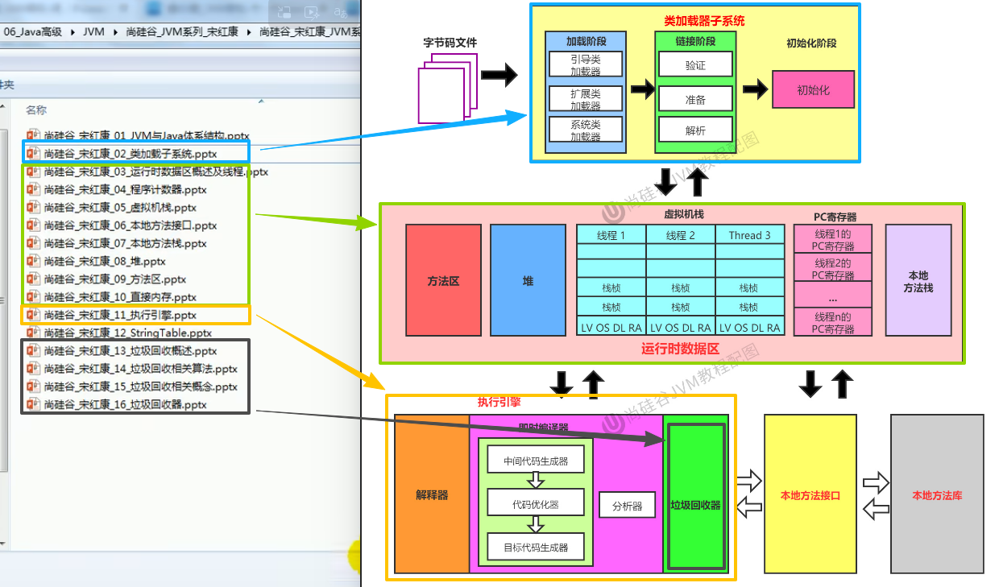
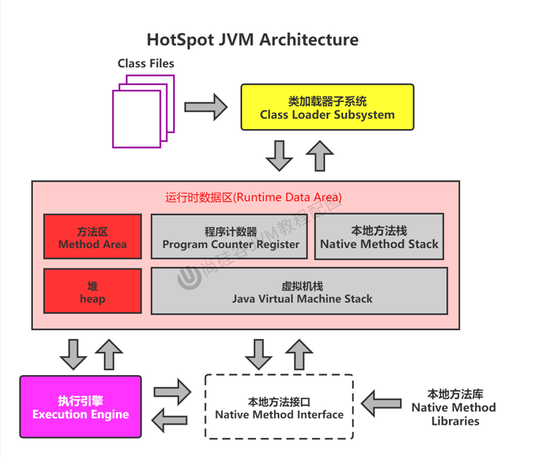
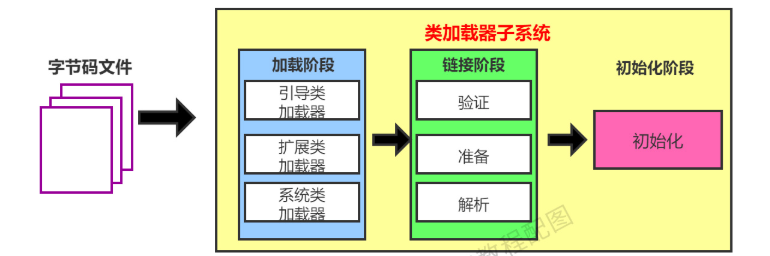
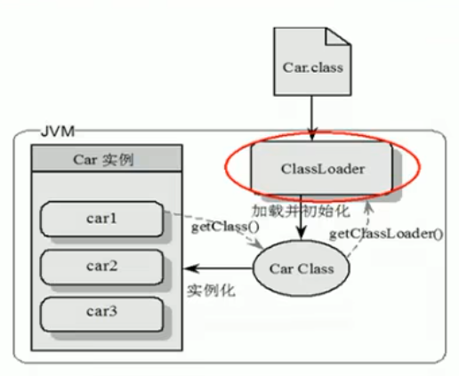
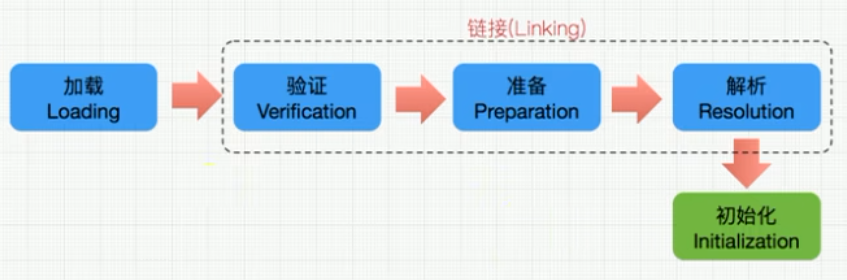

本笔记主要通过[尚硅谷JVM全套教程（详解java虚拟机）](https://www.bilibili.com/video/BV1PJ411n7xZ)为基础编成。

课程介绍：

# 一、JVM与Java体系结构

// TODO

# 二、类加载子系统

## 2.1 内存结构概述

**JVM架构图 - 简图：**

**JVM架构图（英）：**

**JVM架构图（中）：**

## 2.2 类加载器与类的加载过程

### 2.2.1 类加载器

**类加载器子系统作用：**

+ 类加载器子系统负责从文件系统或者网络中加载Class文件，class文件在文件头有特定的文件标识【CAFE BABE】。
+ ClassLoader只负责class文件的加载，至于它是否可以运行，则有Execution Engine（执行引擎）决定。
+ 加载的类信息存放于一块称为方法区的内存空间。除了类的信息外，方法区中还会存放运行时常量池信息，可能还包括字符串字面量和数字常量（这部分常量信息是Class文件中常量池部分的内存映射）。

**类加载器ClassLoader角色：**

1. Class file 存放在本地硬盘上，可以理解为设计师画在纸上的模板，而最终这个模板在执行的时候是要加载到JVM当中来，JVM可以通过这个类文件来实例化多个这样的事例。
2. Class file 加载到JVM中，被称为DNA元数据模板，放在方法区。
3. 在`.class`文件 -> JVM -> 最终称为元数据模板，这个过程需要一个运输工具，也就是类加载器ClassLoader。类加载器会以二进制流的方法将本地硬盘上的类文件加载到JVM中来。

### 2.2.2 类的加载过程：

#### 2.2.2.1 类的加载过程 - Loading

## 2.3 类加载器分类

## 2.4 ClassLoader的使用说明

## 2.5 双亲委派机制

## 2.6 其他

