本笔记主要通过[尚硅谷JVM全套教程（详解java虚拟机）](https://www.bilibili.com/video/BV1PJ411n7xZ)为基础编成。

测试环境：Java8


课程介绍：


# 一、JVM与Java体系结构

// TODO


# 二、类加载子系统

在本章节中会使用到`jclasslib`软件查看类文件里的具体信息。但是IDEA中提供该插件，可以提前在IDEA中安装：

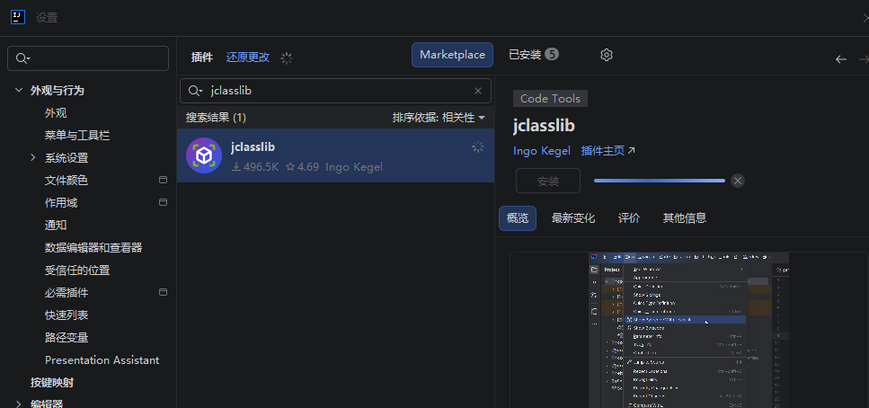

`jclasslib`插件的使用：点击`.class`文件，找到显示字节码选项。

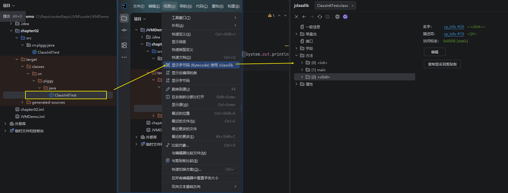


## 2.1 内存结构概述

**JVM架构图 - 简图：**


**JVM架构图（英）：**


**JVM架构图（中）：**


## 2.2 类加载器与类的加载过程

### 2.2.1 类加载器

**类加载器子系统作用：**


+ 类加载器子系统负责从文件系统或者网络中加载Class文件，class文件在文件头有特定的文件标识【CAFE BABE】。
+ ClassLoader只负责class文件的加载，至于它是否可以运行，则有Execution Engine（执行引擎）决定。
+ 加载的类信息存放于一块称为方法区的内存空间。除了类的信息外，方法区中还会存放运行时常量池信息，可能还包括字符串字面量和数字常量（这部分常量信息是Class文件中常量池部分的内存映射）。


**类加载器ClassLoader角色：**


1. Class file 存放在本地硬盘上，可以理解为设计师画在纸上的模板，而最终这个模板在执行的时候是要加载到JVM当中来，JVM可以通过这个类文件来实例化多个这样的事例。
2. Class file 加载到JVM中，被称为DNA元数据模板，放在方法区。
3. 在`.class`文件 -> JVM -> 最终称为元数据模板，这个过程需要一个运输工具，也就是类加载器ClassLoader。类加载器会以二进制流的方法将本地硬盘上的类文件加载到JVM中来。


### 2.2.2 类的加载过程：


#### 2.2.2.1 类的加载过程 - Loading

加载（Loading）：

1. 通过一个类的全限定名获取定义此类的二进制字节流。
2. 将这个字节流所代表的静态存储结构转化为方法区的运行时数据结构。
3. 在内存中生成一个代表这个类的`java.lang.Class`对象，作为方法区这个类的各种数据的访问入口。


补充：加载`.class`文件的方式

> 加载类文件主要有以下几种方式：
>
> + 从本地系统中直接加载
> + 通过网络获取，典型场景:Web Applet
> + 从zip压缩包中读取，成为日后jar、war格式的基础
> + 运行时计算生成，使用最多的是：动态代理技术
> + 由其他文件生成，典型场景：JSP
> + 应用从专有数据库中提取.class文件，比较少见从
> + 加密文件中获取，典型的防Class文件被反编译的保护措施


#### 2.2.2.2 类的加载过程 - Linking

链接（Linking）- 示意图

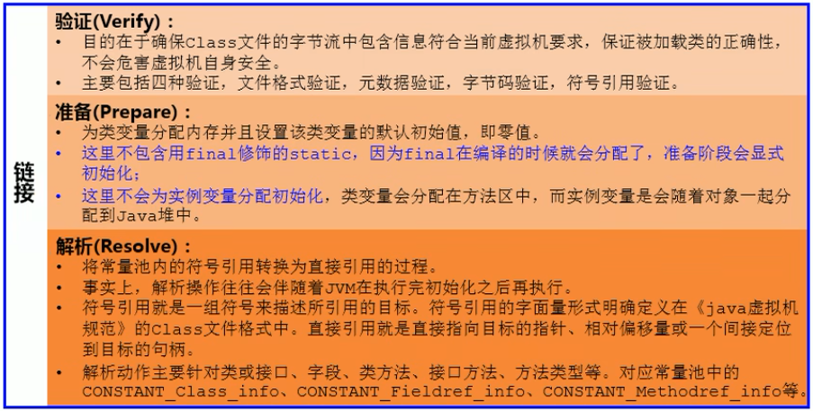

具体步骤：

1. **验证**（Verify）：

   + 目的在于确保Class文件的字节流中包含信息符合当前虚拟机要求，保证被加载类的正确性，不会危害虚拟机自身安全。

   + 主要包括四种验证，文件格式验证，元数据验证，字节码验证，符号引用验证。

     其中文件格式验证会检查`.class`文件是否有魔数`CAFE BABE`：

     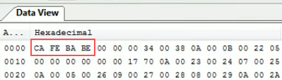

     

2. **准备**（Prepare）：

   + 为类变量分配内存并且设置该类变量的默认初始值，即零值。

     ```java
     // 下面定义的变量：
     //   在prepare阶段默认初始化：a = 0
     // 	 在initial阶段才会被赋值：a = 1
     private static int a = 1;
     ```

   + 这里不包含用`final`修饰的`static`，因为`final`在编译的时候就会分配了，准备阶段会显式初始化；

   + 这里不会为实例变量分配初始化，类变量会分配在方法区中，而实例变量是会随着对象一起分配到Java堆中。

   

3. **解析**（Resolve）：

   + 将常量池内的符号引用转换为直接引用的过程。
   + 事实上，解析操作往往会伴随着JVM在执行完初始化之后再执行。
   + 符号引用就是一组符号来描述所引用的目标。符号引用的字面量形式明确定义在《java虚拟机规范》的Class文件格式中。直接引用就是直接指向目标的指针、相对偏移量或一个间接定位到目标的句柄。
   + 解析动作主要针对类或接口、字段、类方法、接口方法、方法类型等。对应常量池中的`CONSTANT_Class_info`, `CONSTANT_Fieldref_info`, `CONSTANT_Methodref_info`等。


#### 2.2.2.3 类的加载过程 - Initialization

**初始化**（Initialization）：

+ 初始化阶段就是执行类构造器方法`<clinit>()`的过程。
+ 此方法不需定义，是`javac`编译器自动收集类中的所有类变量的赋值动作和静态代码块中的语句合并而来。
+ 构造器方法中指令按语句在源文件中出现的顺序执行。
+ `<clinit>()`不同于类的构造器。（关联:构造器是虚拟机视角下的`<init>()`）
+ 若该类具有父类，JVM会保证子类的`<clinit>`()执行前，父类的`<clinit>()`已经执行完毕。
+ 虚拟机必须保证一个类的`<clinit>()`方法在多线程下被同步加锁。


**类构造器方法的一般解释事项：**

1. 通过`jclasslib`查看`<clinit>()`方法：

   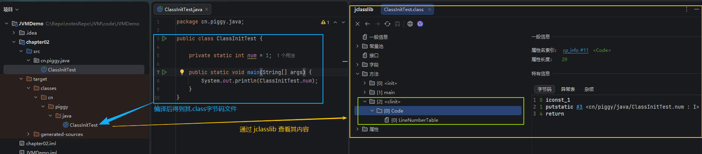

2. `<clinit>()`方法会将显式初始化和静态代码块的赋值放在一起执行：

   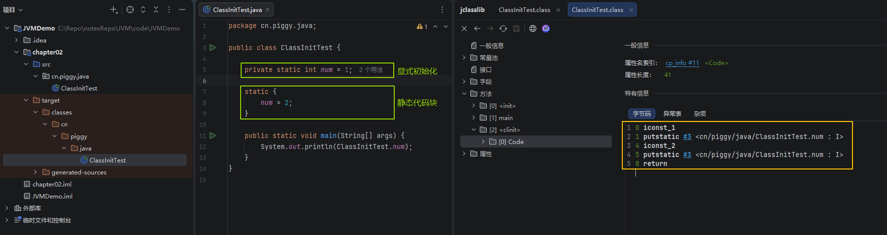

3. 构造器方法中的指令会按语句在源文件中出现的顺序执行：

   代码中`number`变量定义语句在静态代码块中赋值的后面，主要是因为：

   + 在**linking**的**prepare**阶段，`number`分配时默认为0。
   + 在**Initialization**初始化阶段时，可以看到代码执行顺序由上到下，先赋值20再赋值10，这个可以通过`<clinit>()`方法可以看出。

   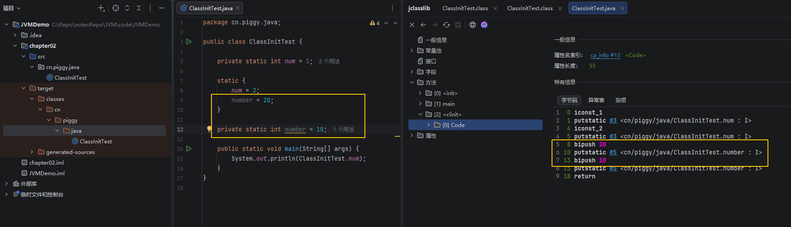

4. 变量定义语句之前无法被使用（非法的前向引用）：

   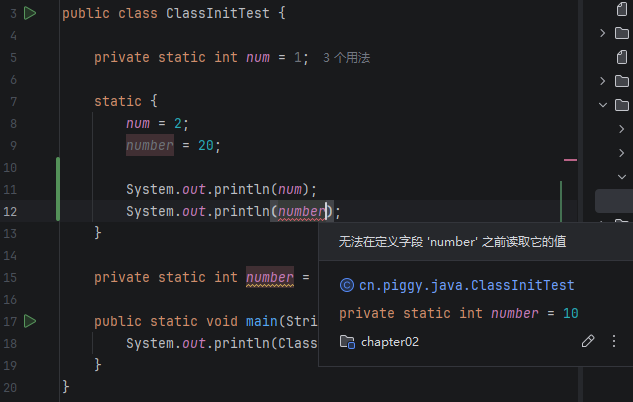

5. `<clinit>()`和`<init>()`方法区别：

   `<clinit>()`方法对所有类变量的赋值动作和静态代码块中的语句进行处理。

   `<init>()`方法是类的构造方法。（如果没写构造方法，则默认是jvm提供的无参构造方法）

   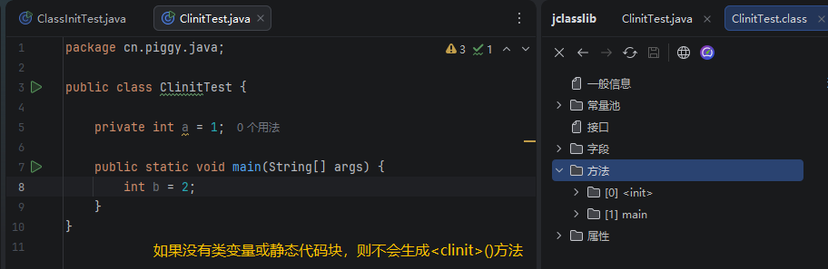

   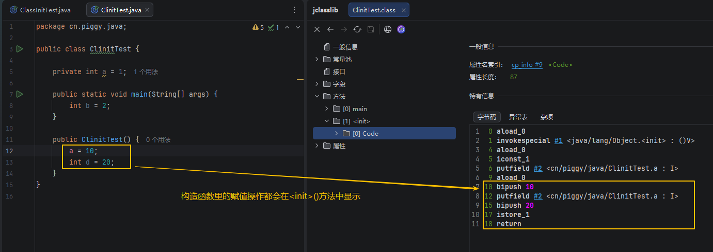

6. 子类加载之前，需要先加载父类：

   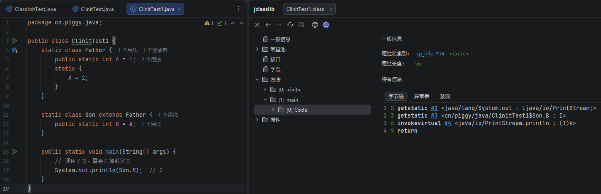

7. 类文件在JVM虚拟机中只会被加载一次：

   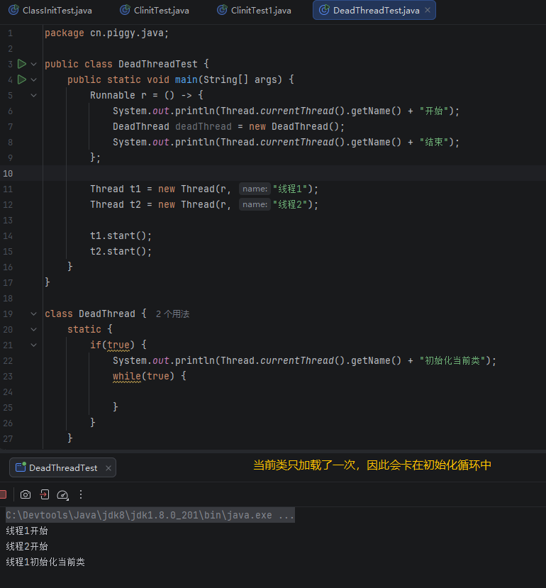


## 2.3 类加载器分类

JVM支持两种类型的类加载器，分别为**引导类加载器**（BootstrapClassLoader）和**自定义类加载器** （User-Defined ClassLoader）。


从概念上来讲，**自定义类加载器**一般指的是程序中由开发人员自定义的一类类加载器，但是Java虚拟机规范却没有这么定义，而是**将所有派生于抽象类ClassLoader的类加载器都划分为自定义类加载器**。


无论类加载器的类型如何划分，在程序中我们最常见的类加载器始终只有3个，如下所示：

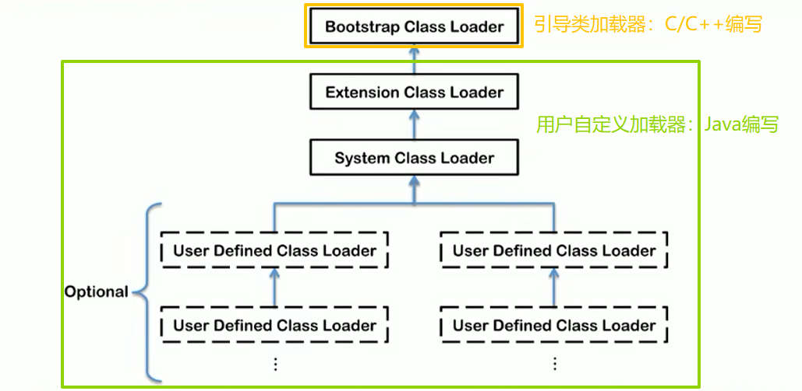

这里的四者之间的关系是包含关系。不是上层下层，也不是子父类的继承关系。


**类加载器输出测试：**

```java
public class ClassLoaderTest {
    public static void main(String[] args) {

        // 获取系统类加载器
        ClassLoader systemClassLoader = ClassLoader.getSystemClassLoader();
        System.out.println(systemClassLoader);  // sun.misc.Launcher$AppClassLoader@18b4aac2

        // 获取其上层:拓展类加载器
        ClassLoader extClassLoader = systemClassLoader.getParent();
        System.out.println(extClassLoader);     // sun.misc.Launcher$ExtClassLoader@1b6d3586

        // 获取其上层：获取不到引导类加载器
        ClassLoader bootstrapClassLoader = extClassLoader.getParent();
        System.out.println(bootstrapClassLoader);   // null


        // 对于用户自定义类来说：默认使用系统类加载器进行加载
        ClassLoader classLoader = ClassLoaderTest.class.getClassLoader();
        System.out.println(classLoader);       // sun.misc.Launcher$AppClassLoader@18b4aac2

        // String类使用引导类加载器进行加载 -> Java核心类库都是
        ClassLoader classLoader1 = String.class.getClassLoader();
        System.out.println(classLoader1);       // null
    }
}
```


### 2.3.1 启动类加载器

启动类加载器（引导类加载器，Bootstrap ClassLoader）

+ 这个类加载使用C/C++语言实现的，嵌套在JVM内部。
+ 它用来加载Java的核心库（`JAVA HOME/jre/lib/rt.jar`、`resources.jar`或`sun.boot.class.path`路径下的内容），用于提供JVM自身需要的类。
+ 并不继承自`java.lang.ClassLoader`，没有父加载器。
+ 加载扩展类和应用程序类加载器，并指定为他们的父类加载器。
+ 出于安全考虑，Bootstrap启动类加载器只加载包名为`java`、`javax`、`sun`等开头的类。


### 2.3.2 扩展类加载器

扩展类加载器（Extension ClassLoader）

+ Java语言编写, 由`sun.misc.Launcher$ExtClassLoader`实现。
+ 派生于`ClassLoader`类。
+ 父类加载器为启动类加载器。
+ 从`java.ext.dirs`系统属性所指定的目录中加载类库，或从JDK的安装目录的`jre/lib/ext`子目录（扩展目录）下加载类库。**如果用户创建的JAR放在此目录下，也会自动由扩展类加载器加载。**


### 2.3.3 应用程序类加载器

应用程序类加载器（系统类加载器，AppClassLoader）

+ java言编写, 由`sun.misc.Launcher$AppClassLoader`实现。
+ 派生于`ClassLoader`类。
+ 父类加载器为扩展类加载器。
+ 它负责加载环境变量`classpath`或系统属性`java.class.path`指定路径下的类库。
+ **该类加载是程序中默认的类加载器**，一般来说，Java应用的类都是由它来完成加载。
+ 通过`classLoader#getSystemclassLoader()`方法可以获取到该类加载器。


### 2.3.4 类加载器测试及注意事项

1. 获取引导类加载器能加载的api路径

   ```java
   public class ClassLoaderTest1 {
       public static void main(String[] args) {
           System.out.println("=====启动类加载器=====");
           // 获取BootstrapClassLoader能够加载的api的路径
           URL[] urLs = Launcher.getBootstrapClassPath().getURLs();
           for (URL urL : urLs) {
               System.out.println(urL);
           }
       }
   }
   ```

   测试结果：

   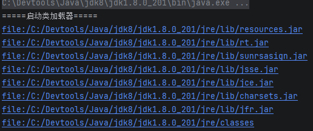

   其中`rt.jar`加载的是java中的常用类库（如String等）。

   随便找一个加载进来的库里的类，看其类加载器是否是引导类加载器？

   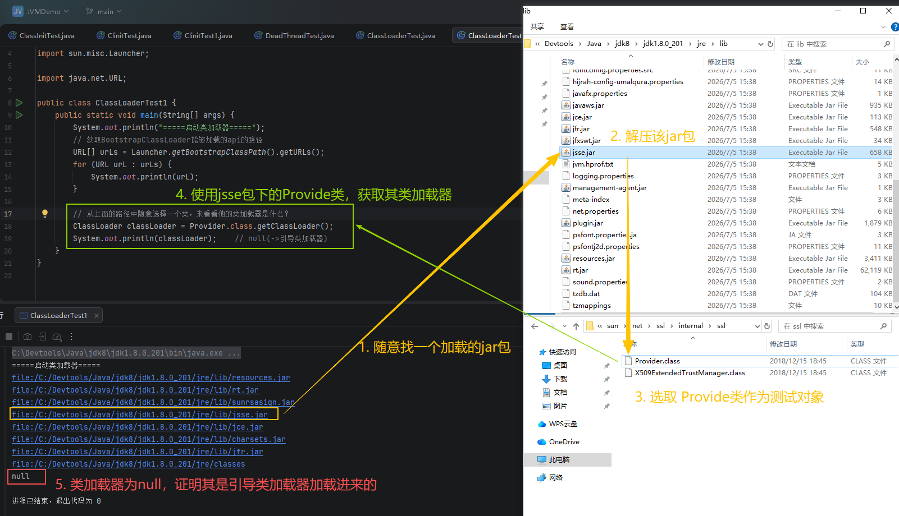

   

2. 获取扩展类加载器能加载的api路径

   ```java
   System.out.println("=====扩展类加载器=====");
   String extDirs = System.getProperty("java.ext.dirs");
   for (String path : extDirs.split(";")) {
       System.out.println(path);
   }
   ```

   测试结果：

   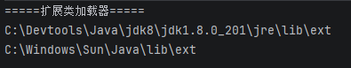

   随便找一个加载进来的库里的类，看其类加载器是否是引导类加载器？

   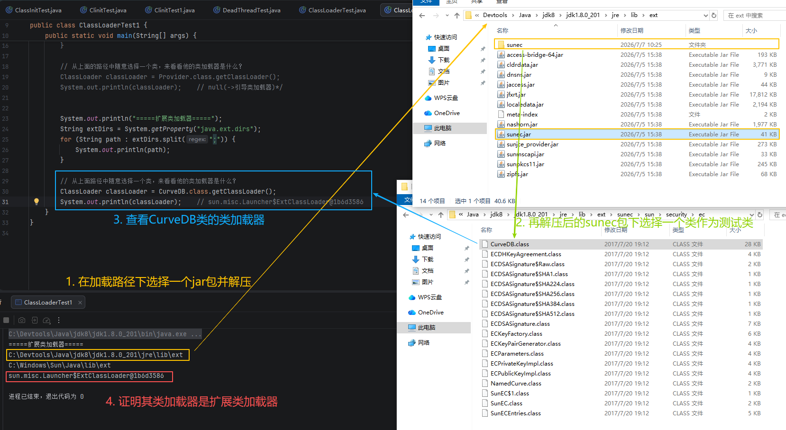


### 2.3.5 用户自定义类加载器（了解）

用户自定义类加载器：

+ 在Java的日常应用程序开发中，类的加载几乎是由上述3种类加载器相互配合执行的，在必要时，我们还可以自定义类加载器，来定制类的加载方式。
+ 为什么要自定义类加载器？
  + 隔离加载类
  + 修改类加载的方式
  + 扩展加载源
  + 防止源码泄漏


**用户自定义类加载器实现步骤：**

1. 开发人员可以通过继承抽象类`java.lang.ClassLoader`类的方式，实现自己的类加载器，以满足一些特殊的需求。
2. 在JDK1.2之前，在自定义类加载器时，总会去继承`ClassLoader`类并重写`loadClass()`方法，从而实现自定义的类加载类。但是在JDK1.2之后已不再建议用户去覆盖`loadClass()`方法，而是建议把自定义的类加载逻辑写在`findClass()`方法中。
3. 在编写自定义类加载器时，如果没有太过于复杂的需求，可以直接继承`URLClassLoader`类，这样就可以避免自己去编写`findClass()`方法及其获取字节码流的方式，使自定义类加载器编写更加简洁。


用户自定义类加载器的简单框架：

```java
public class CustomClassLoader extends ClassLoader {
    @Override
    protected Class<?> findClass(String name) throws ClassNotFoundException {
        try {
            byte[] result = getClassFromCustomPath(name);
            if (result == null) {
                throw new FileNotFoundException();
            } else {
                return defineClass(name, result, 0, result.length);
            }
        } catch (FileNotFoundException e) {
            e.printStackTrace();
        }

        throw new ClassNotFoundException(name);
    }

    private byte[] getClassFromCustomPath(String name) {
        // 从自定义路径中加载指定类：细节略
        // 如果指定路径的字节码文件进行了加密，则需要在此方法中进行解密操作

        return null;
    }

    public static void main(String[] args) {
        CustomClassLoader customClassLoader = new CustomClassLoader();
        try {
            Class<?> clazz = Class.forName("One", true, customClassLoader);
            Object obj = clazz.newInstance();
            System.out.println(obj.getClass().getClassLoader());
        } catch (Exception e) {
            e.printStackTrace();
        }
    }
}
```


## 2.4 ClassLoader的使用说明

`ClassLoader`类，它是一个抽象类，其后所有的类加载器都继承自`ClassLoader`（启动类加载器除外）。

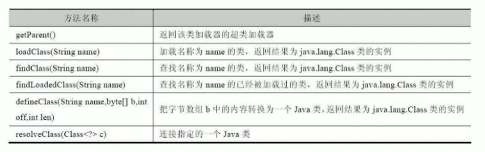


类加载器的继承关系：

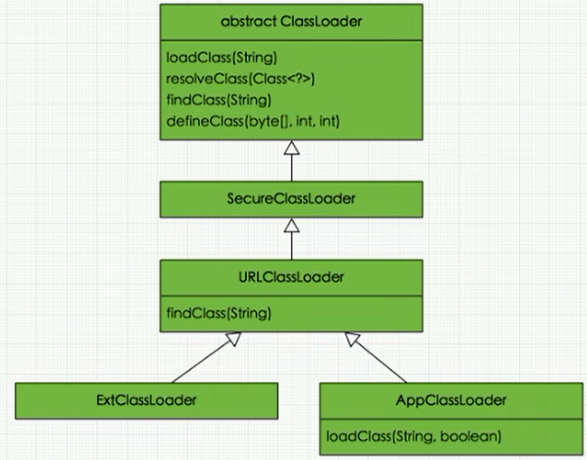

`sun.misc.Launcher`是一个java虚拟机的入口应用，扩展类和应用类加载器都是`Launcher`类的内部类：

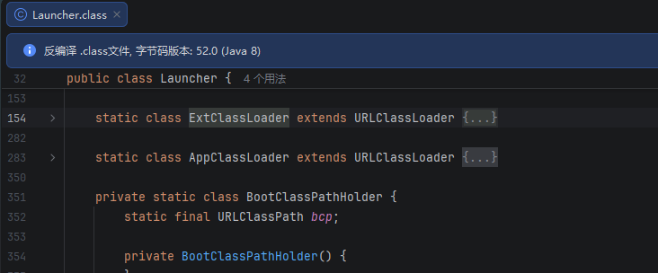


**获取类加载器的方法：**

```java
public class ClassLoaderTest2 {
    public static void main(String[] args) {
        try {
            // 1. 获取当前类的ClassLoader
            ClassLoader classLoader = Class.forName("java.lang.String").getClassLoader();
            System.out.println(classLoader);    // null

            // 2. 获取当前线程上下文的ClassLoader
            ClassLoader contextClassLoader = Thread.currentThread().getContextClassLoader();
            System.out.println(contextClassLoader);

            // 3. 获取系统的ClassLoader
            ClassLoader systemClassLoader = ClassLoader.getSystemClassLoader();
            System.out.println(systemClassLoader);
            // 通过系统类加载器获取应用类加载器
            ClassLoader appClassLoader = systemClassLoader.getParent();
            System.out.println(appClassLoader);

            // 4. 获取调用者的ClassLoader(sql相关)
            // DriverManager.getCallerClassLoader();

        } catch (ClassNotFoundException e) {
            throw new RuntimeException(e);
        }
    }
}
```


## 2.5 双亲委派机制

​	Java虚拟机对class文件采用的是**按需加载**的方式，也就是说当需要使用该类时才会将它的class文件加载到内存生成class对象。而且加载某个类的class文件时，Java虚拟机采用的是**双亲委派模式**，即把请求交由父类处理，它是一种任务委派模式。


### 2.5.1 工作机制

1. 如果一个类加载器收到了类加载请求，它并不会自己先去加载，而是把这个请求委托给父类的加载器去执行;
2. 如果父类加载器还存在其父类加载器，则进一步向上委托，依次递归，请求最终将到达顶层的启动类加载器;
3. 如果父类加载器可以完成类加载任务，就成功返回，倘若父类加载器无法完成此加载任务，子加载器才会尝试自己去加载，这就是双亲委派模式。


**双亲委派机制示意图：**

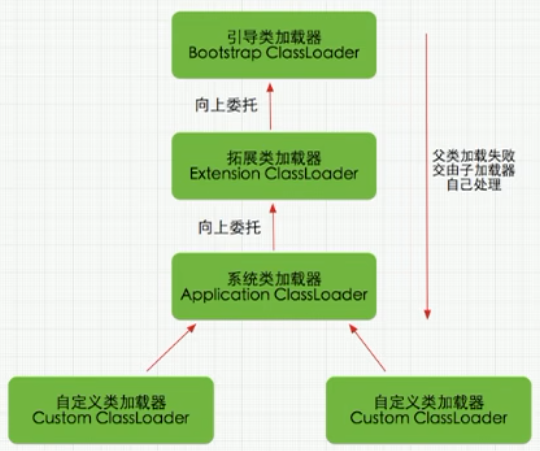


### 2.5.2 委派测试

新建`StringTest.class`类用于测试。

1. 创建一个`java.lang.String`类，路径跟java核心类String类是一样的。我们在测试类中创建`String`类：

   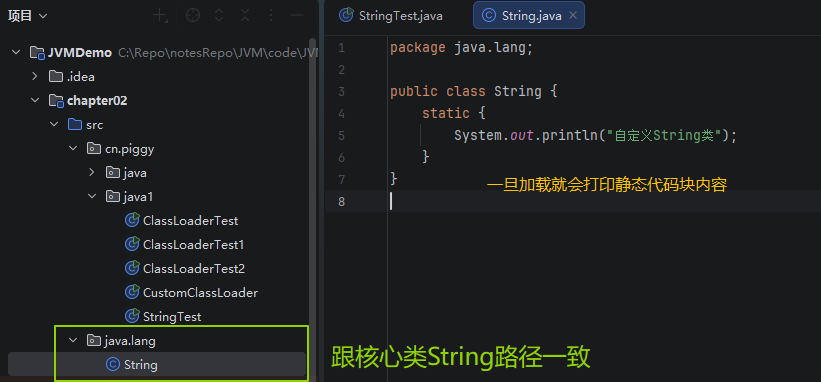

   运行测试：

   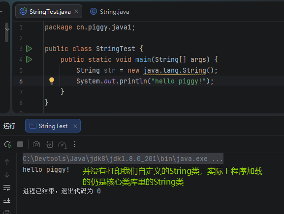

   由此可见，在程序进行类加载时，会将该加载任务向上委托，直到启动类加载器确认加载核心类库的类。（包名为`java`开头的包直接被启动类加载器加载）

   

2. 如果我们在自定义的`String`类中定义一个`main()`方法，直接调用。

   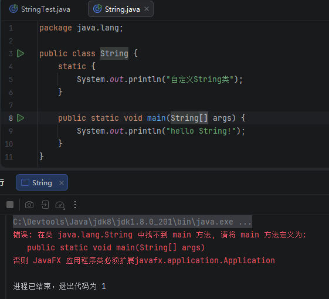

   事实上程序加载的仍然是java核心类库里的`String`类，而且核心类`String`类中是没有`main()`方法的，因此会抛出没有找到该方法的异常。

   

3. 一个正常的例子，实例化`StringTest`类并查看加载器。

   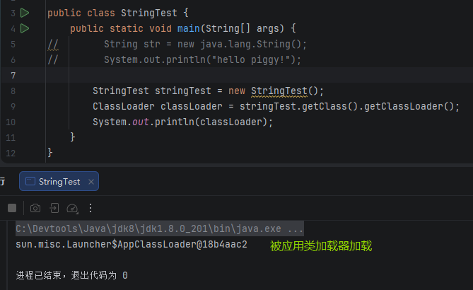

   `StringTest`类加载时向上委托，但其都不属于启动类和扩展类加载器的加载范围，最后向下传递，返回到系统类加载器进行加载。

4. 引入第三方库的委派机制：

   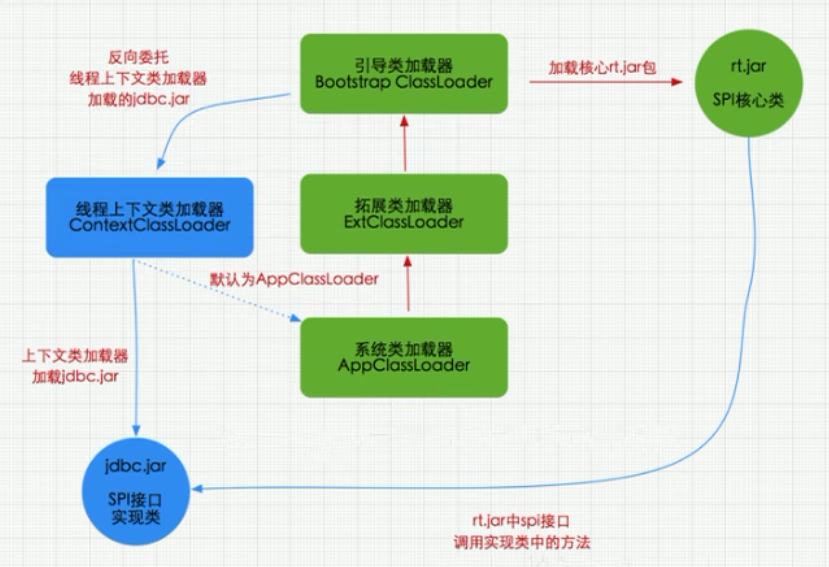

   在引入jdbc库时，接口抽象类是java核心库已经规定好的，这部分是由引导类加载器加载的。而jdbc库里有具体实现，因此是由引导类加载器反向委托给线程上下文加载器（即系统类加载器）加载的。这样一来，jvm就能完全加载SPI接口的抽象类及其第三方实现类的信息了。


### 2.5.3 优势

双亲委派机制的优势：

1. 避免重复加载。

2. 保护程序安全，防止核心API被篡改。

   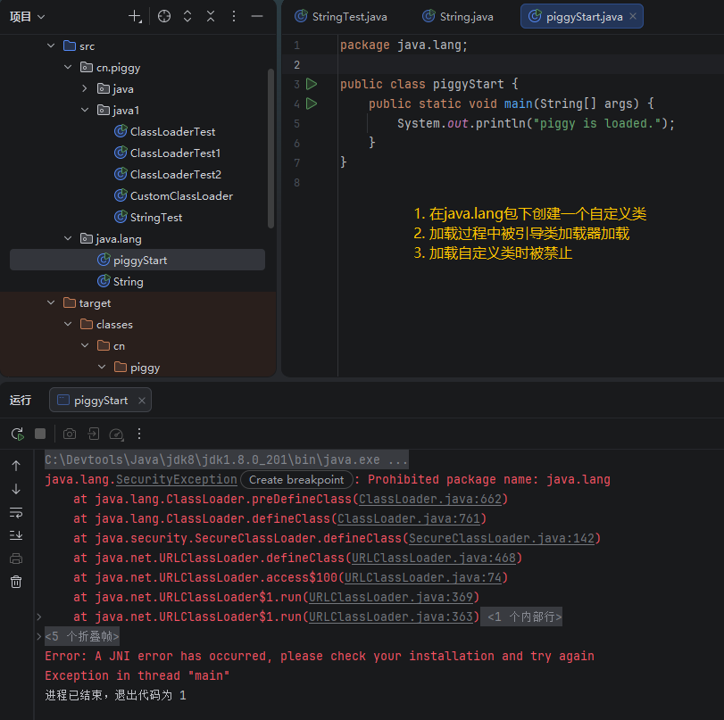

   

   


### 2.5.4 沙箱安全机制

在2.5.2委派测试中，jvm加载自定义`string`类的时候会率先使用引导类加载器加载，而引导类加载器在加载的过程中会先加载jdk自带的文件（`rt.jar`包中`java\lang\String.class`），报错信息说没有`main()`方法，就是因为加载的是rt.jar包中的string类。

虽然加载失败，但是没有对jvm虚拟机造成实质影响，这样可以保证对java核心源代码的保护，这就是沙箱安全机制。


## 2.6 其他

### 2.6.1 对同一个类的判定

在JVM中如何表示两个class对象是否为同一个类？

存在两个必要条件：

+ 类的完整类名必须一致，包括包名。
+ 加载这个类的classLoader（指classLoader实例对象）必须相同。


### 2.6.2 对类加载器的引用

JVM必须知道一个类型是由启动加载器加载的还是由用户类加载器加载的。

如果一个类型是由用户类加载器加载的，那么JVM会**将这个类加载器的一个引用作为类型信息的一部分保存在方法区中**。

当解析一个类型到另一个类型的引用的时候，JVM需要保证这两个类型的类加载器是相同的。


### 2.6.3 类的主动使用和被动使用

Java程序对类的使用方式分为：主动使用和被动使用。

+ **主动使用**，又分为七种情况：
  + 创建类的实例
  + 访问某个类或接口的静态变量，或者对该静态变量赋值
  + 调用类的静态方法
  + 反射 (比如：`Class.forName ("com.atguigu.Test")`）
  + 初始化一个类的子类
  + Java虚拟机启动时被标明为启动类的类
  + JDK7开始提供的动态语言支持：
    + `java.lang.invoke.MethodHandle`实例的解析结果
    + `REF_getStatic`、 `REF_putStatic`、 `REF_invokeStatic`句柄对应的类没有初始化，则初始化
+ 除了以上七种情况，其他使用Java类的方式都被看作是**对类的被动使用，都不会导致类的初始化**。


# 三、运行时数据区

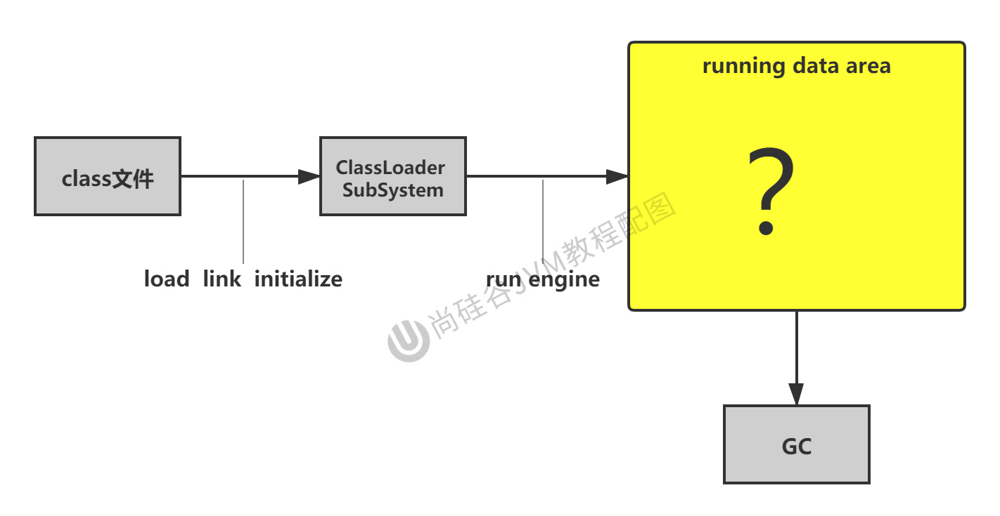

## 3.1 概述

内存是非常重要的系统资源，是硬盘和CPU的中间仓库及桥梁，承载着操作系统和应用程序的实时运行。JVM内存布局规定了Java在运行过程中内存申请、分配、管理的策略，保证了JVM的高效稳定运行。**不同的JVM对于内存的划分方式和管理机制存在着部分差异**。结合JVM虚拟机规范，来探讨一下经典的JVM内存布局（本笔记主要探讨HotSpot虚拟机）。

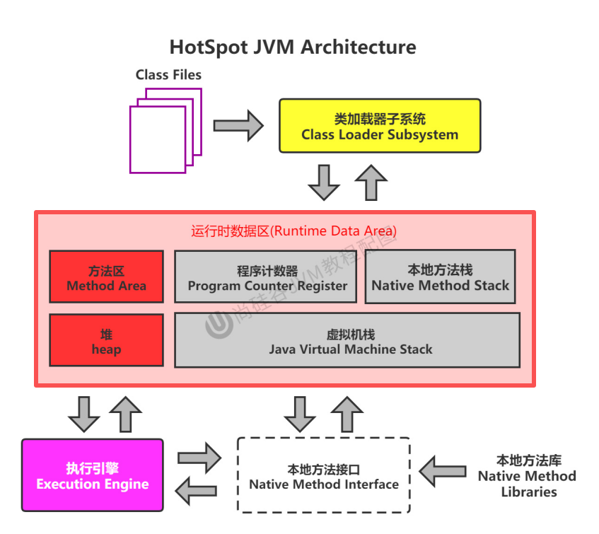

阿里规范提供的示意图：

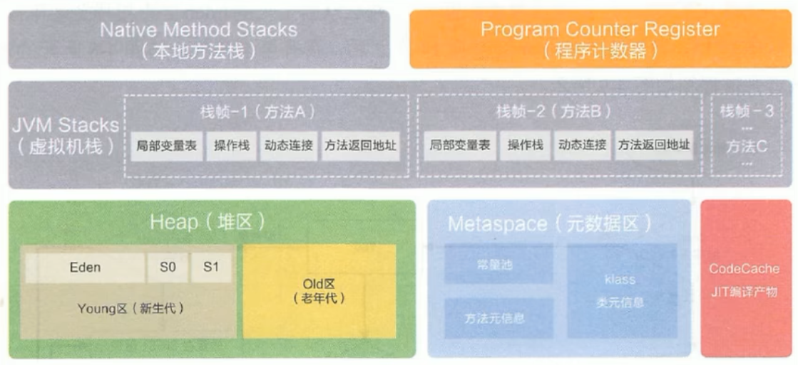


**线程私有和共享**

Java虚拟机定义了若干种程序运行期间会使用到的运行时数据区，其中有一些会随着虚拟机启动而创建，随着虚拟机退出而销毁。另外一些则是与线程一一对应的，这些与线程对应
的数据区域会随着线程开始和结束而创建和销毀。

如下图所示：灰色的为单独线程私有的，红色的为多个线程共享的。即：

+ 每个线程：拥有独立的程序计数器、虚拟机栈、本地方法栈。
+ 线程间共享：堆、堆外内存（永久代或元空间、代码缓存）。

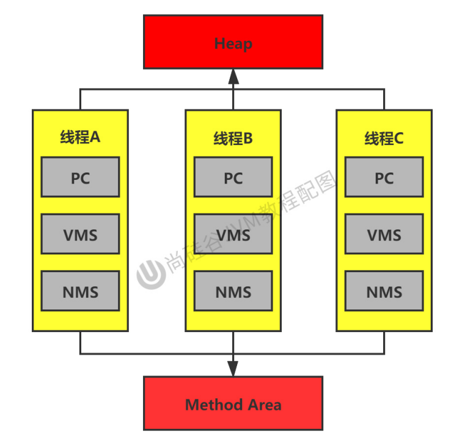

> 永久代和元空间简单理解为本地方法区（Method Area）的落地实现。
>
> + 在jdk8之前称为永久代。
> + 在jdk8及以后称为元空间。
>
> 
>
> 例子 - 1个进程中有五个线程：
>
> + 那么JVM中只有一个堆区和元空间，5个线程共用。
> + 有5份线程私有的程序计数器、虚拟机栈和本地方法栈。
>
> 也即JVM中存在1个堆区、1个元空间、5个程序计数器、5个虚拟机栈和5个本地方法栈。


**运行时数据区实例化表达**

每个JVM中只有一个运行时数据区，在JVM中通过Runtime类实例来表达，可以通过该实例来进行一些交互操作。

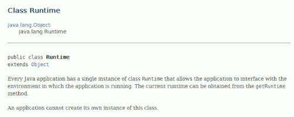


## 3.2 线程

**概览：**

+ 线程是一个程序里的运行单元。JVM允许一个应用有多个线程并行的执行。
+ 在Hotspot JVM里，每个线程都与操作系统的本地线程直接映射。
  + 当一个Java线程准备好执行以后（在JVM上初始化完成程序计数器、虚拟机栈等），此时一个操作系统的本地线程也同时创建。Java线程执行终止后，本地线程也会回收。
+ 操作系统负责所有线程的安排调度到任何一个可用的CPU上。一旦本地线程初始化成功，它就会调用Java线程中的`run()`方法。
+ 如果使用`jconsole`或者是任何一个调试工具，都能看到在后台有许多线程在运行。这些后台线程不包括调用`public static void main(String[])`的main线程以及所有这个main线程自己创建的线程。
+ 这些主要的后台系统线程在Hotspot JVM里主要是以下几个:
  + 虚拟机线程：这种线程的操作是需要JVM达到安全点才会出现。这些操作必须在不同的线程中发生的原因是他们都需要JVM达到安全点，这样堆才不会变化。这种线程的执行类型包括"stop-the-world"的垃圾收集，线程栈收集，线程挂起以及偏向锁撤销。
  + 周期任务线程：这种线程是时间周期事件的体现(比如中断)，他们一般用于周期性操作的调度执行。
  + GC线程：这种线程对在JVM里不同种类的垃圾收集行为提供了支持。（这属于守护线程）
  + 编译线程：这种线程在运行时会将字节码编译成到本地代码。
  + 信号调度线程：这种线程接收信号并发送给JVM，在它内部通过调用适当的方法进
    行处理。


**守护线程和普通线程的区别：**

> JVM关闭的条件是所有线程退出，普通线程必须全部执行完成后，JVM才会推出。如果设置了守护线程，等普通线程全部执行完毕后，守护线程不管执行到什么程度都会直接关闭。
>
> 一般来说，普通线程用于执行核心业务，守护线程用于执行一些可以随时中断的任务，比如日志、监控等任务。这样一来，主业务（普通线程）执行完成，不会被监控线程等卡住无法关闭，从而成为僵尸进程。


# 四、程序计数器（PC寄存器）

更多细节可以查看JVM虚拟机规范：[The Java® Virtual Machine Specification](https://docs.oracle.com/javase/specs/jvms/se8/html/index.html)


## 4.1 PC Register概述

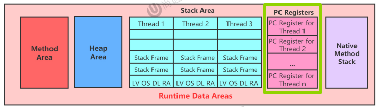

JVM中的**程序计数寄存器**（Program Counter Register）中, Register 的命名源于
CPU的寄存器，寄存器存储指令相关的现场信息。 CPU只有把数据装载到寄存器才能够运行。

这里的程序计数寄存器并非是广义上所指的物理寄存器，或许将其翻译为PC计数器（或指令计数器）会更加贴切（也称为程序钩子），并且也不容易引起一些不必要的误会。**JVM中的PC寄存器是对物理PC寄存器的一种抽象模拟**。


**作用：**PC寄存器用来存储指向下一条指令的地址，也即将要执行的指令代码。由执行引擎读取下一条指令。

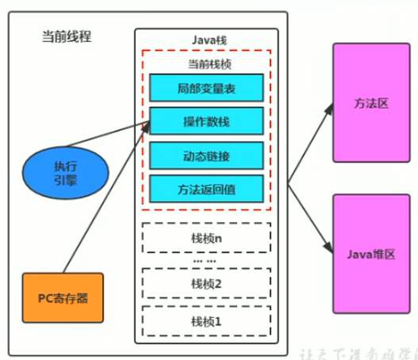


**PC寄存器介绍：**

+ 它是一块很小的内存空间，几乎可以忽略不记。也是运行速度最快的存储区域。
+ 在JVM规范中，每个线程都有它自己的程序计数器，是线程私有的，生命周期与线程的生命周期保持一致。
+ 任何时间一个线程都只有一个方法在执行，也就是所谓的当前方法。程序计数器会存储当前线程正在执行的Java方法的JVM指令地址；或者如果当前是在执行native方法，则是未指定值（undefined）。
+ 它是程序控制流的指示器，分支、循环、跳转、异常处理、线程恢复等基础
  功能都需要依赖这个计数器来完成。
+ 字节码解释器工作时就是通过改变这个计数器的值来选取下一条需要执行的
  字节码指令。
+ 它是唯一一个在Java 虚拟机规范中没有规定任何`OutOfMemoryError`
  情况的区域。


## 4.2 举例说明

我们创建一个简单的java文件，对编译后的字节码文件进行反编译（`javap -verbose PCRegisterTest.class`），查看它`main()`方法，其中PC寄存器记录的就是方法中的偏移地址：

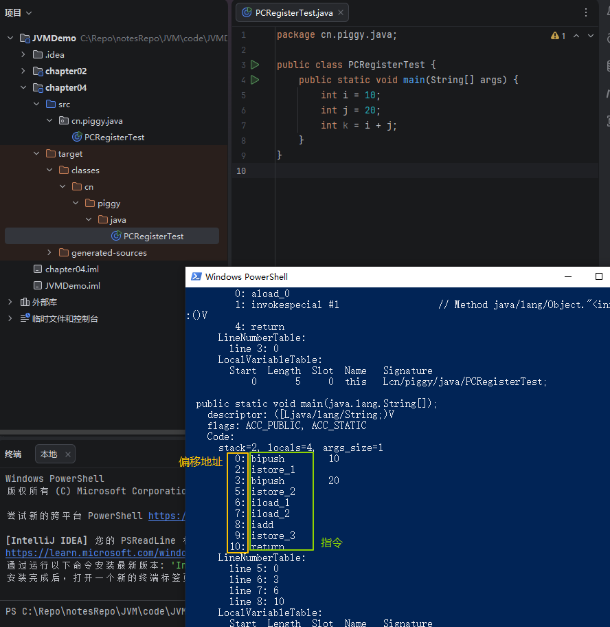


修改代码，编译后反编译：

```java
public class PCRegisterTest {
    public static void main(String[] args) {
        int i = 10;
        int j = 20;
        int k = i + j;

        String s = "abc";
        System.out.println(i);
        System.out.println(j);
    }
}
```

代码`String s = "abc";`在反编译后的表达：

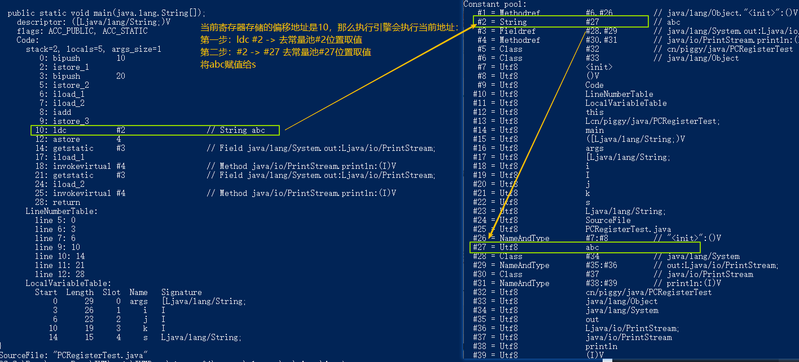


功能模块示意图：

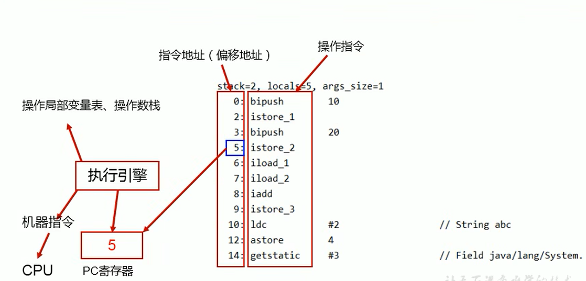


## 4.3 两个常见问题

### 4.3.1 PC寄存器存储指令地址的作用？

**Q：**使用PC寄存器存储字节码指令地址有什么用呢？或者说 为什么使用PC寄存器记录当前线程的执行地址呢？

**A：**因为CPU需要不停的切换各个线程，这时候切换回来以后，就得知道接着从哪开始继续执行。JVM的字节码解释器就需要通过改变PC寄存器的值来明确下一条应该执行什么样的字节码指令。


### 4.3.2 PC寄存器为什么是线程私有的？

**Q：**PC寄存器为什么会被设定为线程私有？

**A：**我们都知道所谓的多线程在一个特定的时间段内只会执行其中某一个线程的方法，CPU会不停地做任务切换，这样必然导致经常中断或恢复，如何保证分毫无差呢？**为了能够准确地记录各个线程正在执行的当前字节码指令地址，最好的办法自然是为每一个线程都分配一个PC寄存器**，这样一来各个线程之间便可以进行独立计算，从而不会出现相互干扰的情况。

由于CPU时间片轮限制，众多线程在并发执行过程中，任何一个确定的时刻，一个处理器或者多核处理器中的一个内核，只会执行某个线程中的一条指令。

这样必然导致经常中断或恢复，如何保证分毫无差呢？每个线程在创建后，都会产生自
己的程序计数器和栈帧，这样程序计数器在各个线程之间都能互不影响。


> **关于CPU时间片：**
>
> CPU时间片即 CPU 分配给各个程序的时间，每个线程被分配一个时间段，称作它的时间片。
>
> + 在宏观上：我们可以同时打开多个应用程序，每个程序并行不悖，同时运行。
> + 但在微观上：由于只有一个CPU，一次只能处理程序要求的一部分，如何处理公平，一种方法就是引入时间片，每个程序轮流执行。
>
> 
>
> **并行与并发：**
>
> + 并行：多个CPU跑多个任务，是物理意义上的多个任务同时执行。
> + 并发：单个CPU跑多个任务，系统时间片轮询处理多个任务，让人觉得是多个任务再同时执行。


# 五、虚拟机栈

## 5.1 虚拟机栈概述

### 5.1.1 虚拟机栈出现的背景

由于跨平台性的设计，Java的指令都是根据栈来设计的。不同平台CPU架构不同，所以不能设计为基于寄存器的。

**优点是跨平台，指令集小，编译器容易实现，缺点是性能下降，实现同样的功能需要更多的指令。**


### 5.1.2 内存中的堆和栈

**栈是运行时的单位，而堆是存储的单位。**

栈解决程序的运行问题，即程序如何执行，或者说如何处理数据。

堆解决的是数据存储的问题，即数据怎么放、放在哪儿。

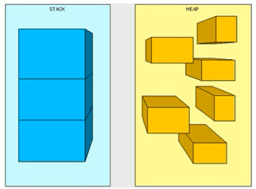


### 5.1.3 虚拟机栈基本内容

#### 5.1.3.1 Java虚拟机栈是什么?

Java虚拟机栈（Java Virtual Machine Stack）, 早期叫Java栈。

每个线程在创建时都会创建一个虚拟机栈，其内部保存一个个的栈帧（Stack Frame），对应着一次次的Java方法调用。

且每个虚拟机栈都是线程私有的。

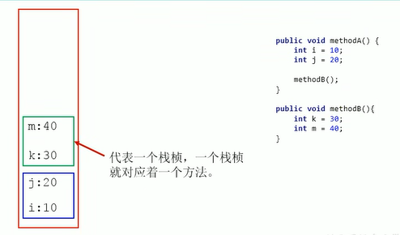


**生命周期**：生命周期和线程一致。

**作用**：主管Java程序的运行，它保存方法的局部变量（8种基本数据类型，对象的引用地址等）、部分结果，并参与方法的调用和返回。

 


#### 5.1.3.2 栈的特点（优点）

+ 栈是一种快速有效的分配存储方式，访问速度仅次于程序计数器。
+ JVM直接对Java栈的操作只有两个:
  + 每个方法执行，伴随着进栈(入栈、压栈)。
  + 执行结束后的出栈工作。
+ 对于栈来说不存在垃圾回收问题。

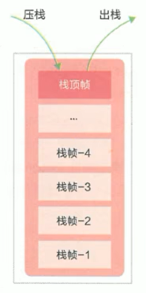


#### 5.1.3.3 栈中可能出现的异常

Java 虚拟机规范允许**Java栈的大小是动态的或者是固定不变的**。

如果采用固定大小的Java虚拟机栈，那每一个线程的Java虚拟机栈容量可以在线程创建的时候独立选定。如果线程请求分配的栈容量超过Java虚拟机栈允许的最大容量，Java虚拟机将会抛出一个`StackOverflowError `异常。

如果Java虚拟机栈可以动态扩展，并且在尝试扩展的时候无法申请到足够的内存，或者在创建新的线程时没有足够的内存去创建对应的虚拟机栈，那Java虚拟机将会抛出一个`OutOfMemoryErxor`异常。


#### 5.1.3.4 设置栈内存大小

> 参考官网文档[java11 Tools Reference](https://docs.oracle.com/en/java/javase/11/tools/java.html#GUID-3B1CE181-CD30-4178-9602-230B800D4FAE)


我们可以使用参数`-Xss`选项来设置线程的最大栈空间，栈的大小直接决定了函数调用的最大可达深度。

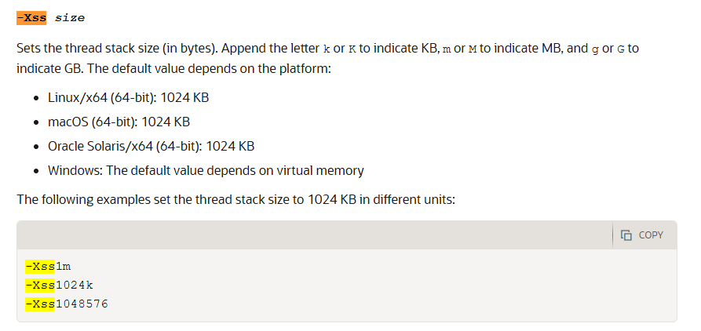


栈溢出测试：

编写测试代码：

```java
public class StackErrorTest {
    private static int count = 1;
    public static void main(String[] args) {
        System.out.println(count);
        count++;
        main(args);
    }
}
```

默认情况下运行测试，count打印到11417次抛出栈溢出异常。

修改虚拟机栈大小参数，设置为`-Xss256k`，重新运行测试：

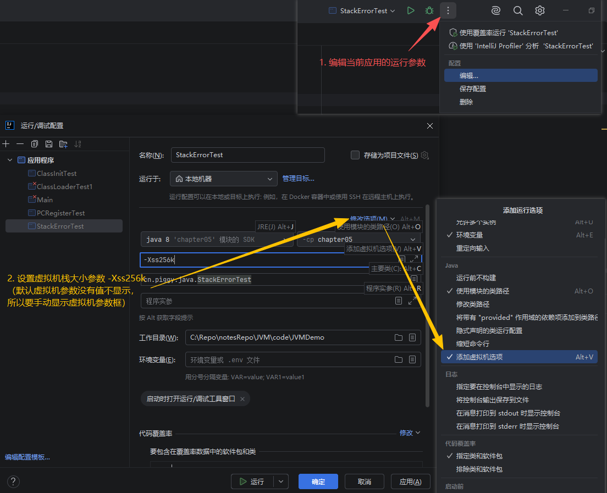

重新测试后count打印到2471次就抛出了栈溢出异常，因此可以看出该参数是有效的。


## 5.2 栈的存储单位

### 5.2.1 栈中存储什么？

+ 每个线程都有自己的栈，栈中的数据都是以**栈帧**（Stack Frame）的形式存在。
+ 在这个线程上正在执行的每个方法都各自对应一个栈帧（StackFrame）。
+ 栈帧是一个内存区块，是一个数据集，维系着方法执行过程中的各种数据信息。


### 5.2.2 栈运行原理

+ JVM直接对Java栈的操作只有两个，就是对栈帧的**压栈**和**出栈**，遵循 “**先进**
  **后出**” / “**后进先出**” 原则。

+ 在一条活动线程中，一个时间点上，只会有一个活动的栈帧。即只有当前正在执行的方法的栈帧（栈顶栈帧）是有效的，这个栈帧被称为**当前栈帧**（Current Frame），与当前栈帧相对应的方法就是**当前方法**（CurrentMethod），定义这个方法的类就是**当前类**（Current Class）。

+ 执行引擎运行的所有字节码指令只针对当前栈帧进行操作。

+ 如果在该方法中调用了其他方法，对应的新的栈帧会被创建出来，放在栈的顶端，成为新的当前帧。

+ 不同线程中所包含的栈帧是不允许存在相互引用的，即不可能在一个栈帧之中引用另外一个线程的栈帧。

+ 如果当前方法调用了其他方法，方法返回之际，当前栈帧会传回此方法的执行结果给前一个栈帧，接着，虚拟机会丢弃当前栈帧，使得前一个栈帧重新成为当前栈帧。

+ Java方法有两种返回函数的方式，**一种是正常的函数返回，使用return指令；另外一种是抛出异常。不管使用哪种方式，都会导致栈帧被弹出**。

  

  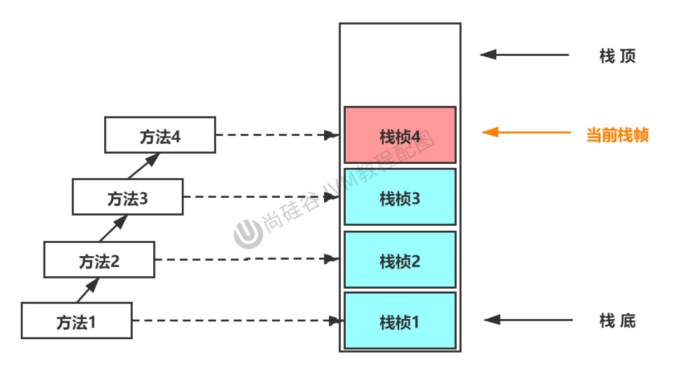


### 5.2.3 运行演示

编写一个方法调用的测试代码：

```java
public class StackFrameTest {
    public static void main(String[] args) {
        StackFrameTest stackFrameTest = new StackFrameTest();
        stackFrameTest.method1();
    }

    public void method1() {
        System.out.println("method1()方法开始执行...");
        method2();
        System.out.println("method1()方法执行结束...");
    }

    public int method2() {
        System.out.println("method2()方法开始执行...");
        int i = 10;
        int m = (int) method3();
        System.out.println("method2()方法即将结束...");
        return i + m;
    }

    public double method3() {
        System.out.println("method3()方法开始执行...");
        double j = 20.0;
        System.out.println("method3()方法即将结束...");
        return j;
    }
}
```

**演示一：给`stackFrameTest.method1()`加断点，查看代码调试状态。**

1. 进行调试，进入`main()`方法断点处：

   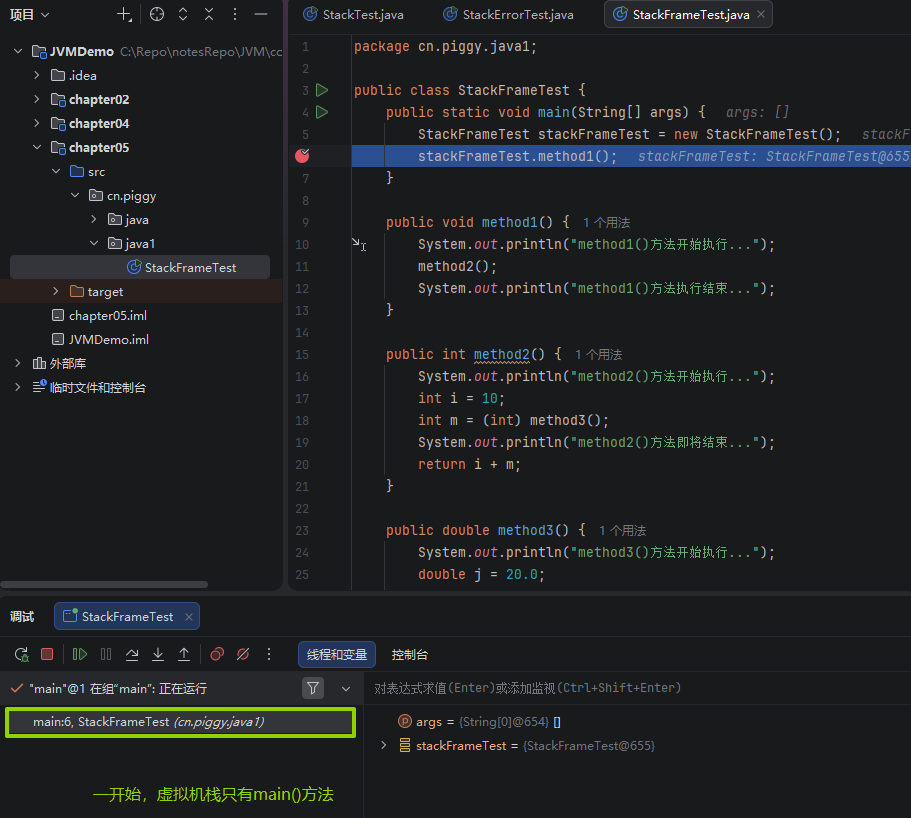

2. 进入`method1()`方法：

   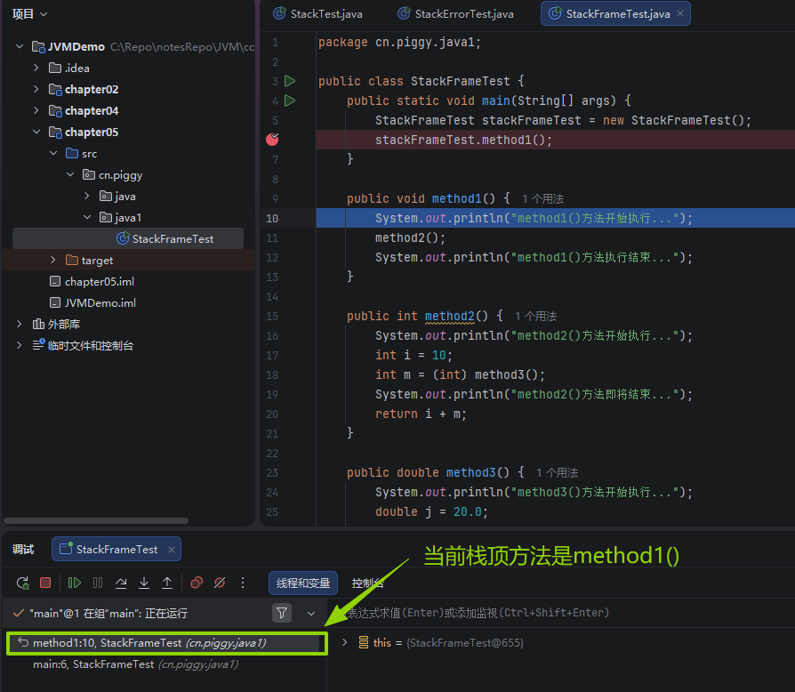

3. 直接进入`method3()`方法：

   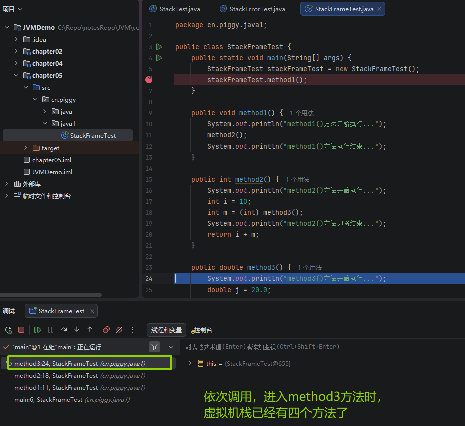

4. `method3()`方法执行结束，`method3()`方法出栈：

   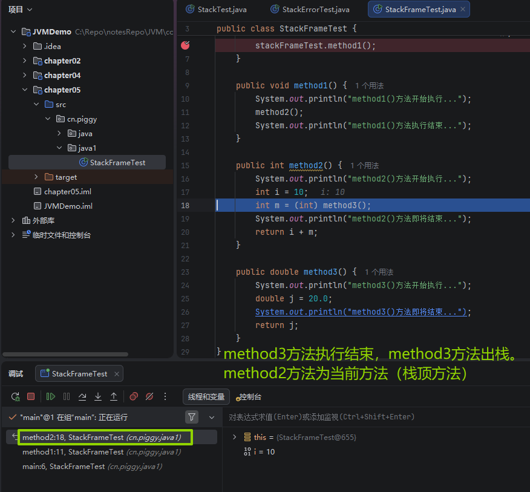

5. 以此类推，直到全部方法执行完毕，虚拟机栈内栈帧全部出栈，线程结束。


**演示二：`method2()`方法抛出异常。**

无异常捕获情况：

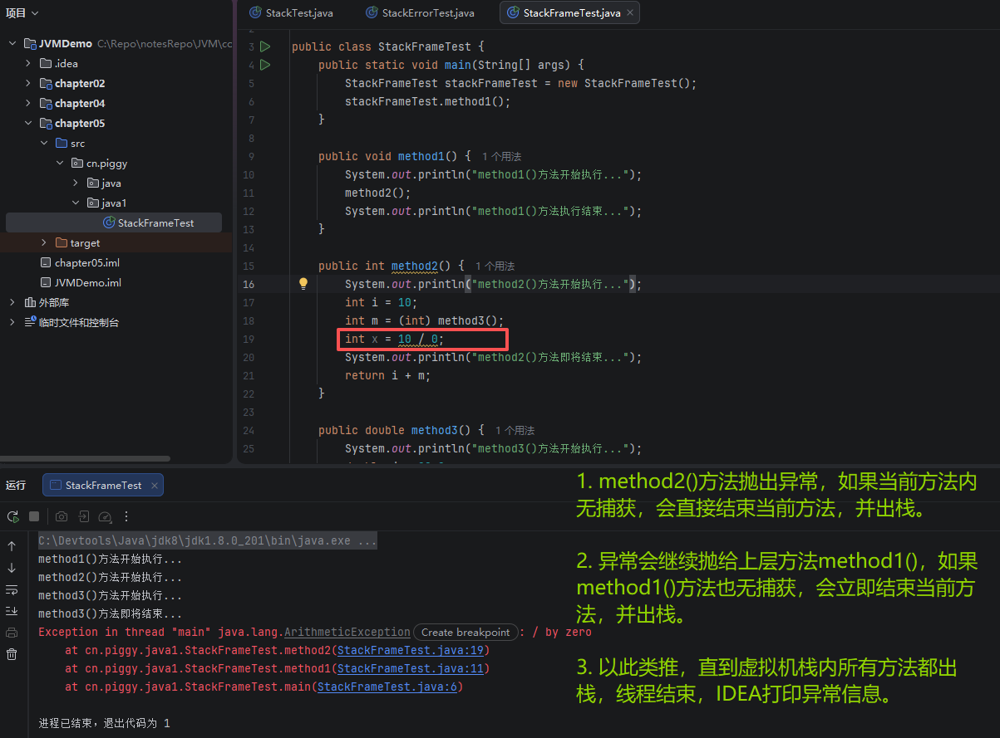

有异常捕获情况：

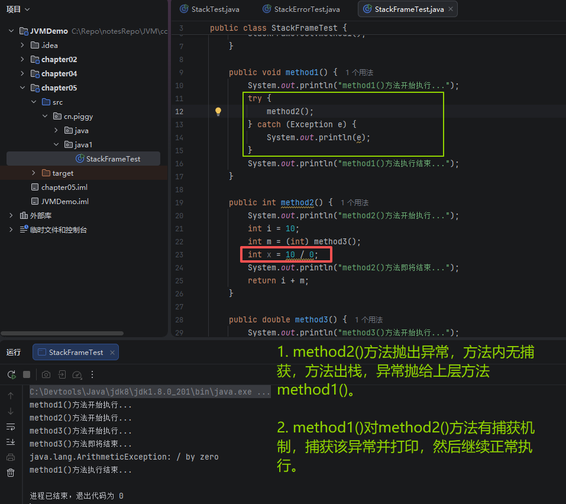


### 5.2.4 栈帧的内部结构

每个栈帧中存储着：

+ 局部变量表（Local Variables）
+ 操作数栈（operand Stack）（或表达式栈）
+ 动态链接（DynamicLinking）（或指向运行时常量池的方法引用）
+ 方法返回地址（Return Address）（或方法正常退出或者异常退出的定义）
+ 一些附加信息

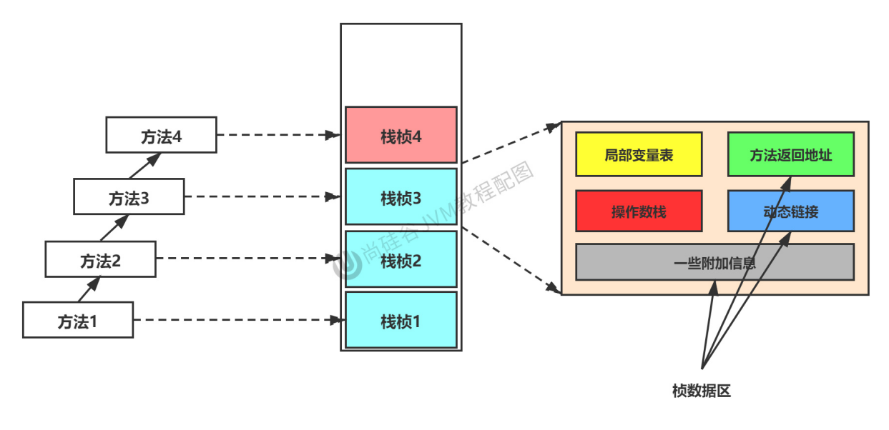


## 5.3 局部变量表

### 5.3.1 概述

+ 局部变量表也被称之为局部变量数组或本地变量表。
+ **定义为一个数字数组，主要用于存储方法参数和定义在方法体内的局部变量**，这些数据类型包括各类基本数据类型、对象引用（reference），以及`returnAddress`类型。
+ 由于局部变量表是建立在线程的栈上，是线程的私有数据，因此不存在数据安全问题。
+ **局部变量表所需的容量大小是在编译期确定下来的**，并保存在方法的`Code`属性的`maximum local variables`数据项中。在方法运行期间是不会改变局部变量表的大小的。
+ **方法嵌套调用的次数由栈的大小决定**。一般来说，**栈越大，方法嵌套调用次数越多**。对一个函数而言，它的参数和局部变量越多，使得局部变量表膨胀，它的栈帧就越大，以满足方法调用所需传递的信息增大的需求。进而函数调用就会占用更多的栈空间，导致其嵌套调用次数就会减少。
+ **局部变量表中的变量只在当前方法调用中有效**。在方法执行时，虚拟机通过使用局部变量表完成参数值到参数变量列表的传递过程。**当方法调用结束后，随着方法栈帧的销毁，局部变量表也会随之销毁**。


## 5.4 操作数栈


## 5.5 代码追踪


## 5.6 栈顶缓存技术


## 5.7 动态链接


## 5.8 方法的调用：解析与分派


## 5.9 方法返回地址


## 5.10 一些附加信息


## 5.11 栈的相关面试题


