本笔记主要通过[尚硅谷JVM全套教程（详解java虚拟机）](https://www.bilibili.com/video/BV1PJ411n7xZ)为基础编成。

测试环境：Java8


课程介绍：

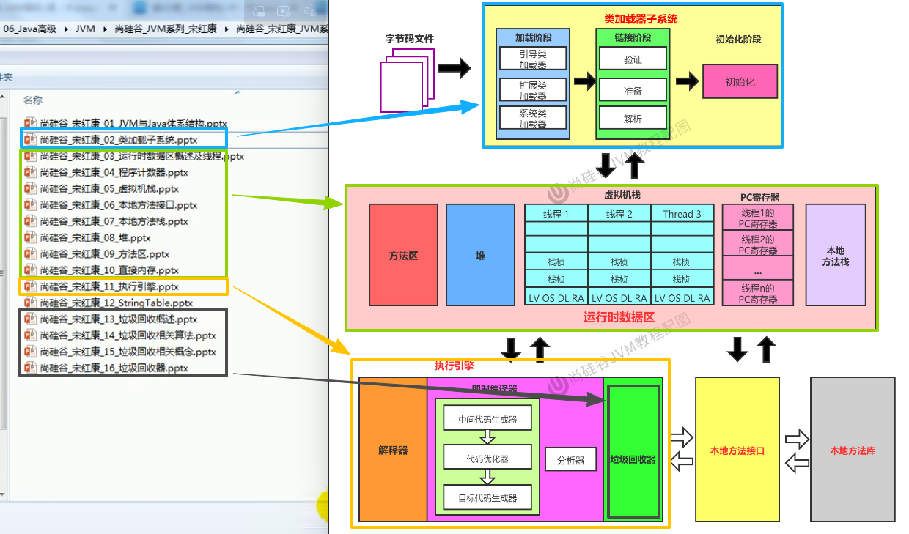


# 一、JVM与Java体系结构

// TODO


# 二、类加载子系统

在本章节中会使用到`jclasslib`软件查看类文件里的具体信息。但是IDEA中提供该插件，可以提前在IDEA中安装：

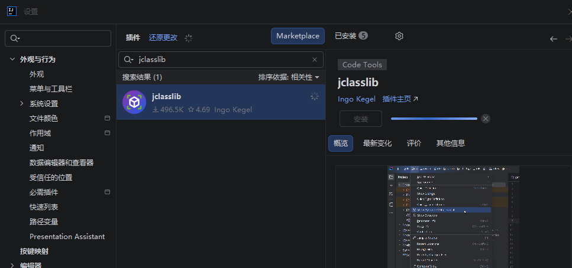

`jclasslib`插件的使用：点击`.class`文件，找到显示字节码选项。

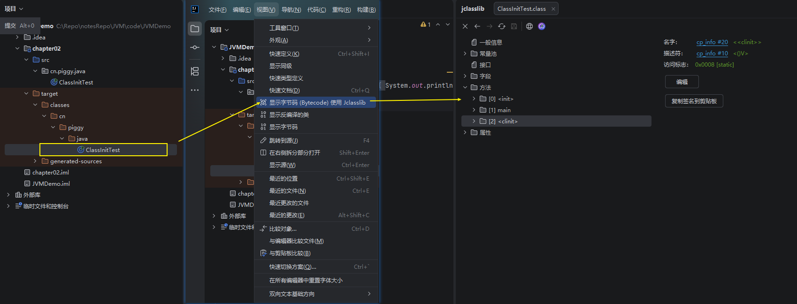


## 2.1 内存结构概述

**JVM架构图 - 简图：**

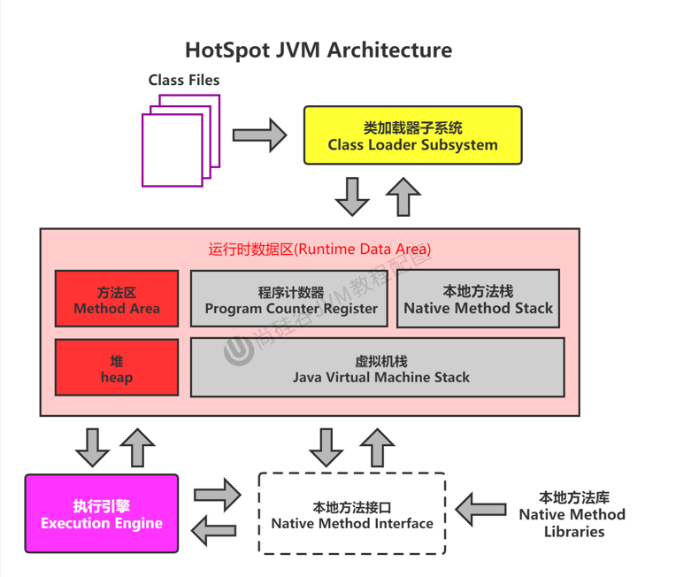


**JVM架构图（英）：**


**JVM架构图（中）：**


## 2.2 类加载器与类的加载过程

### 2.2.1 类加载器

**类加载器子系统作用：**

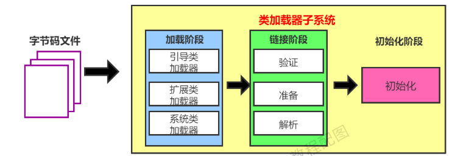

+ 类加载器子系统负责从文件系统或者网络中加载Class文件，class文件在文件头有特定的文件标识【CAFE BABE】。
+ ClassLoader只负责class文件的加载，至于它是否可以运行，则有Execution Engine（执行引擎）决定。
+ 加载的类信息存放于一块称为方法区的内存空间。除了类的信息外，方法区中还会存放运行时常量池信息，可能还包括字符串字面量和数字常量（这部分常量信息是Class文件中常量池部分的内存映射）。


**类加载器ClassLoader角色：**

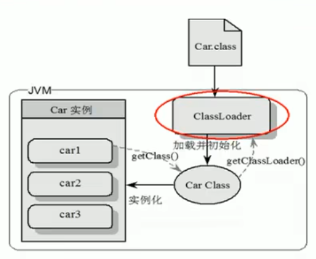

1. Class file 存放在本地硬盘上，可以理解为设计师画在纸上的模板，而最终这个模板在执行的时候是要加载到JVM当中来，JVM可以通过这个类文件来实例化多个这样的事例。
2. Class file 加载到JVM中，被称为DNA元数据模板，放在方法区。
3. 在`.class`文件 -> JVM -> 最终称为元数据模板，这个过程需要一个运输工具，也就是类加载器ClassLoader。类加载器会以二进制流的方法将本地硬盘上的类文件加载到JVM中来。


### 2.2.2 类的加载过程：

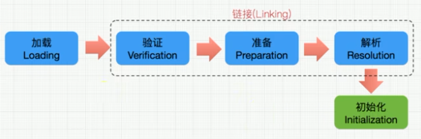


#### 2.2.2.1 类的加载过程 - Loading

加载（Loading）：

1. 通过一个类的全限定名获取定义此类的二进制字节流。
2. 将这个字节流所代表的静态存储结构转化为方法区的运行时数据结构。
3. 在内存中生成一个代表这个类的`java.lang.Class`对象，作为方法区这个类的各种数据的访问入口。


补充：加载`.class`文件的方式

> 加载类文件主要有以下几种方式：
>
> + 从本地系统中直接加载
> + 通过网络获取，典型场景:Web Applet
> + 从zip压缩包中读取，成为日后jar、war格式的基础
> + 运行时计算生成，使用最多的是：动态代理技术
> + 由其他文件生成，典型场景：JSP
> + 应用从专有数据库中提取.class文件，比较少见从
> + 加密文件中获取，典型的防Class文件被反编译的保护措施


#### 2.2.2.2 类的加载过程 - Linking

链接（Linking）- 示意图

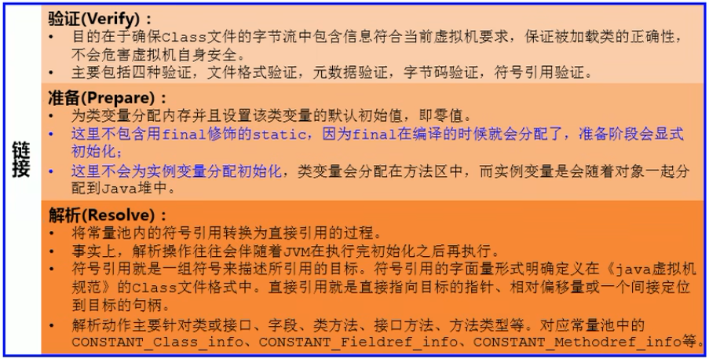

具体步骤：

1. **验证**（Verify）：

   + 目的在于确保Class文件的字节流中包含信息符合当前虚拟机要求，保证被加载类的正确性，不会危害虚拟机自身安全。

   + 主要包括四种验证，文件格式验证，元数据验证，字节码验证，符号引用验证。

     其中文件格式验证会检查`.class`文件是否有魔数`CAFE BABE`：

     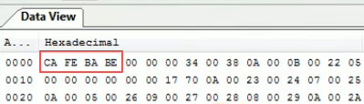

     

2. **准备**（Prepare）：

   + 为类变量分配内存并且设置该类变量的默认初始值，即零值。

     ```java
     // 下面定义的变量：
     //   在prepare阶段默认初始化：a = 0
     // 	 在initial阶段才会被赋值：a = 1
     private static int a = 1;
     ```

   + 这里不包含用`final`修饰的`static`，因为`final`在编译的时候就会分配了，准备阶段会显式初始化；

   + 这里不会为实例变量分配初始化，类变量会分配在方法区中，而实例变量是会随着对象一起分配到Java堆中。

   

3. **解析**（Resolve）：

   + 将常量池内的符号引用转换为直接引用的过程。
   + 事实上，解析操作往往会伴随着JVM在执行完初始化之后再执行。
   + 符号引用就是一组符号来描述所引用的目标。符号引用的字面量形式明确定义在《java虚拟机规范》的Class文件格式中。直接引用就是直接指向目标的指针、相对偏移量或一个间接定位到目标的句柄。
   + 解析动作主要针对类或接口、字段、类方法、接口方法、方法类型等。对应常量池中的`CONSTANT_Class_info`, `CONSTANT_Fieldref_info`, `CONSTANT_Methodref_info`等。


#### 2.2.2.3 类的加载过程 - Initialization

**初始化**（Initialization）：

+ 初始化阶段就是执行类构造器方法`<clinit>()`的过程。
+ 此方法不需定义，是`javac`编译器自动收集类中的所有类变量的赋值动作和静态代码块中的语句合并而来。
+ 构造器方法中指令按语句在源文件中出现的顺序执行。
+ `<clinit>()`不同于类的构造器。（关联:构造器是虚拟机视角下的`<init>()`）
+ 若该类具有父类，JVM会保证子类的`<clinit>`()执行前，父类的`<clinit>()`已经执行完毕。
+ 虚拟机必须保证一个类的`<clinit>()`方法在多线程下被同步加锁。


**类构造器方法的一般解释事项：**

1. 通过`jclasslib`查看`<clinit>()`方法：

   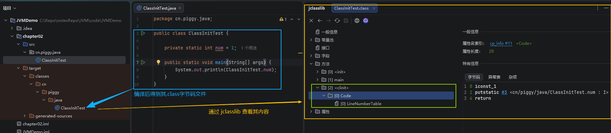

2. `<clinit>()`方法会将显式初始化和静态代码块的赋值放在一起执行：

   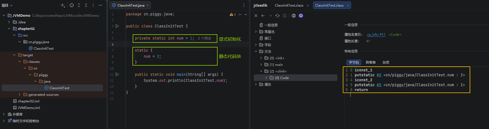

3. 构造器方法中的指令会按语句在源文件中出现的顺序执行：

   代码中`number`变量定义语句在静态代码块中赋值的后面，主要是因为：

   + 在**linking**的**prepare**阶段，`number`分配时默认为0。
   + 在**Initialization**初始化阶段时，可以看到代码执行顺序由上到下，先赋值20再赋值10，这个可以通过`<clinit>()`方法可以看出。

   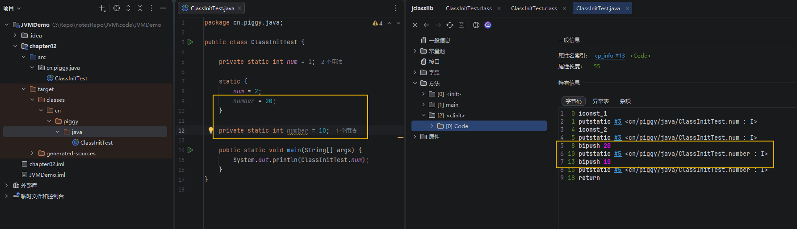

4. 变量定义语句之前无法被使用（非法的前向引用）：

   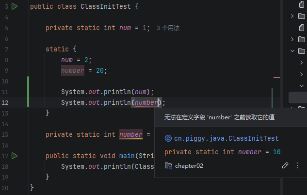

5. `<clinit>()`和`<init>()`方法区别：

   `<clinit>()`方法对所有类变量的赋值动作和静态代码块中的语句进行处理。

   `<init>()`方法是类的构造方法。（如果没写构造方法，则默认是jvm提供的无参构造方法）

   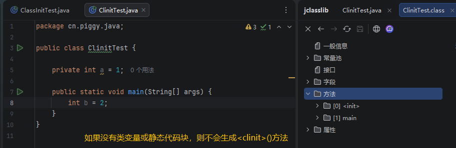

   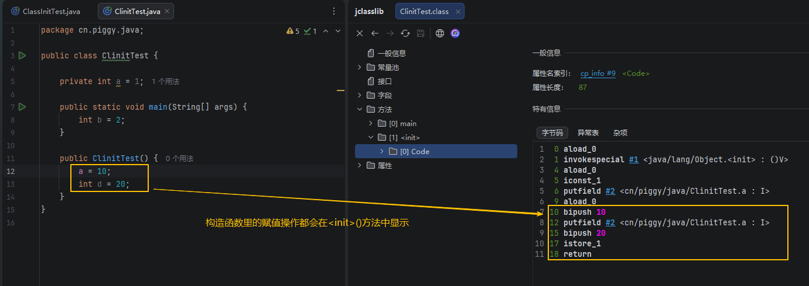

6. 子类加载之前，需要先加载父类：

   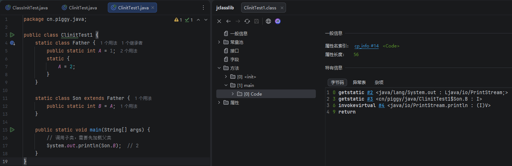

7. 类文件在JVM虚拟机中只会被加载一次：

   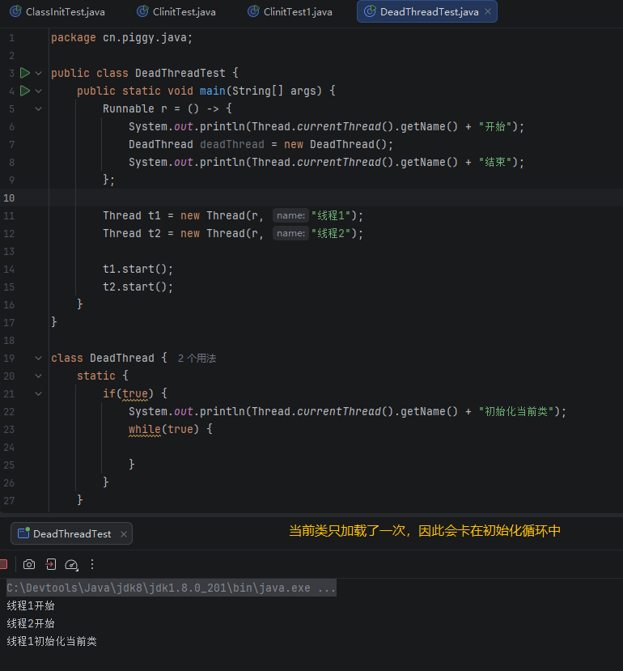


## 2.3 类加载器分类

JVM支持两种类型的类加载器，分别为**引导类加载器**（BootstrapClassLoader）和**自定义类加载器** （User-Defined ClassLoader）。


从概念上来讲，**自定义类加载器**一般指的是程序中由开发人员自定义的一类类加载器，但是Java虚拟机规范却没有这么定义，而是**将所有派生于抽象类ClassLoader的类加载器都划分为自定义类加载器**。


无论类加载器的类型如何划分，在程序中我们最常见的类加载器始终只有3个，如下所示：

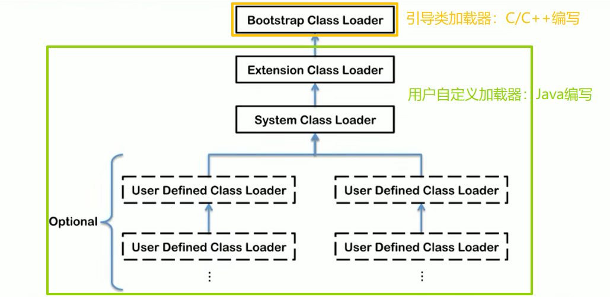

这里的四者之间的关系是包含关系。不是上层下层，也不是子父类的继承关系。


**类加载器输出测试：**

```java
public class ClassLoaderTest {
    public static void main(String[] args) {

        // 获取系统类加载器
        ClassLoader systemClassLoader = ClassLoader.getSystemClassLoader();
        System.out.println(systemClassLoader);  // sun.misc.Launcher$AppClassLoader@18b4aac2

        // 获取其上层:拓展类加载器
        ClassLoader extClassLoader = systemClassLoader.getParent();
        System.out.println(extClassLoader);     // sun.misc.Launcher$ExtClassLoader@1b6d3586

        // 获取其上层：获取不到引导类加载器
        ClassLoader bootstrapClassLoader = extClassLoader.getParent();
        System.out.println(bootstrapClassLoader);   // null


        // 对于用户自定义类来说：默认使用系统类加载器进行加载
        ClassLoader classLoader = ClassLoaderTest.class.getClassLoader();
        System.out.println(classLoader);       // sun.misc.Launcher$AppClassLoader@18b4aac2

        // String类使用引导类加载器进行加载 -> Java核心类库都是
        ClassLoader classLoader1 = String.class.getClassLoader();
        System.out.println(classLoader1);       // null
    }
}
```


### 2.3.1 启动类加载器

启动类加载器（引导类加载器，Bootstrap ClassLoader）

+ 这个类加载使用C/C++语言实现的，嵌套在JVM内部。
+ 它用来加载Java的核心库（`JAVA HOME/jre/lib/rt.jar`、`resources.jar`或`sun.boot.class.path`路径下的内容），用于提供JVM自身需要的类。
+ 并不继承自`java.lang.ClassLoader`，没有父加载器。
+ 加载扩展类和应用程序类加载器，并指定为他们的父类加载器。
+ 出于安全考虑，Bootstrap启动类加载器只加载包名为`java`、`javax`、`sun`等开头的类。


### 2.3.2 扩展类加载器

扩展类加载器（Extension ClassLoader）

+ Java语言编写, 由`sun.misc.Launcher$ExtClassLoader`实现。
+ 派生于`ClassLoader`类。
+ 父类加载器为启动类加载器。
+ 从`java.ext.dirs`系统属性所指定的目录中加载类库，或从JDK的安装目录的`jre/lib/ext`子目录（扩展目录）下加载类库。**如果用户创建的JAR放在此目录下，也会自动由扩展类加载器加载。**


### 2.3.3 应用程序类加载器

应用程序类加载器（系统类加载器，AppClassLoader）

+ java言编写, 由`sun.misc.Launcher$AppClassLoader`实现。
+ 派生于`ClassLoader`类。
+ 父类加载器为扩展类加载器。
+ 它负责加载环境变量`classpath`或系统属性`java.class.path`指定路径下的类库。
+ **该类加载是程序中默认的类加载器**，一般来说，Java应用的类都是由它来完成加载。
+ 通过`classLoader#getSystemclassLoader()`方法可以获取到该类加载器。


### 2.3.4 类加载器测试及注意事项

1. 获取引导类加载器能加载的api路径

   ```java
   public class ClassLoaderTest1 {
       public static void main(String[] args) {
           System.out.println("=====启动类加载器=====");
           // 获取BootstrapClassLoader能够加载的api的路径
           URL[] urLs = Launcher.getBootstrapClassPath().getURLs();
           for (URL urL : urLs) {
               System.out.println(urL);
           }
       }
   }
   ```

   测试结果：

   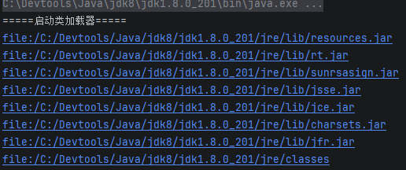

   其中`rt.jar`加载的是java中的常用类库（如String等）。

   随便找一个加载进来的库里的类，看其类加载器是否是引导类加载器？

   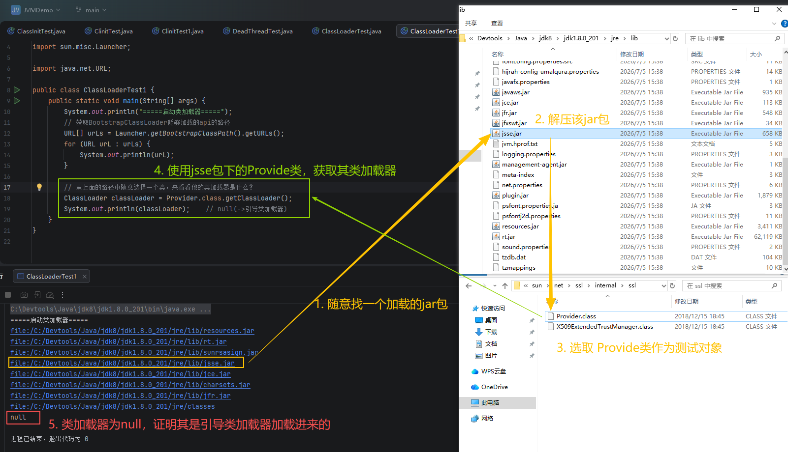

   

2. 获取扩展类加载器能加载的api路径

   ```java
   System.out.println("=====扩展类加载器=====");
   String extDirs = System.getProperty("java.ext.dirs");
   for (String path : extDirs.split(";")) {
       System.out.println(path);
   }
   ```

   测试结果：

   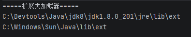

   随便找一个加载进来的库里的类，看其类加载器是否是引导类加载器？

   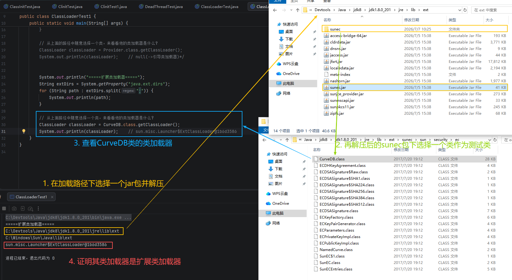


### 2.3.5 用户自定义类加载器（了解）

用户自定义类加载器：

+ 在Java的日常应用程序开发中，类的加载几乎是由上述3种类加载器相互配合执行的，在必要时，我们还可以自定义类加载器，来定制类的加载方式。
+ 为什么要自定义类加载器？
  + 隔离加载类
  + 修改类加载的方式
  + 扩展加载源
  + 防止源码泄漏


**用户自定义类加载器实现步骤：**

1. 开发人员可以通过继承抽象类`java.lang.ClassLoader`类的方式，实现自己的类加载器，以满足一些特殊的需求。
2. 在JDK1.2之前，在自定义类加载器时，总会去继承`ClassLoader`类并重写`loadClass()`方法，从而实现自定义的类加载类。但是在JDK1.2之后已不再建议用户去覆盖`loadClass()`方法，而是建议把自定义的类加载逻辑写在`findClass()`方法中。
3. 在编写自定义类加载器时，如果没有太过于复杂的需求，可以直接继承`URLClassLoader`类，这样就可以避免自己去编写`findClass()`方法及其获取字节码流的方式，使自定义类加载器编写更加简洁。


用户自定义类加载器的简单框架：

```java
public class CustomClassLoader extends ClassLoader {
    @Override
    protected Class<?> findClass(String name) throws ClassNotFoundException {
        try {
            byte[] result = getClassFromCustomPath(name);
            if (result == null) {
                throw new FileNotFoundException();
            } else {
                return defineClass(name, result, 0, result.length);
            }
        } catch (FileNotFoundException e) {
            e.printStackTrace();
        }

        throw new ClassNotFoundException(name);
    }

    private byte[] getClassFromCustomPath(String name) {
        // 从自定义路径中加载指定类：细节略
        // 如果指定路径的字节码文件进行了加密，则需要在此方法中进行解密操作

        return null;
    }

    public static void main(String[] args) {
        CustomClassLoader customClassLoader = new CustomClassLoader();
        try {
            Class<?> clazz = Class.forName("One", true, customClassLoader);
            Object obj = clazz.newInstance();
            System.out.println(obj.getClass().getClassLoader());
        } catch (Exception e) {
            e.printStackTrace();
        }
    }
}
```


## 2.4 ClassLoader的使用说明

`ClassLoader`类，它是一个抽象类，其后所有的类加载器都继承自`ClassLoader`（启动类加载器除外）。

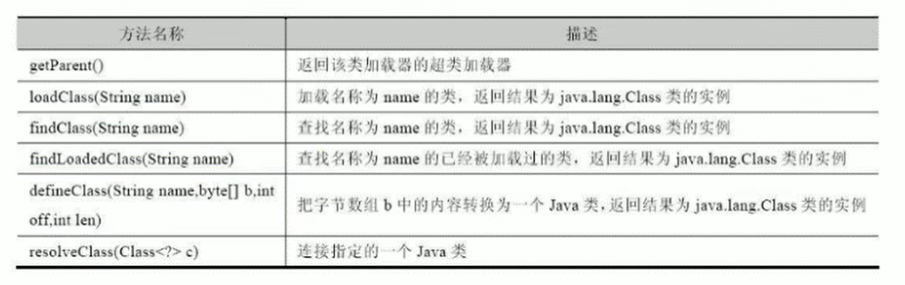


类加载器的继承关系：

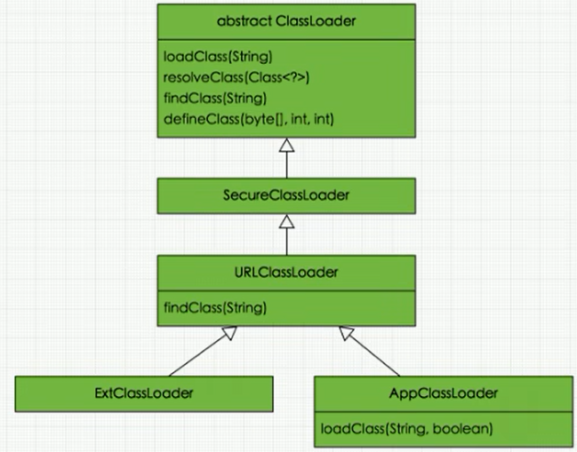

`sun.misc.Launcher`是一个java虚拟机的入口应用，扩展类和应用类加载器都是`Launcher`类的内部类：

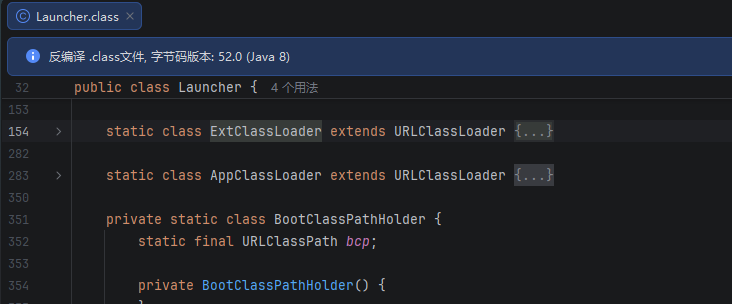


**获取类加载器的方法：**

```java
public class ClassLoaderTest2 {
    public static void main(String[] args) {
        try {
            // 1. 获取当前类的ClassLoader
            ClassLoader classLoader = Class.forName("java.lang.String").getClassLoader();
            System.out.println(classLoader);    // null

            // 2. 获取当前线程上下文的ClassLoader
            ClassLoader contextClassLoader = Thread.currentThread().getContextClassLoader();
            System.out.println(contextClassLoader);

            // 3. 获取系统的ClassLoader
            ClassLoader systemClassLoader = ClassLoader.getSystemClassLoader();
            System.out.println(systemClassLoader);
            // 通过系统类加载器获取应用类加载器
            ClassLoader appClassLoader = systemClassLoader.getParent();
            System.out.println(appClassLoader);

            // 4. 获取调用者的ClassLoader(sql相关)
            // DriverManager.getCallerClassLoader();

        } catch (ClassNotFoundException e) {
            throw new RuntimeException(e);
        }
    }
}
```


## 2.5 双亲委派机制

​	Java虚拟机对class文件采用的是**按需加载**的方式，也就是说当需要使用该类时才会将它的class文件加载到内存生成class对象。而且加载某个类的class文件时，Java虚拟机采用的是**双亲委派模式**，即把请求交由父类处理，它是一种任务委派模式。


### 2.5.1 工作机制

1. 如果一个类加载器收到了类加载请求，它并不会自己先去加载，而是把这个请求委托给父类的加载器去执行;
2. 如果父类加载器还存在其父类加载器，则进一步向上委托，依次递归，请求最终将到达顶层的启动类加载器;
3. 如果父类加载器可以完成类加载任务，就成功返回，倘若父类加载器无法完成此加载任务，子加载器才会尝试自己去加载，这就是双亲委派模式。


**双亲委派机制示意图：**

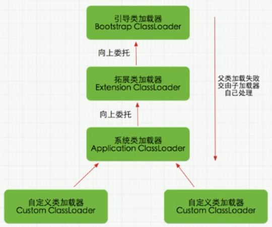


### 2.5.2 委派测试

新建`StringTest.class`类用于测试。

1. 创建一个`java.lang.String`类，路径跟java核心类String类是一样的。我们在测试类中创建`String`类：

   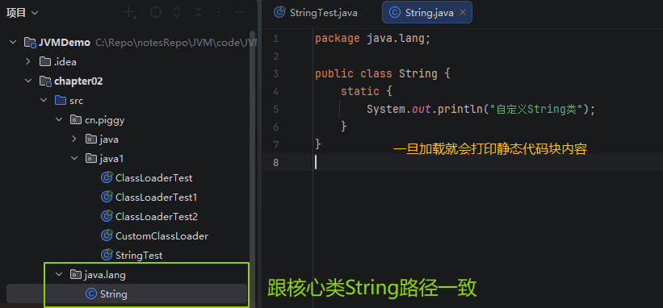

   运行测试：

   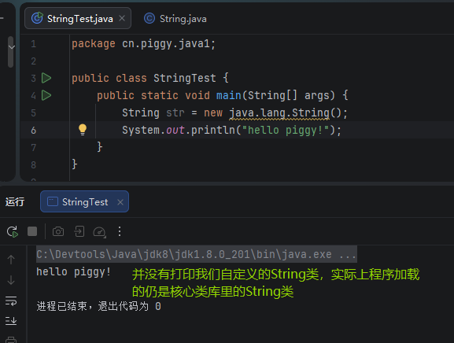

   由此可见，在程序进行类加载时，会将该加载任务向上委托，直到启动类加载器确认加载核心类库的类。（包名为`java`开头的包直接被启动类加载器加载）

   

2. 如果我们在自定义的`String`类中定义一个`main()`方法，直接调用。

   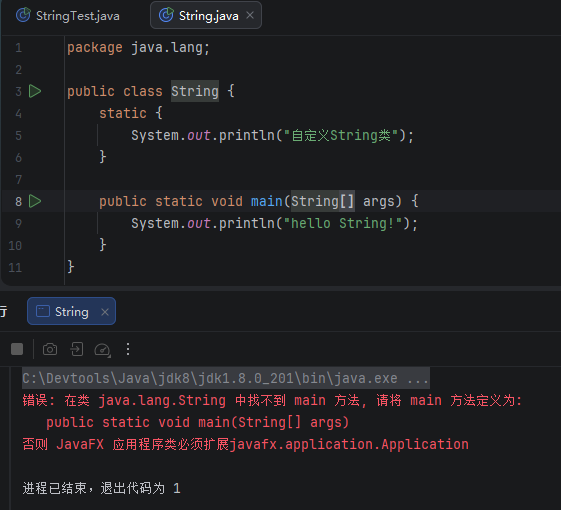

   事实上程序加载的仍然是java核心类库里的`String`类，而且核心类`String`类中是没有`main()`方法的，因此会抛出没有找到该方法的异常。

   

3. 一个正常的例子，实例化`StringTest`类并查看加载器。

   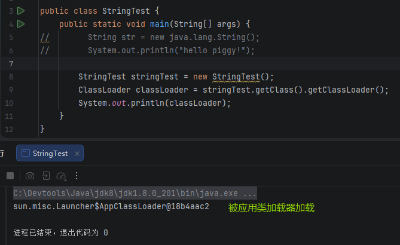

   `StringTest`类加载时向上委托，但其都不属于启动类和扩展类加载器的加载范围，最后向下传递，返回到系统类加载器进行加载。

4. 引入第三方库的委派机制：

   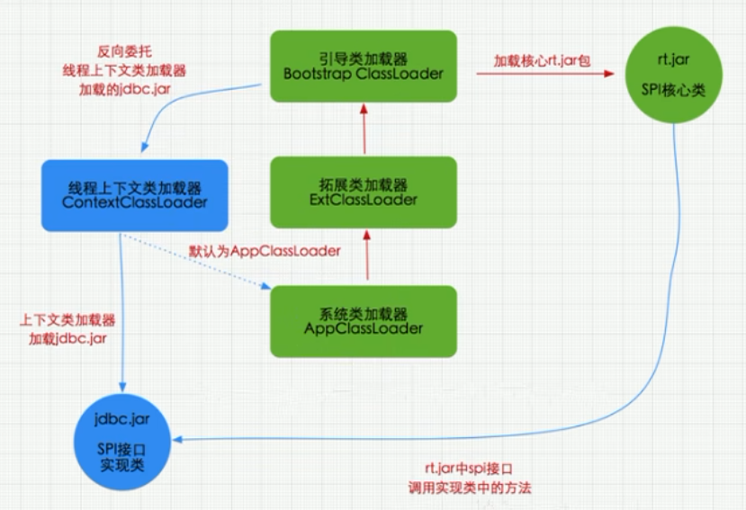

   在引入jdbc库时，接口抽象类是java核心库已经规定好的，这部分是由引导类加载器加载的。而jdbc库里有具体实现，因此是由引导类加载器反向委托给线程上下文加载器（即系统类加载器）加载的。这样一来，jvm就能完全加载SPI接口的抽象类及其第三方实现类的信息了。


### 2.5.3 优势

双亲委派机制的优势：

1. 避免重复加载。

2. 保护程序安全，防止核心API被篡改。

   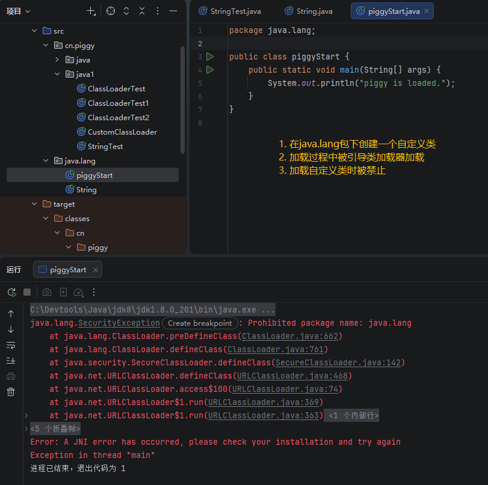

   

   


### 2.5.4 沙箱安全机制

在2.5.2委派测试中，jvm加载自定义`string`类的时候会率先使用引导类加载器加载，而引导类加载器在加载的过程中会先加载jdk自带的文件（`rt.jar`包中`java\lang\String.class`），报错信息说没有`main()`方法，就是因为加载的是rt.jar包中的string类。

虽然加载失败，但是没有对jvm虚拟机造成实质影响，这样可以保证对java核心源代码的保护，这就是沙箱安全机制。


## 2.6 其他

### 2.6.1 对同一个类的判定

在JVM中如何表示两个class对象是否为同一个类？

存在两个必要条件：

+ 类的完整类名必须一致，包括包名。
+ 加载这个类的classLoader（指classLoader实例对象）必须相同。


### 2.6.2 对类加载器的引用

JVM必须知道一个类型是由启动加载器加载的还是由用户类加载器加载的。

如果一个类型是由用户类加载器加载的，那么JVM会**将这个类加载器的一个引用作为类型信息的一部分保存在方法区中**。

当解析一个类型到另一个类型的引用的时候，JVM需要保证这两个类型的类加载器是相同的。


### 2.6.3 类的主动使用和被动使用

Java程序对类的使用方式分为：主动使用和被动使用。

+ **主动使用**，又分为七种情况：
  + 创建类的实例
  + 访问某个类或接口的静态变量，或者对该静态变量赋值
  + 调用类的静态方法
  + 反射 (比如：`Class.forName ("com.atguigu.Test")`）
  + 初始化一个类的子类
  + Java虚拟机启动时被标明为启动类的类
  + JDK7开始提供的动态语言支持：
    + `java.lang.invoke.MethodHandle`实例的解析结果
    + `REF_getStatic`、 `REF_putStatic`、 `REF_invokeStatic`句柄对应的类没有初始化，则初始化
+ 除了以上七种情况，其他使用Java类的方式都被看作是**对类的被动使用，都不会导致类的初始化**。


# 三、运行时数据区

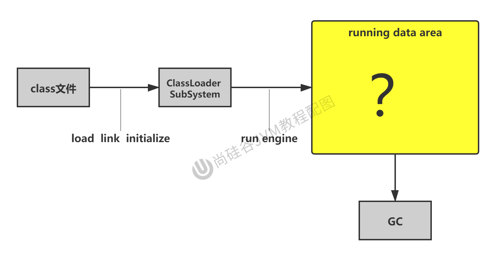

## 3.1 概述

内存是非常重要的系统资源，是硬盘和CPU的中间仓库及桥梁，承载着操作系统和应用程序的实时运行。JVM内存布局规定了Java在运行过程中内存申请、分配、管理的策略，保证了JVM的高效稳定运行。**不同的JVM对于内存的划分方式和管理机制存在着部分差异**。结合JVM虚拟机规范，来探讨一下经典的JVM内存布局（本笔记主要探讨HotSpot虚拟机）。

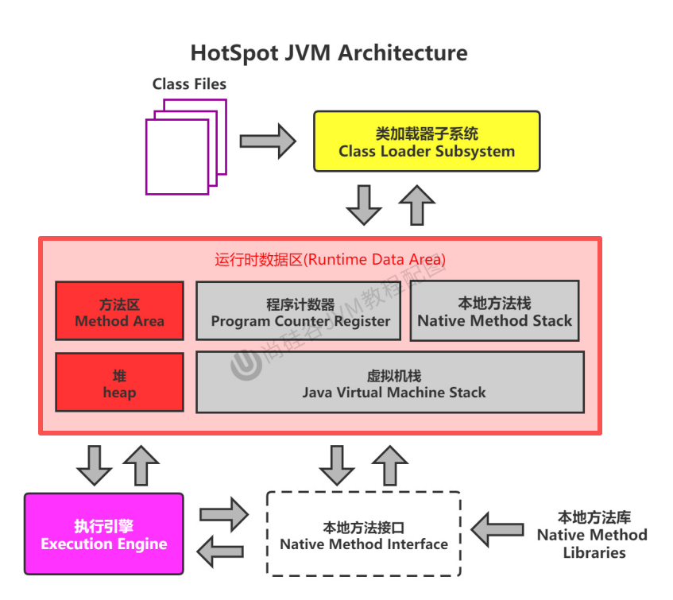

阿里规范提供的示意图：

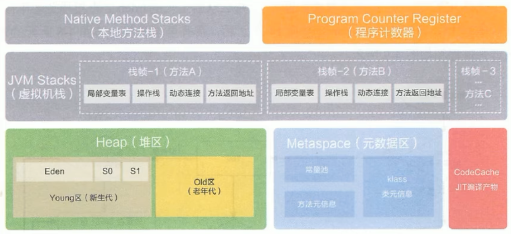


**线程私有和共享**

Java虚拟机定义了若干种程序运行期间会使用到的运行时数据区，其中有一些会随着虚拟机启动而创建，随着虚拟机退出而销毁。另外一些则是与线程一一对应的，这些与线程对应
的数据区域会随着线程开始和结束而创建和销毀。

如下图所示：灰色的为单独线程私有的，红色的为多个线程共享的。即：

+ 每个线程：拥有独立的程序计数器、虚拟机栈、本地方法栈。
+ 线程间共享：堆、堆外内存（永久代或元空间、代码缓存）。

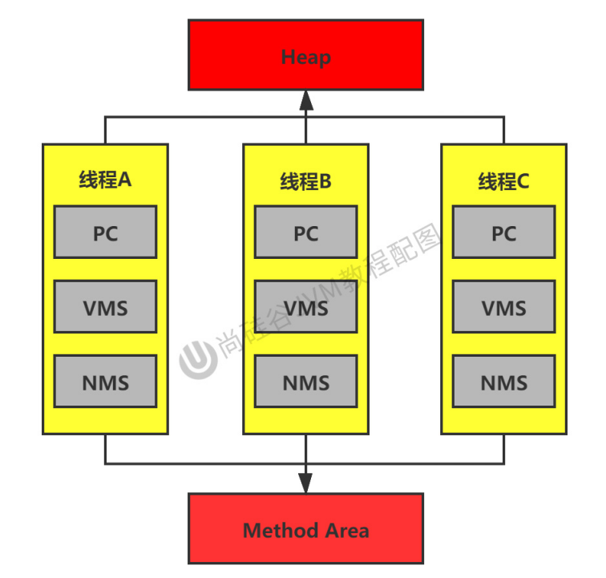

> 永久代和元空间简单理解为本地方法区（Method Area）的落地实现。
>
> + 在jdk8之前称为永久代。
> + 在jdk8及以后称为元空间。
>
> 
>
> 例子 - 1个进程中有五个线程：
>
> + 那么JVM中只有一个堆区和元空间，5个线程共用。
> + 有5份线程私有的程序计数器、虚拟机栈和本地方法栈。
>
> 也即JVM中存在1个堆区、1个元空间、5个程序计数器、5个虚拟机栈和5个本地方法栈。


**运行时数据区实例化表达**

每个JVM中只有一个运行时数据区，在JVM中通过Runtime类实例来表达，可以通过该实例来进行一些交互操作。

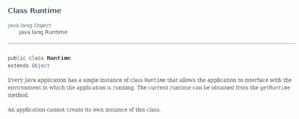


## 3.2 线程

**概览：**

+ 线程是一个程序里的运行单元。JVM允许一个应用有多个线程并行的执行。
+ 在Hotspot JVM里，每个线程都与操作系统的本地线程直接映射。
  + 当一个Java线程准备好执行以后（在JVM上初始化完成程序计数器、虚拟机栈等），此时一个操作系统的本地线程也同时创建。Java线程执行终止后，本地线程也会回收。
+ 操作系统负责所有线程的安排调度到任何一个可用的CPU上。一旦本地线程初始化成功，它就会调用Java线程中的`run()`方法。
+ 如果使用`jconsole`或者是任何一个调试工具，都能看到在后台有许多线程在运行。这些后台线程不包括调用`public static void main(String[])`的main线程以及所有这个main线程自己创建的线程。
+ 这些主要的后台系统线程在Hotspot JVM里主要是以下几个:
  + 虚拟机线程：这种线程的操作是需要JVM达到安全点才会出现。这些操作必须在不同的线程中发生的原因是他们都需要JVM达到安全点，这样堆才不会变化。这种线程的执行类型包括"stop-the-world"的垃圾收集，线程栈收集，线程挂起以及偏向锁撤销。
  + 周期任务线程：这种线程是时间周期事件的体现(比如中断)，他们一般用于周期性操作的调度执行。
  + GC线程：这种线程对在JVM里不同种类的垃圾收集行为提供了支持。（这属于守护线程）
  + 编译线程：这种线程在运行时会将字节码编译成到本地代码。
  + 信号调度线程：这种线程接收信号并发送给JVM，在它内部通过调用适当的方法进
    行处理。


**守护线程和普通线程的区别：**

> JVM关闭的条件是所有线程退出，普通线程必须全部执行完成后，JVM才会推出。如果设置了守护线程，等普通线程全部执行完毕后，守护线程不管执行到什么程度都会直接关闭。
>
> 一般来说，普通线程用于执行核心业务，守护线程用于执行一些可以随时中断的任务，比如日志、监控等任务。这样一来，主业务（普通线程）执行完成，不会被监控线程等卡住无法关闭，从而成为僵尸进程。


# 四、程序计数器（PC寄存器）

更多细节可以查看JVM虚拟机规范：[The Java® Virtual Machine Specification](https://docs.oracle.com/javase/specs/jvms/se8/html/index.html)


## 4.1 PC Register概述

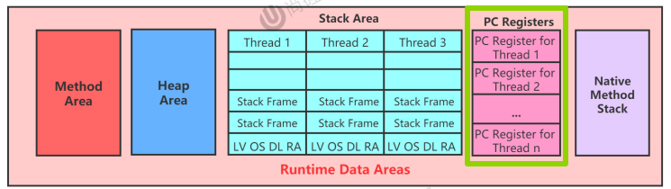

JVM中的**程序计数寄存器**（Program Counter Register）中, Register 的命名源于
CPU的寄存器，寄存器存储指令相关的现场信息。 CPU只有把数据装载到寄存器才能够运行。

这里的程序计数寄存器并非是广义上所指的物理寄存器，或许将其翻译为PC计数器（或指令计数器）会更加贴切（也称为程序钩子），并且也不容易引起一些不必要的误会。**JVM中的PC寄存器是对物理PC寄存器的一种抽象模拟**。


**作用：**PC寄存器用来存储指向下一条指令的地址，也即将要执行的指令代码。由执行引擎读取下一条指令。

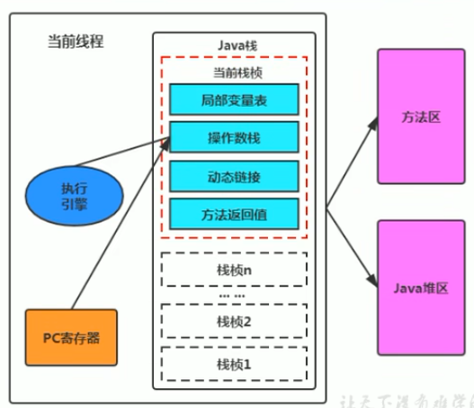


**PC寄存器介绍：**

+ 它是一块很小的内存空间，几乎可以忽略不记。也是运行速度最快的存储区域。
+ 在JVM规范中，每个线程都有它自己的程序计数器，是线程私有的，生命周期与线程的生命周期保持一致。
+ 任何时间一个线程都只有一个方法在执行，也就是所谓的当前方法。程序计数器会存储当前线程正在执行的Java方法的JVM指令地址；或者如果当前是在执行native方法，则是未指定值（undefined）。
+ 它是程序控制流的指示器，分支、循环、跳转、异常处理、线程恢复等基础
  功能都需要依赖这个计数器来完成。
+ 字节码解释器工作时就是通过改变这个计数器的值来选取下一条需要执行的
  字节码指令。
+ 它是唯一一个在Java 虚拟机规范中没有规定任何`OutOfMemoryError`
  情况的区域。


## 4.2 举例说明

我们创建一个简单的java文件，对编译后的字节码文件进行反编译（`javap -verbose PCRegisterTest.class`），查看它`main()`方法，其中PC寄存器记录的就是方法中的偏移地址：

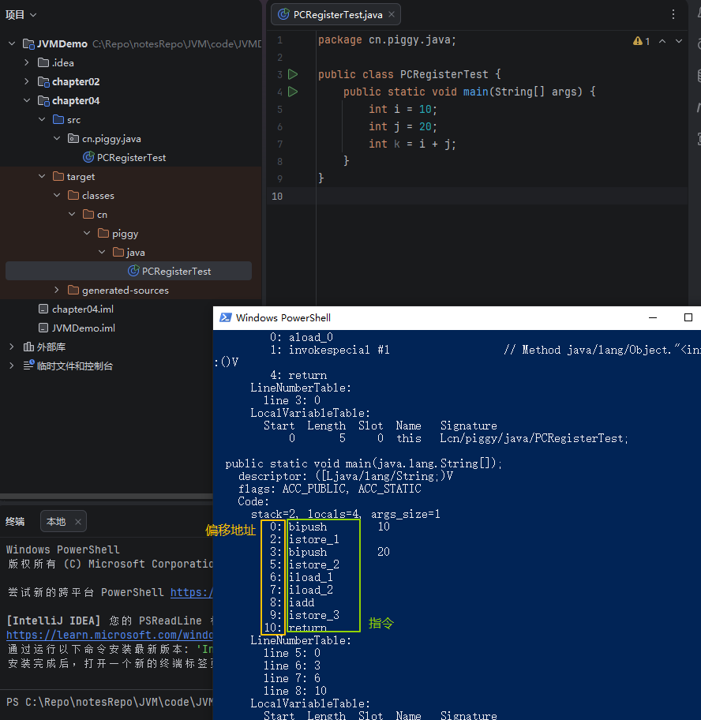


修改代码，编译后反编译：

```java
public class PCRegisterTest {
    public static void main(String[] args) {
        int i = 10;
        int j = 20;
        int k = i + j;

        String s = "abc";
        System.out.println(i);
        System.out.println(j);
    }
}
```

代码`String s = "abc";`在反编译后的表达：

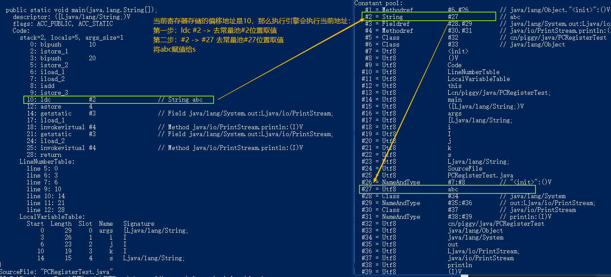


功能模块示意图：

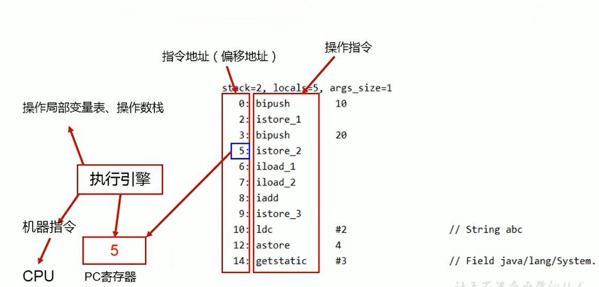


## 4.3 两个常见问题

### 4.3.1 PC寄存器存储指令地址的作用？

**Q：**使用PC寄存器存储字节码指令地址有什么用呢？或者说 为什么使用PC寄存器记录当前线程的执行地址呢？

**A：**因为CPU需要不停的切换各个线程，这时候切换回来以后，就得知道接着从哪开始继续执行。JVM的字节码解释器就需要通过改变PC寄存器的值来明确下一条应该执行什么样的字节码指令。


### 4.3.2 PC寄存器为什么是线程私有的？

**Q：**PC寄存器为什么会被设定为线程私有？

**A：**我们都知道所谓的多线程在一个特定的时间段内只会执行其中某一个线程的方法，CPU会不停地做任务切换，这样必然导致经常中断或恢复，如何保证分毫无差呢？**为了能够准确地记录各个线程正在执行的当前字节码指令地址，最好的办法自然是为每一个线程都分配一个PC寄存器**，这样一来各个线程之间便可以进行独立计算，从而不会出现相互干扰的情况。

由于CPU时间片轮限制，众多线程在并发执行过程中，任何一个确定的时刻，一个处理器或者多核处理器中的一个内核，只会执行某个线程中的一条指令。

这样必然导致经常中断或恢复，如何保证分毫无差呢？每个线程在创建后，都会产生自
己的程序计数器和栈帧，这样程序计数器在各个线程之间都能互不影响。


> **关于CPU时间片：**
>
> CPU时间片即 CPU 分配给各个程序的时间，每个线程被分配一个时间段，称作它的时间片。
>
> + 在宏观上：我们可以同时打开多个应用程序，每个程序并行不悖，同时运行。
> + 但在微观上：由于只有一个CPU，一次只能处理程序要求的一部分，如何处理公平，一种方法就是引入时间片，每个程序轮流执行。
>
> 
>
> **并行与并发：**
>
> + 并行：多个CPU跑多个任务，是物理意义上的多个任务同时执行。
> + 并发：单个CPU跑多个任务，系统时间片轮询处理多个任务，让人觉得是多个任务再同时执行。


# 五、虚拟机栈

## 5.1 虚拟机栈概述

### 5.1.1 虚拟机栈出现的背景

由于跨平台性的设计，Java的指令都是根据栈来设计的。不同平台CPU架构不同，所以不能设计为基于寄存器的。

**优点是跨平台，指令集小，编译器容易实现，缺点是性能下降，实现同样的功能需要更多的指令。**


### 5.1.2 内存中的堆和栈

**栈是运行时的单位，而堆是存储的单位。**

栈解决程序的运行问题，即程序如何执行，或者说如何处理数据。

堆解决的是数据存储的问题，即数据怎么放、放在哪儿。

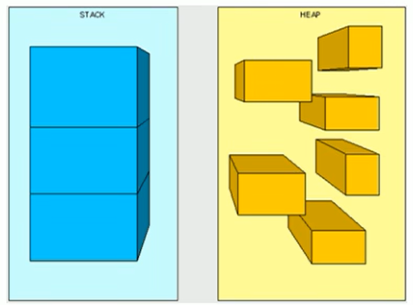


### 5.1.3 虚拟机栈基本内容

#### 5.1.3.1 Java虚拟机栈是什么?

Java虚拟机栈（Java Virtual Machine Stack）, 早期叫Java栈。

每个线程在创建时都会创建一个虚拟机栈，其内部保存一个个的栈帧（Stack Frame），对应着一次次的Java方法调用。

且每个虚拟机栈都是线程私有的。

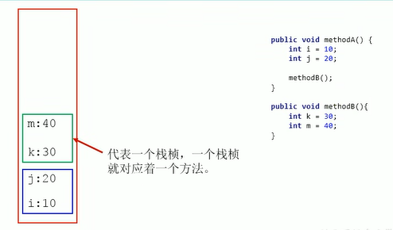


**生命周期**：生命周期和线程一致。

**作用**：主管Java程序的运行，它保存方法的局部变量（8种基本数据类型，对象的引用地址等）、部分结果，并参与方法的调用和返回。

 


#### 5.1.3.2 栈的特点（优点）

+ 栈是一种快速有效的分配存储方式，访问速度仅次于程序计数器。
+ JVM直接对Java栈的操作只有两个:
  + 每个方法执行，伴随着进栈(入栈、压栈)。
  + 执行结束后的出栈工作。
+ 对于栈来说不存在垃圾回收问题。

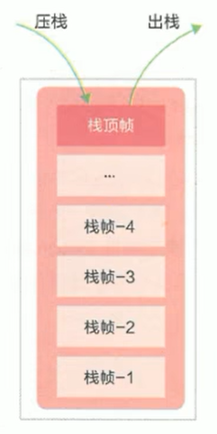


#### 5.1.3.3 栈中可能出现的异常

Java 虚拟机规范允许**Java栈的大小是动态的或者是固定不变的**。

如果采用固定大小的Java虚拟机栈，那每一个线程的Java虚拟机栈容量可以在线程创建的时候独立选定。如果线程请求分配的栈容量超过Java虚拟机栈允许的最大容量，Java虚拟机将会抛出一个`StackOverflowError `异常。

如果Java虚拟机栈可以动态扩展，并且在尝试扩展的时候无法申请到足够的内存，或者在创建新的线程时没有足够的内存去创建对应的虚拟机栈，那Java虚拟机将会抛出一个`OutOfMemoryErxor`异常。


#### 5.1.3.4 设置栈内存大小

> 参考官网文档[java11 Tools Reference](https://docs.oracle.com/en/java/javase/11/tools/java.html#GUID-3B1CE181-CD30-4178-9602-230B800D4FAE)


我们可以使用参数`-Xss`选项来设置线程的最大栈空间，栈的大小直接决定了函数调用的最大可达深度。

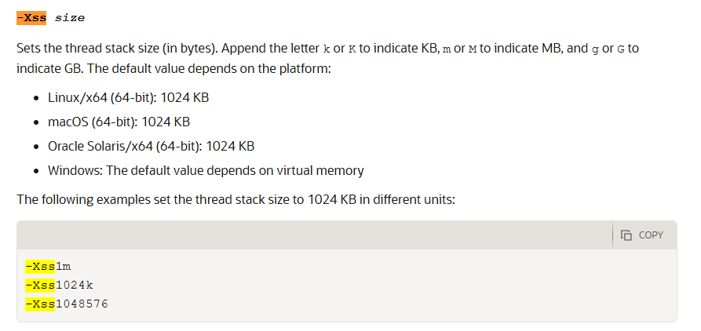


栈溢出测试：

编写测试代码：

```java
public class StackErrorTest {
    private static int count = 1;
    public static void main(String[] args) {
        System.out.println(count);
        count++;
        main(args);
    }
}
```

默认情况下运行测试，count打印到11417次抛出栈溢出异常。

修改虚拟机栈大小参数，设置为`-Xss256k`，重新运行测试：

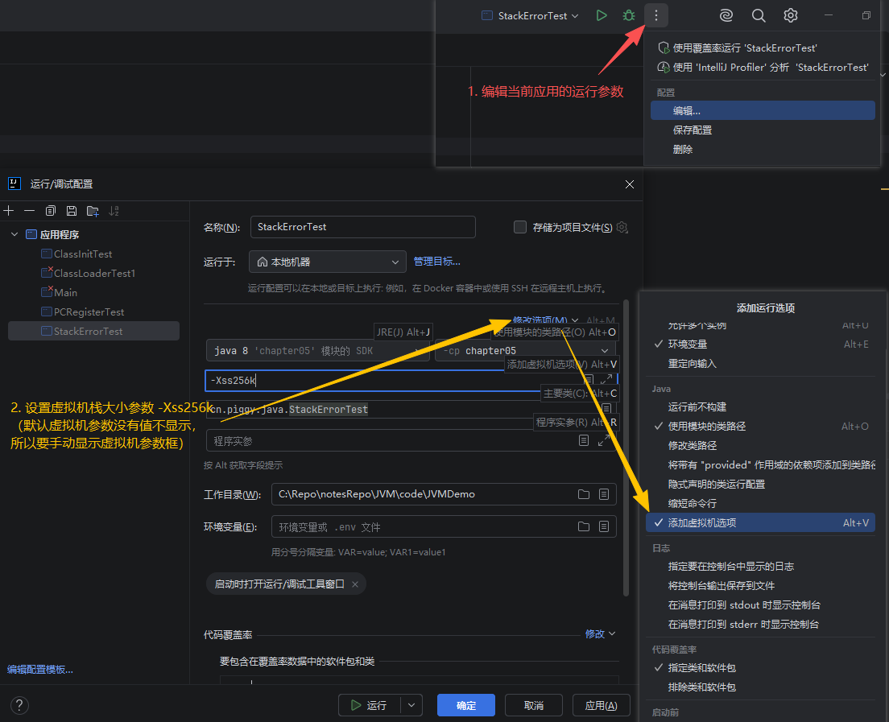

重新测试后count打印到2471次就抛出了栈溢出异常，因此可以看出该参数是有效的。


## 5.2 栈的存储单位

### 5.2.1 栈中存储什么？

+ 每个线程都有自己的栈，栈中的数据都是以**栈帧**（Stack Frame）的形式存在。
+ 在这个线程上正在执行的每个方法都各自对应一个栈帧（StackFrame）。
+ 栈帧是一个内存区块，是一个数据集，维系着方法执行过程中的各种数据信息。


### 5.2.2 栈运行原理

+ JVM直接对Java栈的操作只有两个，就是对栈帧的**压栈**和**出栈**，遵循 “**先进**
  **后出**” / “**后进先出**” 原则。

+ 在一条活动线程中，一个时间点上，只会有一个活动的栈帧。即只有当前正在执行的方法的栈帧（栈顶栈帧）是有效的，这个栈帧被称为**当前栈帧**（Current Frame），与当前栈帧相对应的方法就是**当前方法**（CurrentMethod），定义这个方法的类就是**当前类**（Current Class）。

+ 执行引擎运行的所有字节码指令只针对当前栈帧进行操作。

+ 如果在该方法中调用了其他方法，对应的新的栈帧会被创建出来，放在栈的顶端，成为新的当前帧。

+ 不同线程中所包含的栈帧是不允许存在相互引用的，即不可能在一个栈帧之中引用另外一个线程的栈帧。

+ 如果当前方法调用了其他方法，方法返回之际，当前栈帧会传回此方法的执行结果给前一个栈帧，接着，虚拟机会丢弃当前栈帧，使得前一个栈帧重新成为当前栈帧。

+ Java方法有两种返回函数的方式，**一种是正常的函数返回，使用return指令；另外一种是抛出异常。不管使用哪种方式，都会导致栈帧被弹出**。

  

  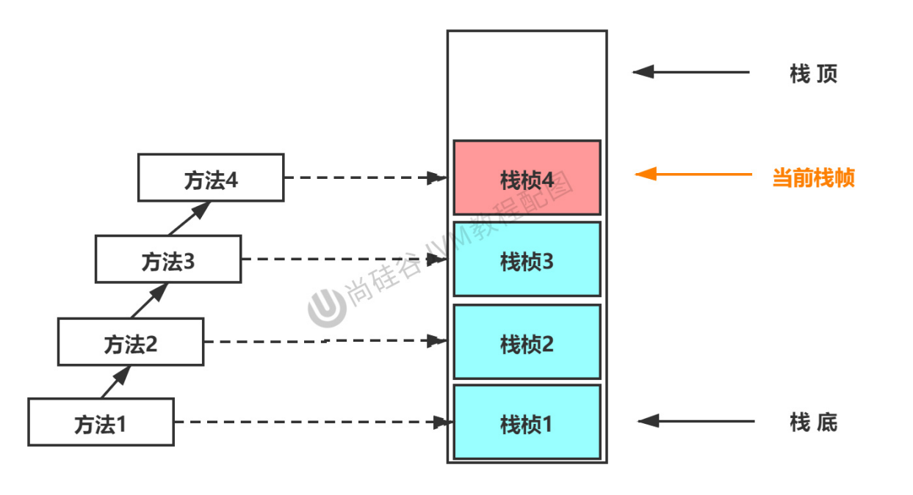


### 5.2.3 运行演示

编写一个方法调用的测试代码：

```java
public class StackFrameTest {
    public static void main(String[] args) {
        StackFrameTest stackFrameTest = new StackFrameTest();
        stackFrameTest.method1();
    }

    public void method1() {
        System.out.println("method1()方法开始执行...");
        method2();
        System.out.println("method1()方法执行结束...");
    }

    public int method2() {
        System.out.println("method2()方法开始执行...");
        int i = 10;
        int m = (int) method3();
        System.out.println("method2()方法即将结束...");
        return i + m;
    }

    public double method3() {
        System.out.println("method3()方法开始执行...");
        double j = 20.0;
        System.out.println("method3()方法即将结束...");
        return j;
    }
}
```

**演示一：给`stackFrameTest.method1()`加断点，查看代码调试状态。**

1. 进行调试，进入`main()`方法断点处：

   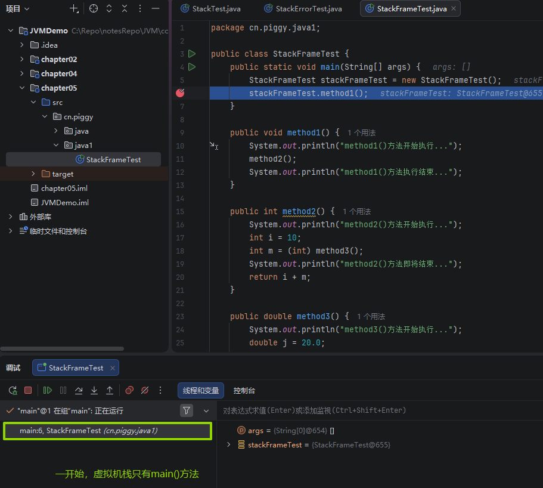

2. 进入`method1()`方法：

   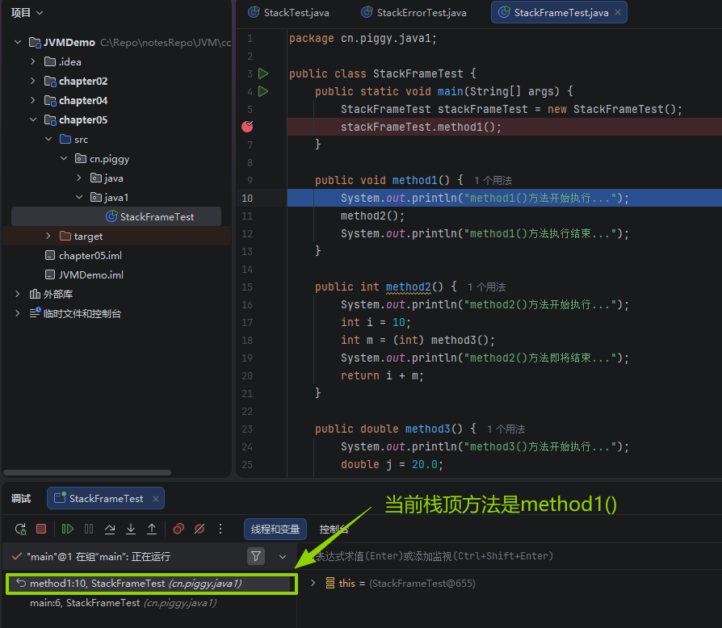

3. 直接进入`method3()`方法：

   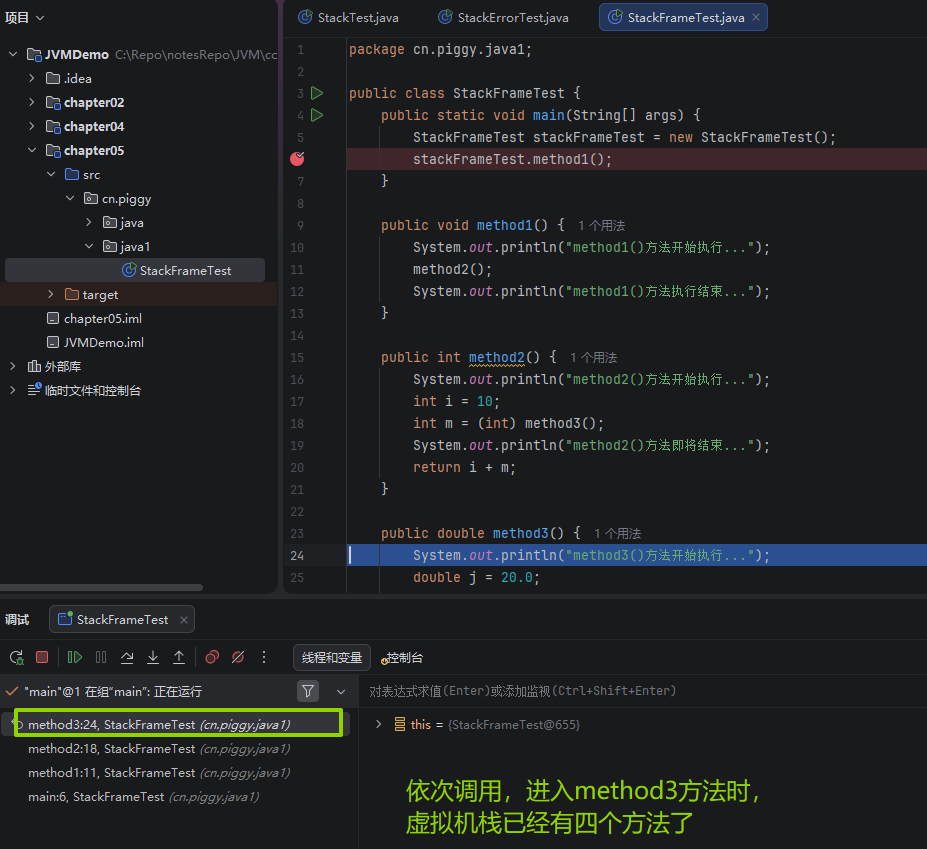

4. `method3()`方法执行结束，`method3()`方法出栈：

   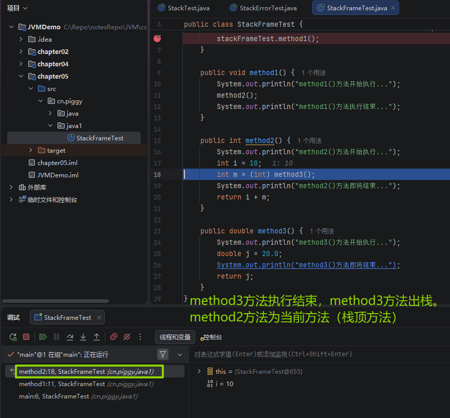

5. 以此类推，直到全部方法执行完毕，虚拟机栈内栈帧全部出栈，线程结束。


**演示二：`method2()`方法抛出异常。**

无异常捕获情况：

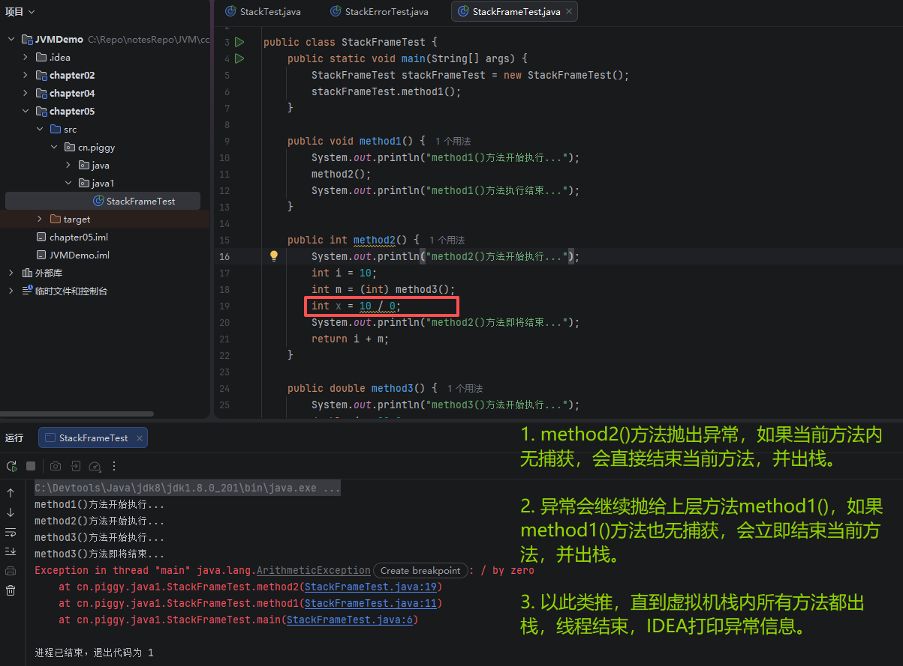

有异常捕获情况：

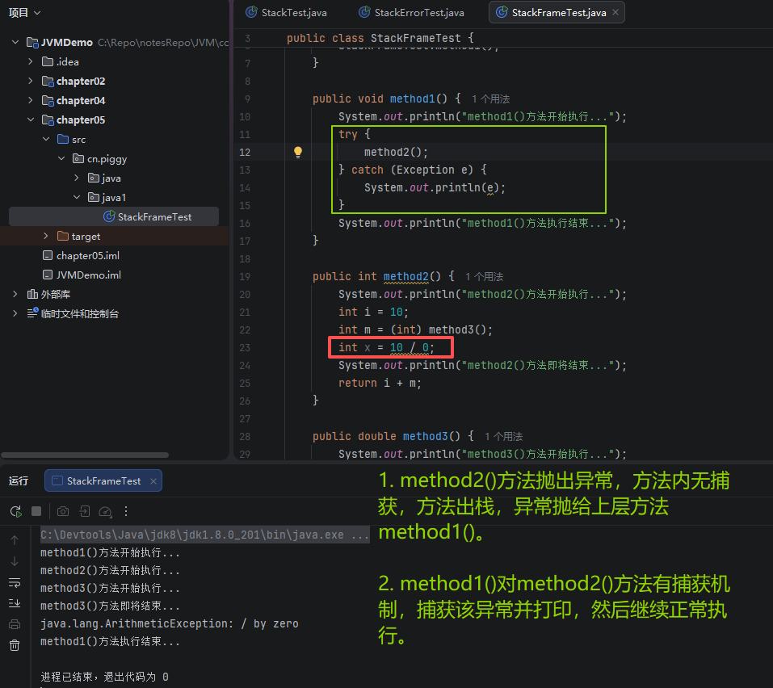


### 5.2.4 栈帧的内部结构

每个栈帧中存储着：

+ 局部变量表（Local Variables）
+ 操作数栈（operand Stack）（或表达式栈）
+ 动态链接（DynamicLinking）（或指向运行时常量池的方法引用）
+ 方法返回地址（Return Address）（或方法正常退出或者异常退出的定义）
+ 一些附加信息

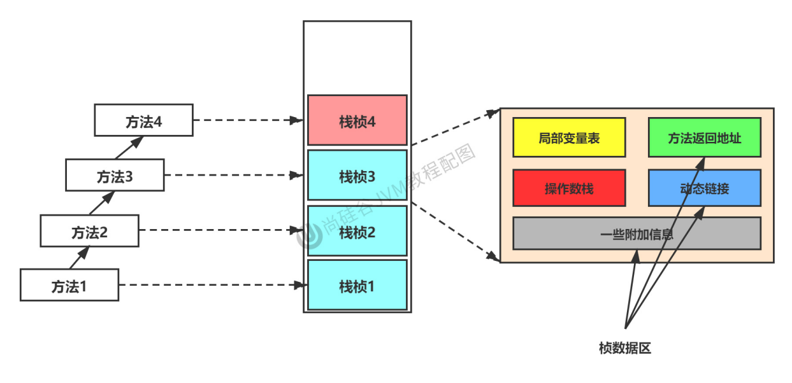


## 5.3 局部变量表

### 5.3.1 概述

+ 局部变量表也被称之为局部变量数组或本地变量表。
+ **定义为一个数字数组，主要用于存储方法参数和定义在方法体内的局部变量**，这些数据类型包括各类基本数据类型、对象引用（reference），以及`returnAddress`类型。
+ 由于局部变量表是建立在线程的栈上，是线程的私有数据，因此不存在数据安全问题。
+ **局部变量表所需的容量大小是在编译期确定下来的**，并保存在方法的`Code`属性的`maximum local variables`数据项中。在方法运行期间是不会改变局部变量表的大小的。
+ **方法嵌套调用的次数由栈的大小决定**。一般来说，**栈越大，方法嵌套调用次数越多**。对一个函数而言，它的参数和局部变量越多，使得局部变量表膨胀，它的栈帧就越大，以满足方法调用所需传递的信息增大的需求。进而函数调用就会占用更多的栈空间，导致其嵌套调用次数就会减少。
+ **局部变量表中的变量只在当前方法调用中有效**。在方法执行时，虚拟机通过使用局部变量表完成参数值到参数变量列表的传递过程。**当方法调用结束后，随着方法栈帧的销毁，局部变量表也会随之销毁**。


### 5.3.2 演示

编写测试代码，编译之后查看其字节码文件反汇编的信息。

1. 字节码长度：

   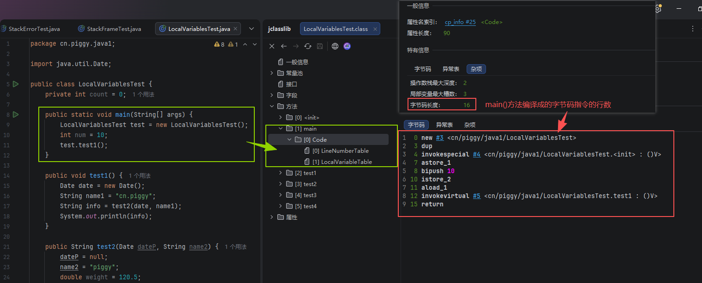

2. 行数对应表：

   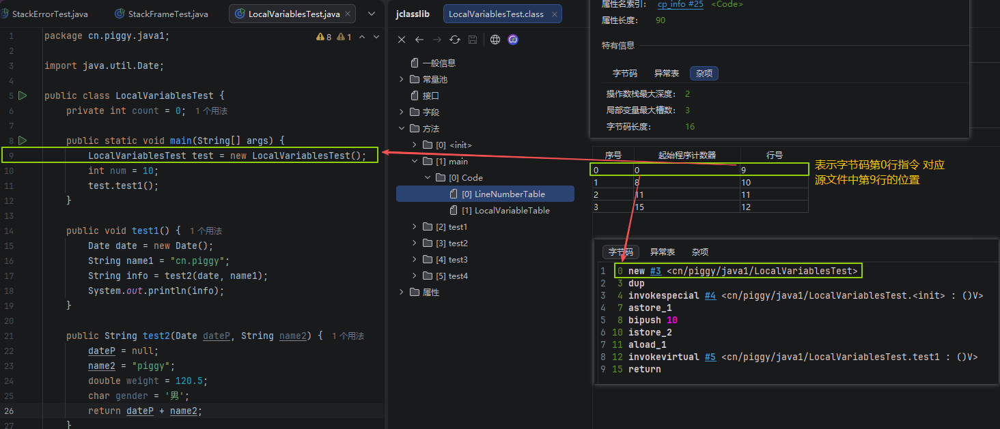

3. 本地变量表

   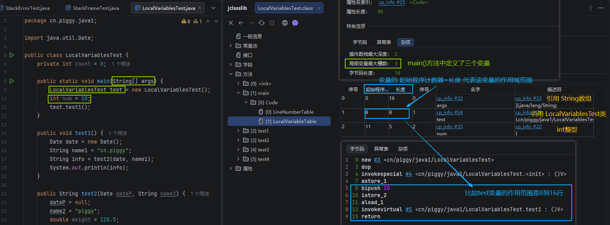


### 5.3.3 关于Slot的理解

+ 参数值的存放总是在局部变量数组的`index0`开始，到`数组长度-1`的索引结束。

+ 局部变量表，最基本的存储单元是**Slot**（变量槽）。

+ 局部变量表中存放编译期可知的各种基本数据类型（8种），引用类型（reference），`returnAddress`类型的变量。

+ 在局部变量表里，**32位以内的类型只占用一个slot（包括returnAddress类型），64位的类型（long和double） 占用两个slot**。

  + `byte`、`short`、`char` 在存储前被转换为`int`,`boolean` 也被转换为`int`，0 表示false，非0 表示true。
  + `long` 和`double` 则占据两个slot。

+ JVM会为局部变量表中的每一个slot都分配一个访问素引，通过这个索引即可成功访问到局部变量表中指定的局部变量值。

+ 当一个实例方法被调用的时候，它的方法参数和方法体内部定义的局部变量将会**按照顺序被复制**到局部变量表中的每一个slot上。

+ **如果需要访问局部变量表中一个64bit的局部变量值时，只需要使用前一个索引即可**。（比如访问`long`或`double`类型变量）

  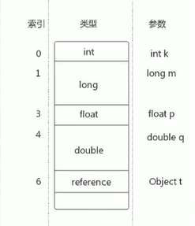

+ 如果当前帧是由构造方法或者实例方法创建的，那么该**对象引用this将会存放在index为0的slot处**，其余的参数按照参数表顺序继续排列。

+ Slot是可以被重复利用的。**栈帧中的局部变量表中的槽位是可以重用的**，如果一个局部变量过了其作用域，那么在其作用域之后申明的新的局部变量就很有可能会复用过期局部变量的槽位，从而达到节省资源的目的。


### 5.3.4 关于局部变量表的演示

1. 实例方法与构造方法会在index为0的slot存放`this`变量：

   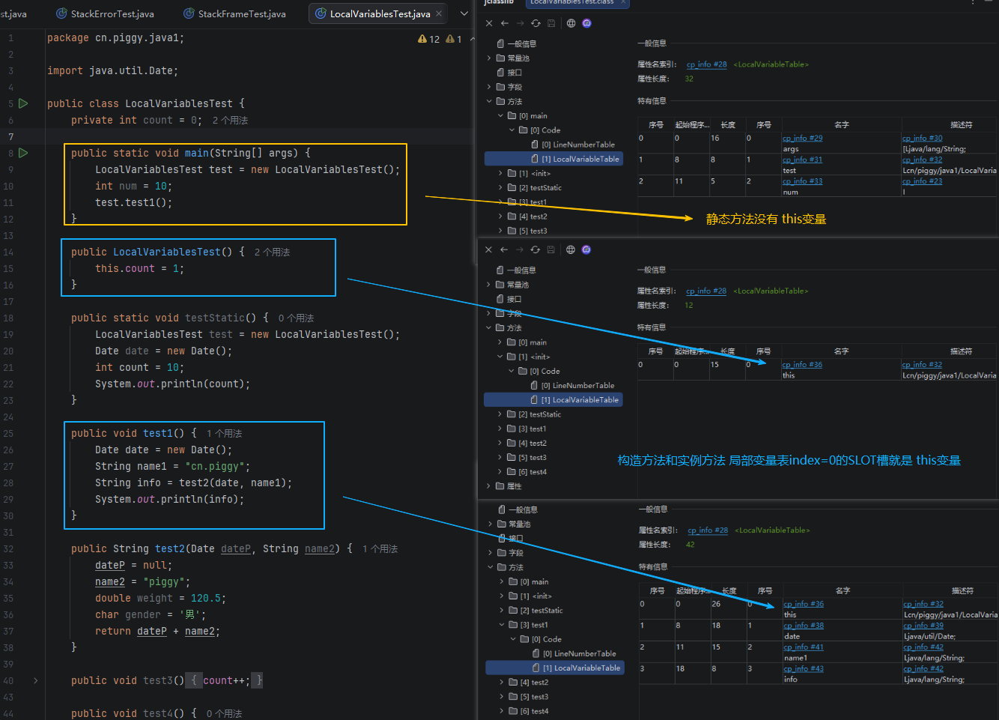

2. 32位以内的类型只占用一个slot（包括returnAddress类型），64位的类型（long和double） 占用两个slot：

   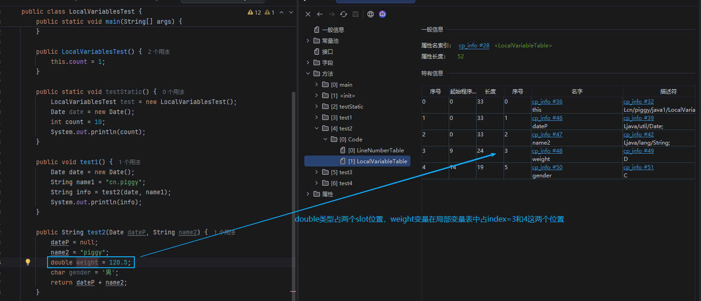

3. Slot是可以被重复利用的情况：

   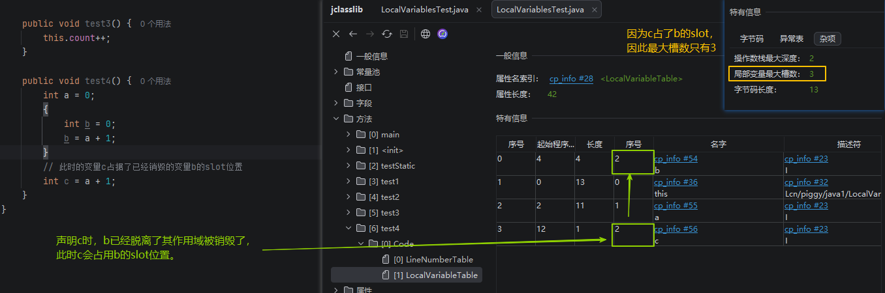


### 5.3.5 静态变量与局部变量的对比

变量的分类一般有两种区分方式：

1. 按数据类型分：**基本数据类型** 和**引用数据类型**。

2. 按在类中声明的位置分：
   + **成员变量**：在使用前会进行默认初始化赋值。
     + 类变量：linking的prepare阶段会默认赋值，initial阶段会显式赋值。
     + 实例变量：随着对象的创建，会在堆空间中分配实例变量空间，并进行默认赋值。
     
   + **局部变量**：在使用前，必须要进行显示赋值。否则编译不通过。
   
     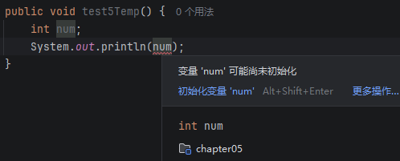


该部分探讨类变量与局部变量的对比。


**补充说明：**

+ 在栈帧中，与性能调优关系最为密切的部分就是前面提到的局部变量表。在方法执行时，虚拟机使用局部变量表完成方法的传递。

+ **局部变量表中的变量也是重要的垃圾回收根节点，只要被局部变量表中直接或间接引用的对象都不会被回收**。


## 5.4 操作数栈

+ 每一个独立的栈帧中除了包含局部变量表以外，还包含一个**后进先出**（Last-In-First-Out）的操作数栈，也可以称之为**表达式栈**（Expression Stack）。

+ **操作数栈，在方法执行过程中，根据字节码指令，往栈中写入数据或提取数据，即入栈（push）/ 出栈（pop）**。

  + 某些字节码指令将值压入操作数栈，其余的字节码指令将操作数取出栈。使用它们后再把结果压入栈。比如：执行复制、交换、求和等操作。

    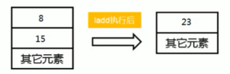

+ 操作数栈，**主要用于保存计算过程的中间结果，同时作为计算过程中变量临时的存储空间**。

+ 操作数栈就是JVM执行引擎的一个工作区，当一个方法刚开始执行的时候，一个新的栈帧也会随之被创建出来，**这个方法的操作数栈是空的**。

+ 每一个操作数栈都会拥有一个明确的栈深度用于存储数值，其所需的最大深度在编译期就定义好了，保存在方法的`Code`属性中，为`max_stack`的值。

+ 栈中的任何一个元素都是可以任意的Java数据类型。

  + 32bit的类型占用一个栈单位深度。
  + 64bit的类型占用两个栈单位深度。

+ 操作数栈是**使用数组实现的，但并非采用访问索引的方式来进行数据访问**的，而是只能通过标准的入栈（push）和出栈（pop）操作来完成一次数据访问。

+ **如果被调用的方法带有返回值的话，其返回值将会被压入当前栈帧的操作数栈中，并更新PC寄存器中下一条需要执行的字节码指令**。

+ 操作数栈中元素的数据类型必须与字节码指令的序列严格匹配，这由编译器在编译器期间进行验证，同时在类加载过程中的类检验阶段的数据流分析阶段要再次验证。

+ 另外，我们说Java虚拟机的**解释引擎是基于栈的执行引擎**，其中的栈指的就是操作数栈。


## 5.5 代码追踪

### 5.5.1 无返回值的函数测试

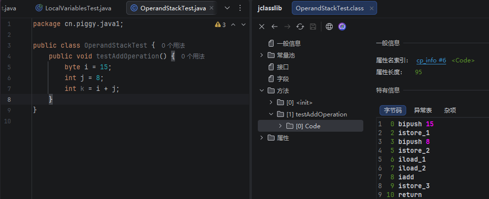

> 注意：
>
> + `byte`、`short`、`char`、`boolean`都以`int`的形式保存。
> + 下图局部变量表中index=0的slot省略，该slot为`this`变量。

1. 执行指令地址0，2：

   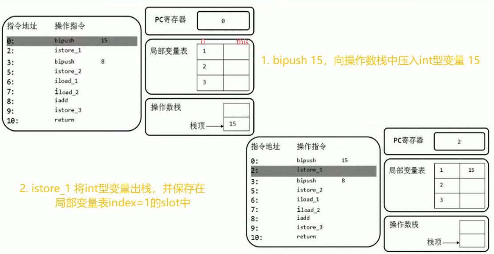

2. 执行指令地址3，5：

   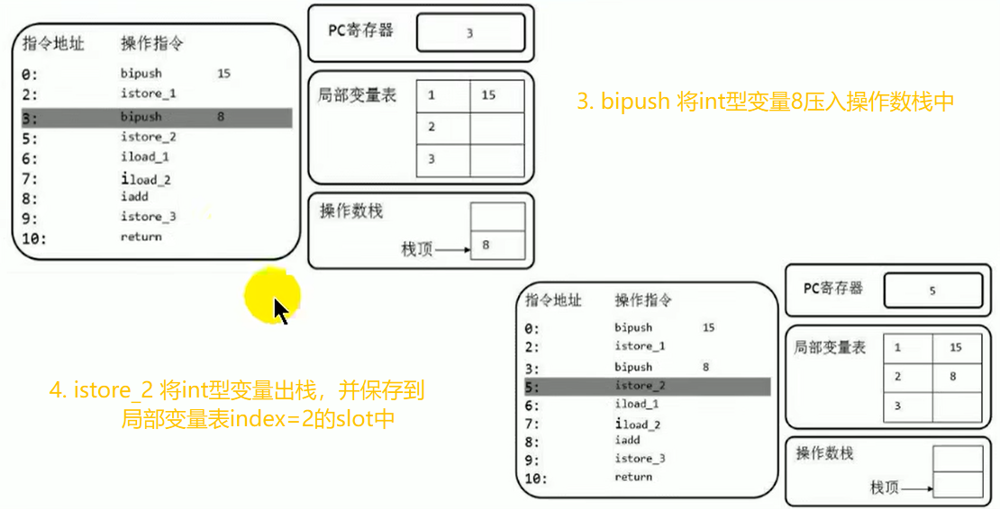

3. 执行指令地址6，7：

   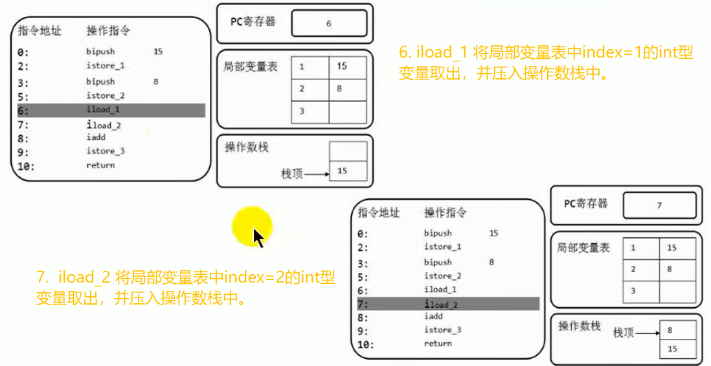

4. 执行指令地址8、9：

   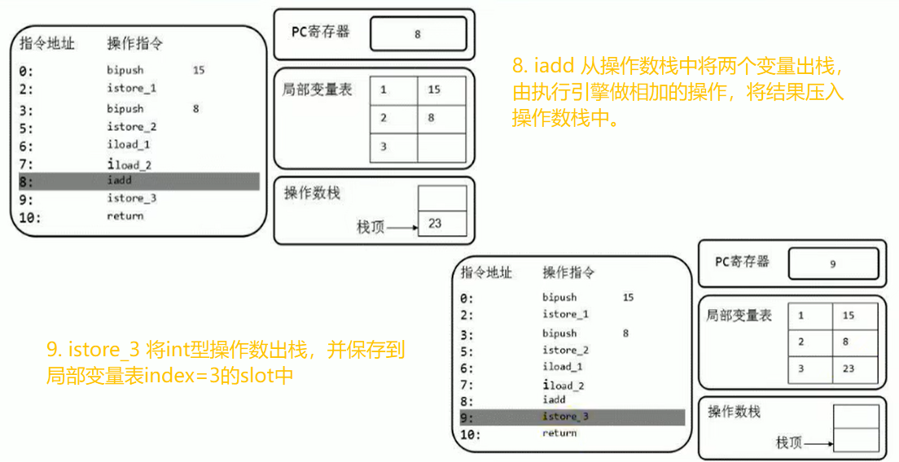

5. 执行指令地址10：直接`return`。


### 5.5.2 有返回值的函数测试

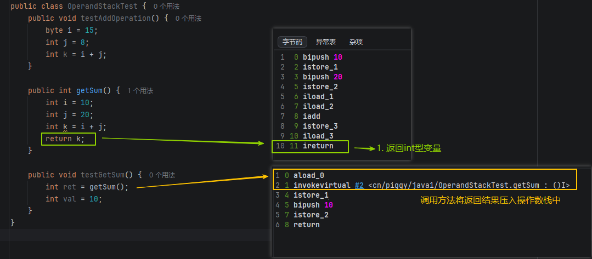


### 5.5.3 常见的i++和++i问题

这部分只做了解，后续会讲。只看第1类问题：

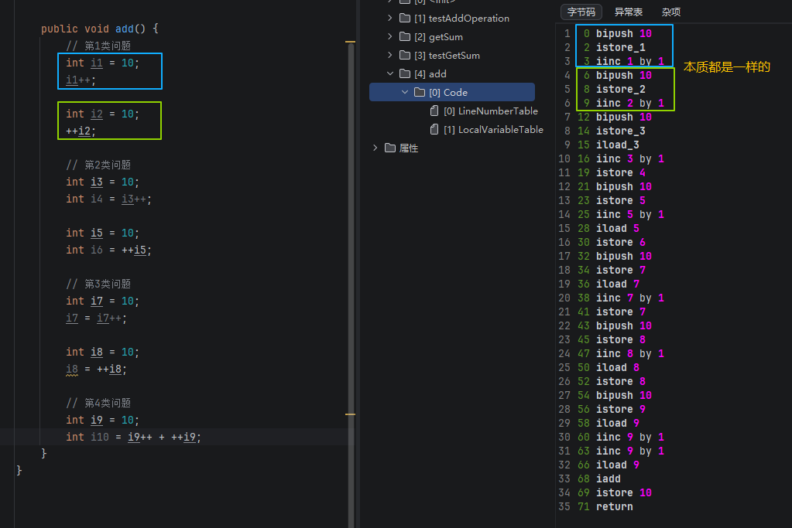


## 5.6 栈顶缓存技术

栈顶缓存技术（Top-of-Stack Cashing）：

前面提过，基于栈式架构的虚拟机所使用的零地址指令更加紧凑，但完成一项操作的时候必然需要使用更多的入栈和出样指令，这同时也就意味着将需要更多的指令分派（instruction dispatch）次数和内存读/写次数。

由于操作数是存储在内存中的，因此频繁地执行内存读/写操作必然会影响执行速度。为了解决这个问题，HotSpot JVM的设计者们提出了栈顶缓存（Tos，Top-of-Stack Cashing）技术，**将栈顶元素全部缓存在物理CPU的寄存器中，以此降低对内存的读/写次数，提升执行引擎的执行效率**。


## 5.7 动态链接

动态链接（或指向运行时常量池的方法引用）：

+ 每一个栈帧内部都包含一个指向**运行时常量池**中**该栈帧所属方法的引用**。包含这个引用的目的就是为了支持当前方法的代码能够实现**动态链接**（Dynamic Linking），比如:`invokedynamic`指令。
+ 在Java源文件被编译到字节码文件中时，所有的变量和方法引用都作为**符号引用**（Symbolic Reference）保存在class文件的常量池里。比如：描述一个方法调用了另外的其他方法时，就是通过常量池中指向方法的符号引用来表示的，那么**动态链接的作用就是为了将这些符号引用转换为调用方法的直接引用**。


**动态链接示意图：**

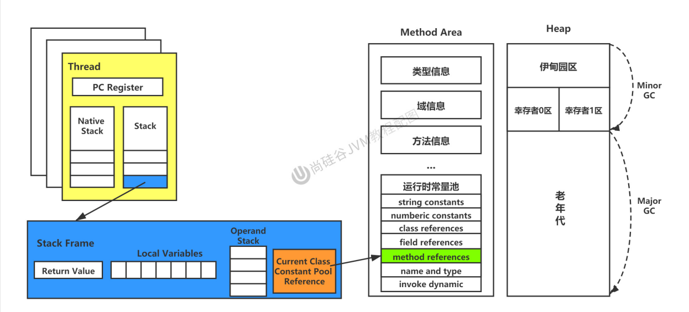


**动态链接演示：**

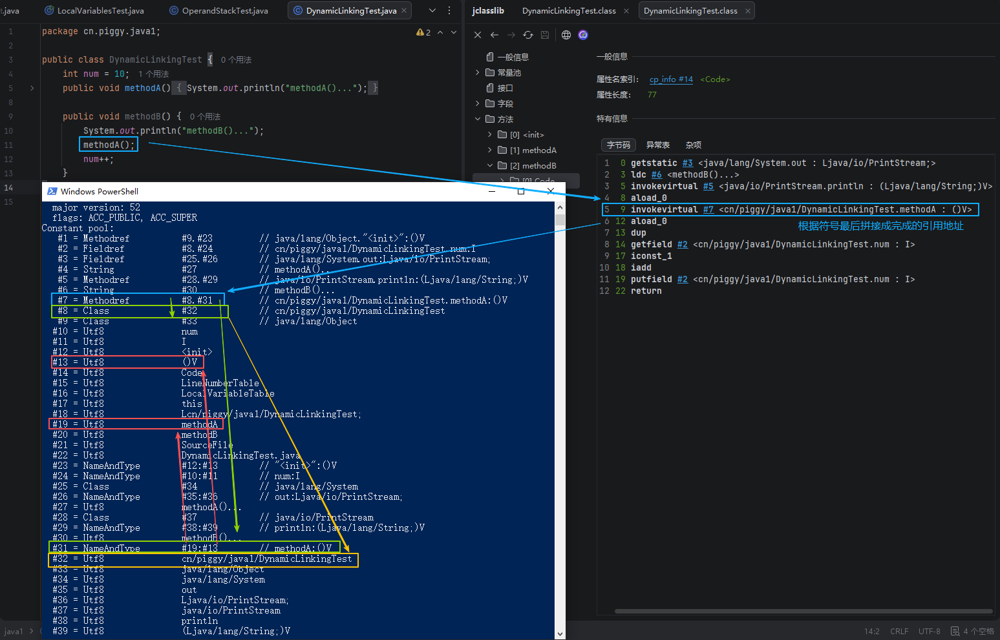


常见问题：

> Q：为什么需要动态链接，而不是每个栈帧保存一份单独的引用？
>
> A：节省空间，增强可复用性，使其他的线程栈帧也能使用相同引用。
>
> 
>
> Q：为什么需要常量池？
>
> A：为了提供一些符号和常量，便于指令的识别。


扩展：

> 在一般情况下，我们把方法返回地址，动态链接和一些附加信息并称为桢数据区。
>
> 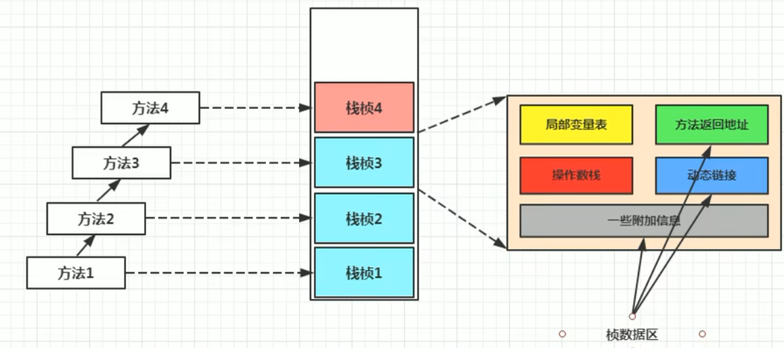


## 5.8 方法的调用：解析与分派

### 5.8.1 静态链接与动态链接

在JVM中，将符号引用转换为调用方法的直接引用与方法的绑定机制相关。

+ **静态链接**：

  当一个字节码文件被装载进JVM内部时，如果**被调用的目标方法在编译期可知**，且运行期保持不变时。这种情况下将调用方法的符号引用转换为直接引用的过程称之为静态链接。

+ **动态链接**：

  如果**被调用的方法在编译期无法被确定下来**，也就是说，只能够在程序运行期将调用方法的符号引用转换为直接引用，由于这种引用转换过程具备动态性，因此也就被称之为动态链接。


对应的方法的绑定机制为：早期绑定（Early Binding）和晚期绑定（Late Binding）。**绑定是一个字段、方法或者类在符号引用被替换为直接引用的过程，这仅仅发生一次**。

+ **早期绑定**：

  早期绑定就是指被调用的**目标方法如果在编译期可知，且运行期保持不变**时，即可将这个方法与所属的类型进行绑定，这样一来，由于明确了被调用的目标方法究竟是哪一个，因此也就可以使用静态链接的方式将符号引用转换为直接引用。

+ **晚期绑定**：

  **如果被调用的方法在编译期无法被确定下来，只能够在程序运行期根据实际的类型绑定相关的方法**，这种绑定方式也就被称之为晚期绑定。


随着高级语言的横空出世，类似于Java一样的基于面向对象的编程语言如今越来越多，尽管这类编程语言在语法风格上存在一定的差别，但是它们彼此之间始终保持着一个共性，那就是都支持封装、继承和多态等面向对象特性，既然**这一类的编程语言具备多态特性，那么自然也就具备早期绑定和晚期绑定两种绑定方式**。

Java中任何一个普通的方法其实都具备虚函数的特征，它们相当于C++语言中的虚函数（C++中则需要使用关键字`virtual`来显式定义）。如果在Java程序中不希望某个方法拥有虚函数的特征时，则可以使用关键字`final`来标记这个方法。


**实例：**

```java
/**
 * AnimalTest.java
 * 说明早期绑定和晚期绑定的例子
 */
class Animal {
    public void eat() {
        System.out.println("动物进食"); // 早期绑定，虚方法调用：invokevirtual
    }
}

interface Huntable {
    void hunt();
}

class Dog extends Animal implements Huntable {
    @Override
    public void eat() {
        System.out.println("狗吃骨头");
    }

    @Override
    public void hunt() {
        System.out.println("狗抓耗子，多管闲事");
    }
}

class Cat extends Animal implements Huntable {

    public Cat() {
        super(); // 调用父类空参构造方法（已经确定，早期绑定：invokespecial）
    }

    public Cat(String name) {
        this(); // 调用本类空参构造方法（已经确定，早期绑定：invokespecial）
    }

    @Override
    public void eat() {
        System.out.println("猫吃鱼");
    }

    @Override
    public void hunt() {
        System.out.println("猫抓老鼠，天经地义");
    }
}

public class AnimalTest {
    public void showAnimal(Animal animal) {
        animal.eat();   // 表现为：晚期绑定，invokevirtual
    }

    public void showHunt(Huntable h) {
        h.hunt();       // 表现为：晚期绑定，invokeinterface
    }
}
```


### 5.8.2 虚方法与非虚方法

如果方法在编译期就确定了具体的调用版本，这个版本在运行时是不可变的。这样的方法称为**非虚方法**。

静态方法、私有方法、final方法、实例构造器、父类方法都是**非虚方法**。

其他方法称为**虚方法**。


> 子类对象的多态性的使用前提：
>
> + 类的继承关系
> + 方法的重写


虚拟机中提供了以下几条方法调用指令：

+ 普通调用指令:
  1. `invokestatic`：调用静态方法，解析阶段确定唯一方法版本。
  2. `invokespecial`：调用`<init>`方法、私有及父类方法，解析阶段确定唯一方法版本。
  3. `invokevirtual`：调用所有虚方法。
  4. `invokeinterface`：调用接口方法。
+ 动态调用指令：
  5. `invokedynamic`：动态解析出需要调用的方法，然后执行。


前四条指令固化在虚拟机内部，方法的调用执行不可人为干预，而invokedynamic指令则支持由用户确定方法版本。**其中`invokestatic`指令和`invokespecial`指令调用的方法称为非虚方法，其余的（final修饰的除外）称为虚方法**。


**演示：**不同方法的调用

```java
class Father {
    public Father() {
        System.out.println("father的构造器");
    }

    public static void showStatic(String str) {
        System.out.println("father " + str);
    }

    public final void showFinal() {
        System.out.println("father show final");
    }

    public void showCommon() {
        System.out.println("father 普通方法");
    }
}

public class Son extends Father {
    public Son() {
        // invokespecial
        super();
    }

    public Son(int age) {
        // invokespecial
        this();
    }

    // 不是重写的父类的静态方法，因此静态方法不能被重写！
    public static void showStatic(String str) {
        System.out.println("Son " + str);
    }

    private void showPrivate(String str) {
        System.out.println("son private " + str);
    }

    public void show() {
        // invokestatic
        showStatic("PIGGY");
        // invokestatic
        super.showStatic("good!");
        // invokestatic
        showPrivate("hello!");
        // invokestatic
        super.showCommon();

        // invokevirtual（虽然调用了invokevirtual，但仍是非虚方法）
        showFinal();
        // 如果指定调用父类的final方法，则是调用了invokespecial
        super.showFinal();

        // 以下都为invokevirtual（虚方法）
        showCommon();
        info();

        MethodInterface in = null;
        in.methodA();   // invokeinterface（虚方法）
    }

    public void info() {
    }

    public void display(Father f) {
        f.showCommon();
    }

    public static void main(String[] args) {
        Son son = new Son();
        son.show();
    }
}

interface MethodInterface {
    void methodA();
}
```


### 5.8.3 关于invokedynamic指令

**概述：**

+ JVM字节码指令集一直比较稳定，一直到Java7中才增加了一个`invokedynamic`指令，这是**Java为了实现动态类型语言支持而做的一种改进**。
+ 但是在Java7中并没有提供直接生成`invokedynamic`指令的方法，需要借助ASM这种底层字节码工具来产生`invokedynamic`指令。**直到Java8的Lambda表达式的出现，`invokedynamic`指令的生成，在Java中才有了直接的生成方式**。
+ Java7中增加的动态语言类型支持的本质是对Java虚拟机规范的修改，而不是对Java语言规则的修改（对变量的定义赋值的方式没变）。这一块相对来讲比较复杂，增加了虚拟机中的方法调用，最直接的受益者就是运行在Java平台的动态语言的编译器。


**动态类型语言和静态类型语言：**

动态类型语言和静态类型语言两者的区别就在于对类型的检查是在编译期还是在运行期，满足前者就是静态类型语言，反之是动态类型语言。

说的再直白一点就是：

+ **静态类型语言是判断变量自身的类型信息；**
+ **动态类型语言是判断变量值的类型信息**，变量没有类型信息，变量值才有类型信息，这是动态语言的一个重要特征。

```java
// Java: 指定变量类型，强语言类型（静态语言类型）
String info = "atguigu"; 

// js: 不指定变量类型，根据变量值推断类型，弱语言类型 （动态语言类型）
var name = "shkstart"; 
var name = 10;

// python: 不指定变量类型，根据变量值推断类型，弱语言类型 （动态语言类型）
info = 130.5;
```


**Lambda表达式调用演示：**

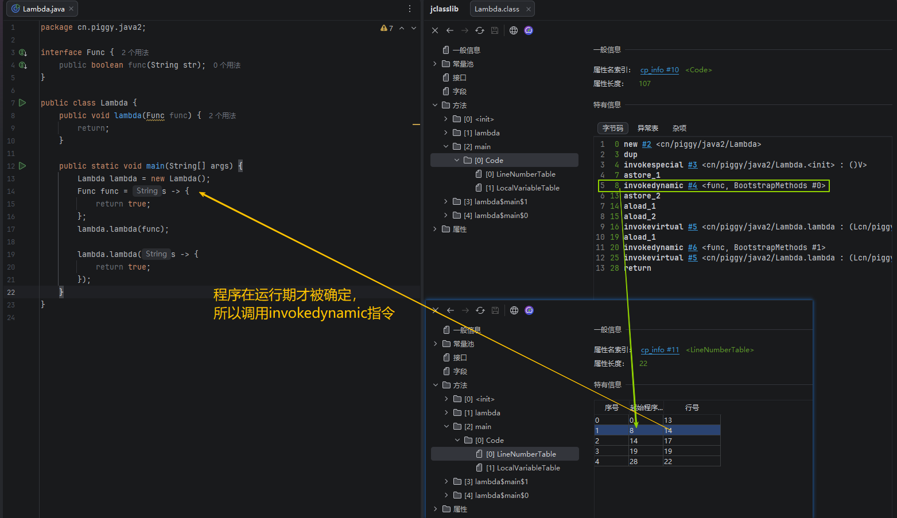


### 5.8.4 方法重写的本质

Java语言中方法重写的本质（`invokedynamic`的一般执行过程）：

1. 找到操作数栈顶的第一个元素所执行的对象的实际类型，记作C。
2. 如果在类型C中找到与常量中的描述符合简单名称都相符的方法，则进行访问权限校验：
   + 如果通过则返回这个方法的直接引用，查找过程结束；
   + 如果不通过，则返回`java.lang.IllegalAccessError` 异常。
3. 如果没找到符合对应的方法，则按照继承关系从下往上依次对C的各个父类进行第2步的搜索和验证过程。
4. 如果始终没有找到合适的方法，则抛出 `java.lang.AbstractMethodError`异常。


扩展：

> **`IllegalAccessError`介绍：**
>
> 程序试图访问或修改一个属性或调用一个方法，而这个属性或方法调用者并没有权限访问。一般的，这个会引起编译器异常。这个错误如果发生在运行时，就说明一个类发生了不兼容的改变。
>
> **`AbstractMethodError`介绍：**
>
> 找到一个接口方法，但是无其实现的具体方法。


### 5.8.5 虚方法表

在面向对象的编程中，会很频繁的使用到动态分派，如果在每次动态分派的过程中都要重新在类的方法元数据中搜索合适的目标的话就可能影响到执行效率。因此，**为了提高性能，JVM采用在类的方法区建立一个虚方法表**（virtual method table）来实现，使用索引表来代替查找。

> 非虚方法不会出现在虚方法表中。


每个类中都有一个虚方法表，表中存放着各个方法的实际入口。


**那么虚方法表什么时候被创建?**

虚方法表会在类加载的链接阶段被创建并开始初始化，类的变量初始值准备完成之后，JVM会把该类的方法表也初始化完毕。


**示例：**

// TODO


## 5.9 方法返回地址

方法返回地址（return address）：

+ 存放调用该方法的pc寄存器的值。
+ 一个方法的结束，有两种方式：
  + 正常执行完成
  + 出现未处理的异常，非正常退出
+ 无论通过哪种方式退出，在方法退出后都返回到该方法被调用的位置。方法正常退出时，**调用者的pc计数器的值作为返回地址，即调用该方法的指令的下一条指令的地址**。而通过异常退出的，返回地址是要通过异常表来确定，栈帧中一般不会保存这部分信息。


### 5.9.1 正常完成出口

当一个方法开始执行后正常退出，执行引擎遇到任意一个方法返回的字节码指令(return)，会将这个返回值传递给上层的方法调用者，简称正常完成出口。

+ 一个方法在正常调用完成之后究竟需要使用哪一个返回指令还需要根据方法返回值的实际数据类型而定。
+ 在字节码指令中，返回指令包含
  + `ireturn`：当返回值是`boolean`、`byte`、`char`、`short`和`int`类型时使用；
  + `lreturn`：当返回值是`long`类型时使用；
  + `freturn`：当返回值是`float`类型时使用；
  + `dreturn`：当返回值是`double`类型时使用；
  + `areturn`：当返回值是引用类型时使用；
  + `return`指令供声明为`void`的方法、实例初始化方法、类和接口的初始化方法使用。

部分返回指令演示：

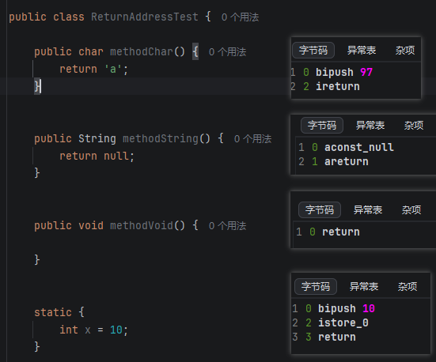


### 5.9.2 异常完成出口

在方法执行的过程中遇到了异常（Exception），并且这个异常没有在方法内进行处理，也就是只要在本方法的异常表中没有搜索到匹配的异常处理器，就会导致方法退出。简称**异常完成出口**。

方法执行过程中抛出异常时的异常处理，存储在一个异常处理表，方便在发生异常的时候找到处理异常的代码。


演示：在下面的java代码中，`method1()`中可能存在异常抛出，但是没有做异常处理；`method2()`调用了`method1()`，但是有做异常捕获处理。

```java
public void method2() {
    try {
        method1();
    } catch (IOException e) {
        e.printStackTrace();
    }
}

public void method1() throws IOException {
    FileReader fis = new FileReader("piggy.txt");
    char[] cBuffer = new char[1024];
    int len;
    while((len = fis.read(cBuffer)) != -1) {
        String str = new String(cBuffer, 0, len);
        System.out.println(str);
    }
    fis.close();
}
```

1. `method1()`方法中没有任何异常捕获处理，因此该方法中没有异常表的信息。

   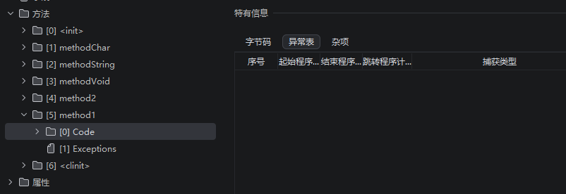

2. `method2()`有异常捕获处理，因此该方法异常表会有记录信息。

   > 前置注意事项：行号表`LineNumberTable`对应的行号应该看编译后的.class文件的信息，而不是直接看.java源文件信息。

   这部分跟老师演示的有出入，可能是不同版本的java编译逻辑有不同。

   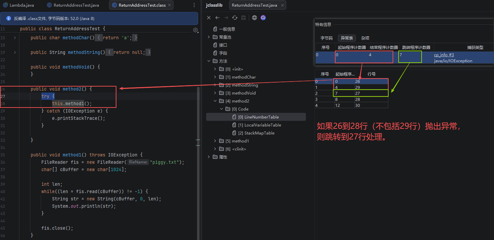

   

   **行号表中为什么第2行（序号1）比第3行（序号2）的映射行数要大？**

   这完全是由 **Java 编译器的代码生成顺序**决定的。编译器先处理try-catch块，再编译try里面的具体代码。

   

   **为什么捕获异常后会跳到PC=7，也就是try块开头这一行？而不是catch后面这一行？**

   而是编译器的**调试信息映射策略**导致的。编译器为了调试便利，将 catch 处理的第一条指令映射到了 try 块开始行。程序逻辑上，它确实进入了 catch 块，只是行号映射让它看起来像是停在了 try 行。目的是**告诉你异常发生的上下文（即哪个 try 块被触发了）**。


### 5.9.3 总结

本质上，方法的退出就是当前栈帧出栈的过程。此时，需要恢复上层方法的局部变量表、操作数栈、将返回值压入调用者栈帧的操作数栈、设置PC寄存器值等，让调用者方法继续执行下去。

正常完成出口和异常完成出口的区别在于：**通过异常完成出口退出的不会给他的上层调用者产生任何的返回值**。


## 5.10 一些附加信息

栈帧中还允许携带与Java虚拟机实现相关的一些附加信息。例如，对程序调试提供支持的信息。


## 5.11 栈的相关面试题

### 5.11.1 举例栈溢出的情况？（StackOverflowError）

常见的几种情况：

+ 递归调用没有正确终止：这是最经典的栈溢出场景。每次递归调用都会在栈上压入一个新栈帧，如果递归深度过大或缺少终止条件，栈内存就会被耗尽。
+ 方法之间互相循环调用：方法间相互调用，形成调用环，同样会无限压栈。


### 5.11.2 调整栈大小，就能保证不出现溢出吗？

**不能。**

调整栈大小（`-Xss`）只是“推迟”了溢出发生的时间点，并不能“保证”不出现溢出。原因很简单：

- **栈溢出本质是逻辑错误**（如死循环递归），而不是资源不足。
- 调大栈空间（比如从1MB调到10MB）只是让程序能多递归几万层再崩，治标不治本。


### 5.11.3 分配的占内存越大越好吗？

**不是。**

物理内存是固定的，栈内存设定设置过大，会使能创建的线程数变少。

在高并发场景中（Web服务），如果栈空间设置过大，会导致请求排队，不能创建更多的线程去处理请求。同时大部分方法栈帧实际使用量远小于默认值，造成内存空间闲置浪费。


### 5.11.4 垃圾回收是否涉及到虚拟机栈？

**不会。**

运行时数据区的溢出情况和GC现象一览：

| 区域                 | 是否可能溢出 | 是否有GC               | 说明                                                      |
| :------------------- | :----------- | :--------------------- | :-------------------------------------------------------- |
| **程序计数器**       | ❌ **不会**   | ❌ **没有**             | 唯一不抛OOM的区域，内存固定且极小                         |
| **Java虚拟机栈**     | ✅ **会**     | ❌ **没有**             | 栈深度超限（`StackOverflowError`）或无法申请新栈（`OOM`） |
| **本地方法栈**       | ✅ **会**     | ❌ **没有**             | 同虚拟机栈，但针对`native`方法                            |
| **堆（Heap）**       | ✅ **会**     | ✅ **有（主要GC区域）** | 对象分配过快或内存泄漏导致`OOM: Java heap space`          |
| **方法区（元空间）** | ✅ **会**     | ✅ **有（但较少）**     | 动态加载类过多导致`OOM: Metaspace`（JDK 8+）              |


### 5.11.5 方法中定义的局部变量是否线程安全？

方法中定义的局部变量不一定是线程安全的，要分情况：

✅ 情况1：局部变量是**基本数据类型** → **线程安全**

```java
public void method() {
    int count = 0;  // 基本类型，存储在栈帧中
    count++;
}
```

- 每个线程调用该方法时，都会在自己的栈帧中创建独立的`count`变量。
- 线程之间完全隔离，**绝对线程安全**。


✅ 情况2：局部变量是**对象引用**，且对象是**方法内部创建**的 → **线程安全**

```java
public void method() {
    StringBuilder sb = new StringBuilder();  // 对象在堆中，但引用在栈中
    sb.append("hello");
}
```

- 虽然`StringBuilder`对象在堆中，但**引用`sb`在栈中**，且该对象**只被当前线程的栈引用**。
- 其他线程无法访问到这个对象，**线程安全**。


❌ 情况3：局部变量是**对象引用**，但对象是**外部传入**或**从共享容器获取**的 → **线程不安全**

```java
private StringBuilder sharedSb = new StringBuilder();  // 成员变量，共享

public void method() {
    StringBuilder sb = sharedSb;  	// 局部引用指向共享对象
    try {
        sb.append("hello");  		// 多线程同时调用会出问题！
    } catch (InterruptedException e) {
        throw new RuntimeException(e);
    }
    System.out.println(sb);
}
```


扩展 - `String`、`StringBuilder`和`StringBuffer`的区别：

>|     特性     |            **String**            |            **StringBuilder**             |           **StringBuffer**           |
>| :----------: | :------------------------------: | :--------------------------------------: | :----------------------------------: |
>|  **可变性**  |     **不可变**（Immutable）      |           **可变**（Mutable）            |         **可变**（Mutable）          |
>| **线程安全** |  安全（因不可变，天然线程安全）  |            **不安全**（无锁）            | **安全**（方法加 `synchronized` 锁） |
>| **执行效率** | **最低**（每次修改都创建新对象） |           **最高**（无锁开销）           |         **中等**（有锁开销）         |
>| **适用场景** |     少量拼接或固定字符串常量     | **单线程**下的大量循环拼接（**最常用**） |      **多线程**下共享变量的修改      |
>
>选型建议：
>
>+ 字符串内容不变或极少变化，用 **`String`**（更安全，且能利用字符串常量池节省内存）。
>
>- 日常的字符串拼接（尤其是循环内），在方法内部创建并使用，且只被当前线程访问直接用 **`StringBuilder`**。
>- 只有明确多线程并发修改同一个字符串对象时，才用 **`StringBuffer`**。
>- 编写高并发程序，还可以考虑使用 `StringBuilder` 配合 `ThreadLocal` 来避免锁竞争，同时保证线程安全。


# 六、本地方法接口

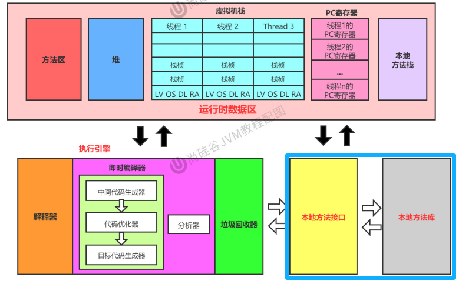

## 6.1 什么是本地方法？

简单地讲，**一个`Native Method`就是一个Java调用非Java代码的接口**。一个`Native Method`是这样一个Java方法：该方法的实现由非Java语言实现，比如C。这个特征并非Java所特有，很多其它的编程语言都有这一机制，比如在C++中，你可以用`extern "C"`告知C++编译器去调用一个c的函数。

> "A native method is a Java method whose implementation is provided by non-java code."

在定义一个`native method`时，并不提供实现体（有些像定义一个Java interface），因为其实现体是由非java语言在外面实现的。

本地接口的作用是融合不同的编程语言为Java所用，它的初衷是融合C/C++程序。


## 6.2 为什么要使用Native Method？

Java使用起来非常方便，然而有些层次的任务用Java实现起来不容易，或者我们对程序的效率很在意时，问题就来了。

+ 与Java环境外交互：

  **有时Java应用需要与Java外面的环境交互，这是本地方法存在的主要原因**。你可以想想Java需要与一些底层系统，如操作系统或某些硬件交换信息时的情况。本地方法正是这样一种交流机制:它为我们提供了一个非常简洁的接口，而且我们无需去了解Java应用之外的繁琐的细节。

+ 与操作系统交互：

  JVM支持着Java语言本身和运行时库，它是Java程序赖以生存的平台，它由一个解释器(解释字节码)和一些连接到本地代码的库组成。然而不管怎样，它毕竟不是一个完整的系统，它经常依赖于一些底层系统的支持。这些底层系统常常是强大的操作系统。**通过使用本地方法，我们得以用Java实现了jre的与底层系统的交互，甚至JVM的一些部分就是用c写的**。还有，如果我们要使用一些Java语言本身没有提供封装的操作系统的特性时，我们也需要使用本地方法。

+ Sun's Java

  **Sun的解释器是用c实现的，这使得它能像一些普通的c一样与外部交互**。jre大部分是用Java实现的，它也通过一些本地方法与外界交互。例如：类`java.lang.Thread`的 `setPriority()`方法是用Java实现的，但是它实现调用的是该类里的本地方法`setPriority0()`。这个本地方法是用c实现的，并被植入JVM内部，在Windows 95的平台上，这个本地方法最终将调用win32 API `SetPriority()`。这是一个本地方法的具体实现由JVM直接提供，更多的情况是本地方法由外部的动态链接库（external dynamic link library）提供, 然后被JVM调用。


> 标识符`native`可以与所有其它的java标识符连用，但是`abstract`除外。


现状：

目前该方法使用的越来越少了，除非是与硬件有关的应用，比如通过Java程序驱动打印机或者Java系统管理生产设备，在企业级应用中已经比较少见。因为现在的异构领域间的通信很发达，比如可以使用socket通信，也可以使用webService等等，不多做介绍。


# 七、本地方法栈

本地方法栈（Native Method Stack）：

+ **Java虚拟机栈用于管理Java方法的调用，而本地方法栈用于管理本地方法的调用**。
+ 本地方法栈，也是线程私有的。
+ 允许被实现成固定或者是可动态扩展的内存大小。（在内存溢出方面是相同的）
  + 如果线程请求分配的栈容量超过本地方法栈允许的最大容量，Java虚拟机将会抛出一个 `StackOverflowError` 异常。
  + 如果本地方法栈可以动态扩展，并且在尝试扩展的时候无法申请到足够的内存，或者在创建新的线程时没有足够的内存去创建对应的本地方法栈，那么Java虚拟机将会抛出一个 `OutofMemoryError` 异常。
+ 本地方法是使用c语言实现的。
+ 它的具体做法是在本地方法栈中登记native方法，在执行引擎执行时加载本地方法库。
+ **当某个线程调用一个本地方法时，它就进入了一个全新的并且不再受虚拟机限制的世界。它和虚拟机拥有同样的权限**。
  + 本地方法可以通过本地方法接口来访问虚拟机内部的运行时数据区。
  + 它甚至可以直接使用本地处理器中的寄存器。
  + 直接从本地内存的堆中分配任意数量的内存。
+ **并不是所有的JVM都支持本地方法。因为Java虚拟机规范并没有明确要求本地方法栈的使用语言、具体实现方式、数据结构等**。如果JVM产品不打算支持native方法，也可以无需实现本地方法栈。
+ 在Hotspot JVM中，直接将本地方法栈和虚拟机栈合二为一。（比如在`Thread`类中`start()`方法，里面存在`start0()`这个本地方法，调用时通过动态链接库调用底层的本地方法）


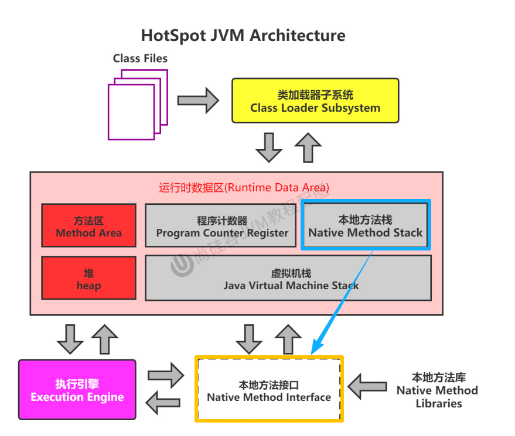


# 八、堆

## 8.1 堆的核心概述

### 8.1.1 堆概述

+ 一个JVM实例只存在一个堆内存，堆也是Java内存管理的核心区域。

+ Java 堆区在JVM 启动的时候即被创建，其空间大小也就确定了。是JVM管理的最大一块内存空间。

  >  堆内存的大小是可以调节的。

+ 《Java虚拟机规范》规定，堆可以处于物理上不连续的内存空间中，但在**逻辑上它应该被视为连续的**。

+ 所有的线程共享Java堆，在这里还可以划分线程私有的缓冲区（Thread Local Allocation Buffer, TLAB）。

+ 《Java虚拟机规范》中对Java堆的描述是：所有的对象实例以及数组都应当在运行时分配在堆上。

  > The heap is the run-time data area fromwhich memory for all class instances and arrays is allocated.

  实际上，在后续会介绍逃逸分析以及其他的分配方式（栈上分配和标量替换），也表示了并非全部对象都在堆上分配。

+ 数组和对象可能永远不会存储在栈上，因为栈帧中保存引用，这个引用指向对象或者数组在堆中的位置。
+ 在方法结束后，堆中的对象不会马上被移除，仅仅在垃圾收集的时候才会被移除。
+ 堆是GC（Garbage Collection，垃圾收集器）执行垃圾回收的重点区域。


**演示：程序执行的堆状态变化过程**

```java
public class SimpleHeap {
    private int id;

    public SimpleHeap(int id) {
        this.id = id;
    }

    public static void main(String[] args) {
        SimpleHeap simpleHeap1 = new SimpleHeap(1);
        SimpleHeap simpleHeap2 = new SimpleHeap(2);

        int[] arr = new int[10];
        Object[] arr1 = new Object[10];
    }
}
```

1. 程序启动，堆为各对象分配内存空间（`new`关键字表示在堆上分配空间）：

   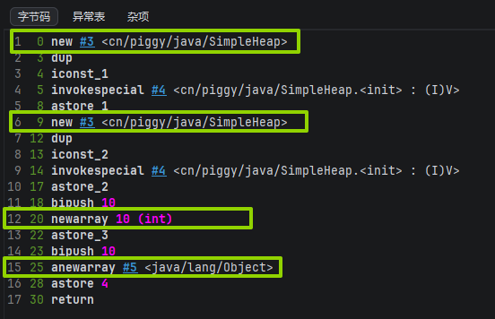

2. 程序执行完成，栈帧弹出，堆中各对象失去引用。

3. 等待GC，GC会回收堆中无引用的对象空间。


### 8.1.2 内存细分概述

现代垃圾收集器大部分都基于分代收集理论设计，堆空间细分为：

+ JDK 7 及之前堆内存逻辑上分为三个部分：
  + **新生区**（Young Generation Space, Young/New）
    + 新生区又划分为Eden区和Survivor区。
  + **养老区**（Tenure generation Space, Old/Tenure）
  + <font color="red">**永久区**</font>（Permanent Space, Perm）
+ JDK 8 及之后堆内存逻辑上分为三个部分：
  + **新生区**（Young Generation Space, Young/New）
    + 新生区又划分为Eden区和Survivor区。
  + **养老区**（Tenure generation Space, Old/Tenure）
  + <font color="red">**元空间**</font>（Meta Space, Meta）


约定：同一个区可能有不同的叫法

>+ 新生区 === 新生代 === 年轻代
>+ 养老区 === 老年区 === 老年代
>+ 永久区 === 永久代


**演示-通过`jvisualvm`查看内存空间分配情况：**

1. 在8.1.1堆概述演示代码中加入延时代码，可以让代码卡在延时部分，更好观察当前内存现象。

   ```java
   public class SimpleHeap {
       // ...省略
   
       public static void main(String[] args) {
           SimpleHeap simpleHeap1 = new SimpleHeap(1);
           SimpleHeap simpleHeap2 = new SimpleHeap(2);
   
           int[] arr = new int[10];
           Object[] arr1 = new Object[10];
           
           // 加入延时函数
           try {
               Thread.sleep(1000000);
           } catch (InterruptedException e) {
               throw new RuntimeException(e);
           }
       }
   }
   ```

2. 打开`jvisualvm`，安装`Visual GC`插件。

   我们可以通过cmd输入`jvisualvm`，启动软件。

   或者进入jdk8目录下，找到`jvisualvm`的位置并启动，默认在`jdk8安装路径\jdk1.8.0_201\bin\jvisualvm.exe`。

   进入软件后，在菜单栏中，找到工具 -> 插件 -> 可用插件，勾选`Visual GC`并安装，等待安装完毕即可。

3. 启动测试程序，并在`jvisualvm`软件->应用程序栏进入测试函数进程，点开`Visual GC`即可查看当前进程的内存分配情况。

   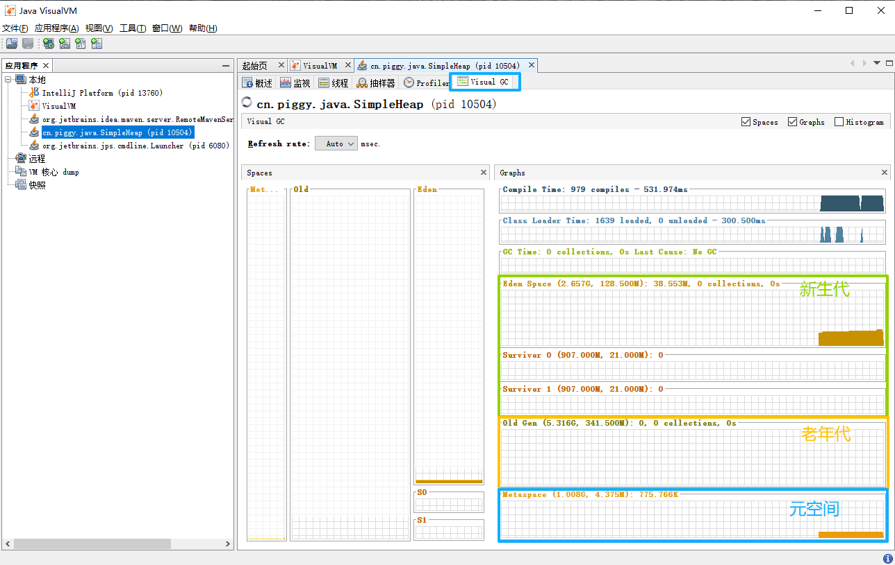


### 8.1.3 堆空间内部结构

+ JDK7及之前的堆结构：

  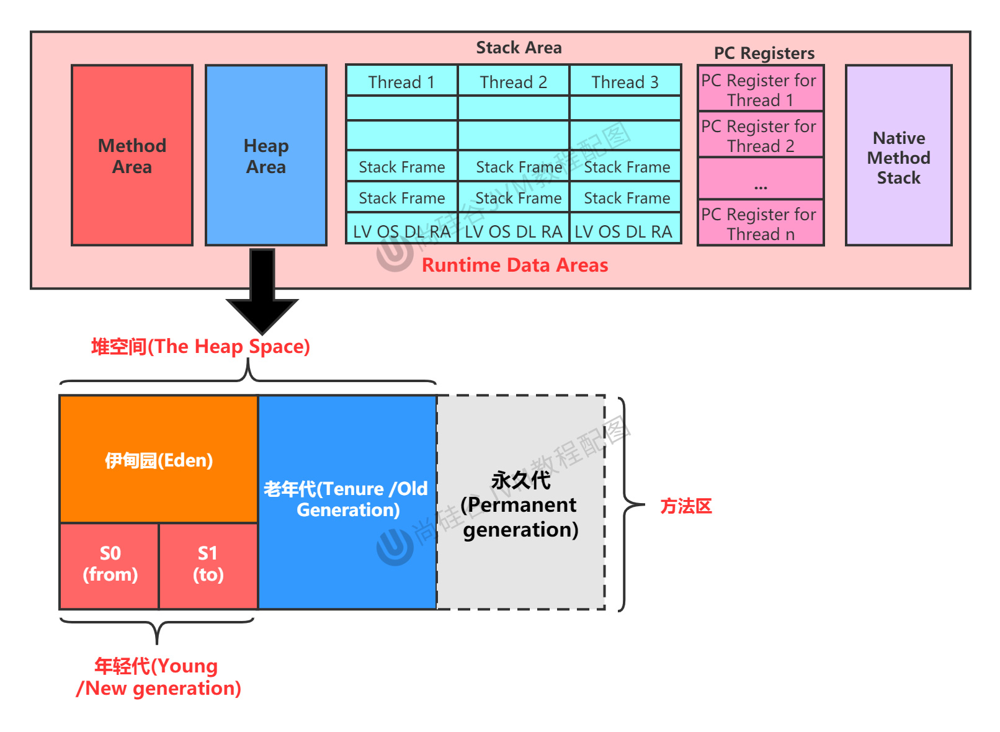

+ JDK8及之后的堆结构：

  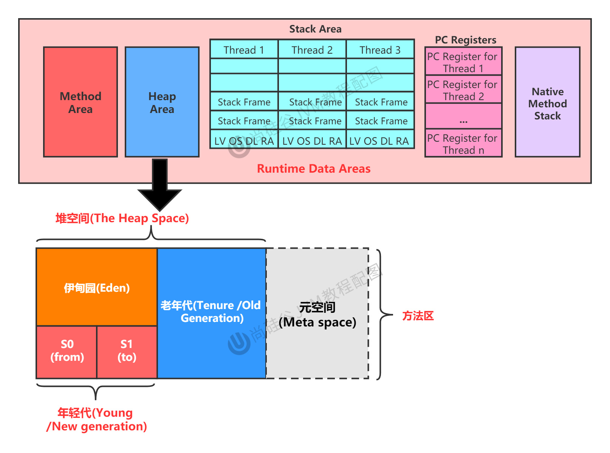


## 8.2 设置堆内存大小与OOM

### 8.2.1 堆空间大小的设置

+ Java堆区用于存储Java对象实例，那么堆的大小在JVM启动时就已经设定好了，大家可以通过选项`-Xmx`和`-Xms`来进行设置。
  + `-Xms`用于表示堆区的起始内存，等价于`-XX:InitialHeapSize`；
  + `-Xmx`则用于表示堆区的最大内存，等价于`-XX:MaxHeapSize`。

+ 一旦堆区中的内存大小超过`-Xmx`所指定的最大内存时，将会抛出`OutOfMemoryError`异常。

+ 通常会将` -Xms`和`-Xmx`两个参数配置相同的值，**其目的是为了能够在java垃圾回收机制清理完堆区后不需要重新分隔计算堆区的大小，从而提高性能**。
+ 默认情况下的堆内存大小设置：
  + 初始内存大小：物理电脑内存大小 / 64；
  + 最大内存大小：物理电脑内存大小 / 4。


扩展：

> `-Xms`和`-Xmx`的解释：
>
> + `-X`：是JVM的 “非标准参数”前缀。
> + `ms`：是Memory Start的缩写，指起始内存。
> + `mx`：是Memory Maximum的缩写，指最大内存。
>
> 设置堆内容大小的单位：不写（默认是字节`B`）、`k`（KB）、`m`（MB）、`g`（GB）（不区分大小写）。


**演示：默认情况下堆空间分配**

```java
public class HeapSpaceInitial {
    public static void main(String[] args) {
        // 返回java虚拟机中堆内存量（换算成MB）
        long initialMemory = Runtime.getRuntime().totalMemory() / 1024 / 1024;
        // 返回java虚拟机中试图使用的最大堆内容量（换算成MB）
        long maxMemory = Runtime.getRuntime().maxMemory() / 1024 / 1024;

        System.out.println("-Xms: " + initialMemory + "MB");    // 491MB
        System.out.println("-Xmx: " + maxMemory + "MB");        // 7259MB
        
        // 延时函数
        /*try {
            Thread.sleep(1000000);
        } catch (InterruptedException e) {
            throw new RuntimeException(e);
        }*/
    }
}
```

> 使用`Runtime`类来获取当前进行的运行时数据区对象。
>
> 一般情况下，系统加载系统文件会占用空间，因此JVM可以利用的空间都小于实际物理内存大小。


**演示：自定义设置堆空间分配**

继续使用`HeapSpaceInitial`类进行测试，并设置堆空间起始和最大内存为600m。

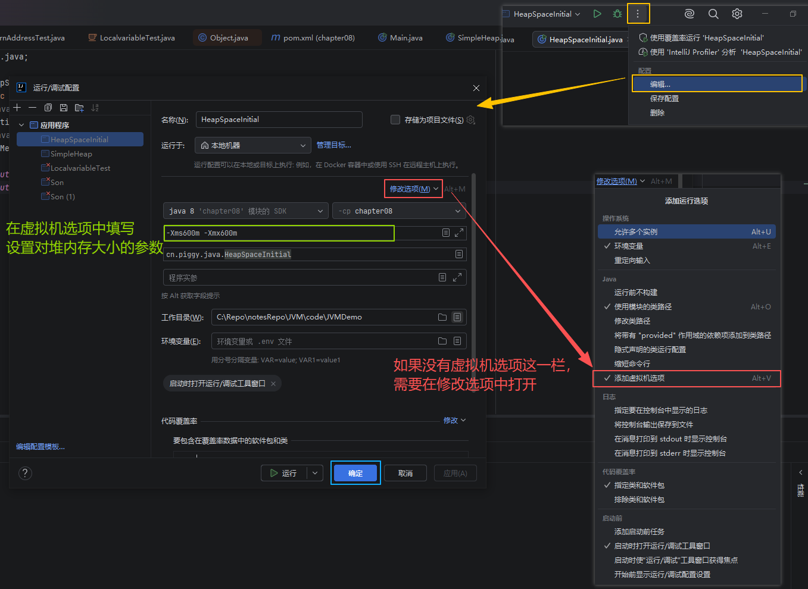

继续执行程序，会发现输出结果和预期不一致，只有575MB：

```shell
-Xms: 575MB
-Xmx: 575MB
```

我们可以进一步对其内存结构进行分析，除了使用`jvisulvm`，还可以使用其他方法进行查看分析。


**方法1：**使用`jps` + `jstat`。（需要在代码中末尾添加延时函数，便于观察现象）

```shell
> jps		# 列出所有java进程
# ...省略
14608 HeapSpaceInitial	# 当前要查看的java进程

> jstat -gc 14608		# 查看14608进程的gc状态(只列前八个数据)
  S0C     S1C    S0U    S1U      EC       EU        OC         OU       
25600.0 25600.0  0.0    0.0   153600.0  30748.0   409600.0     0.0
```

> 参数说明（单位都是KB）：
>
> | 参数 (Column) |       全称 / 含义       | 占用空间 |
> | :-----------: | :---------------------: | :------: |
> |    **S0C**    |  Survivor 0 区当前容量  |  25600   |
> |    **S1C**    |  Survivor 1 区当前容量  |  25600   |
> |    **S0U**    | Survivor 0 区当前使用量 |    0     |
> |    **S1U**    | Survivor 1 区当前使用量 |    0     |
> |    **EC**     |     Eden 区当前容量     |  153600  |
> |    **EU**     |    Eden 区当前使用量    |  30748   |
> |    **OC**     |     老年代当前容量      |  409600  |
> |    **OU**     |    老年代当前使用量     |    0     |
>
> 堆空间总量：S0C + S1C + EC + OC = 614400KB = 600MB，是符合设置大小的。
>
> 但是S0和S1总会有一个处于非使用状态，因此实际可用的堆空间总量：S(0 OR 1)C + EC + OC = 588800KB = 575MB。


**方法2：**添加虚拟机参数`-XX:+PrintGCDetails`。（不需要添加延时函数，程序结束会主动输出GC信息）

```shell
# HeapSpaceInitial.class 输出信息
-Xms: 575MB
-Xmx: 575MB
Heap
 PSYoungGen      total 179200K, used 39964K [0x00000000f3800000, 0x0000000100000000, 0x0000000100000000)
  eden space 153600K, 26% used [0x00000000f3800000,0x00000000f5f07098,0x00000000fce00000)
  from space 25600K, 0% used [0x00000000fe700000,0x00000000fe700000,0x0000000100000000)
  to   space 25600K, 0% used [0x00000000fce00000,0x00000000fce00000,0x00000000fe700000)
 ParOldGen       total 409600K, used 0K [0x00000000da800000, 0x00000000f3800000, 0x00000000f3800000)
  object space 409600K, 0% used [0x00000000da800000,0x00000000da800000,0x00000000f3800000)
 Metaspace       used 8580K, capacity 8854K, committed 9088K, reserved 1056768K
  class space    used 1032K, capacity 1114K, committed 1152K, reserved 1048576K
```


### 8.2.2 OOM说明

**OOM** 全称是 **OutOfMemoryError**，是 Java 程序中一个非常严重的致命错误。它代表 **JVM 堆内存（或其他内存区域）已经被耗尽，无法再为新对象分配内存空间**。


OOM的核心分类：

| 错误信息                                                     | 所属区域        | 常见原因                                               |
| :----------------------------------------------------------- | :-------------- | :----------------------------------------------------- |
| `java.lang.OutOfMemoryError: Java heap space`                | **堆内存**      | 创建了海量对象，或内存泄漏导致无法回收。               |
| `java.lang.OutOfMemoryError: Metaspace`                      | **元空间**      | 加载了大量类（如动态生成类）导致元空间满。             |
| `java.lang.OutOfMemoryError: GC overhead limit exceeded`     | **堆内存**      | GC 回收时间过长（超过98%时间都在GC），但回收效果极差。 |
| `java.lang.OutOfMemoryError: Direct buffer memory`           | **直接内存**    | NIO 操作分配的堆外内存未释放。                         |
| `java.lang.OutOfMemoryError: Unable to create new native thread` | **栈内存/系统** | 创建的线程数量超过了操作系统限制。                     |


## 8.3 年轻代与老年代

### 8.3.1 概述

存储在JVM中的Java对象可以被划分为两类：

+ 一类是生命周期较短的瞬时对象，这类对象的创建和消亡都非常迅速；
+ 另外一类对象的生命周期却非常长，在某些极端的情况下还能够与JVM的生命周期保持一致。

Java堆区进一步细分的话，可以划分为年轻代（YoungGen）和老年代（OldGen）。

其中年轻代又可以划分为`Eden`空间、`Survivor0`空间和`Survivor1`空间（有时也叫做`from`区、`to`区）。

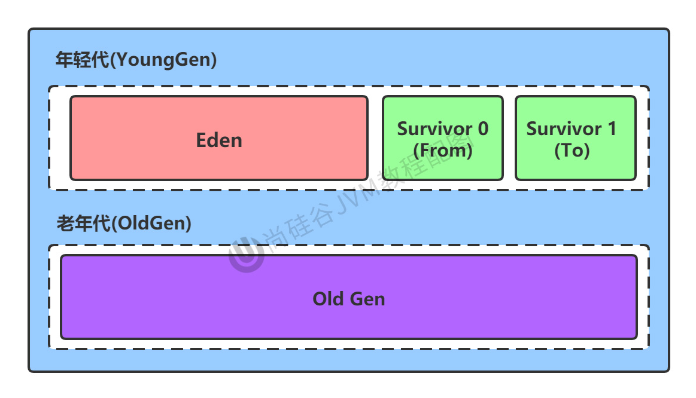


### 8.3.2 设置年轻代与老年代的比例

使用`-XX:NewRatio`参数可以调整堆中年轻代与老年代的比例：

+ 默认设置`-XX:NewRatio=2`，表示年轻代与老年代的比例为1：2；
+ 一般情况下不会调整这个参数。


演示：默认与调整比例（`-XX:NewRatio=4`）的情况（堆空间设置为600m）

```java
// -Xms600m -Xmx600m
public class EdenSurvivorTest {
    public static void main(String[] args) {
        System.out.println("新生区测试...");
        try {
            Thread.sleep(1000000);
        } catch (InterruptedException e) {
            e.printStackTrace();
        }
    }
}
```

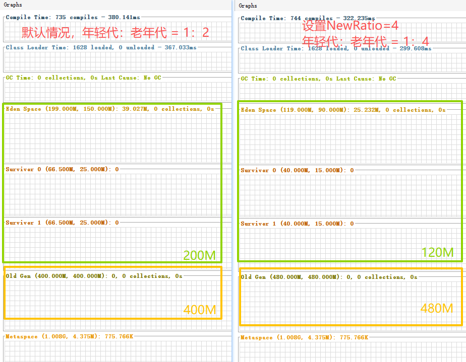


### 8.3.3 设置年轻代结构的内存比例

+ 在HotSpot中，`Eden`空间和另外两个`Survivor`空间缺省所占的比例是**8:1:1**。

+ 可以通过选项`-XX:SurvivorRatio`调整这个空间比例。（默认为`-XX:SurvivorRatio=8`）

+ 几乎所有的Java对象都是在`Eden`区被new出来的。

+ 绝大部分的Java对象的销毁都在新生代进行了。

  > IBM公司的专门研究表明，新生代中80%的对象都是“朝生夕死”的。

+ 可以使用选项`-Xmn`设置新生代最大内存大小

  > 如果同时设置了年轻代/老年代的比例，实际上的年轻代内存大小仍以该选项为准。
  >
  > 这个参数一般使用默认值就可以了。


演示：年轻代中默认选项与设置后的内存比例

同样是8.3.2的演示代码，选项设置`-Xms600m`、`-Xmx600m`。

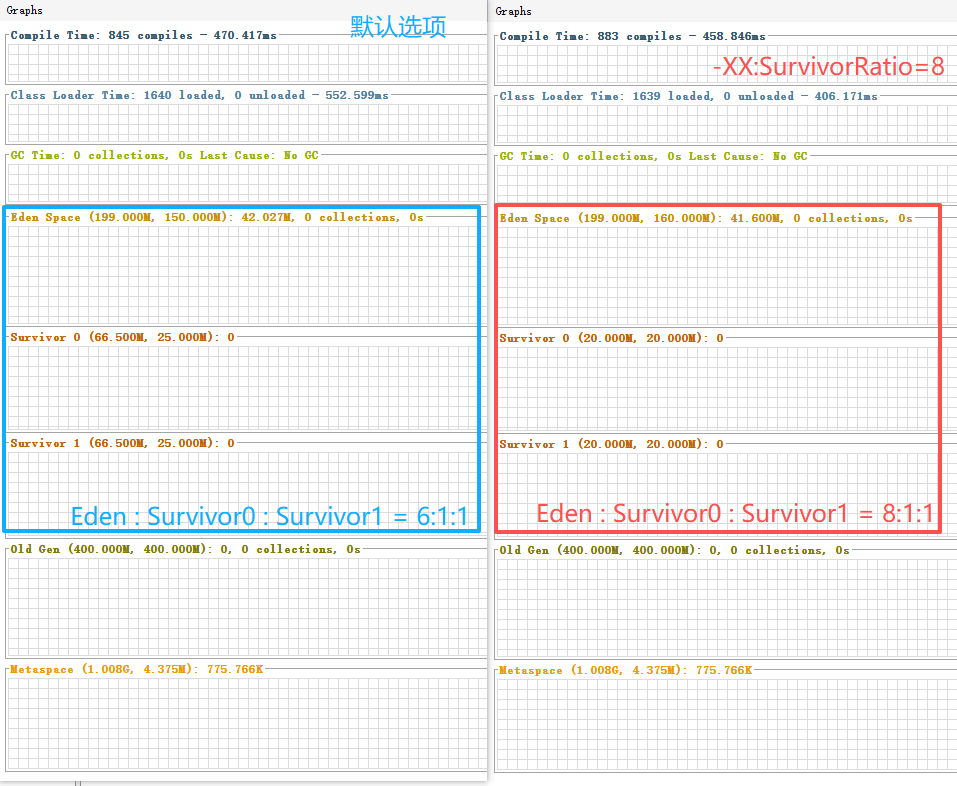

> 默认情况下，Eden和Survivor区的比例也不是默认的8:1:1，是因为在JVM中会默认开启**自适应内存调整策略**`-XX:+UseAdaptiveSizePolicy`选项，因此默认情况下他们的比例是6:1:1。
>
> 如果需要指定相应的内存比例，就需要显示指定`-XX:SurvivorRatio`选项。


## 8.4 图解对象分配过程

### 8.4.1 概述

为新对象分配内存是一件非常严谨和复杂的任务，JVM的设计者们不仅需要考虑内存如何分配、在哪里分配等问题，并且由于内存分配算法与内存回收算法密切相关，所以还需要考虑GC执行完内存回收后是否会在内存空间中产生内存碎片。

**对象分配的一般过程：**

1. 大部分新创建的对象会先放入`Eden`区。

2. 当`Eden`区的空间不足以存放新创建的对象时，JVM会停止所有用户线程（STW），垃圾回收器将对`Eden`区和`Survivor0/1`区进行一次垃圾回收（`Young GC` /` MinorGC`），将`Eden`区中的不再被其他对象所引用的对象进行销毁。这时会再进行两步操作：

   + 加载新的对象放到`Eden`区。
   + 将伊甸园中的剩余的存活对象移动到`Survivor0`区（`to`区）。

   这个过程会使用到年龄计数器，它会记录该对象每次熬过GC的累计次数（年龄）。

3. 如果再次触发`Minor GC`，此时垃圾回收器会检查`Eden`区和`Survivor0`区回收不被使用的对象。`Eden`区新创建的对象和`Survivor0`区存活下来的对象会被放到到`Survivor1`区。这些对象的年龄计数器会被刷新：

   + 新创建的对象：年龄计数器 = 1；
   + 其他`Survivor`区复制过来的对象：年龄计数器 += 1。

4. 如果再次经历垃圾回收，会重复执行步骤3的情况。

   > `Survivor`区中`From`区和`to`区是存活对象复制到新区的方向，会随着每次GC而相互调换。（比如`Survivor0`区存活的对象复制到`Survivor1`区中，此时`Survivor0`区就是`From`区，`Survivor1`区就是`to`区）
   >
   > 每次GC结束后，`Eden`区和原来的`From`区会被清空。

5. 每次`Minor GC`时，JVM都会检查对象的年龄。如果对象年龄达到`晋升阈值`（默认是15），会被直接晋升（Promotion）到老年代。

   > 晋升阈值可以通过选项`-XX:MaxTenuringThreshold`调整。

6. 如果老年代的内存不足，无法存放新移入的对象时，会触发`Major GC`，对老年代进行垃圾回收。

   > 如果老年代执行了`Major GC`仍无法保存新对象，会产生OOM异常。


**图示演示：**

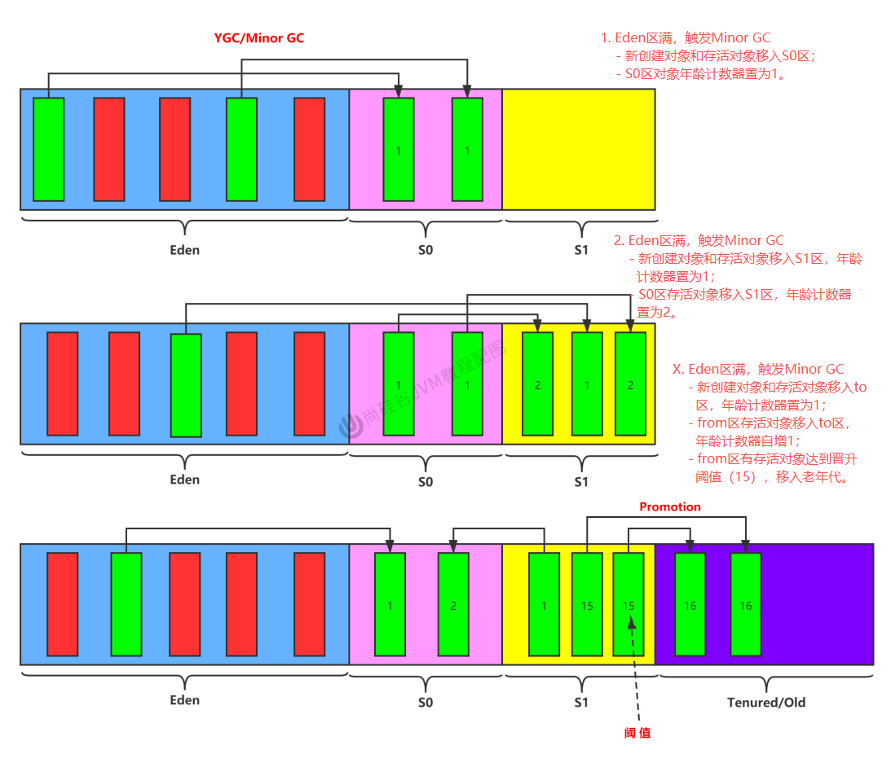


**总结：**

+ 针对幸存者`s0`、`s1`区的总结：复制之后有交换，谁空谁是`to`区。
+ 关于垃圾回收：频繁在新生区收集，很少在养老区收集，几乎不在永久区/
  元空间收集。


### 8.4.2 对象分配的特殊情况

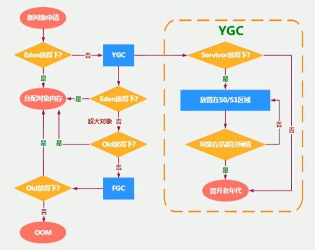

对象分配还存在几种特殊情况：

1. `Eden`区空间不足：创建超大对象（`Eden`区剩余空间不足以存放），`Eden`区尝试分配，失败会触发`Minor GC`，清理空间并继续尝试分配。如果还不能腾出空间存放对象，就会触发**动态担保机制**，将此对象直接晋升到老年代。
2. `Survivor`区空间不足：`Eden`区满触发`Minor GC`，但是对象太大或者数量太多导致`to`区无法全部存放，JVM会将多余的对象直接晋升到老年代，这也是**动态担保机制**。
3. 如果晋升了一部分对象后，空余空间仍不足（如老年代满），则会触发`Full GC`。`Full GC`后空间仍不足的，会抛出OOM。


> 代码及jvisualvm动态演示对象分配过程可以看课程[74节]([74-代码举例与JVisualVM演示对象的分配过程_哔哩哔哩_bilibili](https://www.bilibili.com/video/BV1PJ411n7xZ?spm_id_from=333.788.player.switch&vd_source=35fafdad468652f7e08b1e0b4c20bcb8&p=74))
>
> 以及一些常用的调优工具，后续会进一步讲解。


## 8.5 Minor GC、Major GC、Full GC


## 8.6 对空间分代思想


## 8.7 内存分配策略


## 8.8 为对象分配内存：TLAB


## 8.9 小结堆空间的参数设置


 

## 8.10 堆是分配对象的唯一选择吗？


