# 一、MyBatis概述

## 1.1 框架

+ 在文献中看到的framework被翻译为框架。
+ Java常用框架：
  - SSM三大框架：Spring + SpringMVC + MyBatis
  - SpringBoot
  - SpringCloud
  - 等。。
+ 框架其实就是对通用代码的封装，提前写好了一堆接口和类，我们可以在做项目的时候直接引入这些接口和类（引入框架），基于这些现有的接口和类进行开发，可以大大提高开发效率。
+ 框架一般都以jar包的形式存在。(jar包中有class文件以及各种配置文件等。)
+ SSM三大框架的学习顺序：MyBatis、Spring、SpringMVC（仅仅是建议）


## 1.2 三层架构

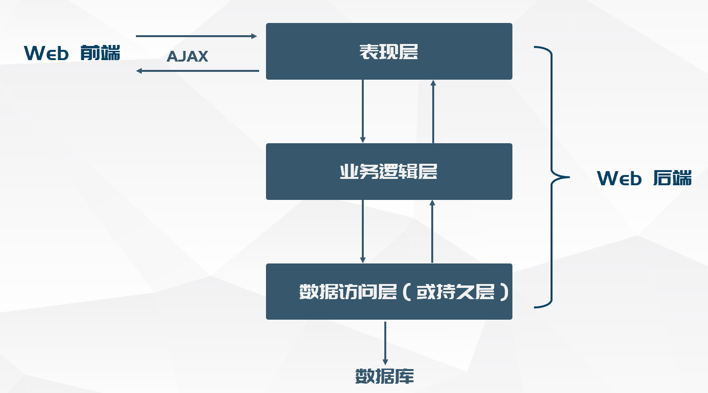

+ 表现层（UI）：直接跟前端打交互（一是接收前端ajax请求，二是返回json数据给前端）
+ 业务逻辑层（BLL）：一是处理表现层转发过来的前端请求（也就是具体业务），二是将从持久层获取的数据返回到表现层。
+ 数据访问层（DAL）：直接操作数据库完成CRUD，并将获得的数据返回到上一层（也就是业务逻辑层）。
+ Java持久层框架：
  - MyBatis
  - Hibernate（实现了JPA规范）
  - jOOQ
  - Guzz
  - Spring Data（实现了JPA规范）
  - ActiveJDBC
  - ......


## 1.3 JDBC不足

+ 示例代码1：

```java
// ......
// sql语句写死在java程序中
String sql = "insert into t_user(id,idCard,username,password,birth,gender,email,city,street,zipcode,phone,grade) values(?,?,?,?,?,?,?,?,?,?,?,?)";
PreparedStatement ps = conn.prepareStatement(sql);
// 繁琐的赋值：思考一下，这种有规律的代码能不能通过反射机制来做自动化。
ps.setString(1, "1");
ps.setString(2, "123456789");
ps.setString(3, "zhangsan");
ps.setString(4, "123456");
ps.setString(5, "1980-10-11");
ps.setString(6, "男");
ps.setString(7, "zhangsan@126.com");
ps.setString(8, "北京");
ps.setString(9, "大兴区凉水河二街");
ps.setString(10, "1000000");
ps.setString(11, "16398574152");
ps.setString(12, "A");
// 执行SQL
int count = ps.executeUpdate();
// ......
```

+ 示例代码2：

```java
// ......
// sql语句写死在java程序中
String sql = "select id,idCard,username,password,birth,gender,email,city,street,zipcode,phone,grade from t_user";
PreparedStatement ps = conn.prepareStatement(sql);
ResultSet rs = ps.executeQuery();
List<User> userList = new ArrayList<>();
// 思考以下循环中的所有代码是否可以使用反射进行自动化封装。
while(rs.next()){
    // 获取数据
    String id = rs.getString("id");
    String idCard = rs.getString("idCard");
    String username = rs.getString("username");
    String password = rs.getString("password");
    String birth = rs.getString("birth");
    String gender = rs.getString("gender");
    String email = rs.getString("email");
    String city = rs.getString("city");
    String street = rs.getString("street");
    String zipcode = rs.getString("zipcode");
    String phone = rs.getString("phone");
    String grade = rs.getString("grade");
    // 创建对象
    User user = new User();
    // 给对象属性赋值
    user.setId(id);
    user.setIdCard(idCard);
    user.setUsername(username);
    user.setPassword(password);
    user.setBirth(birth);
    user.setGender(gender);
    user.setEmail(email);
    user.setCity(city);
    user.setStreet(street);
    user.setZipcode(zipcode);
    user.setPhone(phone);
    user.setGrade(grade);
    // 添加到集合
    userList.add(user);
}
// ......
```

+ JDBC不足：
  - SQL语句写死在Java程序中，不灵活。改SQL的话就要改动Java代码，这违背了开闭原则OCP。
  - 给占位符`?`传值的操作比较繁琐的。（能不能自动化？？？）
  - 将结果集封装成Java对象是繁琐的。(能不能自动化？？？)


## 1.4 了解MyBatis

MyBatis本质上就是对JDBC的封装，通过MyBatis完成CRUD操作。

MyBatis在三层架构中负责持久层的，属于**持久层框架**。


MyBatis的发展历程：<font style="color:#E8323C;">【引用百度百科】</font>

- MyBatis本是apache的一个开源项目iBatis，2010年这个项目由apache software foundation迁移到了google code，并且改名为MyBatis。2013年11月迁移到Github。
- iBATIS一词来源于“internet”和“abatis”的组合，是一个基于Java的持久层框架。iBATIS提供的持久层框架包括SQL Maps和Data Access Objects（DAOs）。


打开mybatis代码可以看到它的包结构中包含：ibatis。

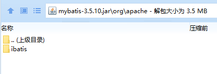


**ORM 对象关系映射：**

- O（**Object**）：Java虚拟机中的Java对象

- R（**Relational**）：关系型数据库

- M（**Mapping**）：将Java虚拟机中的Java对象映射到数据库表中一行记录，或是将数据库表中一行记录映射成Java虚拟机中的一个Java对象。

- ORM图示：

  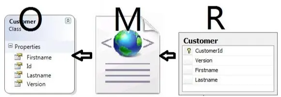

- ORM-对象关系映射 示例：

  

- MyBatis属于半自动化ORM框架。

- Hibernate属于全自动化的ORM框架。


**MyBatis框架特点：**

- 支持定制化 SQL、存储过程、基本映射以及高级映射
- 避免了几乎所有的 JDBC 代码中手动设置参数以及获取结果集
- 支持XML开发，也支持注解式开发。【为了保证sql语句的灵活，所以mybatis大部分是采用XML方式开发。】
- 将接口和 Java 的 POJOs(Plain Ordinary Java Object，简单普通的Java对象)映射成数据库中的记录
- 体积小好学：两个jar包，两个XML配置文件。
- 完全做到sql解耦合。
- 提供了基本映射标签。
- 提供了高级映射标签。
- 提供了XML标签，支持动态SQL的编写。
- ......


# 二、MyBatis入门程序

## 2.1 版本

**软件版本**：

+ IntelliJ IDEA：2022.1.4
+ Navicat for MySQL：16.0.14
+ MySQL数据库：8.0.30

**组件版本：**

+ MySQL驱动：8.0.30
+ <font style="color:#F5222D;">MyBatis：3.5.10</font>
+ <font style="color:#F5222D;">JDK：Java17</font>
+ JUnit：4.13.2
+ Logback：1.2.11


## 2.2 MyBatis下载

从github上下载，地址：[https://github.com/mybatis/mybatis-3](https://github.com/mybatis/mybatis-3)

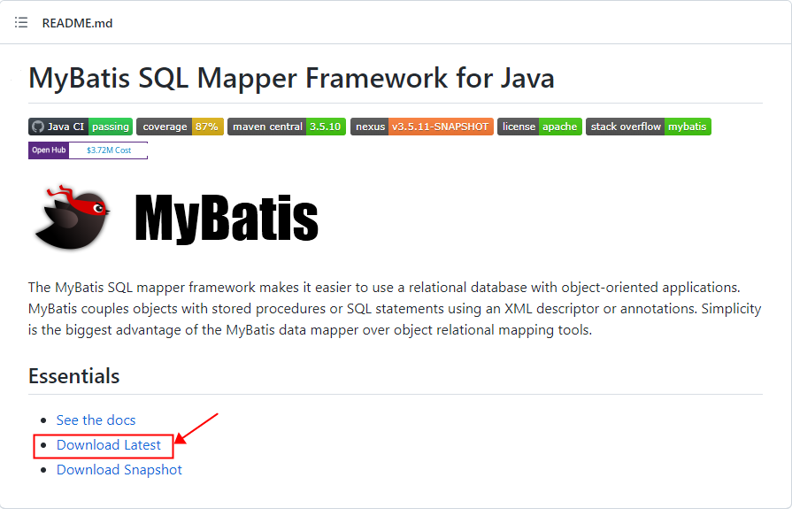

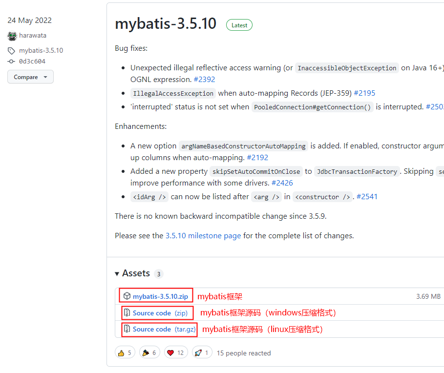


将框架以及框架的源码都下载下来，下载框架后解压，打开mybatis目录

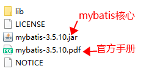

通过以上解压可以看到，框架一般都是以jar包的形式存在。我们的mybatis课程使用maven，所以这个jar我们不需要。

官方手册需要。


## 2.3 MyBatis入门程序开发步骤

### 2.3.1 准备数据库表

1. 准备数据库表`t_car`，字段包括：

   + `id`：主键（自增）【bigint】
   + `car_num`：汽车编号【varchar】
   + `brand`：品牌【varchar】
   + `guide_price`：厂家指导价【decimal类型，专门为财务数据准备的类型】
   + `produce_time`：生产时间【char，年月日即可，10个长度，'2022-10-11'】
   + `car_type`：汽车类型（燃油车、电车、氢能源）【varchar】

2. 在数据库中使用navicat建表：

   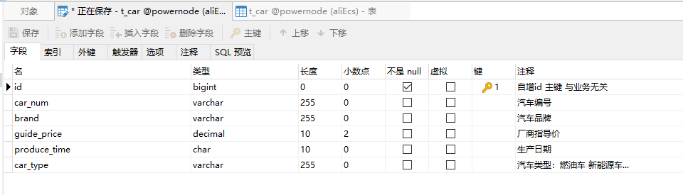

3. 向表中插入两条数据：

   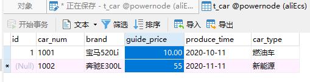


### 2.3.2 创建IDEA项目

mybatis中有两个主要的配置文件：

1. `mybatis-config.xml`：这是核心配置文件，主要配置连接数据库的信息等，有且仅有一个。

2. `XxxxxMapper.xml`：这个文件是专门用来编写SQL语句的配置文件，一般是一个数据库表对应一个。

   如`t_user`表对应`UserMapper.xml`、`t_student`表对应`StudentMapper.xml`。


下面我们开始创建项目：

1. 创建一个空项目`mybatis`，在空项目下创建第一个maven模块`mybatis-001-introduction`。

   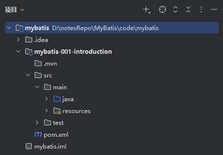

2. 编写pom文件。

   ```xml
   <?xml version="1.0" encoding="UTF-8"?>
   <project xmlns="http://maven.apache.org/POM/4.0.0"
            xmlns:xsi="http://www.w3.org/2001/XMLSchema-instance"
            xsi:schemaLocation="http://maven.apache.org/POM/4.0.0 http://maven.apache.org/xsd/maven-4.0.0.xsd">
       <modelVersion>4.0.0</modelVersion>
   
       <groupId>cn.piggy</groupId>
       <artifactId>mybatis-001-introduction</artifactId>
       <version>1.0-SNAPSHOT</version>
       <!--打包方式-->
       <packaging>jar</packaging>
   
       <dependencies>
           <!--mybatis依赖-->
           <dependency>
               <groupId>org.mybatis</groupId>
               <artifactId>mybatis</artifactId>
               <version>3.5.10</version>
           </dependency>
           <!--mysql驱动依赖-->
           <dependency>
               <groupId>mysql</groupId>
               <artifactId>mysql-connector-java</artifactId>
               <version>8.0.31</version>
           </dependency>
       </dependencies>
   </project>
   ```

3. 在resource根目录下创建`mybatis-config.xml`配置文件。

   ```xml
   <?xml version="1.0" encoding="UTF-8" ?>
   <!DOCTYPE configuration
           PUBLIC "-//mybatis.org//DTD Config 3.0//EN"
           "http://mybatis.org/dtd/mybatis-3-config.dtd">
   <configuration>
       <environments default="development">
           <environment id="development">
               <transactionManager type="JDBC"/>
               <dataSource type="POOLED">
                   <property name="driver" value="com.mysql.cj.jdbc.Driver"/>
                   <property name="url" value="jdbc:mysql://8.134.254.79:3306/powernode"/>
                   <property name="username" value="test"/>
                   <property name="password" value="Aa123456#."/>
               </dataSource>
           </environment>
       </environments>
       <mappers>
           <!--sql映射文件创建好之后，需要将该文件路径配置到这里-->
           <!--resource属性自动会从类路径下开始查找资源 -->
           <mapper resource="CarMapper.xml"/>
       </mappers>
   </configuration>
   ```

   注意：

   + mybatis核心配置文件的文件名不一定是`mybatis-config.xml`，可以是其它名字。
   + mybatis核心配置文件存放的位置也可以随意。这里选择放在resources根下，相当于放到了类的根路径下。

   

4. 在resource根目录下创建`CarMapper.xml`配置文件。

   ```xml
   <?xml version="1.0" encoding="UTF-8" ?>
   <!DOCTYPE mapper
           PUBLIC "-//mybatis.org//DTD Mapper 3.0//EN"
           "http://mybatis.org/dtd/mybatis-3-mapper.dtd">
   <!--namespace先随意写一个-->
   <mapper namespace="car">
       <!--insert sql：保存一个汽车信息-->
       <insert id="insertCar">
           insert into t_car
           (id,car_num,brand,guide_price,produce_time,car_type)
           values
           (null,'102','丰田mirai',40.30,'2014-10-05','氢能源')
       </insert>
   </mapper>
   ```

   注意1：**<font style="color:#E8323C;">sql语句最后结尾可以不写“;”</font>**

   注意2：`CarMapper.xml`文件的名字不是固定的。可以使用其它名字。

   注意3：`CarMapper.xml`文件的位置也是随意的。这里选择放在resources根下，相当于放到了类的根路径下。

   注意4：<font style="color:#F5222D;">将`CarMapper.xml`文件路径配置到`mybatis-config.xml`：</font>

   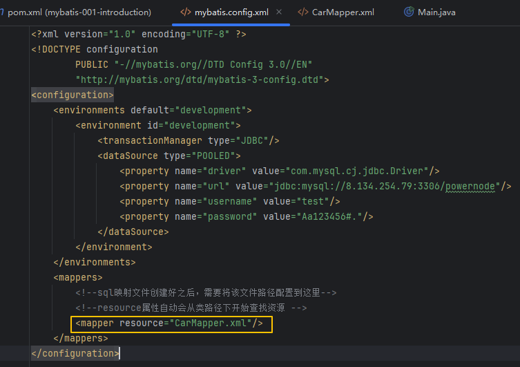

5. 编写MyBatisIntroductionTest代码。

   ```java
   public class MyBatisIntroductionTest {
       public static void main(String[] args) throws IOException {
           // 获取SqlSessionFactoryBuilder对象
           SqlSessionFactoryBuilder sqlSessionFactoryBuilder = new SqlSessionFactoryBuilder();
   
           // 获取SqlSessionFactory对象
           InputStream is = Resources.getResourceAsStream("mybatis-config.xml");
           SqlSessionFactory sqlSessionFactory = sqlSessionFactoryBuilder.build(is);
   
           // 获取SqlSession对象
           SqlSession sqlSession = sqlSessionFactory.openSession();
   
           // 执行sql语句
           int count = sqlSession.insert("insertCar"); // 返回值是影响数据库表的记录条数
           System.out.println("插入了几条记录：" + count);
           
           // 提交事务
           sqlSession.commit();
   
           // 关闭资源（只关闭资源是不会提交事务的）
           sqlSession.close();
       }
   }
   ```

6. 运行测试

   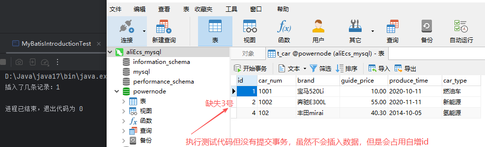

   默认采用的事务管理器是：JDBC。JDBC事务默认是不提交的，需要手动提交。


## 2.4 MyBatis配置文件详解

### 2.4.1 关于核心配置文件的名字和路径详解

**核心配置文件的名字是随意的**，只要在配置的时候放入相应的文件名：

```java
InputStream is = Resources.getResourceAsStream("mybatis-config.xml");
```


**核心配置文件必须放到resources下吗**？

不是。我们将mybatis配置文件放到不同的位置上测试一下。

1. 将配置文件放在类的根目录下的`com`目录下，然后使用`Resources.getResourceAsStream()`进行加载：

   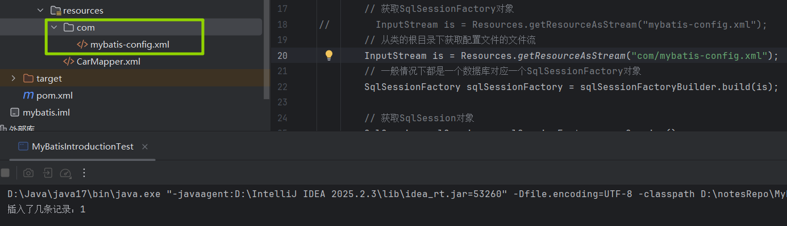

   

2. 将配置文件放到D盘根目录下，使用文件输入流`FileInputStream`进行加载：

   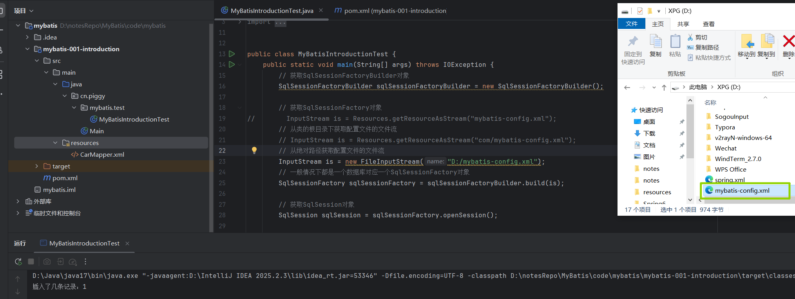


经过测试说明mybatis核心配置文件的名字是随意的，存放路径也是随意的。

虽然mybatis核心配置文件的名字不是固定的，但通常该文件的名字叫做：`mybatis-config.xml`。

虽然mybatis核心配置文件的路径不是固定的，但通常该文件会存放到**<font style="color:#F5222D;">类路径</font>**当中，这样让项目的移植更加健壮。


>  在mybatis中提供了一个类：`Resources`【org.apache.ibatis.io.Resources】，该类可以从类路径当中获取资源，我们通常使用它来获取输入流InputStream，但**这种方式只能从类路径当中获取资源**，也就是说mybatis-config.xml文件必须要在类路径下。代码如下：
>
>  ```java
>  InputStream is = Resources.getResourceAsStream("mybatis-config.xml");
>  ```
>
>  这个方法底层仍然是使用类加载器中的获取文件流方法：
>
>  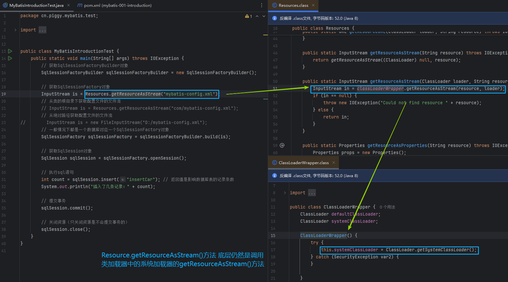


### 2.4.2 关于Mapper配置文件的名字和路径详解

**Mapper名字和存放位置是固定的么？**

不是。`XxxMapper.xml`的名字和位置都不是固定的，在配置文件中`mybatis-config.xml`中的`mapper`属性中指定其位置。

+ 如果是在类根目录`resource`下，则使用`<mapper>的resource`属性从类目录下加载资源：

  ```xml
  <!--resource属性：自动会从类路径下开始查找资源 -->
  <!--<mapper resource="CarMapper.xml"/>-->
  
  <!--从类的根目录下的com目录下加载CarMapper.xml-->
  <mapper resource="com/CarMapper.xml"/>
  ```

+ 如果是在绝对路径下，就需要使用`<mapper>`中`url`属性加载资源：

  ```xml
  <!--url属性：从绝对路径下加载资源-->
  <mapper url="file:///d:/CarMapper.xml"/>
  ```

  > 语法格式：`file:///绝对路径`

跟核心配置文件一样，使用绝对路径加载的方式可移植性太差，不符合OCP原则。为了项目的可移植性和健壮性，最好还是将这些文件放到类路径下面。


### 2.4.3 Mybatis的事务管理机制

#### 2.4.3.1 事务管理器

在`mybatis-config.xml`配置文件中，可以通过以下配置开启mybatis的事务管理：

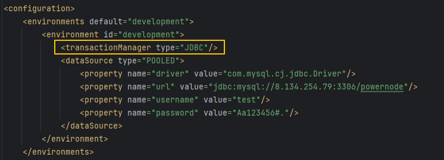

事务管理器中`type`的值有两个：`JDBC`和`MANAGED`，且不区分大小写。

在mybatis中提供了两种事务管理机制：

+ **JDBC事务管理器**：

  mybatis框架自己管理事务，自己采用原生的JDBC代码去管理事务：

  ```java
  conn.setAutoCommit(false);	// 开启事务
  // 业务处理...
  con.commit();		// 手动提交事务
  ```

  

+ **MANAGED事务管理器**：

  mybatis不再负责事务的管理，事务管理交给其他容器来负责，如Spring。

  对于我们当前单纯的只有mybatis的情况下，如果配置为`MANAGED`，就表示事务当前是没有开启的。


#### 2.4.3.2 JDBC事务管理器

**测试一**：我们在开启JDBC事务的时候，使用到`sqlSessionFactory.openSession()`这条语句：

> `sqlSessionFactory.openSession()`默认形参是`false`。

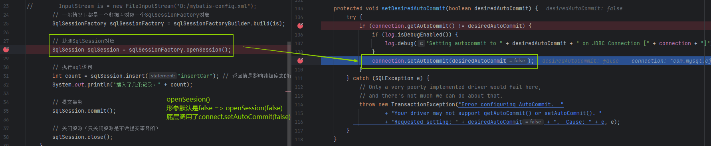

这样相当于mybatis开启了事务，且需要手动提交事务。


**测试二**：如果我们在开启JDBC事务的时候，将形参改为`true`，改动后的语句：`selSessionFactory.openSession(true)`：

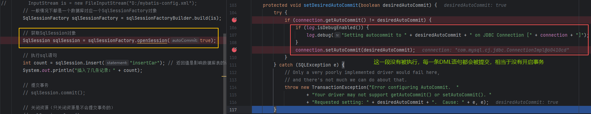

这样一来，每一条DML语句都会被提交，相当于没有开启事务。显然这种方式不适合多DML语句。


#### 2.4.3.3 MANAGED事务管理器

我们开启MANAGED事务，现在只有单纯的mybatis，没有其他的框架来做事务管理，因此这里相当于是没有事务。

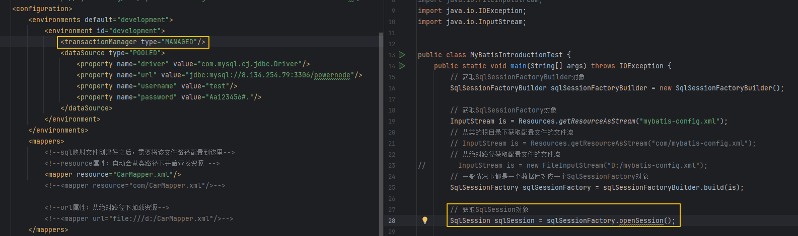

这样配置就是没有事务，每次执行DML语句都会自动提交。


>  注意：只要`autoCommit`为`true`，就表示没有开启事务。


## 2.5 第一个比较完整的Mybatis程序

```java
public class MyBatisCompleteTest {
    public static void main(String[] args) {
        SqlSession sqlSession = null;
        try {
            // 1. 创建SqlSessionFactoryBuilder对象
            SqlSessionFactoryBuilder sqlSessionFactoryBuilder = new SqlSessionFactoryBuilder();
            // 2. 创建SqlSessionFactory对象
            SqlSessionFactory sqlSessionFactory = sqlSessionFactoryBuilder.build(Resources.getResourceAsStream("mybatis-config.xml"));
            // 3. 创建SqlSession开启会话（底层开启事务）
            sqlSession = sqlSessionFactory.openSession();
            // 4. 执行sql语句，处理相关业务
            int count = sqlSession.insert("insertCar");
            System.out.println(count);
            // 5. 执行到这里，没有发生任何异常，提交事务
            sqlSession.commit();
        } catch (IOException e) {
            // 回滚事务
            if (sqlSession != null) {
                sqlSession.rollback();
            }
            e.printStackTrace();
        } finally {
            // 6. 关闭会话
            if (sqlSession != null) {
                sqlSession.close();
            }
        }
    }
}
```


## 2.6 引入JUnit

JUnit是专门做单元测试的组件。

- 在实际开发中，单元测试一般是由我们Java程序员来完成的。
- 我们要对我们自己写的每一个业务方法负责任，要保证每个业务方法在进行测试的时候都能通过。


测试的过程中涉及到两个概念：

* 期望值
* 实际值

期望值和实际值相同表示测试通过，期望值和实际值不同则单元测试执行时会报错。这个部分我们会使用`Assert`断言来完成。


### 2.6.1 简单使用Junit

我们创建一个junit的测试项目`junit-test`：

1. 引入依赖。

   ```xml
   <!--junit依赖-->
   <dependency>
       <groupId>junit</groupId>
       <artifactId>junit</artifactId>
       <version>4.13.2</version>
       <scope>test</scope>
   </dependency>
   ```

2. 编写一个业务类。

   ```java
   public class MathService {
   
       /**
        * 求和的业务方法
        * @param a
        * @param b
        * @return
        */
       public int sum(int a,int b){
           return a+b;
       }
   
       /**
        * 求减的业务方法
        * @param a
        * @param b
        * @return
        */
       public int sub(int a,int b){
           return a-b;
       }
   }
   ```

3. 编写单元测试类和对应的测试方法。

   注意事项：

   + 一般是一个业务方法对应一个测试方法。
   + 单元测试类的名字规范：`XxxxTest`。
   + 测试方法的规范：`public void testXxxx() {}`。
   + 测试方法名的规范：以test开始。比如测试方法`sum()`，对应的测试名为：`testSum()`。
   + @Test注解非常重要，被这个注解标注的方法就是一个单元测试方法。

   

   ```java
   public class MathServiceTest {
   
       @Test
       public void testSum() {
           /**
            * 单元测试中有两个重要概念：
            * 1. 实际值（被测试的业务方法的真正执行结果）
            * 2. 期望值（执行了这个业务方法后，期望的执行结果）
            */
           MathService mathService = new MathService();
           // 获取实际值
           int actual = mathService.sum(1, 2);
           // 期望值
           int expected = 3;
           // 加断言进行测试
           Assert.assertEquals(expected,actual);
   
       }
   
       @Test
       public void testSub() {
           MathService mathService = new MathService();
           // 获取实际值
           int actual = mathService.sub(10, 5);
           // 期望值
           int expected = 6;
           // 加断言进行测试
           Assert.assertEquals(expected,actual);
       }
   }
   ```

4. 执行测试：

   因为我们在测试方法中加了断言，如果实际值与期望值不一致，就报错。

   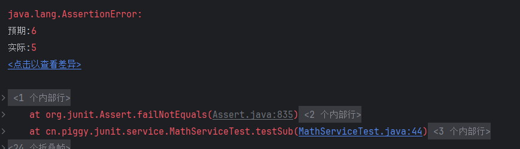


### 2.6.2 在mybatis中引入JUnit

跟简单使用junit一样，先引入依赖，再编写单元测试类：

```java
public class CarMapperTest {
    @Test
    public void testInsertCar(){
        // 编写mybatis程序
        SqlSession sqlSession = null;
        try {
            SqlSessionFactoryBuilder sqlSessionFactoryBuilder = new SqlSessionFactoryBuilder();
            SqlSessionFactory sqlSessionFactory = sqlSessionFactoryBuilder.build(Resources.getResourceAsStream("mybatis-config.xml"));
            // 开启会话（底层开启事务）
            sqlSession = sqlSessionFactory.openSession();
            // 执行sql语句，处理相关业务
            int count = sqlSession.insert("insertCar");
            System.out.println(count);
            // 执行到这里，没有发生任何异常，提交事务
            sqlSession.commit();
        } catch (IOException e) {
            // 回滚事务
            if (sqlSession != null) {
                sqlSession.rollback();
            }
            e.printStackTrace();
        } finally {
            // 关闭会话
            if (sqlSession != null) {
                sqlSession.close();
            }
        }
    }
}
```


## 2.7 引入日志框架logback

引入日志框架的目的是为了看清楚mybatis执行的具体sql。

启用标准日志组件，只需要在`mybatis-config.xml`文件中添加以下配置：【可参考mybatis手册】。

```xml
<settings>
    <setting name="logImpl" value="STDOUT_LOGGING" />
</settings>
```

`<settings>`的放置位置是有顺序的：

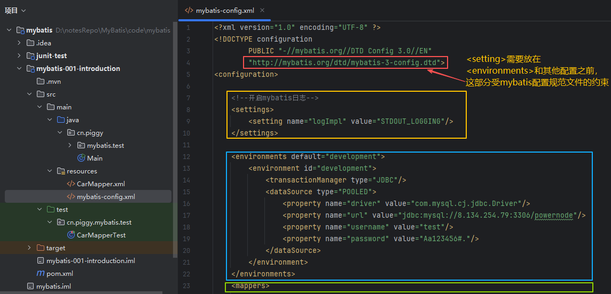


`STDOUT_LOGGING`标准日志配置不够灵活，可以继承其他的日志组件，mybatis支持的日志框架如下：

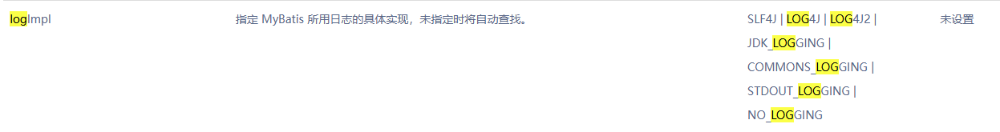

> 注：我们可以看到有几种主要的日志框架：`SLF4J`，`LOG4J`，`LOG4J2`，`STDOUT_LOGGING`等。
>
> 其中，`STDOUT_LOGGING`是mybatis自己就实现的，可以直接使用。而其他三个日志框架在使用前需要引入相关的依赖。
>
> 特别注意的是`SLF4J`只是一种日志标准，并没有直接的实现。但是有一个日志框架`logback`就实现了`SLF4J`规范。
>
> `SLF4J`，`LOG4J`，`LOG4J2`都是同一个作者。


`logback`是目前日志框架中性能较好的，较为流行的，因此我们选择它来作为我们引入的日志框架。

1. 引入logback相关依赖。

   ```xml
   <!--引入logback依赖，这个日志框架实现了slf4j规范-->
   <dependency>
       <groupId>ch.qos.logback</groupId>
       <artifactId>logback-classic</artifactId>
       <version>1.2.11</version>
   </dependency>
   ```

2. 引入logback相关配置文件（文件名必须叫`logback.xml`或`logback-test.xml`，且放在类路径之下）。

   ```xml
   <?xml version="1.0" encoding="UTF-8"?>
   
   <configuration debug="false">
       <!-- 控制台输出 -->
       <appender name="STDOUT" class="ch.qos.logback.core.ConsoleAppender">
           <encoder class="ch.qos.logback.classic.encoder.PatternLayoutEncoder">
               <!--格式化输出：%d表示日期，%thread表示线程名，%-5level：级别从左显示5个字符宽度%msg：日志消息，%n是换行符-->
               <pattern>%d{yyyy-MM-dd HH:mm:ss.SSS} [%thread] %-5level %logger{50} - %msg%n</pattern>
           </encoder>
       </appender>
   
       <!-- 按照每天生成日志文件 -->
       <appender name="FILE" class="ch.qos.logback.core.rolling.RollingFileAppender">
           <rollingPolicy class="ch.qos.logback.core.rolling.TimeBasedRollingPolicy">
               <!--日志文件输出的文件名-->
               <FileNamePattern>${LOG_HOME}/TestWeb.log.%d{yyyy-MM-dd}.log</FileNamePattern>
               <!--日志文件保留天数-->
               <MaxHistory>30</MaxHistory>
           </rollingPolicy>
           <encoder class="ch.qos.logback.classic.encoder.PatternLayoutEncoder">
               <!--格式化输出：%d表示日期，%thread表示线程名，%-5level：级别从左显示5个字符宽度%msg：日志消息，%n是换行符-->
               <pattern>%d{yyyy-MM-dd HH:mm:ss.SSS} [%thread] %-5level %logger{50} - %msg%n</pattern>
           </encoder>
           <!--日志文件最大的大小-->
           <triggeringPolicy class="ch.qos.logback.core.rolling.SizeBasedTriggeringPolicy">
               <MaxFileSize>100MB</MaxFileSize>
           </triggeringPolicy>
       </appender>
   
       <!--mybatis log configure-->
       <logger name="com.apache.ibatis" level="TRACE"/>
       <logger name="java.sql.Connection" level="DEBUG"/>
       <logger name="java.sql.Statement" level="DEBUG"/>
       <logger name="java.sql.PreparedStatement" level="DEBUG"/>
   
       <!-- 日志输出级别,logback日志级别包括五个：TRACE < DEBUG < INFO < WARN < ERROR -->
       <root level="DEBUG">
           <appender-ref ref="STDOUT"/>
           <appender-ref ref="FILE"/>
       </root>
   
   </configuration>
   ```

3. 在`mybatis-config.xml`中修改日志框架为`SLF4J`。

   ```xml
   <settings>
       <!--<setting name="logImpl" value="STDOUT_LOGGING"/>-->
       <setting name="logImpl" value="SLF4J"/>
   </settings>
   ```

4. 再次执行单元测试方法`testInsertCar()`，查看控制台的日志输出。

   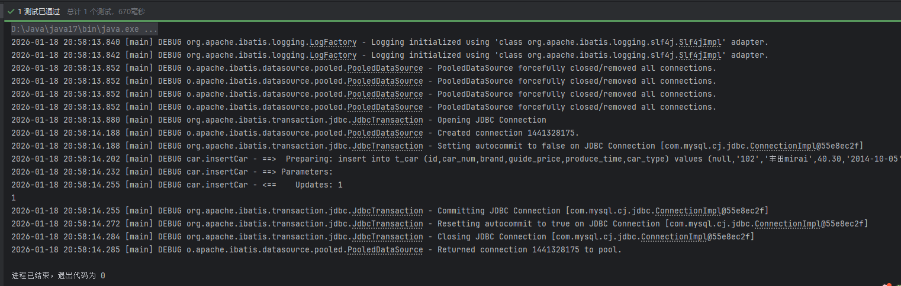


## 2.8 封装MyBatis工具类

我们创建一个工具类`SqlSessionUtil`：

```java
public class SqlSessionUtil {

    // 工具类的构造方法一般都是私有化的
    // 工具中所有的方法都是静态的，直接采用类名即可调用，不需要new对象

    // 为了防止new对象，私有化构造方法
    private SqlSessionUtil() {
    }

    private static SqlSessionFactory sqlSessionFactory;

    // 类加载时执行
    // SqlSessionUtil工具类在进行第一次加载的时候，即系mybatis-config.xml文件，创建SqlSessionFactory对象
    static {
        try {
            sqlSessionFactory = new SqlSessionFactoryBuilder().build(Resources.getResourceAsStream("mybatis-config.xml"));
        } catch (IOException e) {
            throw new RuntimeException(e);
        }
    }

    public static SqlSession openSession() {
        return sqlSessionFactory.openSession();
    }
}
```

在单元测试中无法测试，后续再找下原因。

我们在主程序中执行测试：

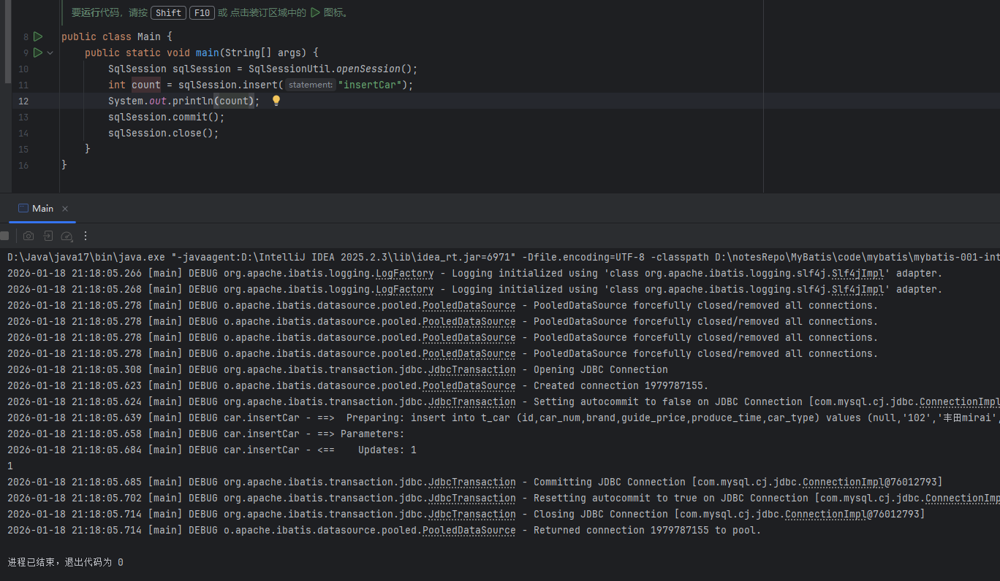


# 三、使用MyBatis完成CRUD

先做一些准备工作，创建一个新的模块`mybatis-002-curd`，并拉取他们的依赖、各种配置文件、工具类`SqlSessionUtil`和测试用例`CarMapperTest`：

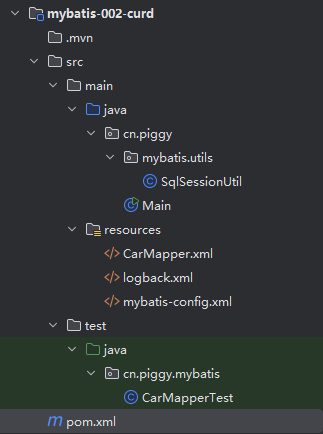


**什么是CURD？**

+ C：Create（增）
+ R：Retrieve（查，检索）
+ U：Update（改）
+ D：Delete（删）


## 3.1 insert（Create）

分析以下SQL映射文件中SQL语句存在的问题：

```xml
<?xml version="1.0" encoding="UTF-8" ?>
<!DOCTYPE mapper
        PUBLIC "-//mybatis.org//DTD Mapper 3.0//EN"
        "http://mybatis.org/dtd/mybatis-3-mapper.dtd">
<!--namespace先随意写一个-->
<mapper namespace="car">
    <!--insert sql：保存一个汽车信息-->
    <insert id="insertCar">
        insert into t_car (id,car_num,brand,guide_price,produce_time,car_type) values (null,'102','丰田mirai',40.30,'2014-10-05','氢能源')
    </insert>
</mapper>
```

存在的问题是：SQL语句中的值不应该写死，值应该是用户提供的。之前的JDBC代码是这样写的：

```java
// JDBC中使用 ? 作为占位符。那么MyBatis中会使用什么作为占位符呢？
String sql = "insert into t_car(car_num,brand,guide_price,produce_time,car_type) values(?,?,?,?,?)";
// ......
// 给 ? 传值。那么MyBatis中应该怎么传值呢？
ps.setString(1,"103");
ps.setString(2,"奔驰E300L");
ps.setDouble(3,50.3);
ps.setString(4,"2022-01-01");
ps.setString(5,"燃油车");
```


在MyBatis中可以这样做：

+ 使用Map集合传参
+ 使用POJO传参


### 3.1.1 使用Map集合传参

**在Java程序中，将数据放到Map集合中**

**在sql语句中使用 `#{map集合的key} `来完成传值，`#{}` 等同于JDBC中的` ?` ，`#{}`就是占位符**

java代码：

```java
@Test
public void testInsertCar(){
    // 准备数据
    Map<String, Object> map = new HashMap<>();
    map.put("k1", "103");
    map.put("k2", "奔驰E300L");
    map.put("k3", 50.3);
    map.put("k4", "2020-10-01");
    map.put("k5", "燃油车");
    // 获取SqlSession对象
    SqlSession sqlSession = SqlSessionUtil.openSession();
    // 执行SQL语句（使用map集合给sql语句传递数据）
    int count = sqlSession.insert("insertCar", map);
    System.out.println("插入了几条记录：" + count);
}
```

SQL语句：

```xml
<?xml version="1.0" encoding="UTF-8" ?>
<!DOCTYPE mapper
        PUBLIC "-//mybatis.org//DTD Mapper 3.0//EN"
        "http://mybatis.org/dtd/mybatis-3-mapper.dtd">
<!--namespace先随意写一个-->
<mapper namespace="car">
    <!--insert sql：保存一个汽车信息-->
    <insert id="insertCar">
        insert into t_car(car_num,brand,guide_price,produce_time,car_type)
        values(#{k1},#{k2},#{k3},#{k4},#{k5})
    </insert>
</mapper>
```

运行测试：

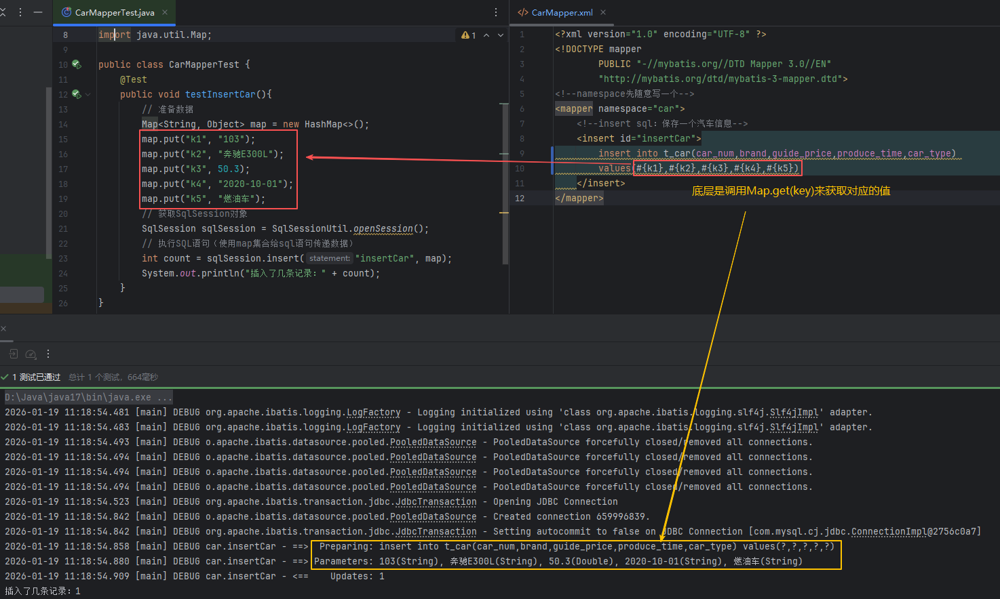

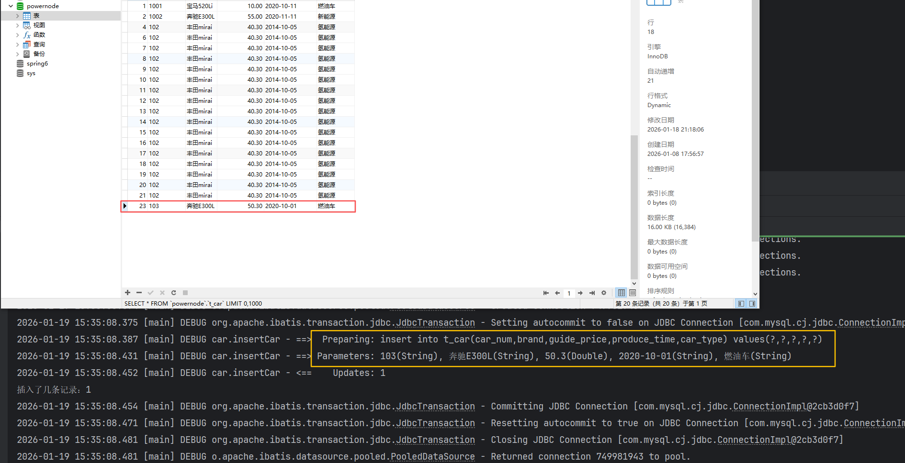


**如果SQL语句中占位符`#{}`里的key不存在**，会出现什么问题？

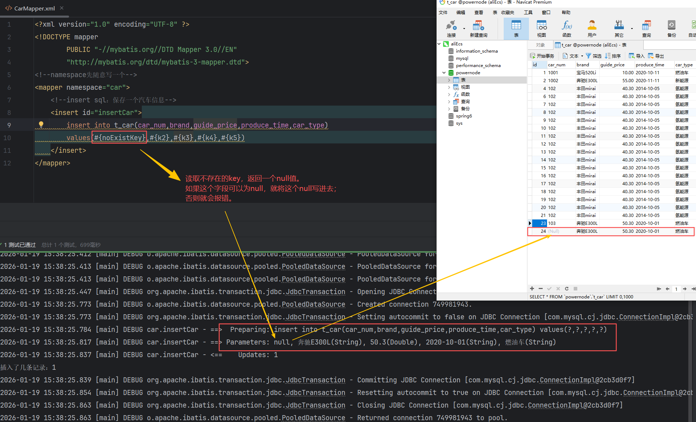

通过测试，看到程序并没有报错。正常执行。不过 `#{noExistKey}` 的写法导致无法获取到map集合中的数据，最终导致数据库表`car_num`插入了NULL。


在以上sql语句中，可以看到`#{k1} #{k2} #{k3} #{k4} #{k5}`的可读性太差，**为了增强可读性**，我们可以改一下测试代码和SQL语句：

```java
@Test
public void testInsertCar(){
    // 准备数据
    Map<String, Object> map = new HashMap<>();
    // 让key的可读性增强
    map.put("carNum", "103");
    map.put("brand", "奔驰E300L");
    map.put("guidePrice", 50.3);
    map.put("produceTime", "2020-10-01");
    map.put("carType", "燃油车");
    // 获取SqlSession对象
    SqlSession sqlSession = SqlSessionUtil.openSession();
    // 执行SQL语句（使用map集合给sql语句传递数据）
    int count = sqlSession.insert("insertCar", map);
    System.out.println("插入了几条记录：" + count);

    sqlSession.commit();
    sqlSession.close();
}
```

```xml
<?xml version="1.0" encoding="UTF-8" ?>
<!DOCTYPE mapper
        PUBLIC "-//mybatis.org//DTD Mapper 3.0//EN"
        "http://mybatis.org/dtd/mybatis-3-mapper.dtd">
<!--namespace先随意写一个-->
<mapper namespace="car">
    <!--insert sql：保存一个汽车信息-->
    <insert id="insertCar">
        insert into t_car(car_num,brand,guide_price,produce_time,car_type)
        values(#{carNum},#{brand},#{guidePrice},#{produceTime},#{carType})
    </insert>
</mapper>
```

运行测试：

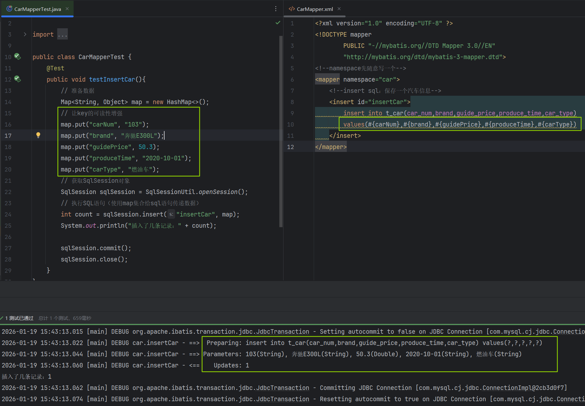


### 3.1.2 使用POJO传参

除了可以使用Map集合传参，也可以使用pojo（简单普通的java对象）完成传参。

1. 创建一个pojo类（`Car`），提供相关属性。属性要与数据库表中的一一对应。

   ```java
   package cn.piggy.mybatis.pojo;
   
   /**
    * 封装汽车相关信息的POJO类，普通的java类
    */
   public class Car {
       // 数据库表中的字段应该和POJO类的属性一一对应
   
       // 建议使用包装类，防止遇到null的问题
       private Long id;
       private String carNum;
       private String brand;
       private Double guidePrice;
       private String produceTime;
       private String carType;
   
       @Override
       public String toString() {
           return "Car{" +
                   "id=" + id +
                   ", carNum='" + carNum + '\'' +
                   ", brand='" + brand + '\'' +
                   ", guidePrice=" + guidePrice +
                   ", produceTime='" + produceTime + '\'' +
                   ", carType='" + carType + '\'' +
                   '}';
       }
   
       public Car() {
       }
   
       public Car(Long id, String carNum, String brand, Double guidePrice, String produceTime, String carType) {
           this.id = id;
           this.carNum = carNum;
           this.brand = brand;
           this.guidePrice = guidePrice;
           this.produceTime = produceTime;
           this.carType = carType;
       }
   
       public Long getId() {
           return id;
       }
   
       public void setId(Long id) {
           this.id = id;
       }
   
       public String getCarNum() {
           return carNum;
       }
   
       public void setCarNum(String carNum) {
           this.carNum = carNum;
       }
   
       public String getBrand() {
           return brand;
       }
   
       public void setBrand(String brand) {
           this.brand = brand;
       }
   
       public Double getGuidePrice() {
           return guidePrice;
       }
   
       public void setGuidePrice(Double guidePrice) {
           this.guidePrice = guidePrice;
       }
   
       public String getProduceTime() {
           return produceTime;
       }
   
       public void setProduceTime(String produceTime) {
           this.produceTime = produceTime;
       }
   
       public String getCarType() {
           return carType;
       }
   
       public void setCarType(String carType) {
           this.carType = carType;
       }
   }
   ```

2. 编写测试程序。

   ```java
   @Test
   public void testInsertCarByPOJO() {
       SqlSession sqlSession = SqlSessionUtil.openSession();
       // 封装数据
       Car car = new Car(null, "105", "比亚迪秦", 10.0, "2020-11-11", "新能源");
       // 执行SQL
       int count =  sqlSession.insert("insertCar", car);
       System.out.println(count);
   
       sqlSession.commit();
       sqlSession.close();
   }
   ```

3. 更改SQL语句。

   ```xml
   <mapper namespace="car">
       <!--占位符#{} 里写的是POJO的属性名-->
       <insert id="insertCar">
           insert into t_car(id,car_num,brand,guide_price,produce_time,car_type)
           values(null, #{carNum},#{brand},#{guidePrice},#{produceTime},#{carType})
       </insert>
   </mapper>
   ```

4. 运行测试。

   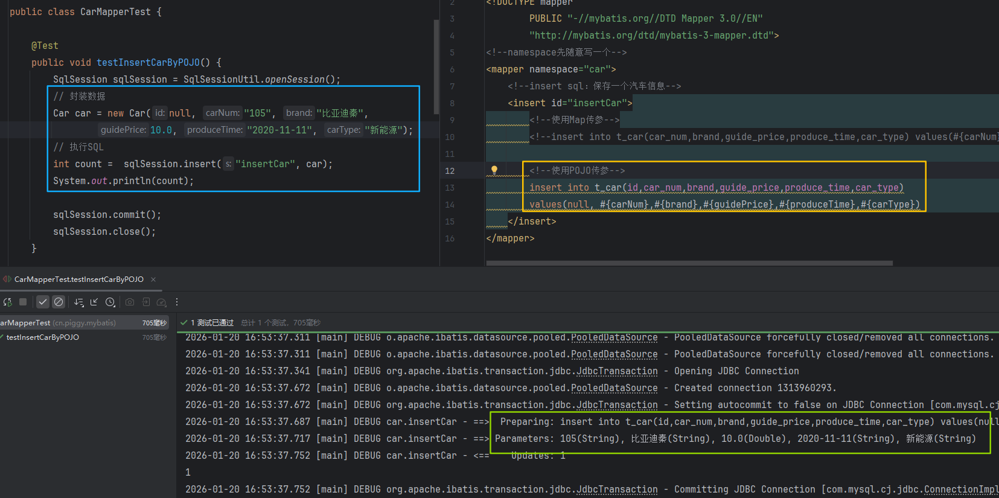


如果SQL语句中占位符`#{}`中写的不是POJO的属性名，会有什么问题？

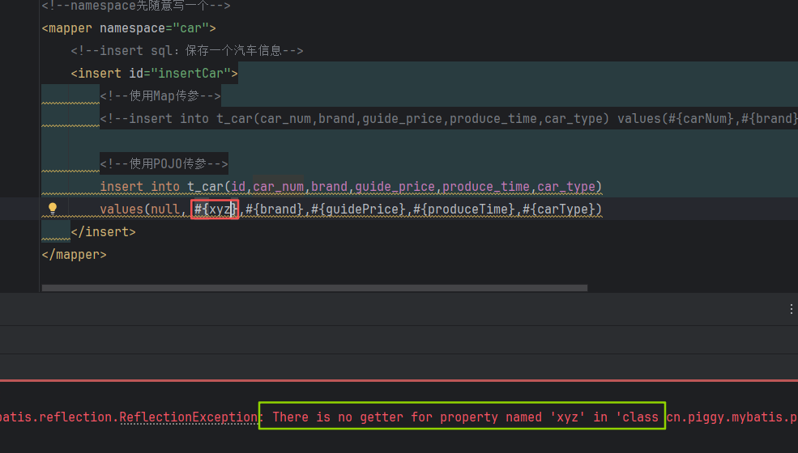

可以看到我们将`carNum`改成了`xyz`，程序报错描述：没有在类中找到xyz属性的getter()方法。

mybatis底层实际上是根据属性名，使用反射机制调用类对象的相应的getter方法，然后得到这个属性值。比如在上面测试中，mybatis要获取carNum属性的值，首先会生成相应的getter方法：属性名第一个字母大写，再添加前缀get字段，得到getCarNum()方法。这样一来就可以调用并获取到属性值了。

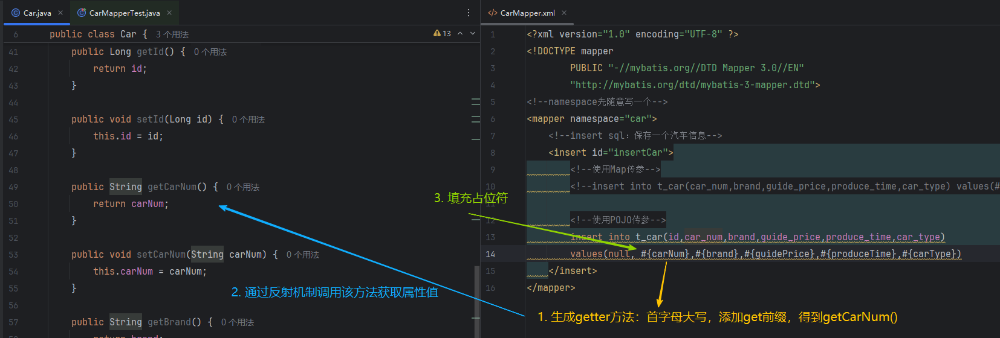


当然，如果改动了不存在的属性名，如上述的`xyz`，也可以在POJO类中新增一个`getXyz()`的方法，返回对应的属性值即可。


**注意：**

注意：其实传参数的时候有一个属性parameterType，这个属性用来指定传参的数据类型，不过这个属性是可以省略的。

```xml
<insert id="insertCar" parameterType="java.util.Map">
    insert into t_car(car_num,brand,guide_price,produce_time,car_type) values(#{carNum},#{brand},#{guidePrice},#{produceTime},#{carType})
</insert>

<insert id="insertCarByPOJO" parameterType="com.powernode.mybatis.pojo.Car">
    insert into t_car(car_num,brand,guide_price,produce_time,car_type) values(#{carNum},#{brand},#{guidePrice},#{produceTime},#{carType})
</insert>
```


## 3.2 delete（Delete）

需求：根据car_num进行删除。

SQL语句：

```xml
<delete id="deleteById">
    delete from t_car where id = #{id}
</delete>
```

java代码：

```java
@Test
public void testDeleteById() {
    SqlSession sqlSession = SqlSessionUtil.openSession();
    int count = sqlSession.delete("deleteById", 24);
    System.out.println(count);

    sqlSession.commit();
    sqlSession.close();
}
```

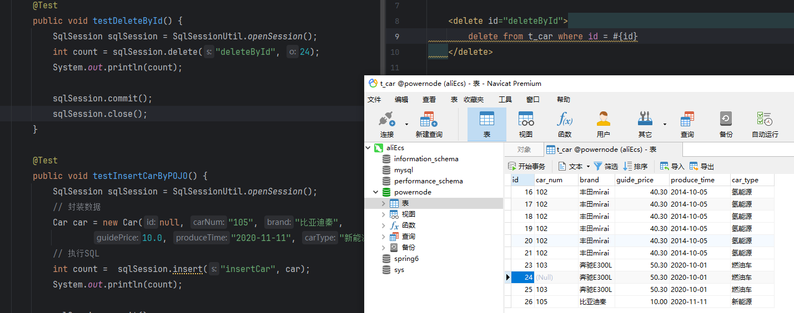

运行测试：

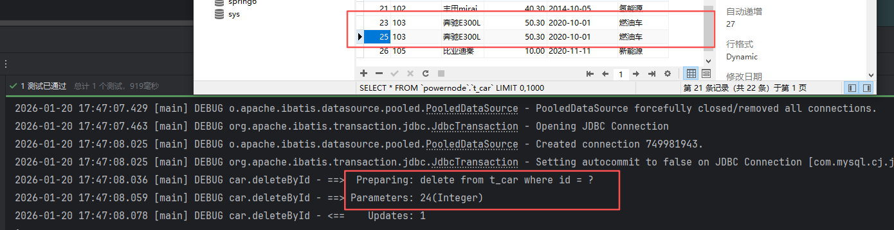


**注意：当占位符只有一个的时候，`${}` 里面的内容可以随便写**，如下面这种写法也是可以的：

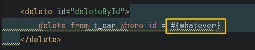


## 3.3 update（Update）

我们使用对象传参来进行数据更新

SQL语句：

```xml
<update id="updateById">
    update t_car set car_num=#{carNum}, brand=#{brand}, guide_price=#{guidePrice},
    produce_time=#{produceTime}, car_type=#{carType} where id = #{id}
</update>
```

java测试代码：

```java
@Test
public void testUpdateById() {
    SqlSession sqlSession = SqlSessionUtil.openSession();

    // 准备数据
    Car car = new Car(4L, "9999", "凯美瑞", 30.3, "1999-11-10", "燃油车");

    // 执行SQL语句
    int count = sqlSession.update("updateById", car);
    System.out.println(count);

    sqlSession.commit();
    sqlSession.close();
}
```

执行测试：

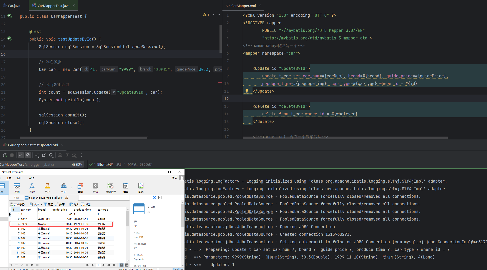


## 3.4 select（Retrieve）

select语句和其它语句不同的是：查询会有一个结果集，这部分来看看mybatis是怎么处理结果集的。


### 3.4.1 查询一条数据

需求：查询id为1的Car的信息

SQL语句：

```xml
<select id="selectById">
    select * from t_car where id = #{id}
</select>
```

java语句：

```java
@Test
public void testSelectById() {
    SqlSession sqlSession = SqlSessionUtil.openSession();
    Object car = sqlSession.selectOne("selectById", 1);
    System.out.println(car);
}
```

执行测试：

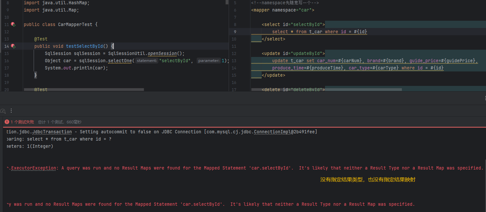

上述错误信息表明了，JDBC尝试把返回的结果集`ResultSet`转换成Java对象或者Map集合时，没有找到相应的可转换类型。因此我们如果想要将结果集转换成一个Java对象的话，就需要致命需要转换的类型，可以在`<select>`标签中添加`resultType`属性，并赋值相应的全限定类名：

```xml
<select id="selectById" resultType="cn.piggy.mybatis.pojo.Car">
    select * from t_car where id = #{id}
</select>
```


我们再次执行测试：

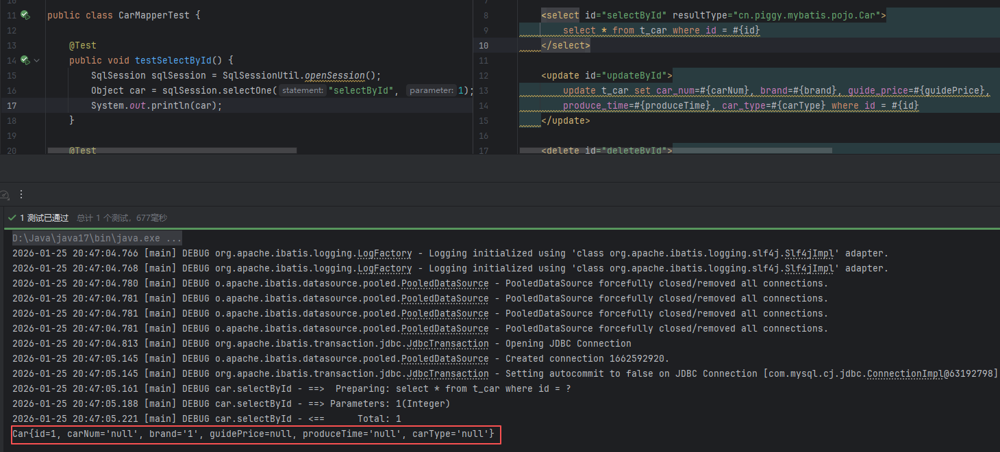


我们可以看到返回的Car对象有一些属性没有值，通过对比我们可以发现，只有当字段名跟属性名一致的就能被成功赋值，不一样的则置为了null：

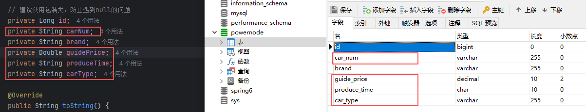

显然在类中属性名我们使用了驼峰命名，而数据库表中的字段名使用了下划线命名，这导致了两边部分数据名称不一致的现象，也是导致无法赋值的原因。我们使用`as`关键字让属性名跟字段名统一起来：

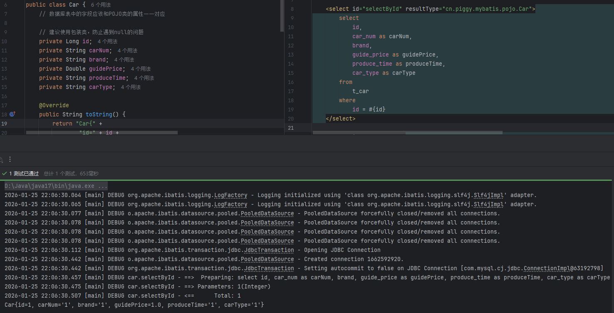

通过测试得知，如果当查询结果的字段名和java类的属性名对应不上的话，可以采用as关键字给字段名起别名，**<font style="color:#E8323C;">当然还有其它解决方案，我们后面再看</font>**。


### 3.4.2 查询多条数据

需求：查询所有数据

SQL语句：

```xml
<!--此处仍需要指定返回对象的类型-->
<select id="selectAll" resultType="cn.piggy.mybatis.pojo.Car">
    select
    id,
    car_num as carNum,
    brand,
    guide_price as guidePrice,
    produce_time as produceTime,
    car_type as carType
    from
    t_car
</select>
```

java代码：

```java
@Test
public void testSelectAll() {
    SqlSession sqlSession = SqlSessionUtil.openSession();
    // 执行SQL语句
    List<Object> cars = sqlSession.selectList("selectAll");
    cars.forEach(System.out::println);
    sqlSession.close();
}
```

执行结果：

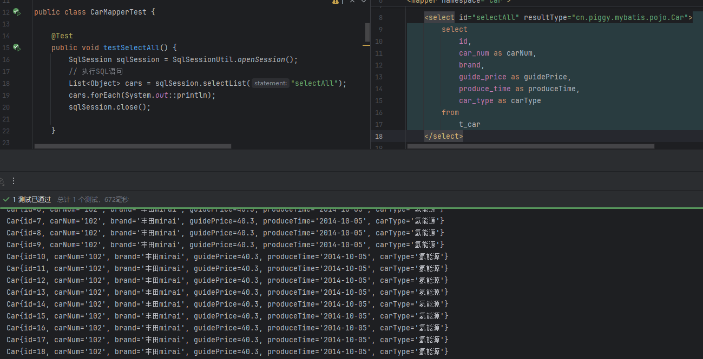


注意：

+ `resultType`：还是指定要封装的结果集的类型，也就是指定List集合中元素的类型。
+ `selectList()`方法：mybatis通过该方法就可以得知需要返回List集合，他会自动给你返回一个List集合。


## 3.5 关于SQL Mapper的namespace

在SQL Mapper配置文件中`<mapper>`标签的`namespace`属性可以翻译为命名空间，这个命名空间主要是为了防止`sqlId`冲突的。

我们在调用mapper中的方法时，完整的写法应该是**命名空间+sqlId**：

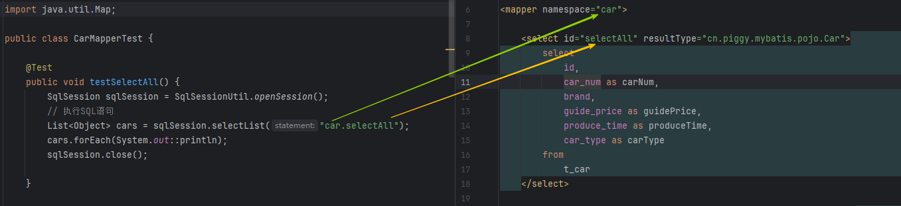


如果当我们存在两个Mapper文件，且里面有些方法名称是一样的时候，不指定namespace，直接使用方法名就会报错：

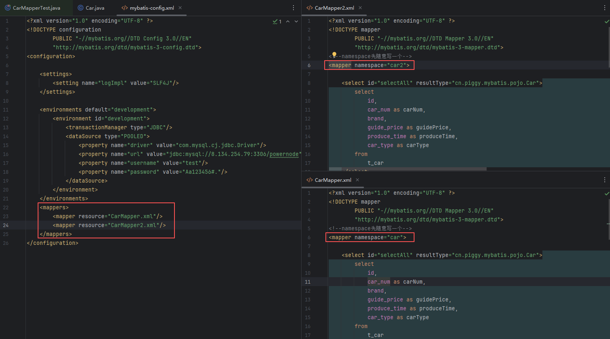

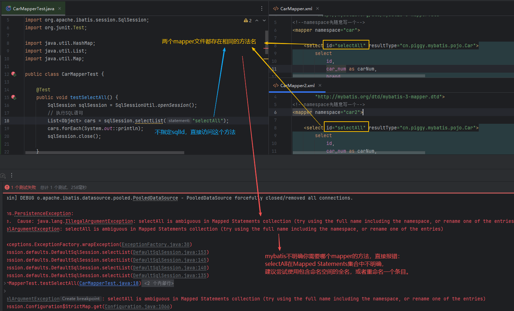


# 四、MyBatis核心配置文件详解

我们新建一个模块`mybatis-003-configuration`，并拷贝部分002项目的代码文件：

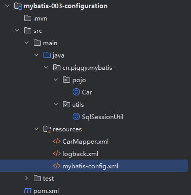

我们来看看mybatis的核心配置文件的标签：

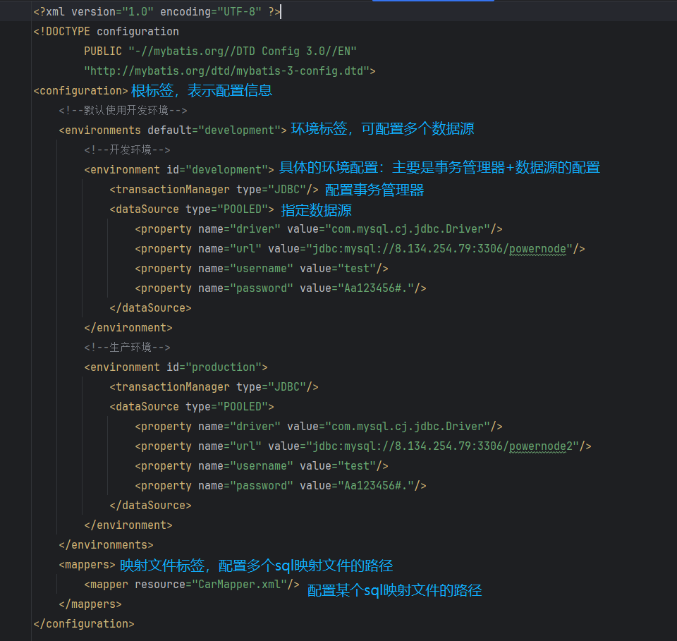


## 4.1 environment

一个`<environment>`环境连接一个数据库，而数据库会对应一个SqlSessionFactory对象。

我们创建两个环境：开发环境`development`和生产环境`production`，并编写相应代码：

```xml
<?xml version="1.0" encoding="UTF-8" ?>
<!DOCTYPE configuration
        PUBLIC "-//mybatis.org//DTD Config 3.0//EN"
        "http://mybatis.org/dtd/mybatis-3-config.dtd">
<configuration>
    <!--默认使用开发环境-->
    <environments default="development">
        <!--开发环境-->
        <environment id="development">
            <transactionManager type="JDBC"/>
            <dataSource type="POOLED">
                <property name="driver" value="com.mysql.cj.jdbc.Driver"/>
                <property name="url" value="jdbc:mysql://8.134.254.79:3306/powernode"/>
                <property name="username" value="test"/>
                <property name="password" value="Aa123456#."/>
            </dataSource>
        </environment>
        <!--生产环境-->
        <environment id="production">
            <transactionManager type="JDBC"/>
            <dataSource type="POOLED">
                <property name="driver" value="com.mysql.cj.jdbc.Driver"/>
                <property name="url" value="jdbc:mysql://8.134.254.79:3306/powernode2"/>
                <property name="username" value="test"/>
                <property name="password" value="Aa123456#."/>
            </dataSource>
        </environment>
    </environments>
    <mappers>
        <mapper resource="CarMapper.xml"/>
    </mappers>
</configuration>
```

```java
@Test
public void testEnvironment() throws Exception {
    // 准备数据
    Car car = new Car();
    car.setCarNum("133");
    car.setBrand("丰田霸道");
    car.setGuidePrice(50.3);
    car.setProduceTime("2020-01-10");
    car.setCarType("燃油车");

    // 一个数据库对应一个SqlSessionFactory对象
    // 两个数据库对应两个SqlSessionFactory对象，以此类推
    SqlSessionFactoryBuilder sqlSessionFactoryBuilder = new SqlSessionFactoryBuilder();

    // 使用默认数据库
    SqlSessionFactory sqlSessionFactory = sqlSessionFactoryBuilder.build(Resources.getResourceAsStream("mybatis-config.xml"));
    SqlSession sqlSession = sqlSessionFactory.openSession(true);
    int count = sqlSession.insert("insertCar", car);
    System.out.println("插入了几条记录：" + count);

    // 使用指定数据库
    SqlSessionFactory sqlSessionFactory1 = sqlSessionFactoryBuilder.build(Resources.getResourceAsStream("mybatis-config.xml"), "production");
    SqlSession sqlSession1 = sqlSessionFactory1.openSession(true);
    int count1 = sqlSession1.insert("insertCar", car);
    System.out.println("插入了几条记录：" + count1);
}
```


执行测试：

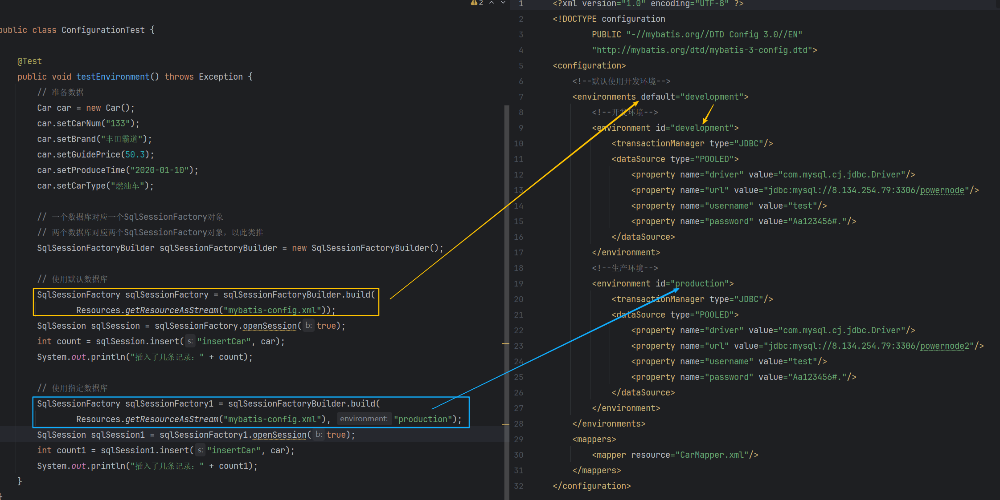

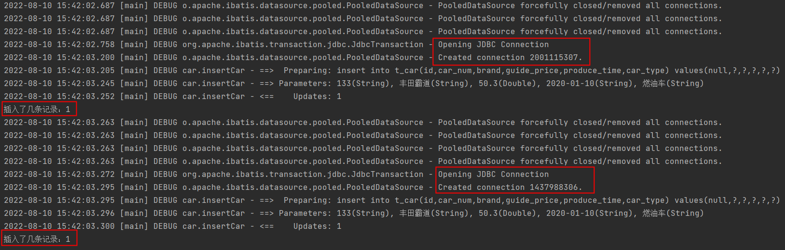

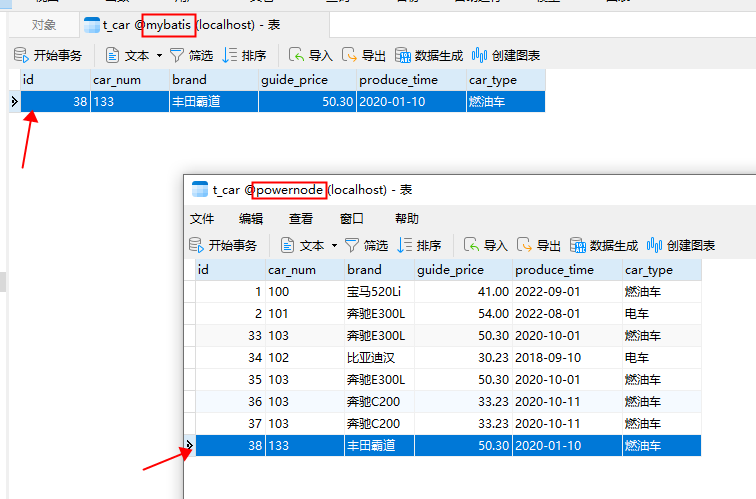


## 4.2 transactionManager

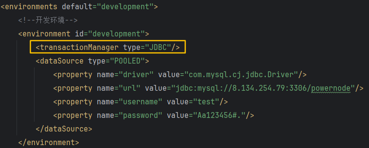

`<transactionManager>`标签：

+ 作用：配置事务管理器。指定mybatis具体使用什么方式去管理事务。

+ `type`属性的两个值：

  + `JDBC`：使用原生的JDBC代码来管理事务。

    ```java
    conn.setAutoCommit(false);
    ...
    conn.commit();
    ```

  + `MANAGED`：mybatis不再负责事务的管理，将事务管理交给其他的JEE（JavaEE）容器来管理，如Spring等。

    如果使用了`Managed`属性且没有容器支持，也即当mybatis找不到容器支持时，那么数据库操作就没有事务，每执行一条SQL语句就提交一次。

+ type属性不区分大小写，且只能二选一。

+ 在mybatis中提供了一个事务管理器接口：`Transaction`，且该接口下有两个实现类：`JdbcTransaction`和`ManagedTransaction`。

  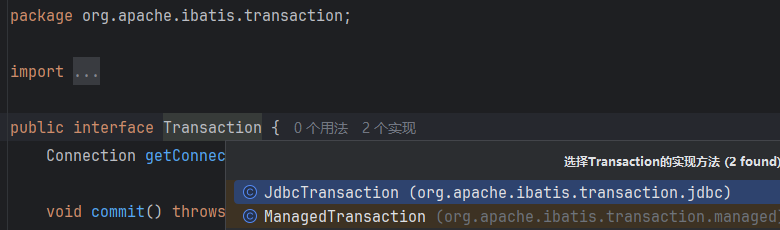

  根据type属性，底层实例化相应的管理器实现类。


## 4.3 dataSource

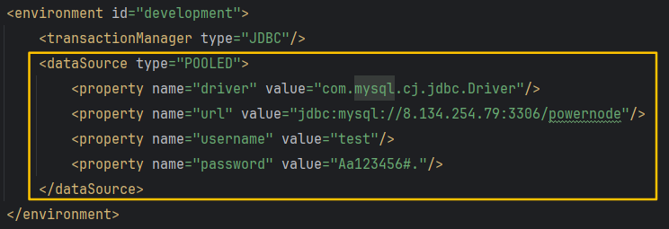


dataSource被称为**数据源**。

dataSource作用：**为程序提供Connnection对象**。（但凡是给程序提供Connection对象的，都叫数据源）


数据源实际上是一套规范，JDK中有这套规范：`javax.sql.DataSource`。（基于这套规范制定的接口实际上也是JDK规定的）。

我们也可以自定义数据源组件，只要实现`javax.sql.DataSource`接口就行了。比如可以写一个自定义的数据库连接池（数据库连接池是提供对象的，所以数据库连接池就是一个数据源）。


常见的数据源组件（常见的数据库连接池）有哪些？

+ 阿里巴巴的德鲁伊连接池（druid）
+ c3p0
+ dbcp
+ 等等


`type`属性用来指定数据源的类型，就是指定具体使用什么方式来获取Connection对象，其有三种内建的数据源类型`"[UNPOOLED|POOLED|JNDI]`。

+ `UNPOOLED`：不使用数据库连接池技术，每一次请求都会创建新的Connection对象。
+ `POOLED`：使用mybatis自己实现的数据库连接池。
+ `JNDI`：集成其他第三方的数据库连接池。


### 4.3.1 数据源下的不同属性

**JNDI**是一套规范。大部分web容器都实现了JNDI规范，比如Tomcat、Jetty、WebLogic等都实现了这套规范。

也就是说Java命名目录接口，而web容器则实现了这个规范。

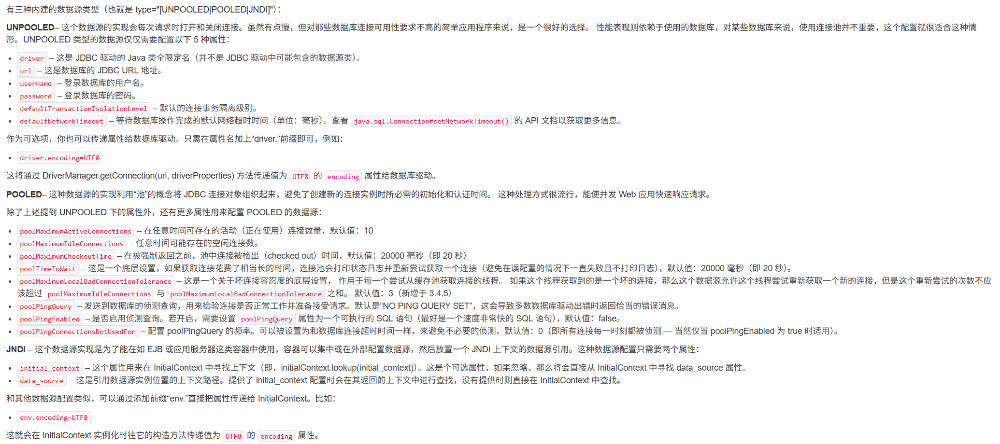


### 4.3.2 UNPOOLED 和 POOLED的区别

连接池的优点：

+ 每一次获取连接都从池中拿，效率高。
+ 因为每一次只能从池中拿，所以连接对象的创建数量是可控的。


我们准备测试代码，使用默认的环境进行测试：

```java
@Test
public void testDataSource() throws Exception {
    SqlSessionFactoryBuilder sqlSessionFactoryBuilder = new SqlSessionFactoryBuilder();

    SqlSessionFactory sqlSessionFactory = sqlSessionFactoryBuilder.build(Resources.getResourceAsStream("mybatis-config.xml"));

    // 准备数据
    Car car = new Car();
    car.setCarNum("199");
    car.setBrand("丰田霸道");
    car.setGuidePrice(50.3);
    car.setProduceTime("2020-01-10");
    car.setCarType("燃油车");

    // 通过sqlSessionFactory对象可以开启多个会话
    // 会话1
    SqlSession sqlSession1 = sqlSessionFactory.openSession();
    sqlSession1.insert("car.insertCar", car);
    sqlSession1.commit();
    sqlSession1.close();

    // 会话2
    SqlSession sqlSession2 = sqlSessionFactory.openSession();
    sqlSession2.insert("car.insertCar", car);
    sqlSession2.commit();
    sqlSession2.close();
}
```


使用UNPOOLED，两次会话都会打开和关闭Connection连接对象：

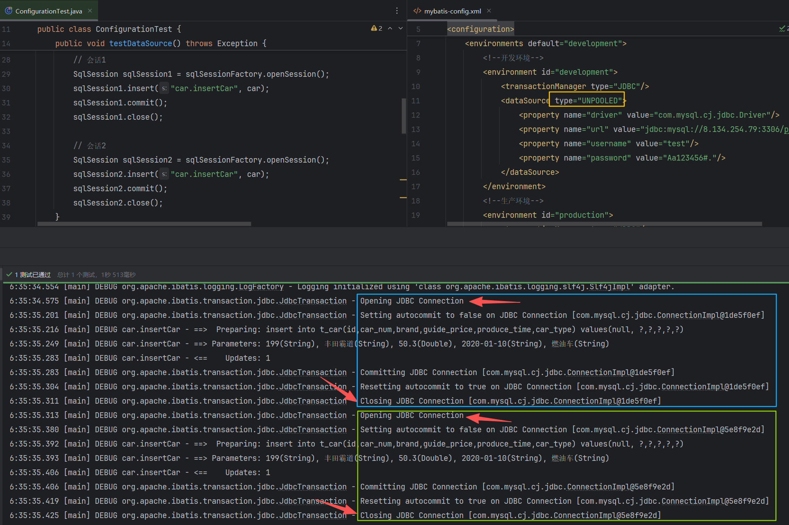


使用POOLED，在会话开始时会向连接池申请Connection连接，结束后会返还给连接池。

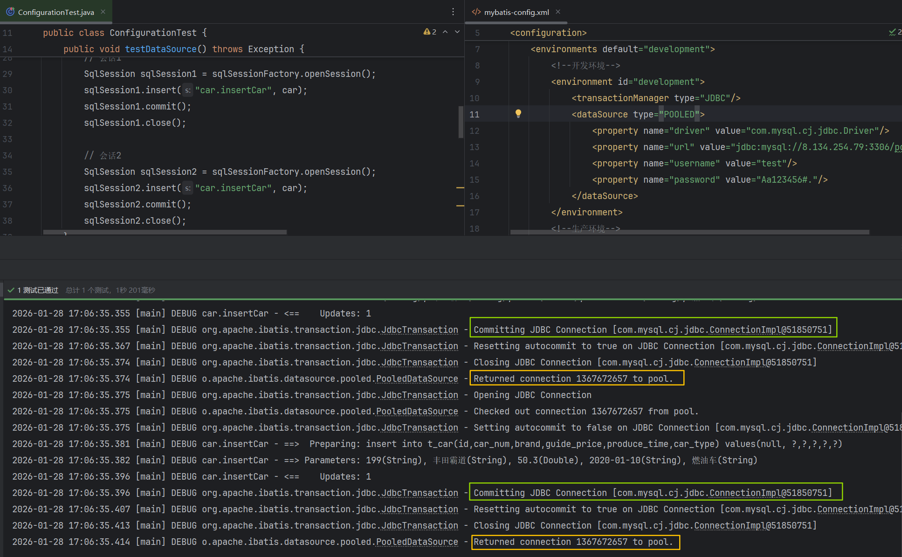


### 4.3.3 POOLED状态下的其他参数设置

1. `poolMaximumActiveConnections`：连接池当中正在使用的连接对象的数量上限（同一段时间最大的连接数量），默认为10。

   测试一：我们设置其为3，在测试代码中申请4个会话。

   ```xml
   <property name="poolMaximumActiveConnections" value="3"/>
   ```

   ```java
   @Test
   public void testProperties() throws Exception {
       SqlSessionFactoryBuilder sqlSessionFactoryBuilder = new SqlSessionFactoryBuilder();
       SqlSessionFactory sqlSessionFactory = sqlSessionFactoryBuilder.build(Resources.getResourceAsStream("mybatis-config.xml"));
   
       // 准备数据
       Car car = new Car();
       car.setCarNum("199");
       car.setBrand("丰田霸道");
       car.setGuidePrice(50.3);
       car.setProduceTime("2020-01-10");
       car.setCarType("燃油车");
   
       for (int i = 0; i < 4; i++) {
           SqlSession sqlSession1 = sqlSessionFactory.openSession();
           sqlSession1.insert("car.insertCar", car);
           // 不要关闭，不要返还连接对象
       }
   }
   ```

   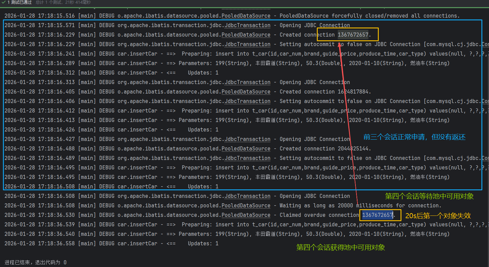


2. `poolMaximumCheckoutTime`：在被强制返回之前，池中连接被检出（check out）时间，默认值为20000毫秒（20秒）。

   一般情况下，对某个已占用的连接对象，处于空闲状态且超过检出时间时，会被连接池强制回收。

   如上个测试例子可以看到，第四个会话的等待池中可用连接的时间可以通过这个参数进行调整。

   

3. `poolTimeToWait`：这是一个底层设置，如果获取连接花费了相当长的时间，连接池会打印状态日志并重新尝试获取一个连接（避免在误配置的情况下一直失败且不打印日志），默认值：20000 毫秒（即 20 秒）。

   测试二：我们将检出时间设置为10s，且打印日志间隔为2s，继续执行测试一。

   ```xml
   <!--池中连接检出时间，，默认20s。现设置为10s-->
   <property name="poolMaximumCheckoutTime" value="10000"/>
   <!--每隔2s打印日志，并且尝试获取连接对象-->
   <property name="poolTimeToWait" value="2000"/>
   ```

   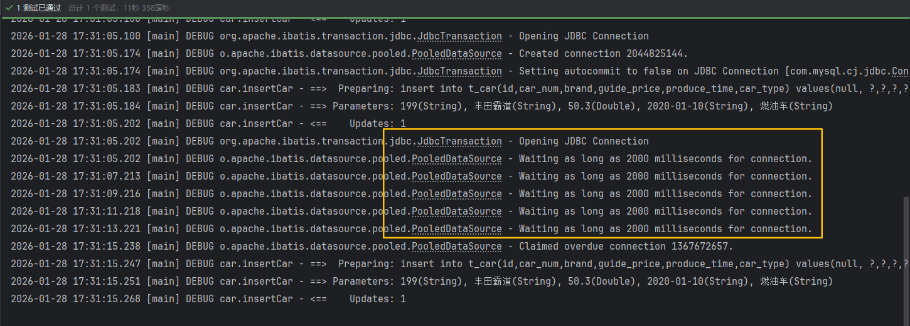


4. `poolMaximumIdleConnections `： 任意时间可能存在的空闲连接数上限。

   如果当池中的空闲对象数量超过设定的空闲连接数上限时，多余的空闲连接对象会被真正的关闭。

   ```xml
   <!--空闲连接数上限,设置为5个-->
   <property name="poolMaximumIdleConnections " value="5"/>
   ```

   

## 4.4 Properties

mybatis提供了更加灵活的配置，连接数据库的信息可以抽取出来或者单独写到一个属性资源文件中。

1. 将数据库配置信息抽取出来：

   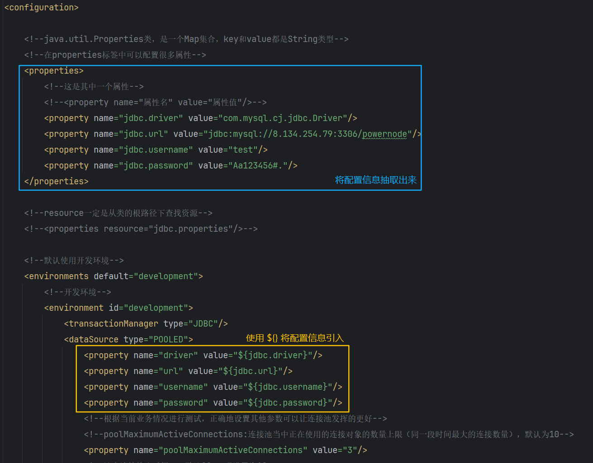

2. 单独写到一个配置文件`jdbc.properties`中（放到根目录下）：

   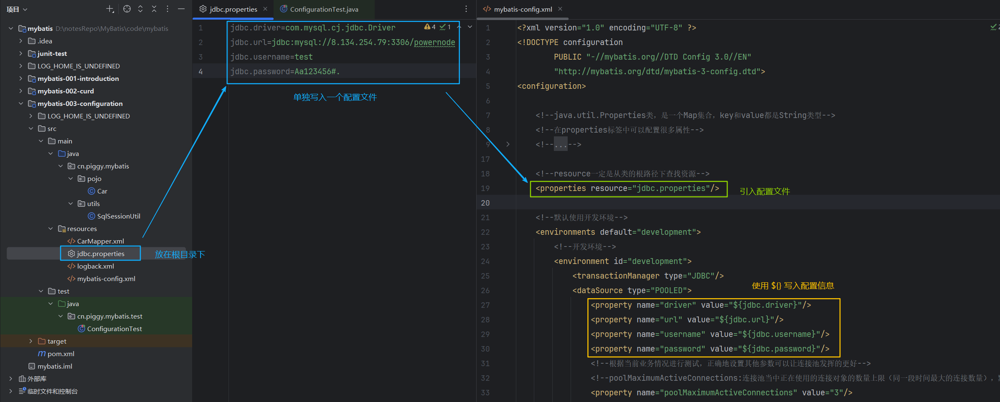

3. 单独写到一个配置文件`jdbc.properties`中（放到绝对路径下）：

   比如将配置文件放在D盘下的写法：

   ```xml
   <!--url从绝对路径下加载文件-->
   <properties url="file:///d:/jdbc.properties"/>
   ```


**properties两个属性：**

+ `resource`：这个属性从类的根路径下开始加载。【常用的。】
+ `url`：从指定的url加载，假设文件放在`d:/jdbc.properties`，这个url可以写成：`file:///d:/jdbc.properties`。（注意是三个斜杠）


注意：如果不知道`mybatis-config.xml`文件中标签的编写顺序的话，可以有两种方式知道它的顺序：

+ 第一种方式：查看dtd约束文件。
+ 第二种方式：通过idea的报错提示信息。【一般采用这种方式】


## 4.5 Mapper

mapper标签用来指定SQL映射文件的路径，包含多种指定方式，这里先主要看其中两种：

+ `resource`：从类的根路径下开始加载。
+ `url`：从指定的url位置加载。


实例：

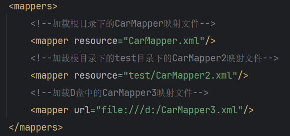


# 五、手写MyBatis框架

## 5.1 dom4j解析XML文件

新建一个模块`parse-xml-by-dom4j`，用于测试解析程序。


### 5.1.1 解析mybaits核心配置文件

1. 在`pom.xml`中引入依赖：

   ```xml
   <dependencies>
       <!--dom4j依赖-->
       <dependency>
           <groupId>org.dom4j</groupId>
           <artifactId>dom4j</artifactId>
           <version>2.1.3</version>
       </dependency>
       <!--jaxen依赖-->
       <dependency>
           <groupId>jaxen</groupId>
           <artifactId>jaxen</artifactId>
           <version>1.2.0</version>
       </dependency>
       <!--junit依赖-->
       <dependency>
           <groupId>junit</groupId>
           <artifactId>junit</artifactId>
           <version>4.13.2</version>
           <scope>test</scope>
       </dependency>
   </dependencies>
   ```

   

2. 编写代码并测试：

   ```java
   @Test
   public void testParseMyBatisConfigXML() throws Exception {
       // 创建SAXReader对象
       SAXReader reader = new SAXReader();
       // 获取输入流
       InputStream is = ClassLoader.getSystemClassLoader().getResourceAsStream("mybatis-config.xml");
       // 读XML文件，返回document独享，document对象是文档对象，代表了整个XML文件
       Document document = reader.read(is);
       System.out.println(document);
   
       // 获取文档当中的根标签
       /*Element rootElement = document.getRootElement();
           System.out.println("根节点的名字：" + rootElement.getName());*/
   
       // 获取default默认的环境id
       // xpath是做标签路径匹配的，能够让我们快速定位XML文件中的元素。
       // 下面的xpath代表：从根下找configuration标签，然后找该标签下的environments子标签
       String xpath = "/configuration/environments";
       Element environments = (Element) document.selectSingleNode(xpath);  // Element是Node的子类，方法更多
       // 获取属性的值
       String defaultEnvironmentId = environments.attributeValue("default");
       System.out.println("默认环境的环境ID：" + defaultEnvironmentId);
   
       // 根据默认的环境ID 获取具体的环境environment
       xpath = "/configuration/environments/environment[@id='" + defaultEnvironmentId + "']";
       Element environment = (Element) document.selectSingleNode(xpath);
       // System.out.println(environment);
   
       // 获取environment节点下的TransactionManager节点
       // 使用Element的element()方法来互殴孩子节点
       Element transactionManager = environment.element("transactionManager");
       String transactionType = transactionManager.attributeValue("type");
       System.out.println("事务管理器的类型： " + transactionType);
   
       // 获取dataSource节点
       Element dataSource = environment.element("dataSource");
       String dataSourceType = dataSource.attributeValue("type");
       System.out.println("数据源的类型：" + dataSourceType);
   
       // 获取dataSource节点下的所有子节点
       List<Element> propertyElts = dataSource.elements();
       // 遍历输出
       propertyElts.forEach(propertyElt -> {
           String name = propertyElt.attributeValue("name");
           String value = propertyElt.attributeValue("value");
           System.out.println(name + ":" + value);
       });
   
       // 获取所有的Mapper标签
       // 不想从根下开始获取，从任意位置开始，获取所有的mapper标签
       xpath = "//mapper";
       List<Node> mappers = document.selectNodes(xpath);
       // 遍历
       mappers.forEach(mapper -> {
           Element mapperElt = (Element) mapper;
           String resource = mapperElt.attributeValue("resource");
           System.out.println(resource);
       });
   }
   ```

3. 执行测试：

   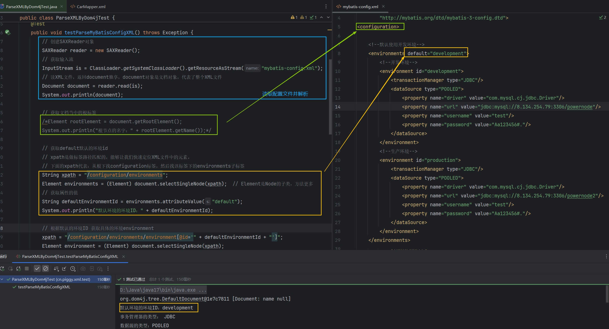

   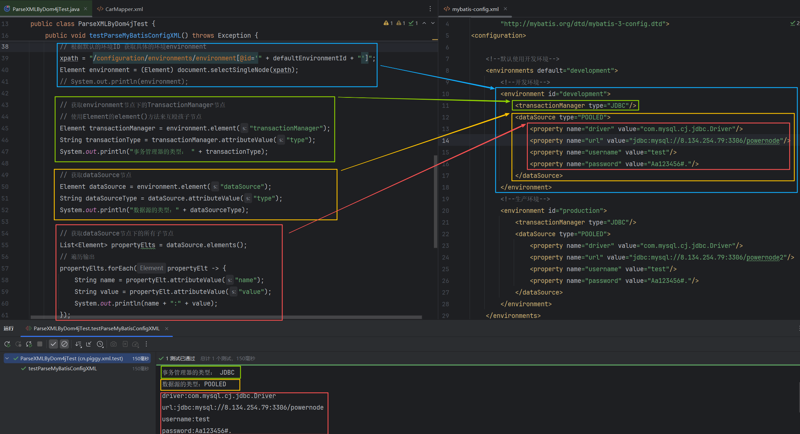


### 5.1.2 解析mapper映射文件

准备解析代码：

```java
@Test
public void testParseSqlMapperXML() throws Exception {
    SAXReader reader = new SAXReader();
    InputStream is = ClassLoader.getSystemClassLoader().getResourceAsStream("CarMapper.xml");
    Document document = reader.read(is);

    // 获取namespace
    String xpath = "/mapper";
    Element mapper = (Element) document.selectSingleNode(xpath);
    String namespace = mapper.attributeValue("namespace");
    System.out.println("命名空间：" + namespace);

    // 获取mapper节点下所有的子节点
    List<Element> elements = mapper.elements();
    elements.forEach(element -> {
        // 获取sqlId
        String id = element.attributeValue("id");
        System.out.println(id);

        // 获取resultType（如果没有这个属性则会返回null）
        String resultType = element.attributeValue("resultType");
        System.out.println(resultType);

        // 获取标签中的sql语句（获取文本且去除前后空白）
        String sql = element.getTextTrim();
        System.out.println(sql);

        /** MYBATIS封装了JDBC,我们需要将#{}转换成JDBC规范里的？
             * insert into t_car values(null, #{carNum},#{brand},#{guidePrice},#{produceTime},#{carType})
             * ↑ 转换为 → insert into t_car values(null,?,?,?,?,?)
             */
        String newSql = sql.replaceAll("#\\{[0-9A-Za-z_$]*}", "?");
        System.out.println(newSql);
    });
}
```


测试：

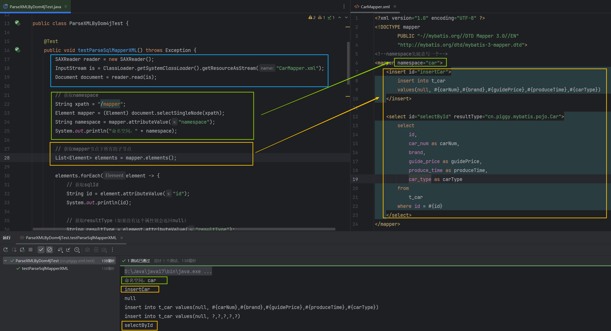

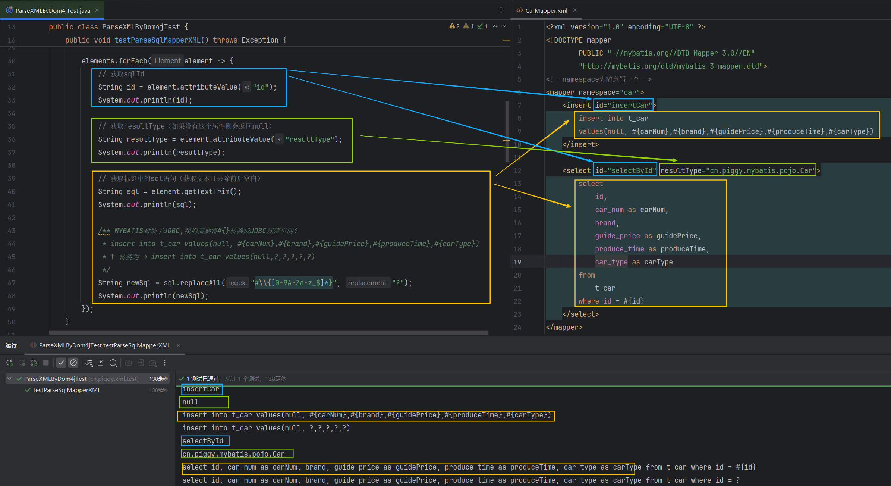


## 5.2 GodBatis

### 5.2.1 创建GodBatis模块

新建maven项目`godbatis`，并引入依赖：

```xml
<?xml version="1.0" encoding="UTF-8"?>
<project xmlns="http://maven.apache.org/POM/4.0.0"
         xmlns:xsi="http://www.w3.org/2001/XMLSchema-instance"
         xsi:schemaLocation="http://maven.apache.org/POM/4.0.0 http://maven.apache.org/xsd/maven-4.0.0.xsd">
    <modelVersion>4.0.0</modelVersion>

    <groupId>cn.piggy</groupId>
    <artifactId>godbatis</artifactId>
    <version>1.0-SNAPSHOT</version>
    <packaging>jar</packaging>

    <dependencies>
        <!--dom4j-->
        <dependency>
            <groupId>org.dom4j</groupId>
            <artifactId>dom4j</artifactId>
            <version>2.1.3</version>
        </dependency>
        <!--jaxen-->
        <dependency>
            <groupId>jaxen</groupId>
            <artifactId>jaxen</artifactId>
            <version>1.2.0</version>
        </dependency>
    </dependencies>

    <properties>
        <maven.compiler.source>17</maven.compiler.source>
        <maven.compiler.target>17</maven.compiler.target>
        <project.build.sourceEncoding>UTF-8</project.build.sourceEncoding>
    </properties>

</project>
```


分析构建的流程：

1. 通过观察之前的代码，可以得知`SqlSessionFactory`对象先通过`SqlSessionFactoryBuilder`对象的build方法生成的，而build方法需要加载核心配置文件，因此我们可以先把这两个对象给定义出来，并封装加载文件的方法。

   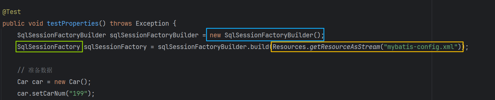


### 5.2.2 创建资源工具类

创建资源工具类`cn.piggy.godbatis.utils.Resouces`，方便获取指向配置文件的输入流:

```java
/**
 * godBatis框架提供的一个工具类
 * 这个工具类专门完成类路径中资源的加载
 */
public class Resources {
    /**
     * 工具了的构造方法都是建议私有化的
     * 因为工具类中的方法都是静态的，不能创建对象就能调佣。
     * 为了避免new对象，所有构造方法私有化。
     * 这是一种编程习惯。
     */
    private Resources() {}

    /**
     * 从类路径中加载资源。
     * @param resource 放在类路径当中的资源文件
     * @return 访问资源文件的一个输入流
     */
    public static InputStream getResourceAsStream(String resource) {
        return ClassLoader.getSystemClassLoader().getResourceAsStream(resource);
    }
}
```


### 5.2.3 定义SqlSessionFactoryBuilder类

提供一个无参数构造方法，再提供一个build方法，该build方法要返回SqlSessionFactory对象。

```java
/**
 * SqlSessionFactory的构建器对象
 * 通过SqlSessionFactoryBuilder的build方法来解析godbatis-config.xml文件，然后创建SqlSessionFactory对象。
 */
public class SqlSessionFactoryBuilder {

    /**
     * 无参数构造方法
     */
    public SqlSessionFactoryBuilder() {
    }

    /**
     * 解析godbatis-config.xml文件，来构建SqlSessionFactory对象
     * @param in 指向godbatis-config.xml的文件流
     * @return SqlSessionFactory对象
     */
    public SqlSessionFactory build(InputStream in) {
        // 解析完成之后，构建SqlSessionFactory对象
        SqlSessionFactory factory = new SqlSessionFactory();
        return factory;
    }
}
```


### 5.2.4 定义SqlSessionFactory类

根据核心配置文件，来初步定义相关的属性：

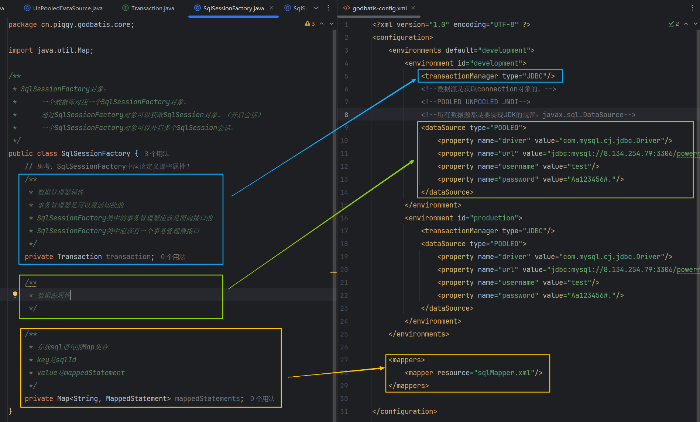

代码：

```java
public class SqlSessionFactory {
    // 思考：SqlSessionFactory中应该定义那些属性？
    /**
     * 数据管理器属性
     * 事务管理器是可以灵活切换的
     * SqlSessionFactory类中的事务管理器应该是面向接口的
     * SqlSessionFactory类中应该有一个事务管理器接口
     */
    private Transaction transaction;

    /**
     * 数据源属性
     */

    /**
     * 存放sql语句的Map集合
     * key是sqlId
     * value是mappedStatement
     */
    private Map<String, MappedStatement> mappedStatements;
}
```


注意：黄框中的`mappedStatements`属性主要是为了存放映射文件中的SQL映射信息，`MappedStatement`类封装了每一条的SQL信息。

```java
// MappedStatement.class
package cn.piggy.godbatis.core;

/**
 * 普通的java类。POJO 封装了一个SQL标签
 * 一个MappedStatment对象对应一个SQL标签
 * 一个SQL标签中的所有信息封装到MappedStatement对象当中。
 * 面向对象编程思想。
 */
public class MappedStatement {
    /**
     * sql语句
     */
    private String sql;

    /**
     * 要封装的结果集类型，有的时候为null
     * 比如:insert delete update语句的时候为null，在select语句时才有值
     */
    private String resultType;

    public MappedStatement() {
    }

    public MappedStatement(String sql, String resultType) {
        this.sql = sql;
        this.resultType = resultType;
    }

    @Override
    public String toString() {
        return "MappedStatement{" +
                "sql='" + sql + '\'' +
                ", resultType='" + resultType + '\'' +
                '}';
    }

    public String getSql() {
        return sql;
    }

    public void setSql(String sql) {
        this.sql = sql;
    }

    public String getResultType() {
        return resultType;
    }

    public void setResultType(String resultType) {
        this.resultType = resultType;
    }
}
```

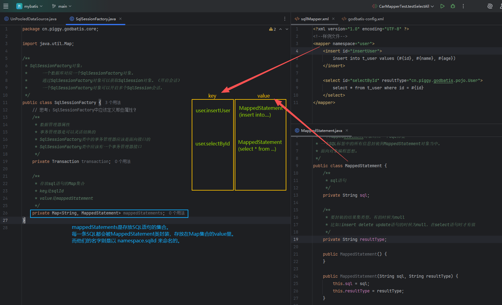


### 5.2.5 定义事务管理器类(Transaction)

这个事务管理器主要提供管理事务的方法，有`JDBC`和`MANAGED`两种事务管理器。

因此事务管理器应该使用面向接口的方法：新建一个`Transaction`事务管理接口，然后后续再实现两个实现类`JdbcTransaction`和`ManagedTransaction`。

```java
// Transaction事务管理器接口
/**
 * 事务管理器接口
 * 所有的事务管理器都应该遵循该规范
 * JDBC事务管理器、MANAGED事务管理器都应该实现这个接口
 * Transaction事务管理器：提供管理事务方法
 */
public interface Transaction {
    /**
     * 提交事务
     */
    void commit();

    /**
     * 回滚事务
     */
    void rollback();

    /**
     * 关闭事务
     */
    void close();

    /**
     * 真正开启数据库连接
     */
    void openSession();

    /**
     * 获取数据库连接对象
     * @return 数据库连接对象
     */
    Connection getConnection();

    /**
     * 后续如需其他方法可继续添加...
     */
}
```


我们重点关注实现，因此只完成`JdbcTransaction`事务管理器类，`ManagedTransaction`类暂不做处理。

```java
/**
 * JDBC事务管理器（godbatis只对这个管理器实现）
 */
public class JdbcTransaction implements Transaction{

    /**
     * 数据源属性
     * 面向接口编程
     */
    private DataSource dataSource;

    /**
     * 自动提交标志
     * true:自动提交    false:手动提交
     */
    private boolean autoCommit;

    /**
     * 数据库连接
     * 保证该事务管理器的连接不会变动
     */
    private Connection connection;

    @Override
    public Connection getConnection() {
        return connection;
    }

    /**
     * 创建事务管理器对象
     * @param dataSource
     * @param autoCommit
     */
    public JdbcTransaction(DataSource dataSource, boolean autoCommit) {
        this.dataSource = dataSource;
        this.autoCommit = autoCommit;
    }

    @Override
    public void commit() {
        try {
            connection.commit();
        } catch (SQLException e) {
            e.printStackTrace();
        }
    }

    @Override
    public void rollback() {
        try {
            connection.rollback();
        } catch (SQLException e) {
            e.printStackTrace();
        }
    }

    @Override
    public void close() {
        try {
            connection.close();
        } catch (SQLException e) {
            e.printStackTrace();
        }
    }

    @Override
    public void openSession() {
        if (connection == null) {
            try {
                connection = dataSource.getConnection();
            } catch (SQLException e) {
               e.printStackTrace();
            }
        }
    }
}
```


注意：

1. 因为事务管理需要依赖`DataSource`数据源提供的连接`Connection`，因此我们需要添加数据源属性。

   ```java
   private DataSource dataSource;
   ```

2. 此外，因为数据源在事务管理器的构造方法中传入，因此SqlSessionFactory工厂类也不需要在维护数据源属性。（如有需要可直接通过Transaction属性获取）

   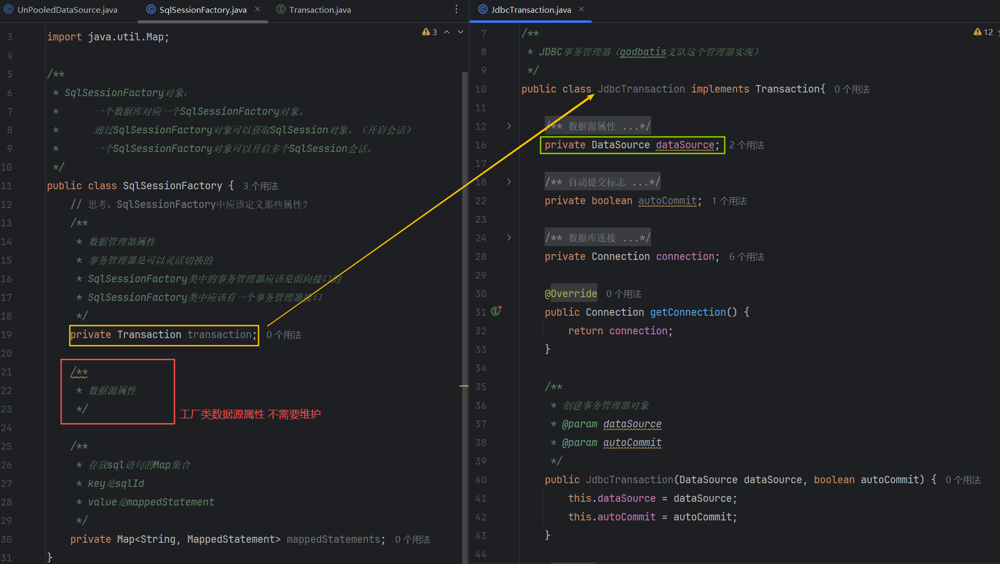

3. 为什么需要单独维护一个连接对象`Connection`？

   我们先按下不表，等完成了数据源实现后再讲。


### 5.2.6 定义数据源类(DataSource)

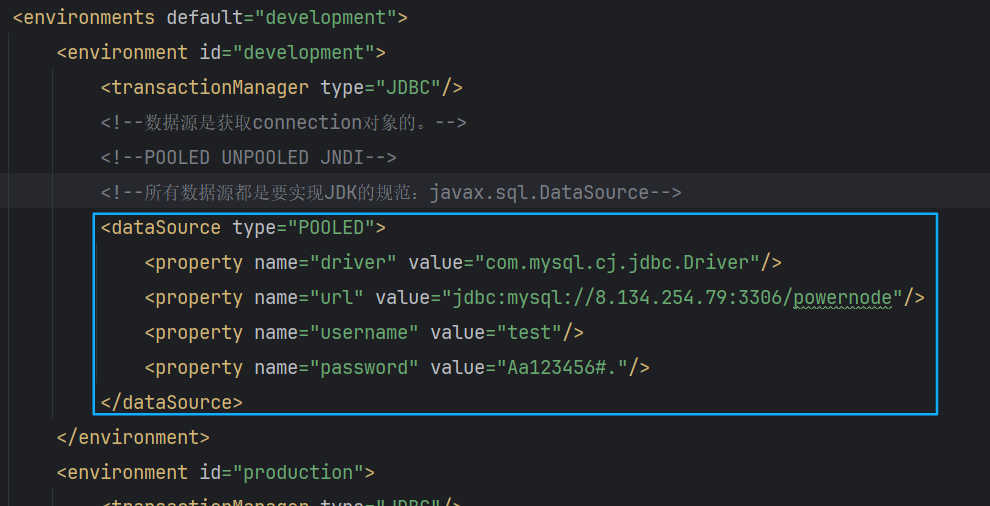

所有数据源都是要实现JDK的规范：`javax.sql.DataSource`，而且有三种属性`UNPOOLED`、`POOLED`和`JNDI`。

JDK已经为我们提供了数据源的接口，我们只需要实现这三种类型的接口就行了。但我们还是只完全实现`UNPOOLED`这一种类型的接口，而且只实现`getConnection()`这一个方法。

```java
// UnPooledDataSource.class

/**
 * 数据源的实现类：UNPOOLED（重点实现这个）
 * 不适用连接池，每一次都新建连接
 */
public class UnPooledDataSource implements DataSource {

    private String url;
    private String username;
    private String password;

    /**
     * 创建一个数据源对象。
     * @param url
     * @param username
     * @param password
     */
    public UnPooledDataSource(String driver, String url, String username, String password) {
        try {
            // 直接注册驱动
            Class.forName(driver);
        } catch (ClassNotFoundException e) {
            throw new RuntimeException(e);
        }
        this.url = url;
        this.username = username;
        this.password = password;
    }

    @Override
    public Connection getConnection() throws SQLException {
        Connection connection = DriverManager.getConnection(url, username, password);
        return connection;
    }

    @Override
    public Connection getConnection(String username, String password) throws SQLException {
        return null;
    }

    @Override
    public PrintWriter getLogWriter() throws SQLException {
        return null;
    }

    @Override
    public void setLogWriter(PrintWriter out) throws SQLException {

    }

    @Override
    public void setLoginTimeout(int seconds) throws SQLException {

    }

    @Override
    public int getLoginTimeout() throws SQLException {
        return 0;
    }

    @Override
    public <T> T unwrap(Class<T> iface) throws SQLException {
        return null;
    }

    @Override
    public boolean isWrapperFor(Class<?> iface) throws SQLException {
        return false;
    }

    @Override
    public Logger getParentLogger() throws SQLFeatureNotSupportedException {
        return null;
    }
}
```


现在可以回答5.2.5中的第三个问题：为什么要在事务管理器实现类中单独维护一个连接对象`Connection`？

因为直接调用`getConnection()`方法每次都会返回不同的连接对象:

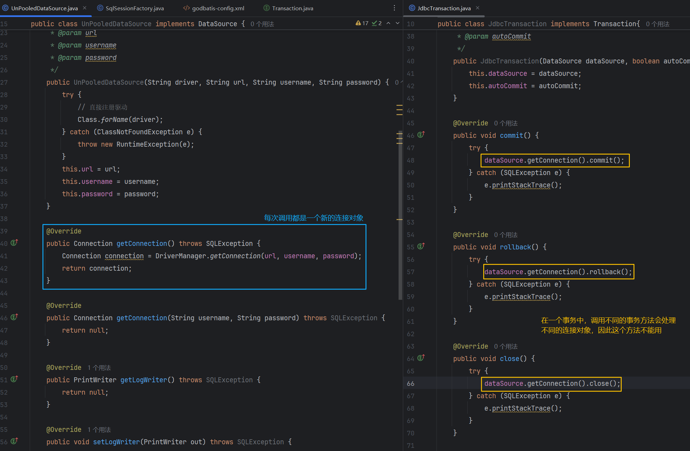

所以我们需要维护一个独立的连接对象；

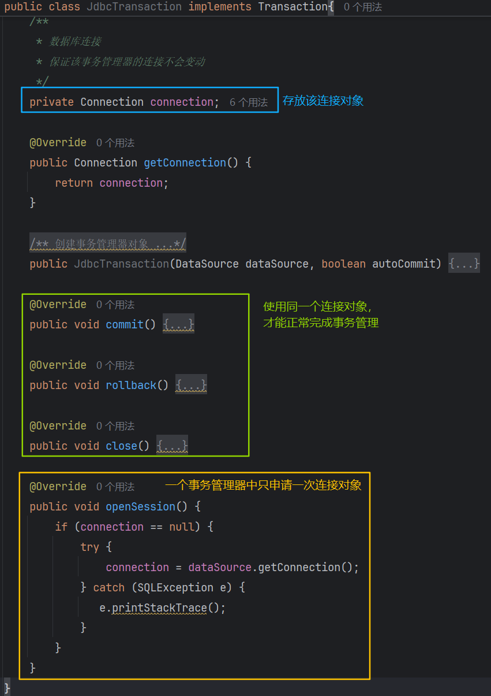


### 5.2.7 完善SqlSessionFactory类

我们给`SqlSessionFactory`类加上getter和setter方法，并创建其全参构造器。

```java
public class SqlSessionFactory {
    /**
     * 数据管理器属性
     * 事务管理器是可以灵活切换的
     * SqlSessionFactory类中的事务管理器应该是面向接口的
     * SqlSessionFactory类中应该有一个事务管理器接口
     */
    private Transaction transaction;

    /**
     * 存放sql语句的Map集合
     * key是sqlId
     * value是mappedStatement
     */
    private Map<String, MappedStatement> mappedStatements;

    public SqlSessionFactory() {
    }

    public SqlSessionFactory(Transaction transaction, Map<String, MappedStatement> mappedStatements) {
        this.transaction = transaction;
        this.mappedStatements = mappedStatements;
    }

    public Transaction getTransaction() {
        return transaction;
    }

    public void setTransaction(Transaction transaction) {
        this.transaction = transaction;
    }

    public Map<String, MappedStatement> getMappedStatements() {
        return mappedStatements;
    }

    public void setMappedStatements(Map<String, MappedStatement> mappedStatements) {
        this.mappedStatements = mappedStatements;
    }
}
```


### 5.2.8 完善SqlSessionFactoryBuilder类

我们首先来完善`SqlSessionFactoryBuilder`的`build()`方法：

```java
/**
     * 解析godbatis-config.xml文件，来构建SqlSessionFactory对象
     * @param in 指向godbatis-config.xml的文件流
     * @return
     */
public SqlSessionFactory build(InputStream in) {
    SqlSessionFactory factory = null;
    try {
        // 解析godbatis-config.xml
        SAXReader reader = new SAXReader();
        Document document = reader.read(in);

        // 获取默认的环境environment
        Element environments = (Element) document.selectSingleNode("/configuration/environments");
        String defaultId = environments.attributeValue("default");
        Element environment = (Element) document.selectSingleNode("/configuration/environments/environment[@id='" + defaultId+ "']");
        // 获取事务管理器节点
        Element transactionElt = environment.element("transactionManager");
        // 获取数据源节点
        Element dataSourceElt = environment.element("dataSource");
        // 获取mapper所有路径
        List<String> sqlMapperXMLPathList = new ArrayList<>();
        List<Node> nodes = document.selectNodes("//mapper");    // 获取整个配置文件中的所有mapper标签
        nodes.forEach(node -> {
            Element mapper = (Element) node;
            String resource = mapper.attributeValue("resource");
            sqlMapperXMLPathList.add(resource);
        });

        // 获取数据源对象
        DataSource dataSource = getDataSource(dataSourceElt);
        // 获取事务管理器
        Transaction transaction = getTransaction(transactionElt, dataSource);
        // 获取mappedStatements
        Map<String, MappedStatement> mappedStatements = getMappedStatements(sqlMapperXMLPathList);
        // 解析完成之后，构建SqlSessionFactory对象
        factory = new SqlSessionFactory(transaction, mappedStatements);
    } catch (DocumentException e) {
        e.printStackTrace();
    }

    return factory;
}
```

我们先解析获取核心配置文件`godbatis-config.xml`的相关信息，将相关信息传递给相关方法用于创建数据源和事务管理器、以及映射文件的SQL列表。

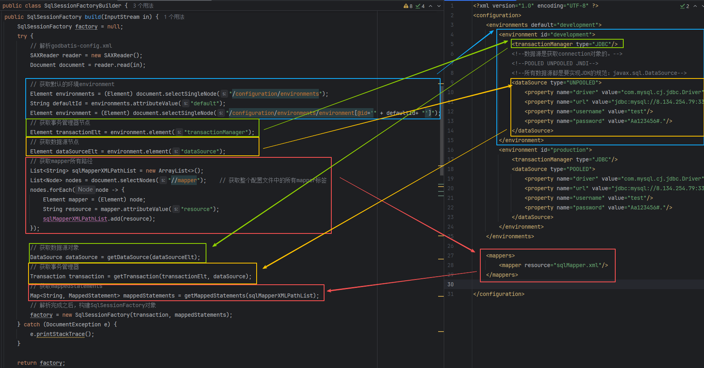


我们再来完善其他方法：

1. 获取数据源对象：

   ```java
   /**
        * 获取数据源对象
        * @param dataSourceElt 数据源标签元素
        * @return
        */
   private DataSource getDataSource(Element dataSourceElt) {
       Map<String, String> map = new HashMap<>();
       // 获取所有的property
       List<Element> propertyElts = dataSourceElt.elements("property");
       propertyElts.forEach(propertyElt -> {
           String name = propertyElt.attributeValue("name");
           String value = propertyElt.attributeValue("value");
           map.put(name, value);
       });
   
       DataSource dataSource = null;
       String type = dataSourceElt.attributeValue("type").trim().toUpperCase();
   
       if (Const.UN_POOLED_DATASOURCE.equals(type)) {
           dataSource = new UnPooledDataSource(map.get("driver"), map.get("url"), map.get("username"), map.get("password"));
       } else if (Const.POOLED_DATASOURCE.equals(type)) {
           dataSource = new PooledDataSource();
       } else if (Const.JNDI_DATASOURCE.equals(type)) {
           dataSource = new JNDIDataSource();
       }
   
       return dataSource;
   }
   ```

   

2. 获取事务管理器对象：

   ```java
   /**
        * 获取事务管理器
        * @param transactionElt 事务管理器标签元素
        * @param dataSource 数据源对象
        * @return
        */
   private Transaction getTransaction(Element transactionElt, DataSource dataSource) {
       Transaction transaction = null;
       String type = transactionElt.attributeValue("type").trim().toUpperCase();
       if (Const.JDBC_TRANSACTION.equals(type)) {
           transaction = new JdbcTransaction(dataSource, false);   // 默认是开启事务的，需要手动提交
       } else if(Const.MANAGED_TRANSACTION.equals(type)){
           transaction = new ManagedTransaction();
       }
       return transaction;
   }
   ```

   

3. 获取MappedStatements字典对象：

   ```java
   /**
        * 解析所有的SqlMapper.xml文件，然后构建Map集合
        * @param sqlMapperXMLPathList
        * @return
        */
   private Map<String, MappedStatement> getMappedStatements(List<String> sqlMapperXMLPathList) {
       Map<String, MappedStatement> mappedStatements = new HashMap<>();
       sqlMapperXMLPathList.forEach(sqlMapperXMLPath -> {
           try {
               SAXReader reader = new SAXReader();
               Document document = reader.read(Resources.getResourceAsStream(sqlMapperXMLPath));
               Element mapper = (Element) document.selectSingleNode("/mapper");
               String namespace = mapper.attributeValue("namespace");
               List<Element> elements = mapper.elements();
               elements.forEach(element -> {
                   String id = element.attributeValue("id");
                   // 对namespace和id进行拼接 生成最终id
                   String sqlId = namespace + "." + id;
                   String resultType = element.attributeValue("resultType");
                   String sql = element.getTextTrim();
                   MappedStatement mappedStatement = new MappedStatement(sql, resultType);
                   mappedStatements.put(sqlId, mappedStatement);
               });
           } catch (DocumentException e) {
               e.printStackTrace();
           }
       });
       return mappedStatements;
   }
   ```


> 注意：我们在上述方法中使用了一些常量，并定义在常亮类中：
>
> ```java
> /**
>  * 整个godbatis框架的常量类
>  */
> public class Const {
>     public static final String UN_POOLED_DATASOURCE = "UNPOOLED";
>     public static final String POOLED_DATASOURCE = "POOLED";
>     public static final String JNDI_DATASOURCE = "JNDI";
> 
>     public static final String JDBC_TRANSACTION = "JDBC";
>     public static final String MANAGED_TRANSACTION = "MANAGED";
> }
> ```


### 5.2.9 阶段测试1及修改

我们引入mysql依赖和junit依赖：

```xml
<!--mysql-->
<dependency>
    <groupId>mysql</groupId>
    <artifactId>mysql-connector-java</artifactId>
    <version>8.0.31</version>
</dependency>
<!--junit-->
<dependency>
    <groupId>junit</groupId>
    <artifactId>junit</artifactId>
    <version>4.13.2</version>
    <scope>test</scope>
</dependency>
```

创建测试类`GodBatisTest`：

```java
public class GodBatisTest {
    @Test
    public void testSqlSessionFactory() throws Exception {
        SqlSessionFactoryBuilder sqlSessionFactoryBuilder = new SqlSessionFactoryBuilder();
        SqlSessionFactory sqlSessionFactory = sqlSessionFactoryBuilder.build(Resources.getResourceAsStream("godbatis-config.xml"));
        System.out.println(sqlSessionFactory);
    }
}
```

调试输出：

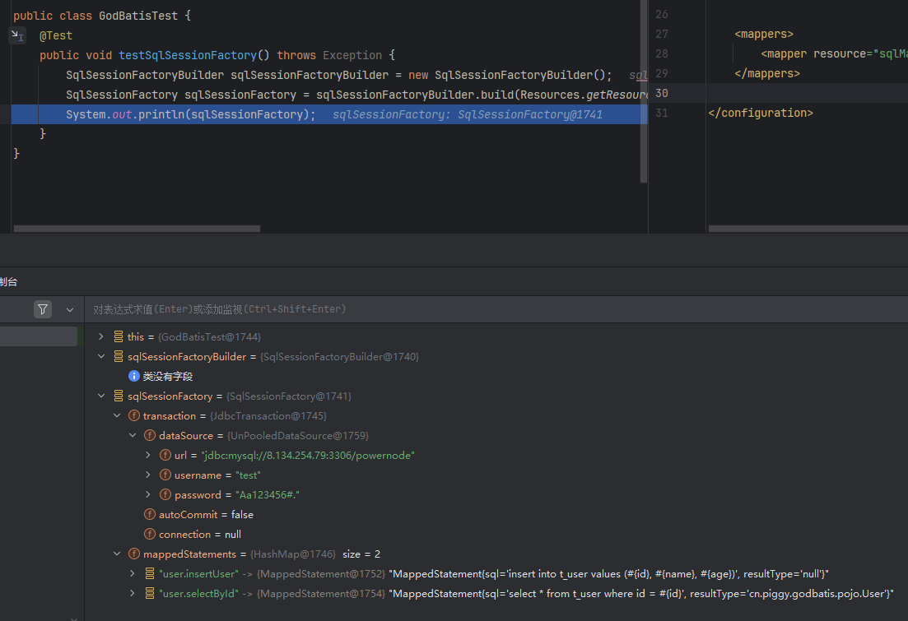


**部分代码需要修改：**

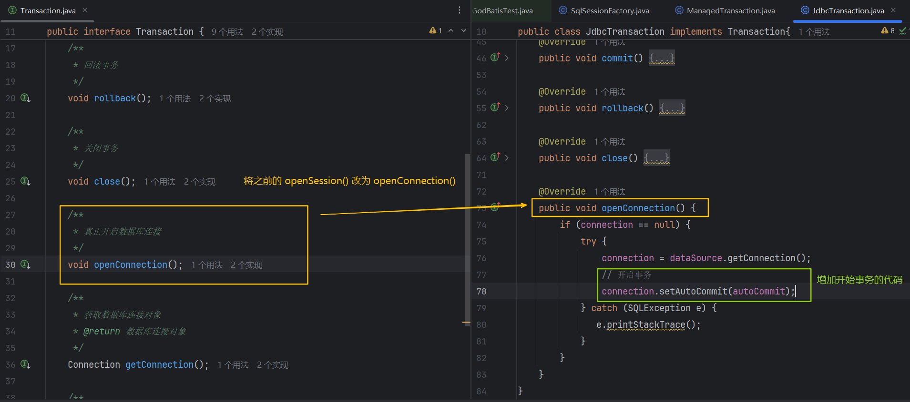


### 5.2.10 封装SqlSession对象

该部分将通过`SqlSessionFactory`类的`openSession()`方法来开启Sql会话，我们先来添加这部分代码：

```java
// SqlSessionFactory类
/**
     * 获取SQL会话对象
     * @return
     */
public SqlSession openSession() {
    // 开启会话的前提是开启连接
    transaction.openConnection();
    // 创建SqlSession对象
    SqlSession sqlSession = new SqlSession(this);

    return sqlSession;
}
```


下面将来完善`SqlSession`类：

```java
/**
 * 专门负责处理SQL语句的会话对象
 */
public class SqlSession {
    private SqlSessionFactory factory;

    public SqlSession(SqlSessionFactory sqlSessionFactory) {
        this.factory = sqlSessionFactory;
    }

    /**
     * 提交事务
     */
    public void commit() {
        factory.getTransaction().commit();
    }

    /**
     * 回滚事务
     */
    public void rollback() {
        factory.getTransaction().rollback();
    }

    /**
     * 关闭事务
     */
    public void close() {
        factory.getTransaction().close();
    }

    /**
     * 执行insert语句，向数据库表当中插入记录
     * @param sqlId sql语句的id
     * @param pojo 插入的数据
     * @return
     */
    public int insert(String sqlId, Object pojo) {
        return null;
    }

    /**
     * 执行查询语句，返回一个对象。该方法只适合返回一条记录的sql语句
     * @param sqlId
     * @param param
     * @return
     */
    public Object selectOne(String sqlId, Object param) {
        return null;
    }
}
```


完善`insert()`方法：

```java
/**
     * 执行insert语句，向数据库表当中插入记录
     * @param sqlId sql语句的id
     * @param pojo 插入的数据
     * @return
     */
public int insert(String sqlId, Object pojo) {
    int count = 0;
    try {
        // JDBC代码，执行insert语句，完成插入操作
        Connection connection = factory.getTransaction().getConnection();
        // insert into t_user values (#{id}, #{name}, #{age})
        String godbatisSql = factory.getMappedStatements().get(sqlId).getSql();
        // insert into t_user values (?, ?, ?)
        String sql = godbatisSql.replaceAll("#\\{[a-zA-Z0-9_$]*}", "?");
        PreparedStatement ps = connection.prepareStatement(sql);
        // 给？占位传值
        // 要点：1.传值数量 2.传值顺序
        // godbatis主要考虑大致实现，类型匹配转换先不做考虑。因此godbatis只使用setString，要求数据库表中字段类型都为varchar
        int fromIndex = 0;  // 查找起始位
        int index = 1;      // 属性顺序下标
        while(true) {
            int jingIndex = godbatisSql.indexOf("#", fromIndex);
            if(jingIndex < 0) {
                break;
            }
            int youKuoHaoIndex = godbatisSql.indexOf("}", fromIndex);
            // 获取属性名
            String propertyName = godbatisSql.substring(jingIndex + 2, youKuoHaoIndex).trim();
            fromIndex = youKuoHaoIndex + 1;

            // 通过反射机制调用相关属性的方法
            String getMethodName = "get" + propertyName.toUpperCase().charAt(0) + propertyName.substring(1);
            Method method = pojo.getClass().getDeclaredMethod(getMethodName);
            Object propertyValue = method.invoke(pojo);

            ps.setString(index, propertyValue.toString());
            index++;	// 下标自增
        }

        // 执行SQL语句
        count = ps.executeUpdate();
    } catch (Exception e) {
        e.printStackTrace();
    }
    return count;
}
```


完善`selectOne()`方法：

```java
/**
     * 执行查询语句，返回一个对象。该方法只适合返回一条记录的sql语句
     * @param sqlId
     * @param param
     * @return
     */
public Object selectOne(String sqlId, Object param) {
    Object object = null;
    try {
        Connection connection = factory.getTransaction().getConnection();
        MappedStatement mappedStatement = factory.getMappedStatements().get(sqlId);
        // sql查询语句
        // select * from t_user where id = #{id}
        String godbatisSql = mappedStatement.getSql();
        String sql = godbatisSql.replaceAll("#\\{[a-zA-Z0-9_$]*}", "?");
        PreparedStatement ps = connection.prepareStatement(sql);

        // 给占位符传值（只考虑只有一个占位符的情况）
        ps.setString(1, param.toString());
        // 查询返回结果集
        ResultSet rs = ps.executeQuery();

        // 获取需要返回的对象类型
        String resultType = mappedStatement.getResultType();
        // 从结果集中取数据，封装java对象
        if (rs.next()) {
            // 获取resultType的Class
            Class<?> resultTypeClass = Class.forName(resultType);
            // 调用无参数构造方法创建对象
            object = resultTypeClass.newInstance(); // Object obj = new User();
            // 给User类的id、name、age属性赋值
            ResultSetMetaData rsmd = rs.getMetaData();  // 获取结果集元数据
            int columnCount = rsmd.getColumnCount();    // 获取元数据的列数量
            for (int i = 0; i < columnCount; i++) {     // 循环列数
                String propertyName = rsmd.getColumnName(i + 1);    // 获取当前列名字
                // 拼接方法名
                String setMethodName = "set" + propertyName.toUpperCase().charAt(0) + propertyName.substring(1);
                // 获取set方法
                Method method = resultTypeClass.getDeclaredMethod(setMethodName, String.class);
                // 调用set方法给对象object属性赋值
                method.invoke(object, rs.getString(propertyName));
            }
        }

    } catch (Exception e) {
        e.printStackTrace();
    }
    return object;
}
```

注意：`getColumName(index)`方法中，`index`从1开始计数。

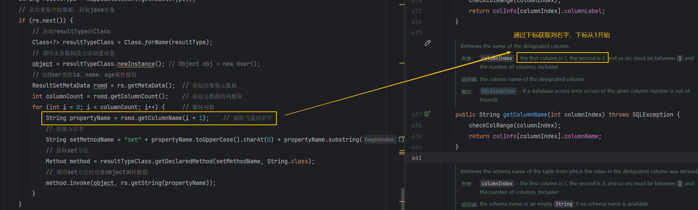


### 5.2.11 阶段测试2

我们测试5.2.10的两个方法是否可用，先准备一张用户表`t_user`，所有字段都为`varchar`类型：

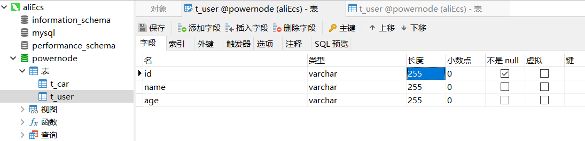


然后新建pojo类`User`：

```java
public class User {
    private String id;
    private String name;
    private String age;

    public User() {
    }

    public User(String id, String name, String age) {
        this.id = id;
        this.name = name;
        this.age = age;
    }

    @Override
    public String toString() {
        return "User{" +
                "id='" + id + '\'' +
                ", name='" + name + '\'' +
                ", age='" + age + '\'' +
                '}';
    }

    public String getId() {
        return id;
    }

    public void setId(String id) {
        this.id = id;
    }

    public String getName() {
        return name;
    }

    public void setName(String name) {
        this.name = name;
    }

    public String getAge() {
        return age;
    }

    public void setAge(String age) {
        this.age = age;
    }
}
```


接下来我们开始测试两个方法：

1. 测试`insert()`：

   ```java
   @Test
   public void testInsertUser() {
       SqlSessionFactoryBuilder sqlSessionFactoryBuilder = new SqlSessionFactoryBuilder();
       SqlSessionFactory sqlSessionFactory = sqlSessionFactoryBuilder.build(Resources.getResourceAsStream("godbatis-config.xml"));
       SqlSession sqlSession = sqlSessionFactory.openSession();
   
       // 执行SQL
       User user = new User("1111", "张三", "28");
       int count = sqlSession.insert("user.insertUser", user);
       System.out.println("影响行数：" + count);
   
       sqlSession.commit();
       sqlSession.close();
   }
   ```

   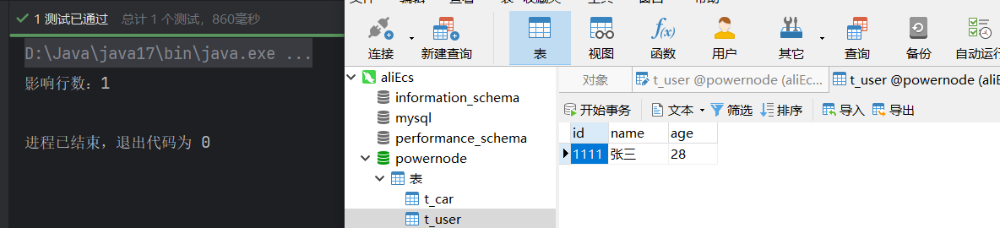

2. 测试`selectOne()`：

   ```java
   @Test
   public void testSelectOne() {
       SqlSessionFactoryBuilder sqlSessionFactoryBuilder = new SqlSessionFactoryBuilder();
       SqlSessionFactory sqlSessionFactory = sqlSessionFactoryBuilder.build(Resources.getResourceAsStream("godbatis-config.xml"));
       SqlSession sqlSession = sqlSessionFactory.openSession();
   
       // 执行SQL
       Object obj = sqlSession.selectOne("user.selectById", "1111");
       System.out.println(obj);
   
       sqlSession.close();
   }
   ```

   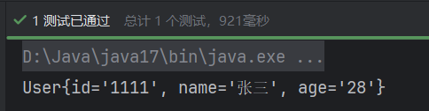


### 5.2.12 打包测试

使用`install`命令给`godbatis`项目打包：

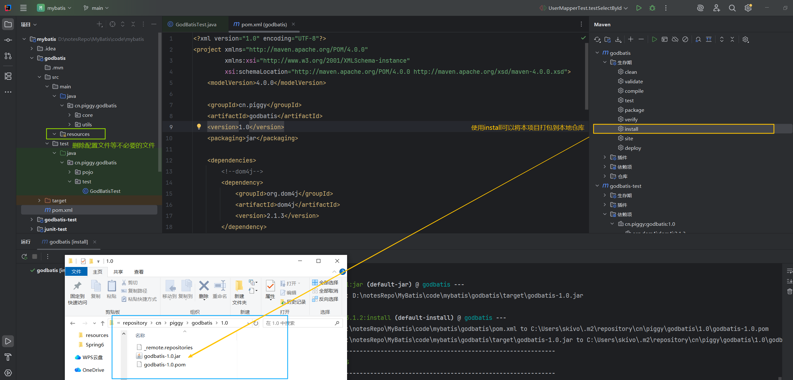

这样可以安装到本地仓库中，其他项目可以直接添加本框架。


新建模块`godbatis-test`，测试功能：

1. 新建项目，并引入依赖：

   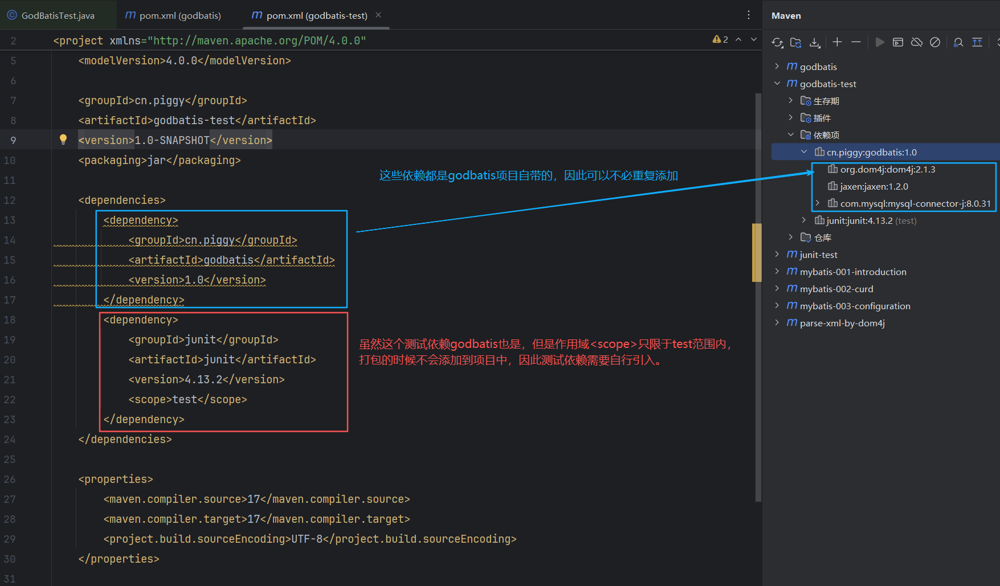

2. 创建配置文件和Mapper文件：

   核心配置文件`godbatis-config.xml`：

   ```xml
   <?xml version="1.0" encoding="UTF-8" ?>
   <configuration>
       <environments default="development">
           <environment id="development">
               <transactionManager type="JDBC"/>
               <dataSource type="UNPOOLED">
                   <property name="driver" value="com.mysql.cj.jdbc.Driver"/>
                   <property name="url" value="jdbc:mysql://8.134.254.79:3306/powernode"/>
                   <property name="username" value="test"/>
                   <property name="password" value="Aa123456#."/>
               </dataSource>
           </environment>
       </environments>
       <mappers>
           <mapper resource="UserMapper.xml"/>
       </mappers>
   </configuration>
   ```

   `UserMapper`映射文件：

   ```xml
   <?xml version="1.0" encoding="UTF-8" ?>
   <mapper namespace="user">
   
       <insert id="insertUser">
           insert into t_user values(#{id}, #{name}, #{age})
       </insert>
   
       <select id="selectById" resultType="cn.piggy.godbatis.pojo.User">
           select * from t_user where id = #{id}
       </select>
   </mapper>
   ```

3. 测试：

   + 插入新的用户：

     ```java
     @Test
     public void testInsertUser() {
         SqlSessionFactoryBuilder sqlSessionFactoryBuilder = new SqlSessionFactoryBuilder();
         SqlSessionFactory sqlSessionFactory = sqlSessionFactoryBuilder.build(Resources.getResourceAsStream("godbatis-config.xml"));
         SqlSession sqlSession = sqlSessionFactory.openSession();
     
         User user = new User("1112", "李四", "30");
         int count = sqlSession.insert("user.insertUser", user);
         System.out.println("影响行数:" + count);
     
         sqlSession.commit();
         sqlSession.close();
     }
     ```

     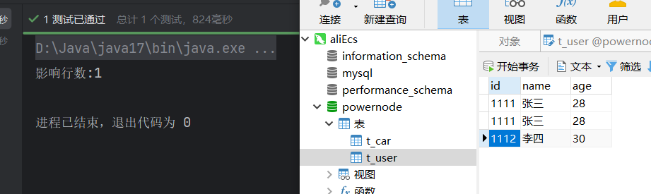

   + 查询刚插入的用户信息：

     ```java
     @Test
     public void testSelectById() {
         SqlSessionFactoryBuilder sqlSessionFactoryBuilder = new SqlSessionFactoryBuilder();
         SqlSessionFactory sqlSessionFactory = sqlSessionFactoryBuilder.build(Resources.getResourceAsStream("godbatis-config.xml"));
         SqlSession sqlSession = sqlSessionFactory.openSession();
     
         Object obj = sqlSession.selectOne("user.selectById", "1112");
         System.out.println(obj);
     
         sqlSession.close();
     }
     ```

     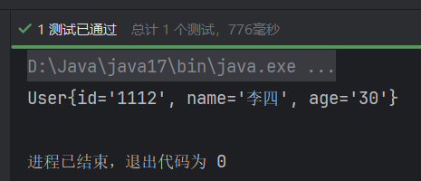


## 5.3 总结MyBatis框架的重要实现原理

思考两个问题：

+ 为什么insert语句中 #{} 里填写的必须是属性名？

  > 因为底层需要通过属性名来生成类属性的获取方法，从而能通过反射机制来获取相关的值并传进去。

+ 为什么select语句查询结果列名要属性名一致？

  > 因为底层需要通过列名来生成类属性的赋值方法，通过反射机制将相应的值赋给对应的属性。如果列名跟属性名不一致，就需要使用关键字`AS`来对列名进行重命名，从而使其能正常被获取并赋值。


# 六、在WEB中应用MyBatis（使用MVC架构模式）

## 6.1 需求描述

**实现功能：**

+ 银行账户转账

**使用技术：**

+ HTML + Servlet + MyBatis

**WEB应用的名称：**

+ bank

**数据库表设计：**

新建`t_act`表：

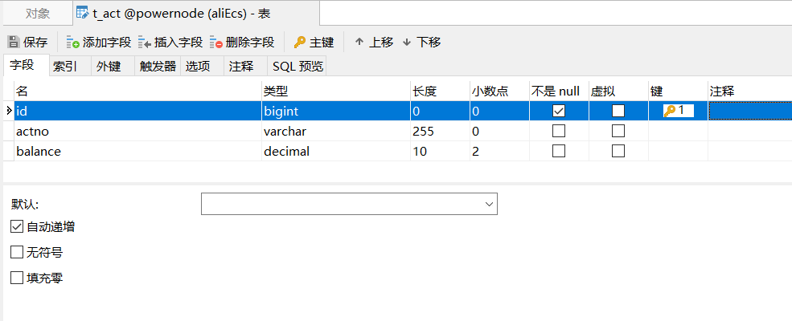


效果图：

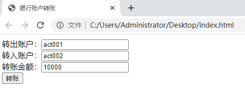

## 6.2 环境搭建

1. 创建Maven WEB项目`mybatis-004-web`，并创建相关目录：

   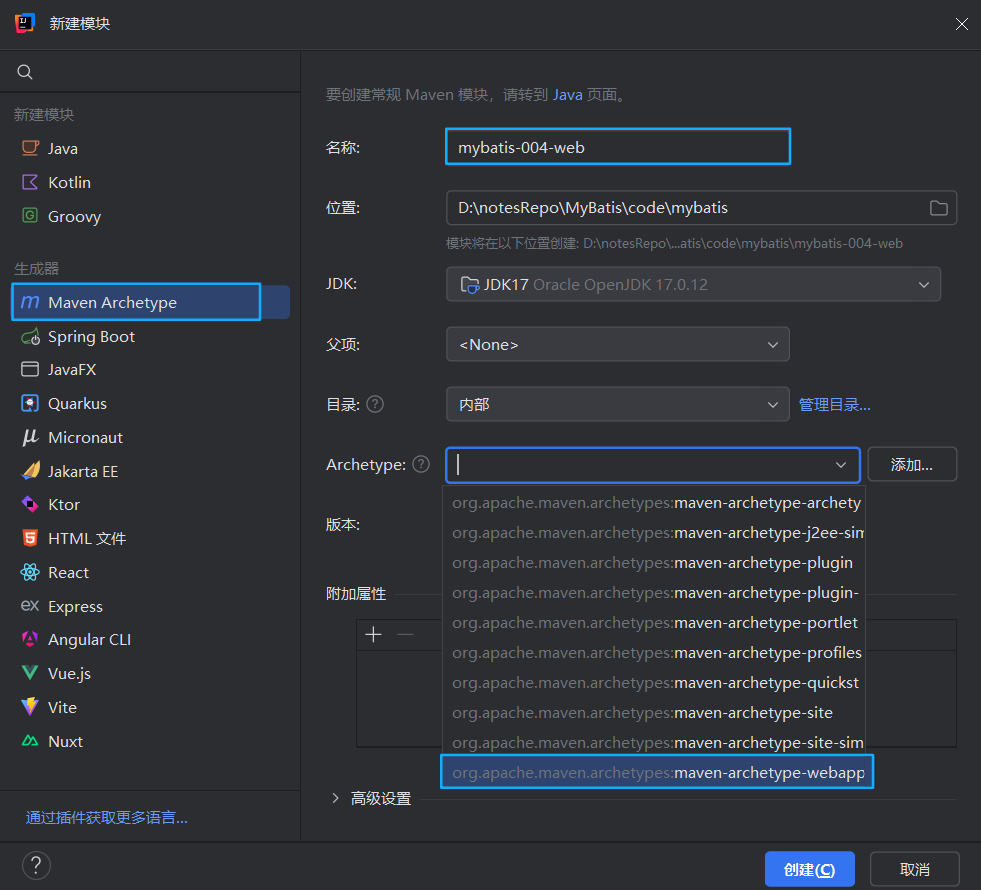

   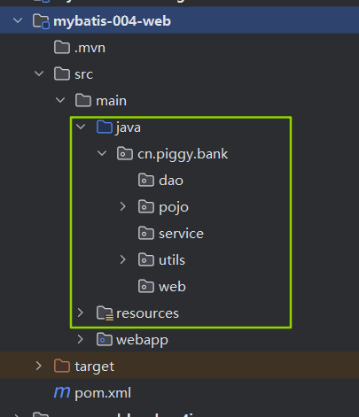

   > 如果有些目录不存在，可以手动创建。

2. 配置tomcat：

   如果没有部署过tomcat，可以直接在官网下载一个9.0版本的tomcat。[tomcat下载]([Apache Tomcat® - Apache Tomcat 9 Software Downloads](https://tomcat.apache.org/download-90.cgi))

   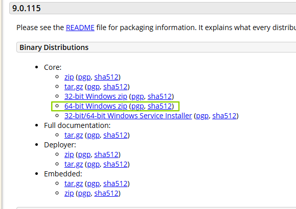

   在IDEA中配置tomcat：

   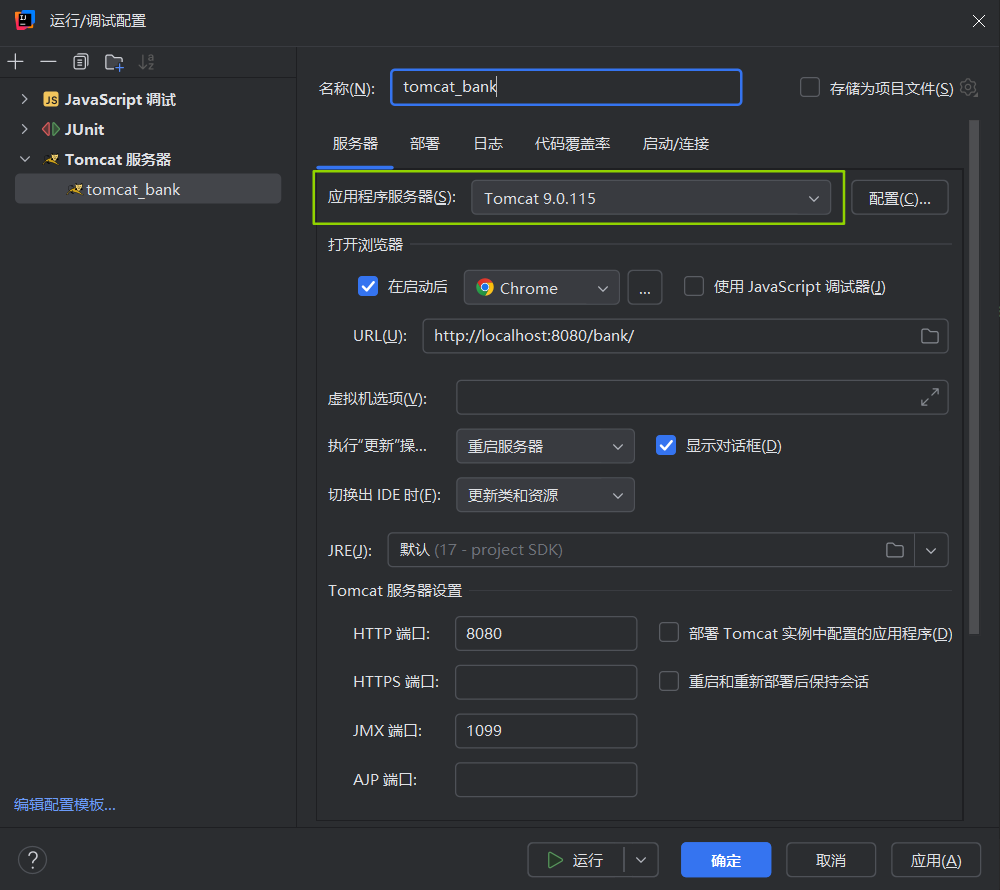

   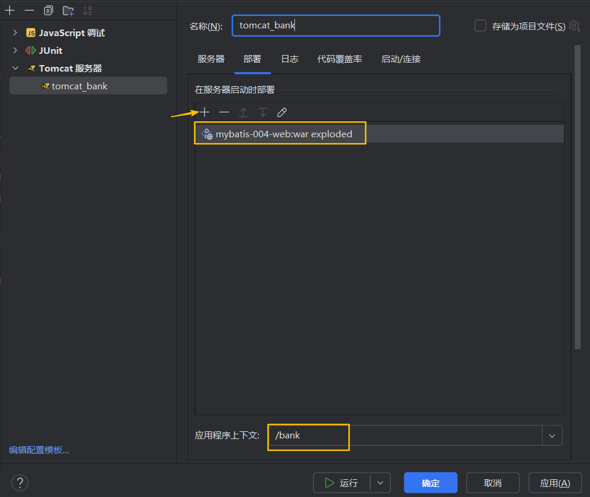

3. 引入pom依赖：

   ```xml
   <project xmlns="http://maven.apache.org/POM/4.0.0" xmlns:xsi="http://www.w3.org/2001/XMLSchema-instance"
            xsi:schemaLocation="http://maven.apache.org/POM/4.0.0 http://maven.apache.org/maven-v4_0_0.xsd">
       <modelVersion>4.0.0</modelVersion>
   
       <groupId>cn.piggy</groupId>
       <artifactId>mybatis-004-web</artifactId>
       <packaging>war</packaging>
       <version>1.0-SNAPSHOT</version>
   
       <name>mybatis-004-web Maven Webapp</name>
       <url>http://maven.apache.org</url>
   
       <dependencies>
           <!--mybatis-->
           <dependency>
               <groupId>org.mybatis</groupId>
               <artifactId>mybatis</artifactId>
               <version>3.5.10</version>
           </dependency>
           <!--mysql-->
           <dependency>
               <groupId>mysql</groupId>
               <artifactId>mysql-connector-java</artifactId>
               <version>8.0.31</version>
           </dependency>
           <!--logback-->
           <dependency>
               <groupId>ch.qos.logback</groupId>
               <artifactId>logback-classic</artifactId>
               <version>1.2.11</version>
           </dependency>
           <!--servlet-->
           <dependency>
               <groupId>javax.servlet</groupId>
               <artifactId>javax.servlet-api</artifactId>
               <version>4.0.1</version>
           </dependency>
       </dependencies>
   
       <build>
           <finalName>mybatis-004-web</finalName>
       </build>
   </project>
   ```

4. 拉取其他完整项目（如`mybatis-003-configuration`）中的资源目录下的文件：

   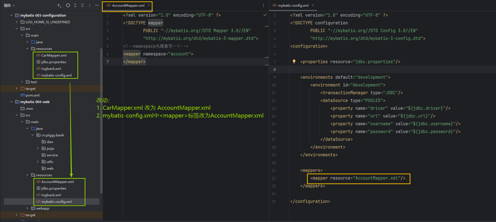

5. 新增pojo类`Account`和utils类`SqlSessionUtil`：

   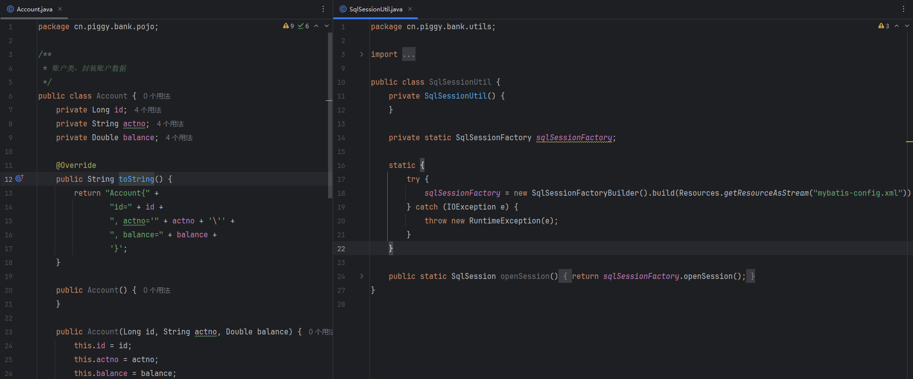


## 6.3 后端代码实现

1. 新建`AccountServlet`类，处理表单数据：

   ```java
   @WebServlet("/transfer")
   public class AccountServlet extends HttpServlet {
   
       // 为了让这个对象在其他方法中也能被使用，因此声明为实例变量
       private AccountService accountService = new AccountServiceImpl();
   
       @Override
       protected void doPost(HttpServletRequest req, HttpServletResponse resp) throws ServletException, IOException {
           // 获取表单数据
           String fromActno = req.getParameter("fromActno");
           String toActno = req.getParameter("toActno");
           double money = Double.parseDouble(req.getParameter("money"));
   
           // 调用service的转账方法完成转账（调业务层）
           try {
               accountService.transfer(fromActno, toActno, money);
               // 此处转账成功，调用View完成展示结果
               resp.sendRedirect(req.getContextPath() + "/success.html");
           } catch (MoneyNotEnoughException e) {
               resp.sendRedirect(req.getContextPath() + "/error1.html");
           } catch (TransferException e) {
               resp.sendRedirect(req.getContextPath() + "/error2.html");
           }
       }
   }
   ```

2. 创建核心业务类`AccountService`及其实现类：

   ```java
   /**
    * 账户业务类
    */
   public interface AccountService {
       /**
        * 账户转账业务
        * @param fromActno 转出账号
        * @param toActno   转入账号
        * @param money 转账金额
        */
       void transfer(String fromActno, String toActno, double money) throws MoneyNotEnoughException, TransferException;
   }
   ```

   ```java
   public class AccountServiceImpl implements AccountService {
   
       private AccountDao accountDao = new AccountDaoImpl();
   
       @Override
       public void transfer(String fromActno, String toActno, double money) throws MoneyNotEnoughException, TransferException {
           // 1. 判断转出账户的余额时候否充足（select)
           Account fromAct = accountDao.selectByActno(fromActno);
           if (fromAct.getBalance() < money) {
               // 2. 如果转出账户余额不足，提示用户
               throw new MoneyNotEnoughException("转出账户余额不足!");
           }
           // 3. 如果转出账户余额充足，更新转出账户余额（update）
           // 先更新内存中对象余额
           Account toAct = accountDao.selectByActno(toActno);
           fromAct.setBalance(fromAct.getBalance() - money);
           toAct.setBalance(toAct.getBalance() + money);
           int count = accountDao.updateByActno(fromAct);
           // 4. 更新转入账户余额（update）
           count += accountDao.updateByActno(toAct);
   
           if (count!=2) {
               throw new TransferException("转账异常，未知原因");
           }
       }
   }
   ```

3. 补充业务层的异常类：

   ```java
   package cn.piggy.bank.exceptions;
   
   /**
    * 余额不足异常
    */
   public class MoneyNotEnoughException extends Exception {
       public MoneyNotEnoughException() {
       }
   
       public MoneyNotEnoughException(String message) {
           super(message);
       }
   }
   ```

   ```java
   package cn.piggy.bank.exceptions;
   
   public class TransferException extends Exception {
       public TransferException(String message) {
           super(message);
       }
   
       public TransferException() {
       }
   }
   ```

4. 创建数据访问类`AccountDao`及其实现类：

   ```java
   /**
    * 账户的DAO对象，负责t_act表中数据的CRUD
    */
   public interface AccountDao {
       /**
        * 根据账号查询账户信息
        * @param actno 账号
        * @return  账户信息
        */
       Account selectByActno(String actno);
   
       /**
        * 更新账户信息
        * @param act   被更新的账户对象
        * @return  1表示更新成功，其他值表示失败
        */
       int updateByActno(Account act);
   
   }
   ```

   ```java
   public class AccountDaoImpl implements AccountDao {
       @Override
       public Account selectByActno(String actno) {
           SqlSession sqlSession = SqlSessionUtil.openSession();
           Account account = (Account) sqlSession.selectOne("account.selectByActno", actno);
           sqlSession.close();
           return account;
       }
   
       @Override
       public int updateByActno(Account act) {
           SqlSession sqlSession = SqlSessionUtil.openSession();
           int count = sqlSession.update("account.updateByActno", act);
           sqlSession.commit();
           sqlSession.close();
           return count;
       }
   }
   ```

5. 完善Mapper映射文件

   ```xml
   <?xml version="1.0" encoding="UTF-8" ?>
   <!DOCTYPE mapper
           PUBLIC "-//mybatis.org//DTD Mapper 3.0//EN"
           "http://mybatis.org/dtd/mybatis-3-mapper.dtd">
   <!--namespace先随意写一个-->
   <mapper namespace="account">
   
       <select id="selectByActno" resultType="cn.piggy.bank.pojo.Account">
           select * from t_act where actno = #{actno}
       </select>
   
       <update id="updateByActno">
           update t_act set balance = #{balance} where actno = #{actno}
       </update>
   
   </mapper>
   ```


## 6.4 运行测试

首先要使servlet注解生效：

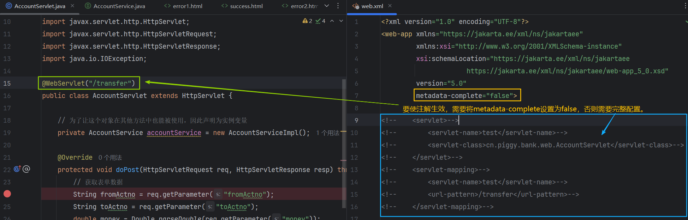

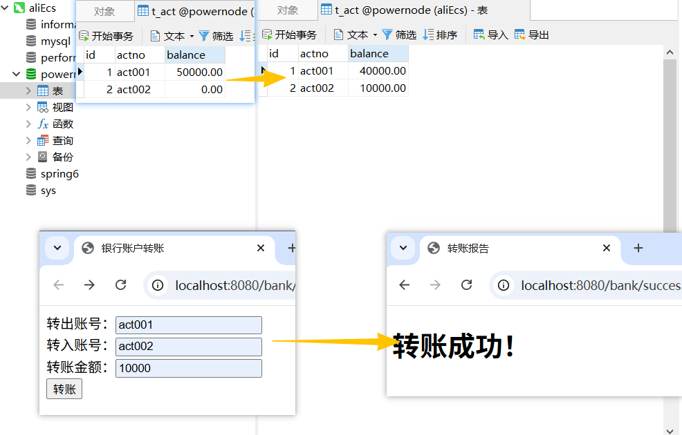

测试转账成功的情况，其他情况自行测试。


## 6.5 添加事务管理

### 6.5.1 转账异常演示

如果我们在两次转张之间出现了异常报错，转账没有成功，但是相应的数据库操作已经被提交，则会出现金额对不上的情况。

1. 添加一下异常及捕获代码：

   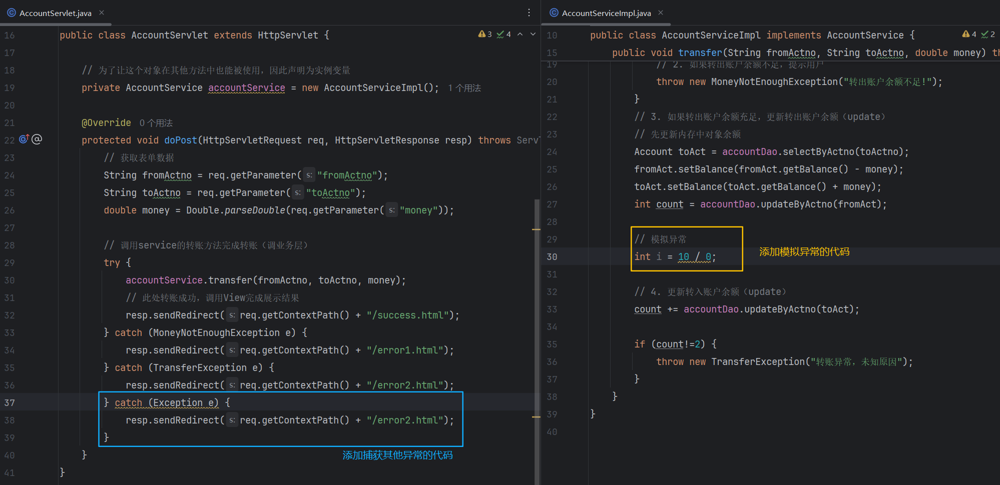

2. 执行测试：

   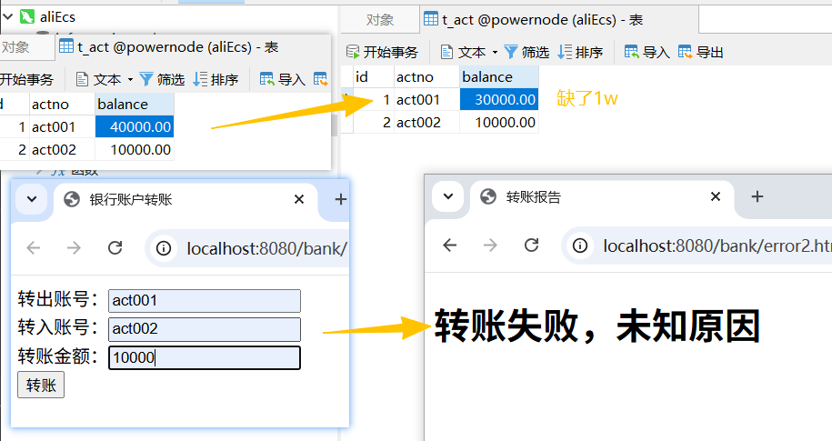


测试发现转账失败，但是金额对不上，主要还是缺少事务控制，两次操作数据库都是获取的不同连接，因此没办法对其进行事务控制。

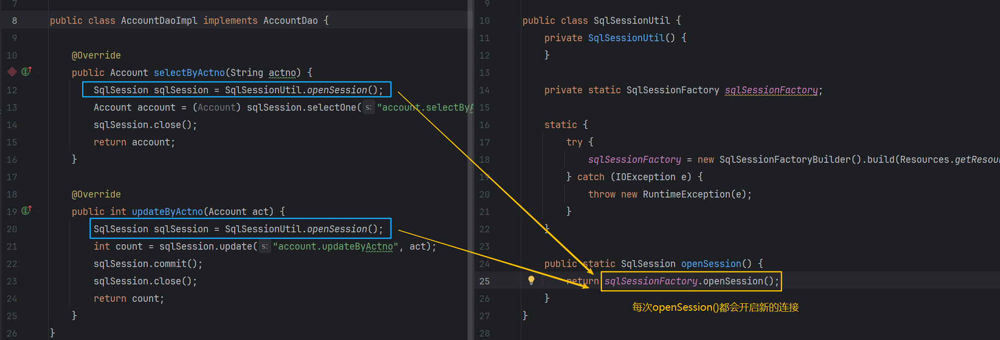


### 6.5.2 添加事务管理

因此我们需要添加一些事务管理代码。

1. 修改`SqlSessionUtil`代码，添加ThreadLocal变量：

   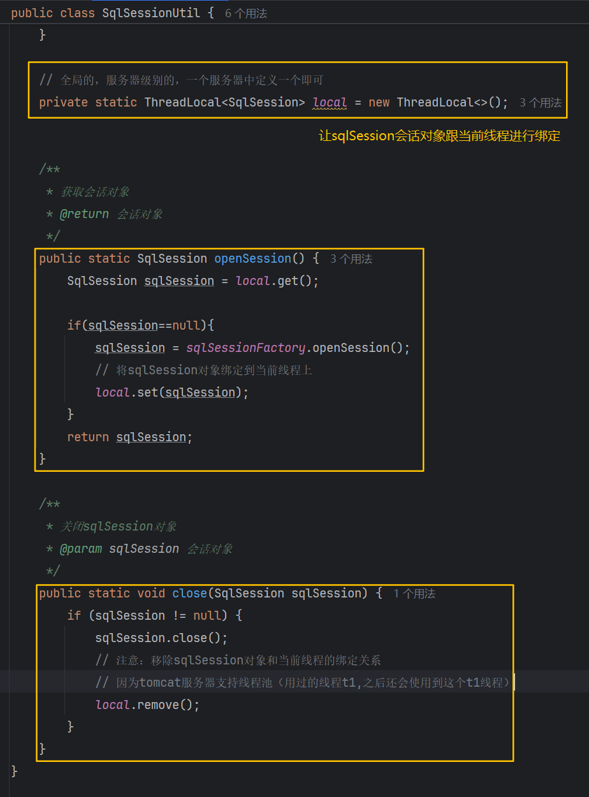

2. 注释掉`AccountDaoImpl`中关于事务管理的代码：

   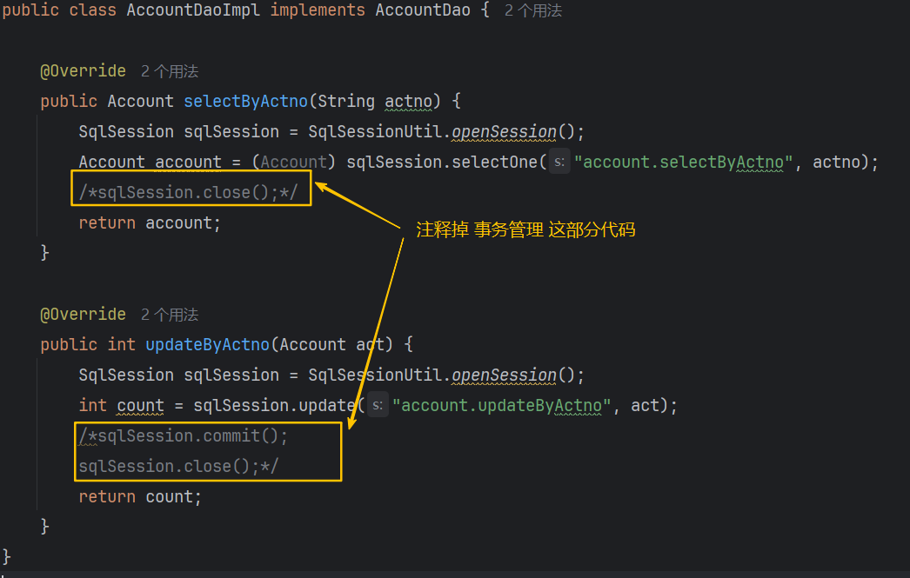

3. 在业务层添加事务管理的代码：

   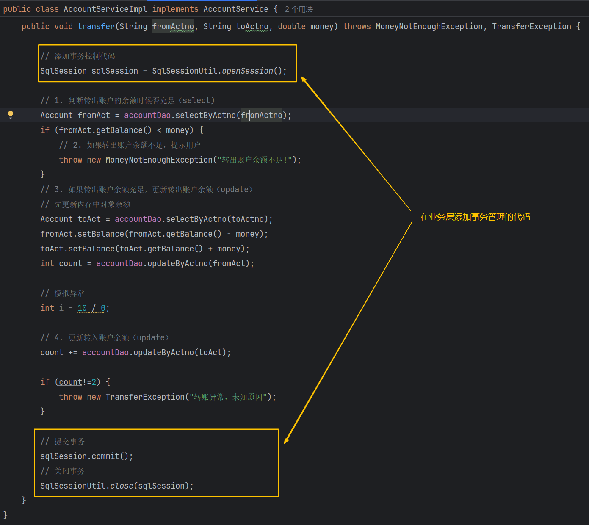

   

4. 运行测试：转账异常，事务不会提交，数据库金额还是没有变化的。

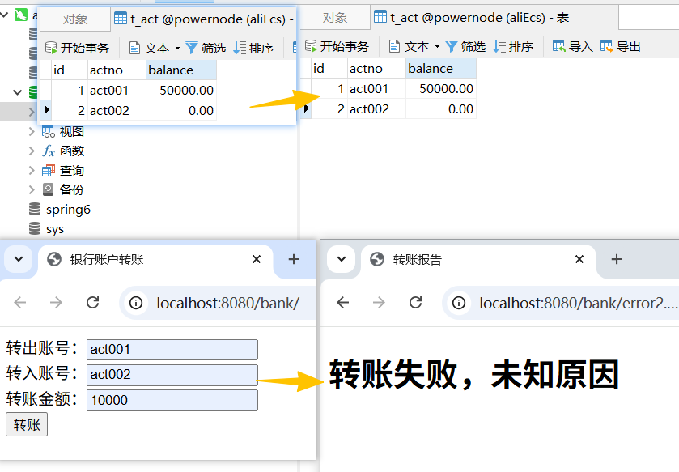


> 手撕ThreadLocal：


## 6.6 MyBatis核心对象的作用域

#### SqlSessionFactoryBuilder

<font style="color:rgb(51, 51, 51);">这个类可以被实例化、使用和丢弃，一旦创建了 SqlSessionFactory，就不再需要它了。 因此 SqlSessionFactoryBuilder 实例的最佳作用域是方法作用域（也就是局部方法变量）。 你可以重用 SqlSessionFactoryBuilder 来创建多个 SqlSessionFactory 实例，但最好还是不要一直保留着它，以保证所有的 XML 解析资源可以被释放给更重要的事情。</font>

#### SqlSessionFactory

<font style="color:rgb(51, 51, 51);">SqlSessionFactory 一旦被创建就应该在应用的运行期间一直存在，没有任何理由丢弃它或重新创建另一个实例。 使用 SqlSessionFactory 的最佳实践是在应用运行期间不要重复创建多次，多次重建 SqlSessionFactory 被视为一种代码“坏习惯”。因此 SqlSessionFactory 的最佳作用域是应用作用域。 有很多方法可以做到，最简单的就是使用单例模式或者静态单例模式。</font>

#### SqlSession

每个线程都应该有它自己的 SqlSession 实例。SqlSession 的实例不是线程安全的，因此是不能被共享的，所以它的最佳的作用域是请求或方法作用域。 绝对不能将 SqlSession 实例的引用放在一个类的静态域，甚至一个类的实例变量也不行。 也绝不能将 SqlSession 实例的引用放在任何类型的托管作用域中，比如 Servlet 框架中的 HttpSession。 如果你现在正在使用一种 Web 框架，考虑将 SqlSession 放在一个和 HTTP 请求相似的作用域中。 换句话说，每次收到 HTTP 请求，就可以打开一个 SqlSession，返回一个响应后，就关闭它。 这个关闭操作很重要，为了确保每次都能执行关闭操作，你应该把这个关闭操作放到 finally 块中。 下面的示例就是一个确保 SqlSession 关闭的标准模式：

```java
try (SqlSession session = sqlSessionFactory.openSession()) {
    // 你的应用逻辑代码
}
```


# 七、使用javassist生成类

我们可以看到这个dao实现类中的方法代码很固定，基本上就是一行代码，通过`SqlSession`对象调用`insert`、`delete`、`update`、`select`等方法，这个类中的方法没有任何业务逻辑，既然是这样，这个类我们可以让其动态生成。

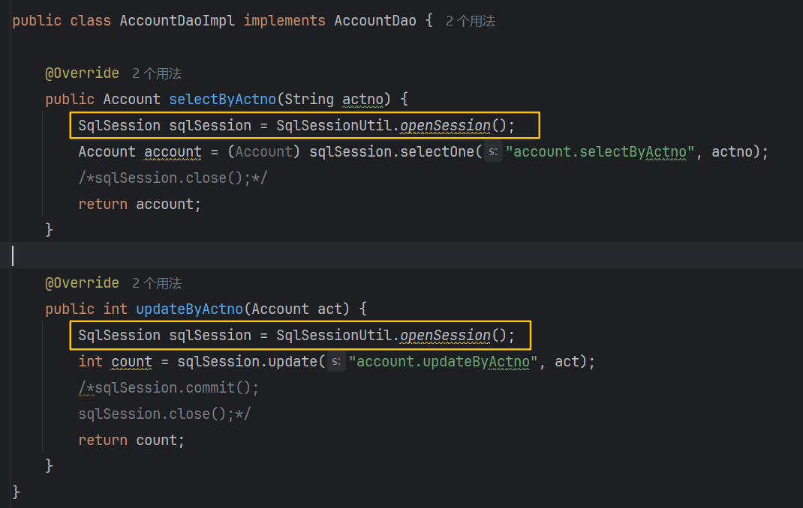


使用Javassist，来自百度百科的介绍：

> Javassist是一个开源的分析、编辑和创建Java字节码的类库。是由东京工业大学的数学和计算机科学系的 Shigeru Chiba （千叶 滋）所创建的。它已加入了开放源代码JBoss 应用服务器项目，通过使用Javassist对字节码操作为JBoss实现动态"AOP"框架。


## 7.1 Javassist的使用

1. 创建maven项目`javassist-test`，并引入pom依赖：

   ```xml
   <dependencies>
       <!--javassist依赖-->
       <dependency>
           <groupId>org.javassist</groupId>
           <artifactId>javassist</artifactId>
           <version>3.29.1-GA</version>
       </dependency>
       <!--junit依赖-->
       <dependency>
           <groupId>junit</groupId>
           <artifactId>junit</artifactId>
           <version>4.13.2</version>
           <scope>test</scope>
       </dependency>
   </dependencies>
   ```

2. 编写类生成代码：

   ```java
   public class JavassistTest {
       @Test
       public void testGenerateFirstClass() throws Exception {
           // 获取类池，这个类池就是用来生成class的
           ClassPool pool = ClassPool.getDefault();
           // 制造类（需要告知类名）
           CtClass ctClass = pool.makeClass("cn.piggy.bank.dao.impl.AccountDaoImpl");
           // 制造方法
           String methodCode = "public void insert() {System.out.println(123);}";
           CtMethod ctMethod = CtMethod.make(methodCode, ctClass);
           // 将方法添加到类中
           ctClass.addMethod(ctMethod);
           // 在内存中生成class
           ctClass.toClass();
   
           // 类加载到JVM中，返回AccountDaoImpl类的字节码文件
           Class<?> clazz = Class.forName("cn.piggy.bank.dao.impl.AccountDaoImpl");
           // 创建对象
           Object obj = clazz.newInstance();
           // 获取AccountDaoImpl中的insert方法
           Method insertMethod = clazz.getDeclaredMethod("insert");
           // 调用方法insert
           insertMethod.invoke(obj);
       }
   }
   ```

3. 运行前要添加两个参数（否则在JDK>8环境下会报错）：

   > + --add-opens java.base/java.lang=ALL-UNNAMED
   > + --add-opens java.base/sun.net.util=ALL-UNNAMED

   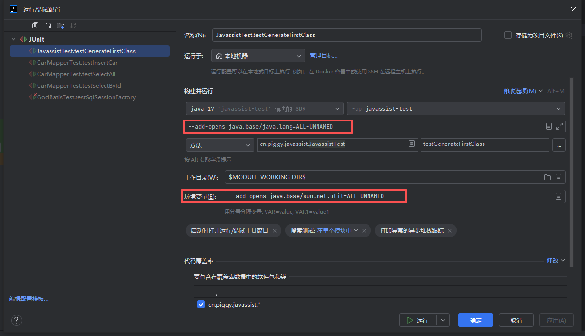

4. 执行测试：

   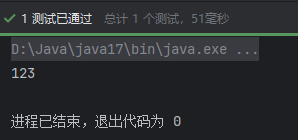


## 7.2 生成DaoImpl类

我们使用javassist来生成DaoImpl类：

1. 创建接口类`AccountDao`:

   ```java
   package cn.piggy.bank.dao;
   
   public interface AccountDao {
       void delete();
   }
   ```

2. 编写生成实现类的测试代码：

   ```java
   @Test
   public void testGenerateImpl() throws Exception {
       // 获取类池
       ClassPool pool = ClassPool.getDefault();
       // 制造类
       CtClass ctClass = pool.makeClass("cn.piggy.bank.dao.impl.AccountDaoImpl");
       // 制造接口
       CtClass ctInterface = pool.makeInterface("cn.piggy.bank.dao.AccountDao");
       // 添加接口到类中
       ctClass.addInterface(ctInterface);  // AccountDaoImpl implements AccountDao
       // 实现接口中的方法
       // 制造方法
       CtMethod ctMethod = CtMethod.make("public void delete() {System.out.println(\"hello delete!\");}", ctClass);
       // 将方法添加到类中
       ctClass.addMethod(ctMethod);
   
       // 在内存中生成类，同时将生成的类加载到JVM中
       Class<?> clazz = ctClass.toClass();
       AccountDao accountDao = (AccountDao) clazz.newInstance();
       accountDao.delete();
   }
   ```

   > 记得要配置两个命令参数：
   >
   > 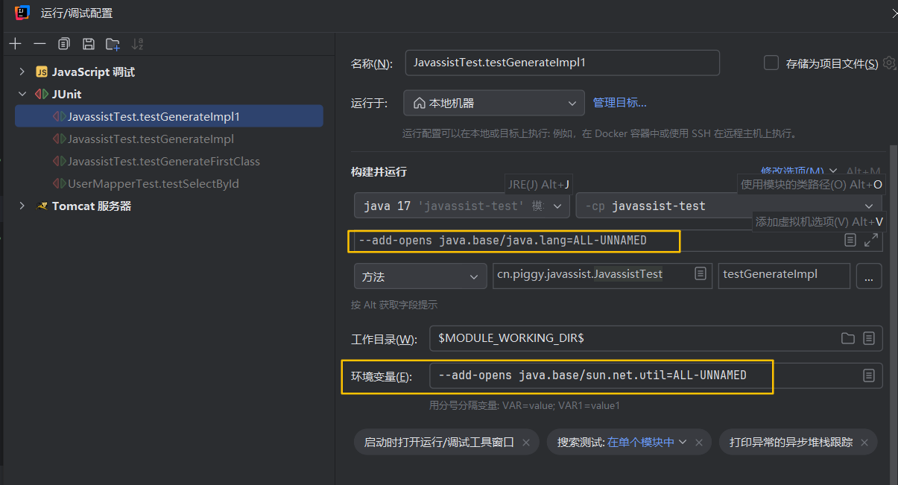

3. 运行测试：

   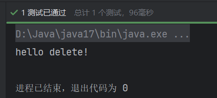

   


## 7.3 根据Dao接口类生成DaoImpl类

7.2中我们只生成了固定的方法的实现类，现在提供一个Dao层的接口类，里面提供一些方法，要根据这些方法来动态生成相应的实现类：

1. 创建一个Dao接口类`AccountDao`：

   ```java
   package cn.piggy.bank.dao;
   
   public interface AccountDao {
       void delete();
       int insert(String actno);
       int update(String actno, Double balance);
       String selectByActno(String actno);
   }
   ```

2. 编写生成的测试方法：

   ```java
   @Test
   public void testGenerateAccountDaoImpl() throws Exception {
       // 制造类池
       ClassPool pool = ClassPool.getDefault();
       // 制造类
       CtClass ctClass = pool.makeClass("cn.piggy.bank.dao.impl.AccountDaoImpl");
       // 制造接口
       CtClass ctInterface = pool.makeInterface("cn.piggy.bank.dao.AccountDao");
       // 实现接口
       ctClass.addInterface(ctInterface);
       // 实现接口中所有的方法
       // 获取接口中所有方法
       Method[] methods = AccountDao.class.getDeclaredMethods();
       Arrays.stream(methods).forEach(method -> {
           // method是接口中的抽象方法
           // 把method抽象方法给实现了
           try{
               // public void delete() {}
               // public int update(String actno, Double balance) {}
               StringBuilder methodCode = new StringBuilder();
               methodCode.append("public ");   // 追加修饰符列表
               methodCode.append(method.getReturnType().getName());    // 追加返回值类型
               methodCode.append(" ");
               methodCode.append(method.getName());    // 追加方法名
               methodCode.append("(");
               // 拼接参数 String actno, Double balance
               Class<?>[] parameterTypes = method.getParameterTypes();	// 获取所有参数
               for (int i = 0; i < parameterTypes.length; i++) {
                   Class<?> parameterType = parameterTypes[i];	// 获取当前参数类型
                   methodCode.append(parameterType.getName());	// 追加参数类型
                   methodCode.append(" ");
                   methodCode.append("arg" + i);				// 追加参数名称 按顺序以arg+i命名
                   if(i != parameterTypes.length - 1){
                       methodCode.append(",");
                   }
               }
               methodCode.append("){System.out.println(11111);");
               // 动态添加return语句
               String returnTypeSimpleName = method.getReturnType().getSimpleName();	// 获取返回参数简单名
               if ("void".equals(returnTypeSimpleName)) {
   
               } else if("int".equals(returnTypeSimpleName)){
                   methodCode.append("return 1;");
               } else if("String".equals(returnTypeSimpleName)){
                   methodCode.append("return \"hello\";");
               }
               methodCode.append("}");
               System.out.println(methodCode);
               CtMethod ctMethod = CtMethod.make(methodCode.toString(), ctClass);
               ctClass.addMethod(ctMethod);
           } catch (Exception e) {
               e.printStackTrace();
           }
       });
       // 在内存中生成class,并且加载到JVM当中
       Class<?> clazz = ctClass.toClass();
       // 创建对象
       AccountDao accountDao = (AccountDao) clazz.newInstance();
       // 调用方法
       accountDao.insert("aaa");
       accountDao.delete();
       accountDao.update("aaa", 1000.0);
       accountDao.selectByActno("aaa");
   }
   ```

3. 运行测试：

   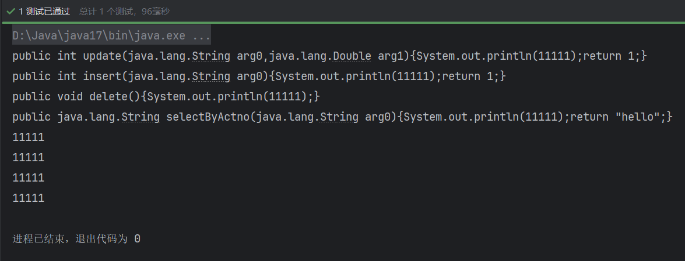


## 7.4 在项目中使用生成工具类

通过上面的例子我们大概了解了通过javassist动态生成实现类的方法，下面我们将在之前的项目`mybatis-004-web`中创建一个工具类，用于通过dao接口类来生成其实现类：

1. 创建动态生成Dao的实现类`GenerateDaoProxy`：

   ```java
   /**
    * 工具类：可以动态生成DAO的实现类（可以动态生成DAO的代理类）
    */
   public class GenerateDaoProxy {
   
       /**
        * 生成DAO接口实现类，并且将实现类的对象创建并返回。
        * @param daoInterface dao接口
        * @return dao接口实现类的实例化对象
        */
       public static Object generate(SqlSession sqlSession, Class daoInterface) {
           // 类池
           ClassPool pool = ClassPool.getDefault();
           // 制造类（cn.piggy.bank.dao.AccountDao -> cn.piggy.bank.dao.AccountDaoProxy）
           CtClass ctClass = pool.makeClass(daoInterface.getName() + "Proxy"); // 本质上就是在内存中动态生成要给代理类
           // 制造接口
           CtClass ctInterface = pool.makeInterface(daoInterface.getName());
           // 实现接口
           ctClass.addInterface(ctInterface);
           // 实现接口中所有方法
           Method[] methods = daoInterface.getDeclaredMethods();
           Arrays.stream(methods).forEach(method -> {
               // method是接口中的抽象方法
               // 将method这个抽象方法进行实现(拼接方法)
               try {
                   // Account selectByActno(String actno);
                   // public  Account selectByActno(String actno) {代码}
                   StringBuilder methodCode = new StringBuilder();
                   methodCode.append("public ");
                   methodCode.append(method.getReturnType().getName());
                   methodCode.append(" ");
                   methodCode.append(method.getName());
                   methodCode.append("(");
                   // 需要方法的形参列表
                   Class<?>[] parameterTypes = method.getParameterTypes();
                   for (int i = 0; i < parameterTypes.length; i++) {
                       Class<?> parameterType = parameterTypes[i];
                       methodCode.append(parameterType.getName());
                       methodCode.append(" ");
                       methodCode.append("arg" + i);
                       if (i != parameterTypes.length - 1) {
                           methodCode.append(",");
                       }
                   }
                   methodCode.append(")");
                   methodCode.append("{");
                   // 需要方法体中的代码（里面的类需要全限定名）
                   methodCode.append("org.apache.ibatis.session.SqlSession sqlSession = cn.piggy.bank.utils.SqlSessionUtil.openSession();");
                   // 需要知道是什么类型的SQL语句
                   /**
                    * sql语句的id是框架使用这提供的，具有多变性。对于框架开发者来说，这个是没办法知道的。
                    * 因此为了能正常获取到使用者编写的SQL语句细节，开发者对框架进行一个规定：
                    * 凡是使用GenerateDaoProxy机制的，sqlId不能随便写：namespace必须是dao接口的全限定名，id必须是dao接口的方法名。
                    */
                   String sqlId = daoInterface.getName() + "." + method.getName();
                   // 获取SQL语句的类型
                   SqlCommandType sqlCommandType = sqlSession.getConfiguration().getMappedStatement(sqlId).getSqlCommandType();
                   switch(sqlCommandType) {
                       case INSERT:
                           break;
                       case DELETE:
                           break;
                       case UPDATE:
                           methodCode.append("return sqlSession.update(\"" + sqlId +"\", arg0);");
                           break;
                       case SELECT:
                           methodCode.append("return (" + method.getReturnType().getName() + ") sqlSession.selectOne(\"" + sqlId + "\", arg0);");
                           break;
                       default:
                           break;
                   }
   
                   methodCode.append("}");
   
                   CtMethod ctMethod = CtMethod.make(methodCode.toString(), ctClass);
                   ctClass.addMethod(ctMethod);
               } catch (Exception e) {
                   e.printStackTrace();
               }
           });
           // 创建对象
           Object obj = null;
           try {
               Class<?> clazz = ctClass.toClass();
               obj = clazz.newInstance();
           } catch (Exception e) {
               e.printStackTrace();
           }
           return obj;
       }
   }
   ```

   注意1：mybatis内部已经封装了javassist

   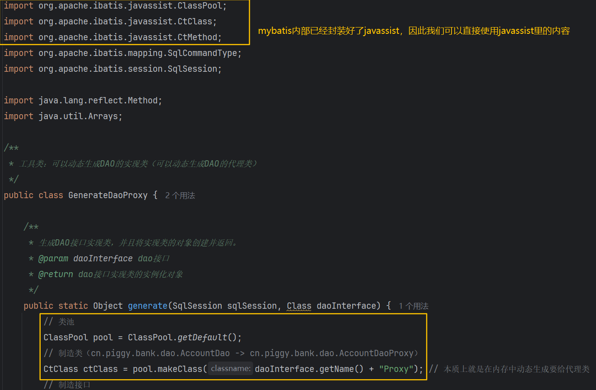

   注意2：sqlId比如是全限定名的namespace + dao接口的id：

   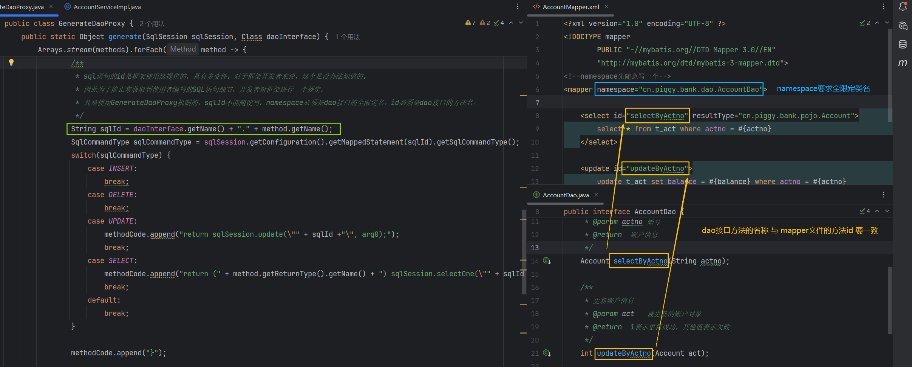

2. 修改一下业务类`AccountServiceImpl`：

   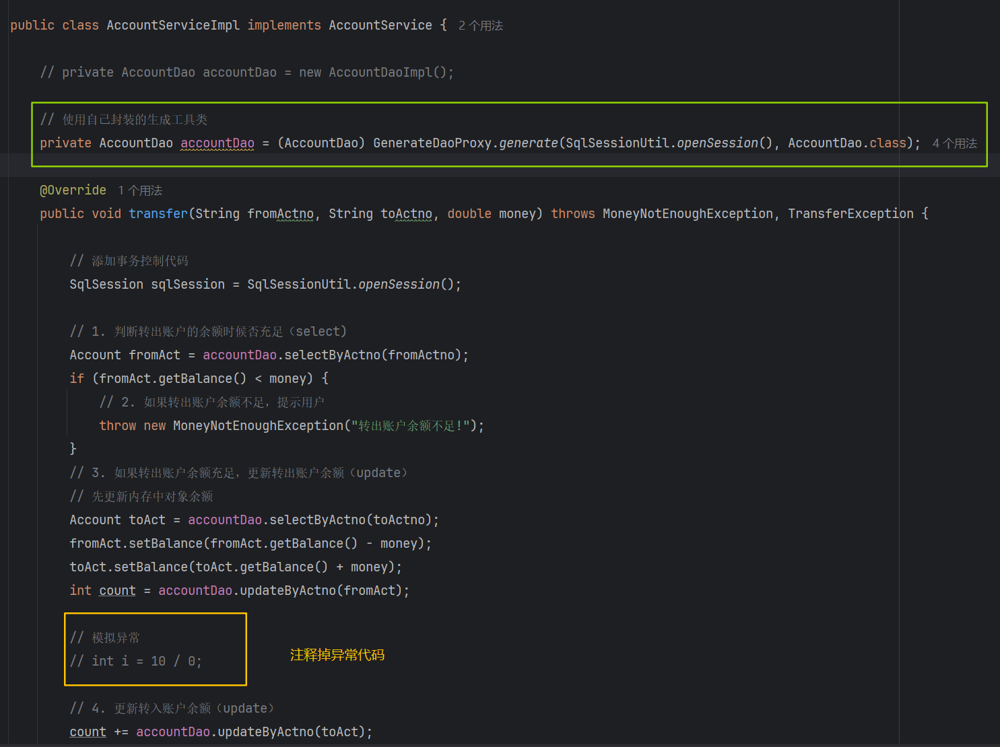

3. 运行测试

   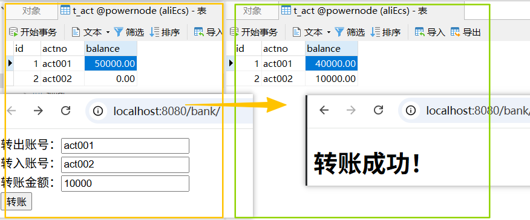


# 八、MyBatis中接口代理机制及使用

## 8.1 接口代理机制及使用

实际上，我们上述封装的生成工具类，在mybatis中已经提供了相关的机制，可以动态生成dao接口的实现类。

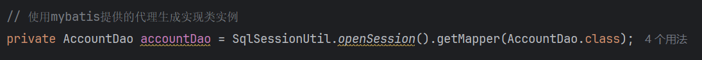


mybatis采用了代理模式，在内存中生成dao接口的代理类，然后创建代理类的实例。

使用mybatis的这个代理机制的前提与我们封装的生成工具类一样：

+ Mapper映射文件中`namespace`必须是dao接口的全限定类名
+ id必须是dao接口的方法名

本质上是通过会话对象获取接口类信息来创建实现类对象：

```java
AccountDao accountDao = sqlSession.getMapper(AccountDao.class);
```


在项目`mybatis-004-web`中测试结果与上面一致。


## 8.2 项目演示

1. 创建新项目`mybatis-005-curd2`，并引入依赖：

   ```xml
   <dependencies>
       <dependency>
           <groupId>org.mybatis</groupId>
           <artifactId>mybatis</artifactId>
           <version>3.5.10</version>
       </dependency>
       <dependency>
           <groupId>mysql</groupId>
           <artifactId>mysql-connector-java</artifactId>
           <version>8.0.31</version>
       </dependency>
       <dependency>
           <groupId>junit</groupId>
           <artifactId>junit</artifactId>
           <version>4.13.2</version>
           <scope>test</scope>
       </dependency>
       <dependency>
           <groupId>ch.qos.logback</groupId>
           <artifactId>logback-classic</artifactId>
           <version>1.2.11</version>
       </dependency>
   </dependencies>
   ```

2. 补充资源`resource`文件，以及补充pojo类`Car`和工具类`SqlSessionUtil`（从其他项目拉取过来）：

   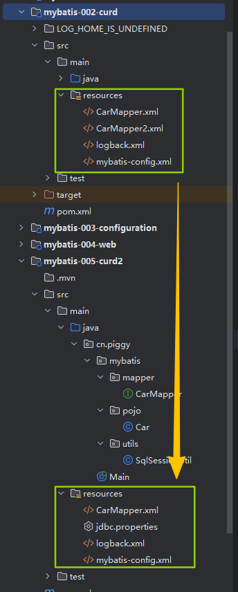

   主要看核心配置文件和mapper文件：

   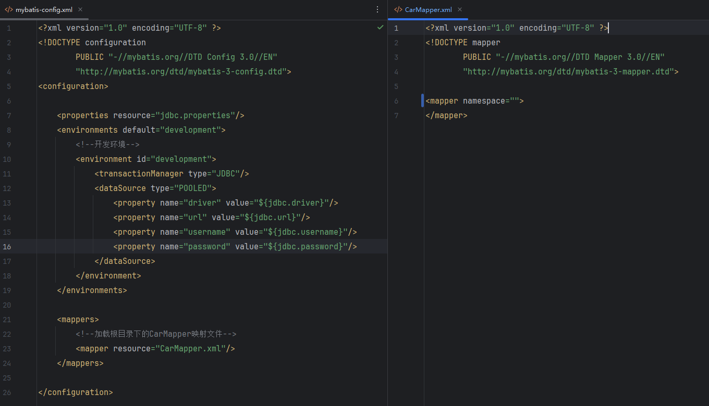

3. 添加接口类`CarMapper`：

   > 使用mybatis时，可以将Dao接口类命名改为Mapper接口类命名，如CarDao.class -> CarMapper.class，本质上是一致的，为了规范还是改一下。

   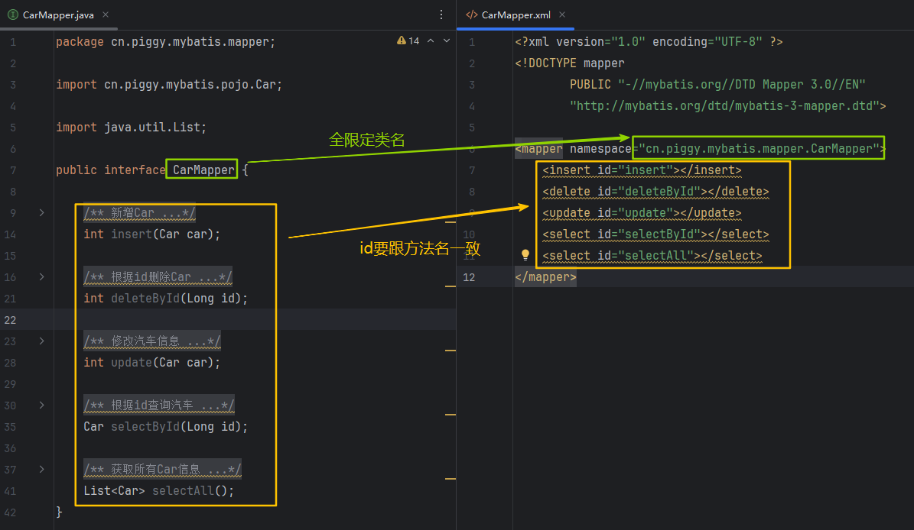

4. 完善映射文件`CarMapper.xml`：

   ```xml
   <?xml version="1.0" encoding="UTF-8" ?>
   <!DOCTYPE mapper
           PUBLIC "-//mybatis.org//DTD Mapper 3.0//EN"
           "http://mybatis.org/dtd/mybatis-3-mapper.dtd">
   
   <mapper namespace="cn.piggy.mybatis.mapper.CarMapper">
       <insert id="insert">
           insert into t_car values(null, #{carNum}, #{brand}, #{guidePrice}, #{produceTime}, #{carType})
       </insert>
   
       <delete id="deleteById">
           delete from t_car where id = #{id}
       </delete>
   
       <update id="update">
           update t_car set car_num=#{carNum}, brand=#{brand},guide_price=#{guidePrice},
           produce_time=#{produceTime}, car_type=#{carType} where id = #{id}
       </update>
   
       <select id="selectById" resultType="cn.piggy.mybatis.pojo.Car">
           select
           id,
           car_num as carNum,
           brand,
           guide_price as guidePrice,
           produce_time as produceTime,
           car_type as carType
           from t_car where id = #{id}
       </select>
   
       <select id="selectAll" resultType="cn.piggy.mybatis.pojo.Car">
           select
           id,
           car_num as carNum,
           brand,
           guide_price as guidePrice,
           produce_time as produceTime,
           car_type as carType
           from t_car
       </select>
   </mapper>
   ```

5. 编写测试程序：

   ```java
   public class CarMapperTest {
       @Test
       public void testInsert() {
           SqlSession sqlSession = SqlSessionUtil.openSession();
           // 面向接口，获取接口的代理对象
           CarMapper mapper = sqlSession.getMapper(CarMapper.class);
           Car car = new Car(null, "12345", "凯美瑞", 3.0, "2000-10-30", "新能源");
           int count = mapper.insert(car);
           System.out.println("影响行数：" + count);
   
           sqlSession.commit();
       }
   
       @Test
       public void testDelete() {
           SqlSession sqlSession = SqlSessionUtil.openSession();
           // 面向接口，获取接口的代理对象
           CarMapper mapper = sqlSession.getMapper(CarMapper.class);
           int count = mapper.deleteById(54L);
           System.out.println("影响行数：" + count);
   
           sqlSession.commit();
       }
   
       @Test
       public void testUpdate() {
           SqlSession sqlSession = SqlSessionUtil.openSession();
           // 面向接口，获取接口的代理对象
           CarMapper mapper = sqlSession.getMapper(CarMapper.class);
           Car car = new Car(30L, "12345", "凯美瑞", 3.0, "2000-10-30", "新能源");
           int count = mapper.update(car);
           System.out.println("影响行数：" + count);
   
           sqlSession.commit();
       }
   
       @Test
       public void testSelect() {
           SqlSession sqlSession = SqlSessionUtil.openSession();
           // 面向接口，获取接口的代理对象
           CarMapper mapper = sqlSession.getMapper(CarMapper.class);
           Car car = mapper.selectById(30L);
           System.out.println(car);
       }
   
       @Test
       public void testSelectAll() {
           SqlSession sqlSession = SqlSessionUtil.openSession();
           // 面向接口，获取接口的代理对象
           CarMapper mapper = sqlSession.getMapper(CarMapper.class);
           List<Car> cars = mapper.selectAll();
           cars.forEach(System.out::println);
       }
   }
   ```

6. 测试结果：

   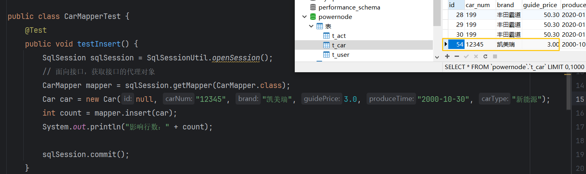

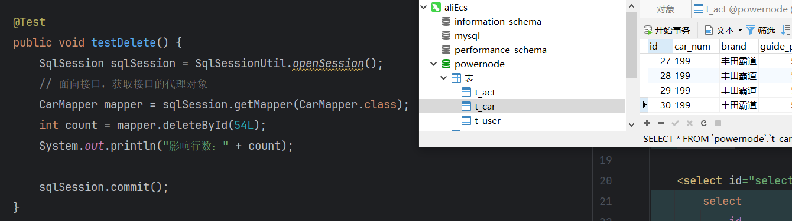

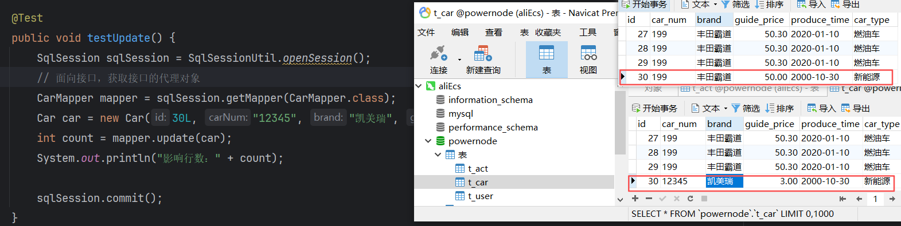

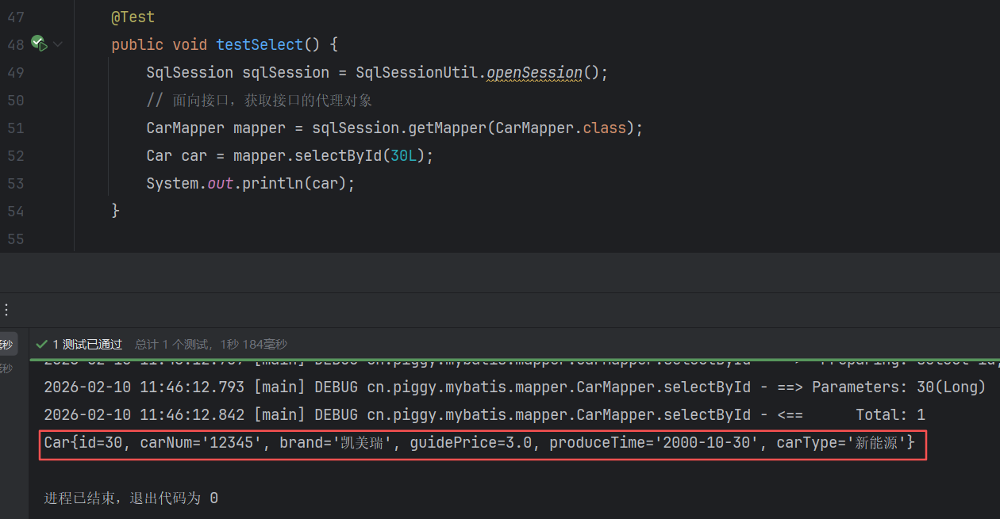

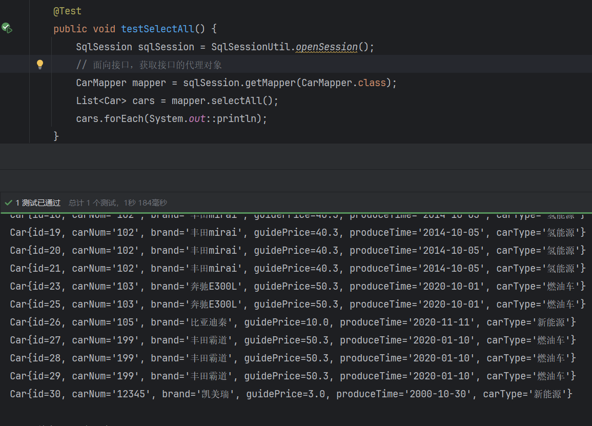


# 九、MyBatis小技巧

我们先创建新的项目`mybatis-006-antic`编译演示：

1. 引入依赖

   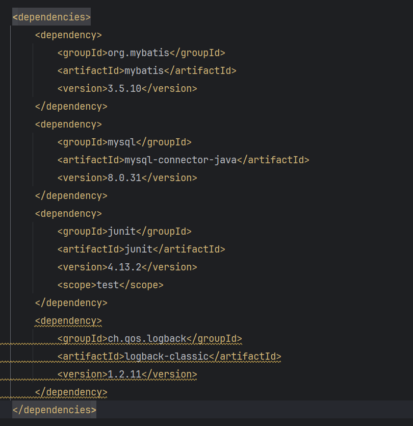

2. 从上一个项目`mybatis-005-curd2`中拉取相关文件，修改Mapper相关文件，并编写测试程序：

   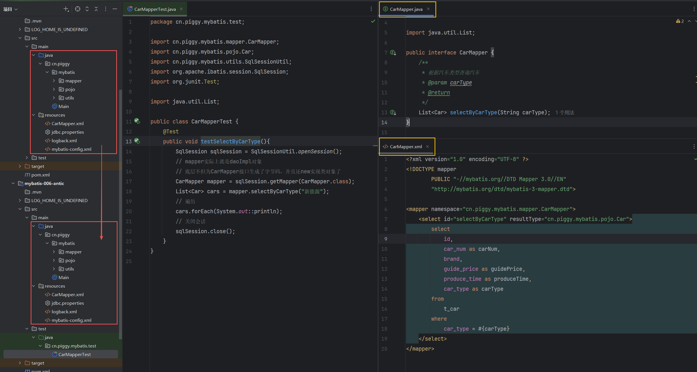

## 9.1 #{}和${}的区别

**使用`#{}`的情况：**

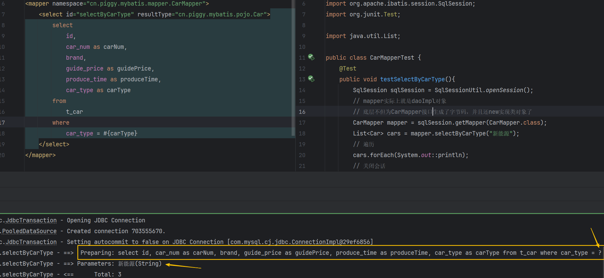

**使用`${}`的情况：**

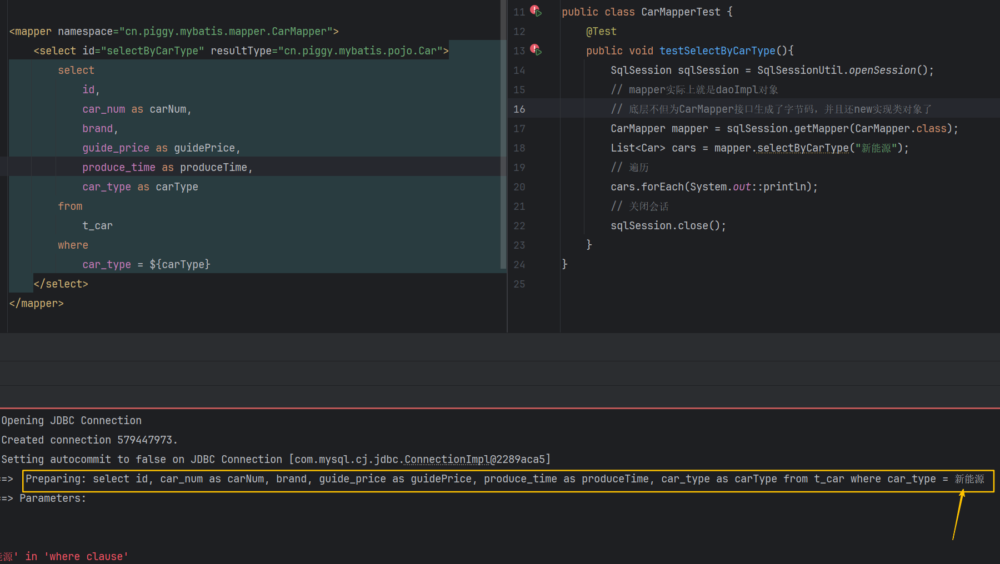


通过上述示例得知他们的区别：

+ 使用`#{}`：底层使用`PrepareedStatement`，会先对SQL语句进行编译，然后给SQL语句的占位符`?`传值，可以避免SQL注入的风险。
+ 使用`${}`：底层使用`Statement`，先对SQL语句进行拼接，然后在对SQL语句进行编译，存在SQL注入的风险。

对于需要传值的SQL语句，优先使用`#{}`，这是原则，避免SQL注入的风险。

对于需要将SQL关键字直接放到SQL语句，或者需要直接拼接的情况，就只能使用`${}`。


**需要使用`${}`对SQL进行直接拼接的三种情况：**

**示例1**：通过传入排序`asc`或`desc`来对查询结果进行排序

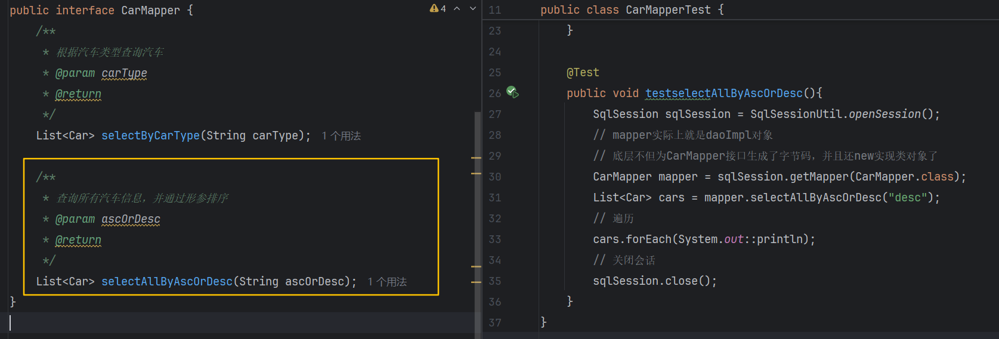

**使用`${}`的情况：**

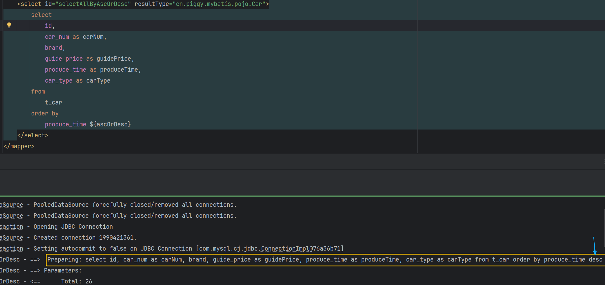

**使用`#{}`的情况：**

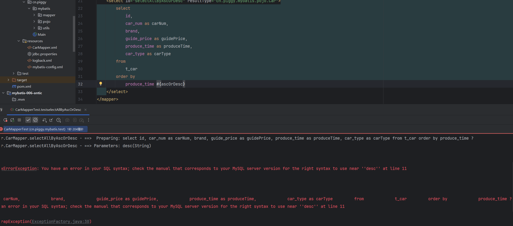

> 这个情况会mybatis会组合成：
>
> select id, car_num as carNum,brand, guide_price as guidePrice,produce_time as produceTime,car_type as carType from t_car order by produce_time ?，参数是desc，会传值进入，得到↓
>
> select id, car_num as carNum,brand, guide_price as guidePrice,produce_time as produceTime,car_type as carType from t_car order by produce_time ‘desc’，从而语法错误报错。


因此对于需要拼接的语句来说，只能使用`${}`，因为`#{}`是以值的方式传入进去的。


**示例2**：拼接表名

现实业务中，可能会存在分表存储数据的情况。因为一张表存的话，数据量太大，查询效率比较低。

可以将这些表有规律的分表存储，这样在查询的时候效率会比较高，因为扫描的数据量太少了。

日志表：专门存储日志信息的。如果t_log只有一张表，那么每条增长的日志信息会导致其查询的效率变慢。

因此我们可以将这张日志表以当前日期作为后缀名称，如：t_log_20260209、t_log_20260210等。

如果我们想查询某一天的日志信息，就可以传入某天的日期来查询当天的日志信息了。我们要做的就是查询这一部分。


1. 创建日志类`Log`，使其字段与数据库表`t_log_20260210`的字段一致，在该表中创建两条日志记录：

   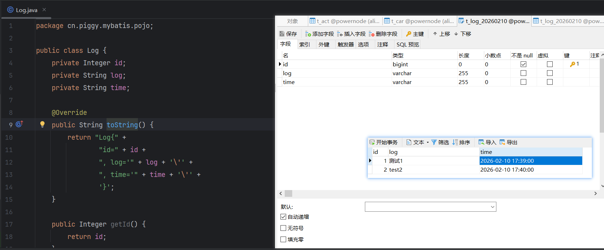

2. 创建mapper接口类`LogMapper.class`和映射文件`LogMapper.xml`，同时在核心配置文件中添加映射文件的扫描信息：

   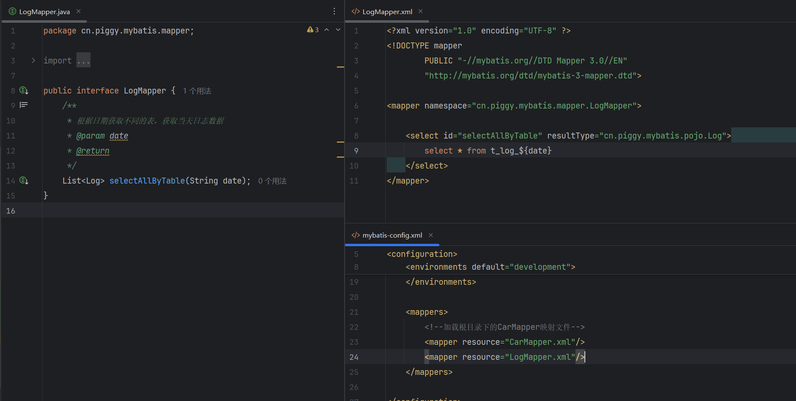

3. 编写测试程序，并运行：

   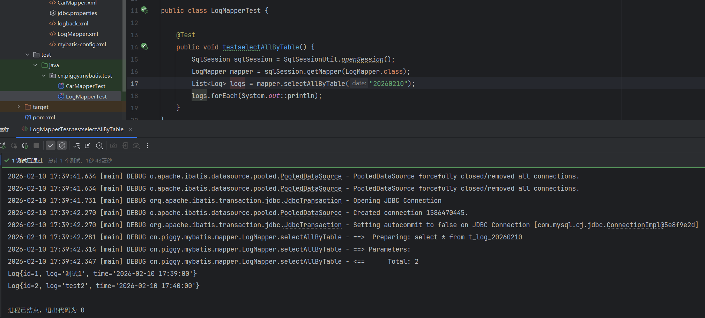


**示例3：**批量删除，一次性删除多条记录

批量删除的SQL语句有两种写法：

+ 第一种`OR`:

  ```sql
  delete from t_car where id = 1 or id = 2 or id = 3;
  ```

+ 第二种`IN`：

  ```sql
  delete from t_car where id in (1,2,3);
  ```


我们先测试第二种。

1. `CarMapper.class`添加批量删除的接口方法：

   ```java
   /**
       * 根据id批量删除
       * @param ids
       * @return
   */
   int deleteBatch(String ids);
   ```

2. `CarMapper.xml`添加批量删除的SQL语句：

   ```xml
   <delete id="deleteBatch">
       delete from t_car where id in (${ids})
   </delete>
   ```

3. 编写测试方法并测试：

   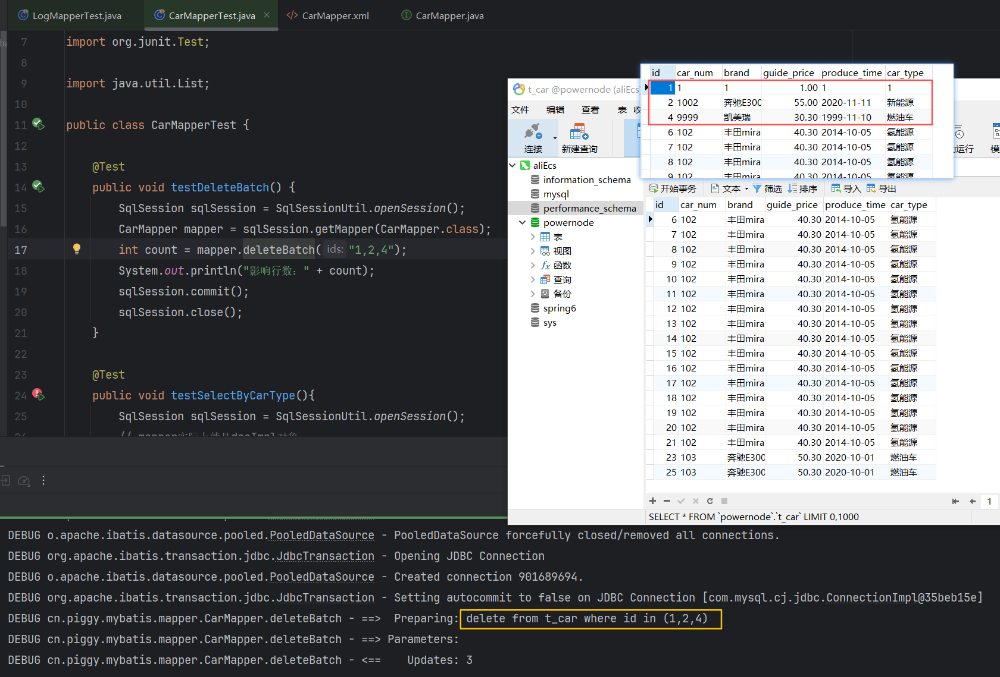

如果SQL语句中使用`#{ids}`，则会报错：

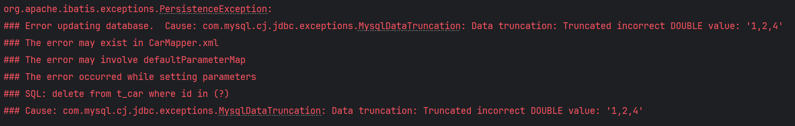


**示例3**：模糊查询`like`

需求：根据汽车品牌进行模糊查询

```sql
select * from t_car where brand like '%奔驰%';
select * from t_car where brand like '%比亚迪%';
```

方法有四种，SQL语句前段都一致，主要看`WHERE`后拼接的部分：

```xml
<select id="selectByBrandLike" resultType="cn.piggy.mybatis.pojo.Car">
    select
    	id,
    	car_num as carNum,
    	brand,
    	guide_price as guidePrice,
    	produce_time as produceTime,
    	car_type as carType
    from
    	t_car
    where
    	brand like 拼接字符串
</select>
```


+ 使用`${}`进行拼接：

  ```xml
  brand like '%${brand}%'
  ```

+ 配合`concat()`方法，使用`#{}`传值：

  ```xml
  brand like concat('%', #{brand}, '%');
  ```

+ 配合`concat()`方法，使用`${}`拼接，注意单引号（很少使用）：

  ```xml
  brand like concat('%', '${brand}', '%');
  ```

+ 使用`#{}`传值直接拼接：

  ```xml
  brand like "%"#{brand}"%"
  ```

  

## 9.2 typeAliases 起别名

我们观察看mapper.xml文件中：

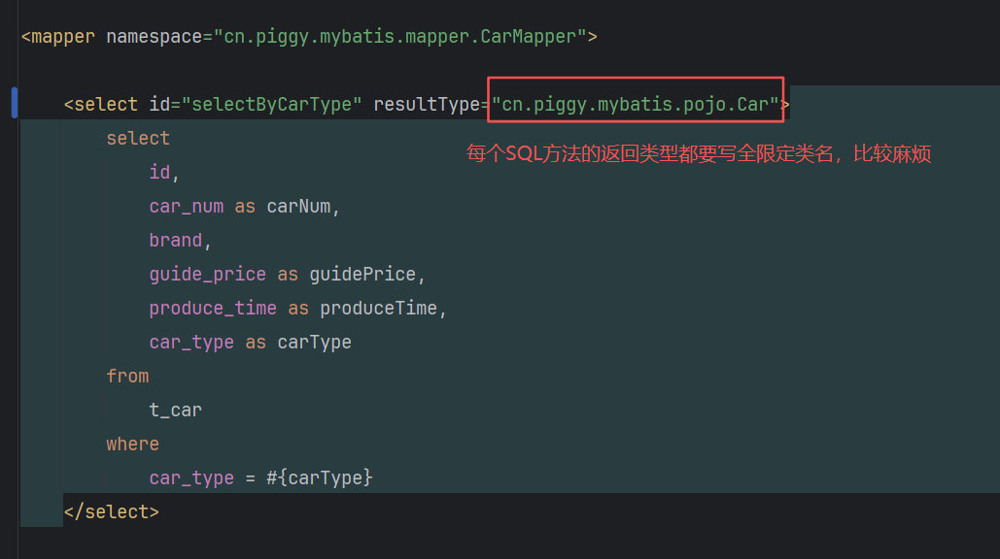

每次执行返回值类型的时候都要写全限定名，比较麻烦。我们可以在核心配置文件中`mybatis-config.xml`中使用`<typeAliases>`标签起别名，包括两种方式：`<typeAlias>`和`<package>`


### 9.2.1 typeAlias

对`Car`类起别名：

```xml
<typeAliases>
    <!--
        type: 指定给哪个类型起别名
        alias:指定别名
        注意：别名不区分大小写
    -->
    <typeAlias type="cn.piggy.mybatis.pojo.Car" alias="aaa"/>
</typeAliases>
```

注意点：

+ 注意`<typeAliases>`的放置位置，如果不清楚可查看相关错误信息。
+ `<typeAliases>`标签中`<typeAlias>`子标签可以有多个。
+ 关于`<typeAlias>`:
  + `type`属性：指定给哪个类起别名。
  + `alias`属性：别名。
    + `alias`属性是大小写不敏感的。
    + `alias`属性不是必须的。在缺省情况下，将会使用`type`指定类型的简类名作为别名。

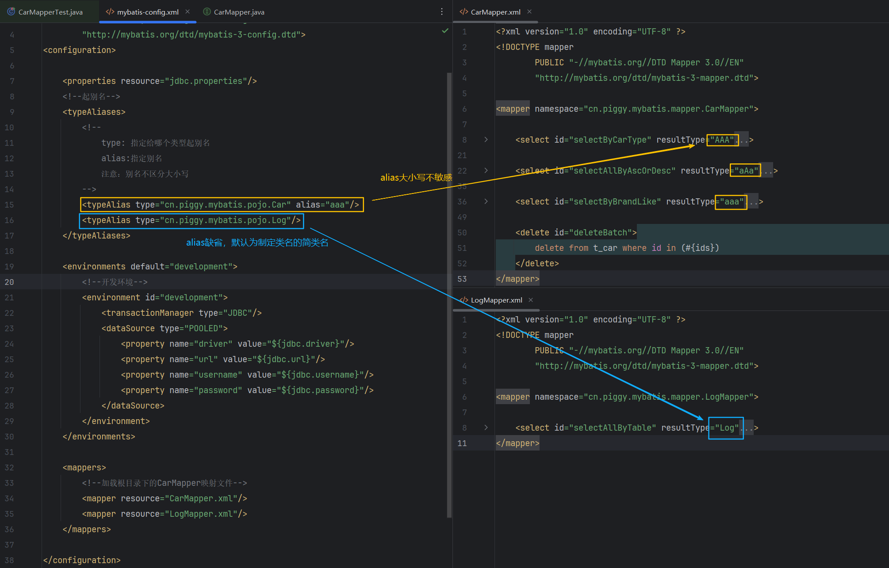


### 9.2.2 package

如果一个包下的类太多，每个类都要起别名，会导致`typeAlias`标签配置较多，所以mybatis用提供`package`的配置方式，只需要指定包名，该包下的所有类都自动起别名，别名就是简类名。并且别名不区分大小写。

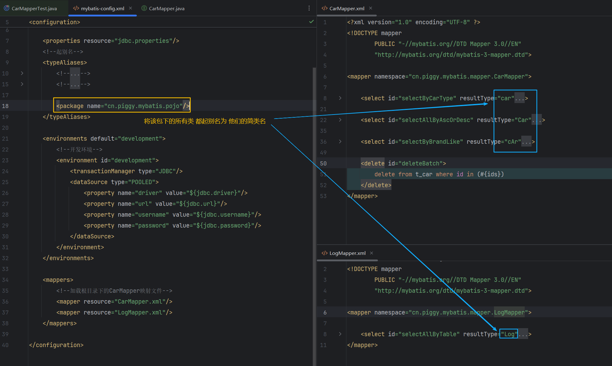


## 9.3 mappers

SQL映射文件的配置方式包括四种：

+ `resource`：从类路径中加载
+ `url`：从指定的全限定资源路径中加载
+ `class`：使用映射器接口实现类的完全限定类名
+ `package`：将包内的映射器接口实现全部注册为映射器


**resource**

这种方式是从类路径中加载配置文件，所以这种方式要求SQL映射文件必须放在`resources`目录下或其子目录下。

```xml
<mappers>
  <mapper resource="CarMapper.xml"/>
  <mapper resource="LogMapper.xml"/>
</mappers>
```


**url**

这种方式显然使用了绝对路径的方式，这种配置对SQL映射文件存放的位置没有要求，但不适合移植，不常用。

```xml
<mappers>
  <mapper url="file:///D:/CarMapper.xml"/>
  <mapper url="file:///D:/LogMapper.xml"/>
</mappers>
```


**class**

如果使用这种方式必须满足以下条件：

+ SQL映射文件和mapper接口放在同一个目录下。
+ SQL映射文件的名字也必须和mapper接口名一致。


将CarMapper.xml文件移动到和mapper接口同一个目录下：

+ 在resources目录下新建：cn/piggy/mybatis/mapper【这里千万要注意：**不能这样新建 cn.piggy.mybatis.mapper**】
+ 将`CarMapper.xml`和`LogMapper.xml`文件移动到mapper目录下
+ 修改`mybatis-config.xml`文件

```xml
<!-- 使用映射器接口实现类的完全限定类名 -->
<mappers>
    <mapper class="cn.piggy.mybatis.mapper.CarMapper"/>
    <mapper class="cn.piggy.mybatis.mapper.LogMapper"/>
</mappers>
```

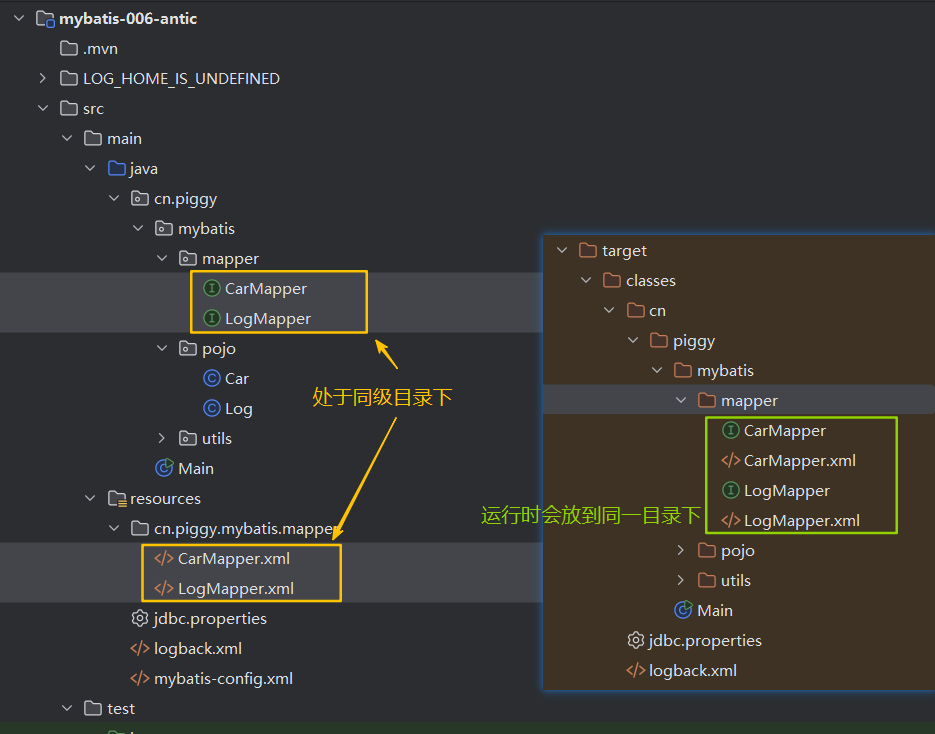


**package**

如果class较多，可以使用这种package的方式，但前提条件和上一种方式一样。

```xml
<!-- 将包内的映射器接口实现全部注册为映射器 -->
<mappers>
  <package name="cn.piggy.mybatis.mapper"/>
</mappers>
```


## 9.4 idea配置文件模板

可以通过IDEA提供的模板创建来配置一些模板，比如Mybatis的核心配置和映射文件的模板，以后可以通过这些模板创建配置文件。

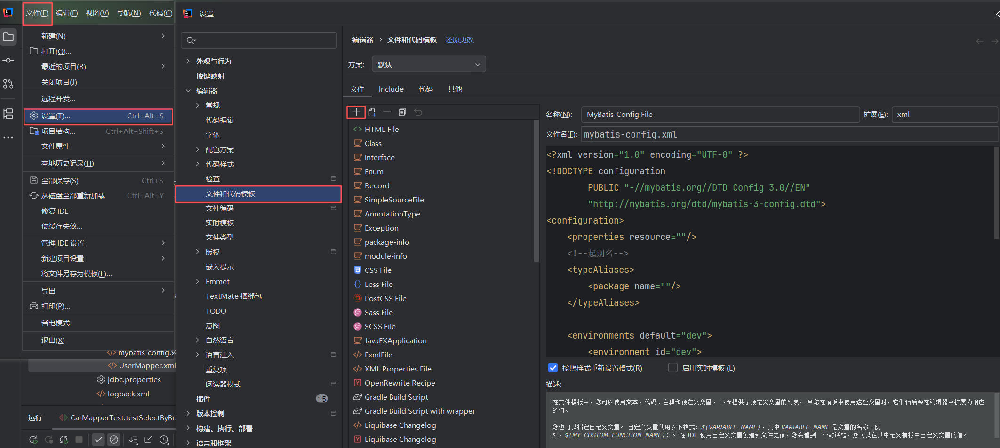


**创建核心配置文件模板：**

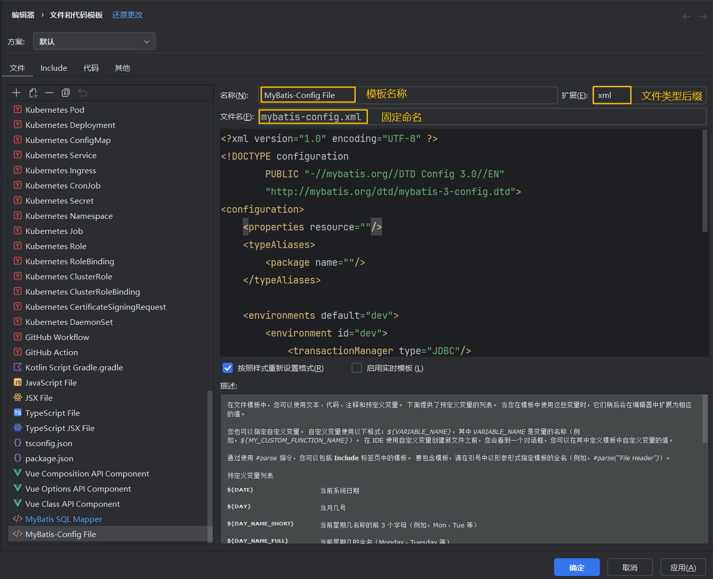

```xml
<?xml version="1.0" encoding="UTF-8" ?>
<!DOCTYPE configuration
        PUBLIC "-//mybatis.org//DTD Config 3.0//EN"
        "http://mybatis.org/dtd/mybatis-3-config.dtd">
<configuration>
    <properties resource=""/>
    <typeAliases>
        <package name=""/>
    </typeAliases>

    <environments default="dev">
        <environment id="dev">
            <transactionManager type="JDBC"/>
            <dataSource type="POOLED">
                <property name="driver" value="${jdbc.driver}"/>
                <property name="url" value="${jdbc.url}"/>
                <property name="username" value="${jdbc.username}"/>
                <property name="password" value="${jdbc.password}"/>
            </dataSource>
        </environment>
    </environments>
    <mappers>
        <package name=""/>
    </mappers>
</configuration>
```


**创建映射文件模板**

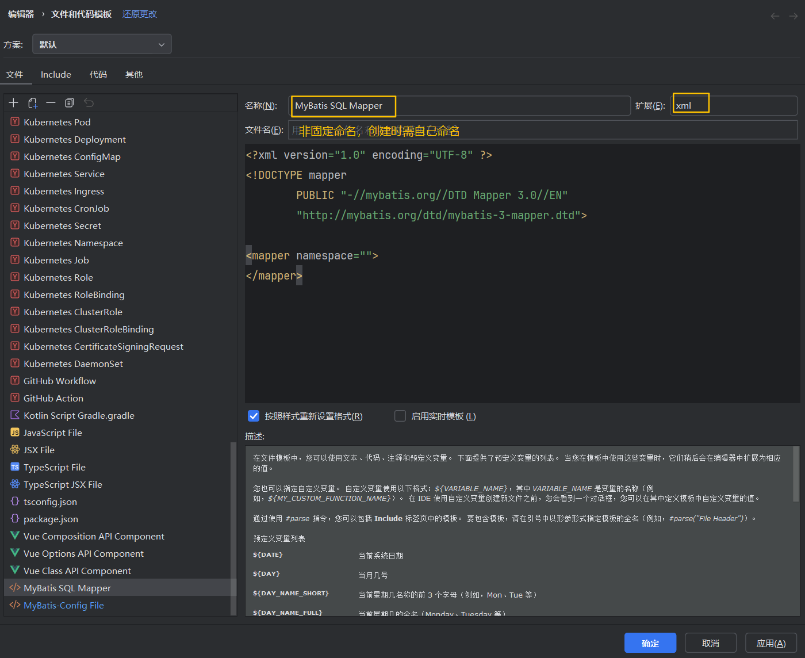

```xml
<?xml version="1.0" encoding="UTF-8" ?>
<!DOCTYPE mapper
        PUBLIC "-//mybatis.org//DTD Mapper 3.0//EN"
        "http://mybatis.org/dtd/mybatis-3-mapper.dtd">

<mapper namespace="">
</mapper>
```


## 9.5 插入数据时获取自动生成的主键

前提是：主键是自动生成的。

业务背景：一个用户有多个角色。

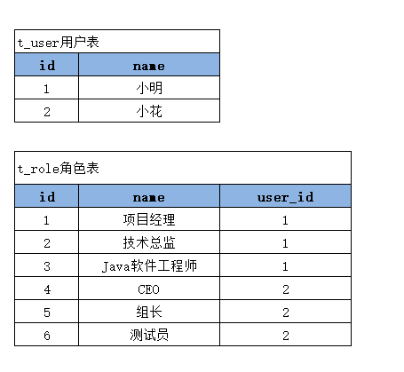

插入一条新的记录之后，自动生成了主键，而这个主键需要在其他表中使用时。

插入一个用户数据的同时需要给该用户分配角色：需要将生成的用户的id插入到角色表的user_id字段上。

第一种方式：可以先插入用户数据，再写一条查询语句获取id，然后再插入user_id字段。【比较麻烦】

第二种方式：mybatis提供了一种方式更加便捷。


演示：

我们在t_car插入一条新的汽车信息时，在Mapper映射文件中使用`useGeneratedKeys`获取其主键，并通过`keyProperty`指定赋值给`id`对象。

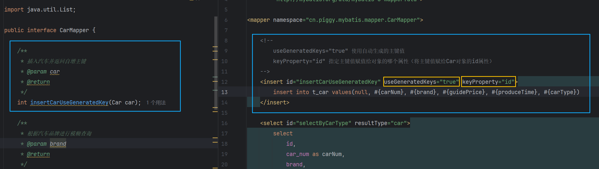

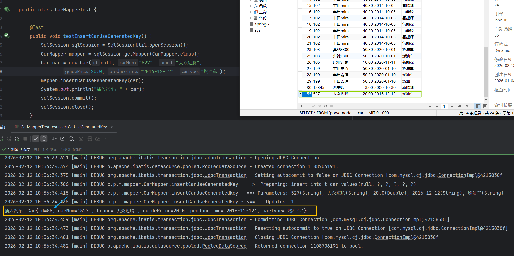


# 十、MyBatis参数处理

先准备新的项目`mybatis-007-param`和数据库表，便于后续测试

1. 创建数据库表`t_student`：

   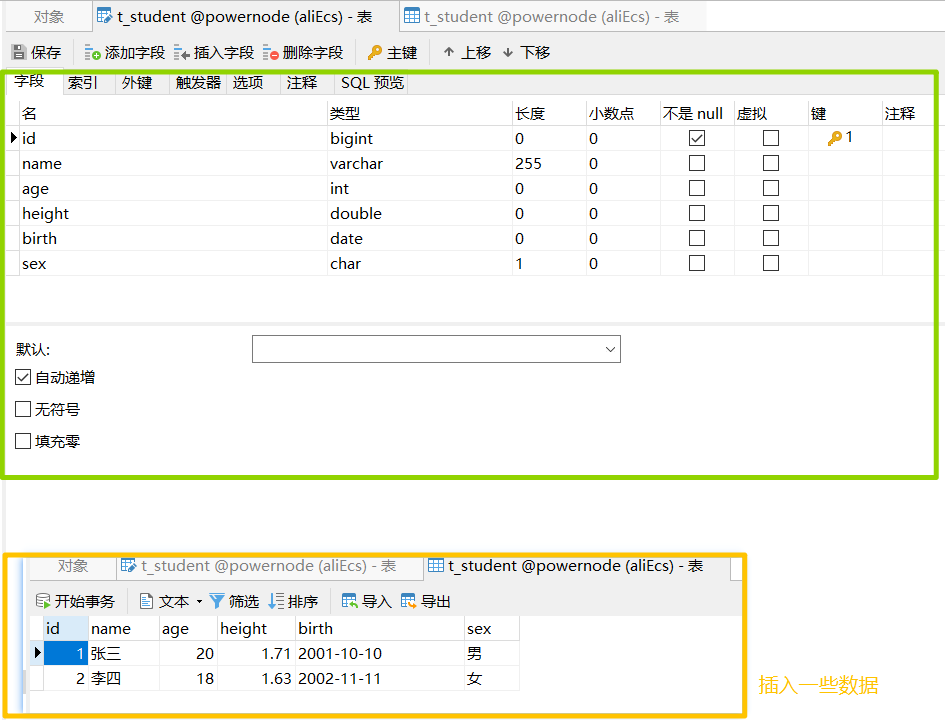

2. 创建新项目`mybatis-007-param`，引入依赖：

   ```xml
   <dependencies>
       <dependency>
           <groupId>org.mybatis</groupId>
           <artifactId>mybatis</artifactId>
           <version>3.5.10</version>
       </dependency>
       <dependency>
           <groupId>mysql</groupId>
           <artifactId>mysql-connector-java</artifactId>
           <version>8.0.31</version>
       </dependency>
       <dependency>
           <groupId>junit</groupId>
           <artifactId>junit</artifactId>
           <version>4.13.2</version>
           <scope>test</scope>
       </dependency>
       <dependency>
           <groupId>ch.qos.logback</groupId>
           <artifactId>logback-classic</artifactId>
           <version>1.2.11</version>
       </dependency>
   </dependencies>
   ```

3. 创建相关的目录，从之前的项目拉取一些配置文件和工具类：

   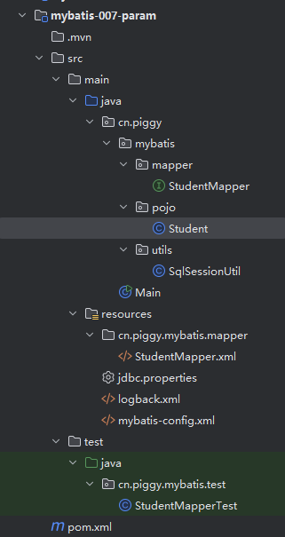

4. 核心配置文件的一些设置：

   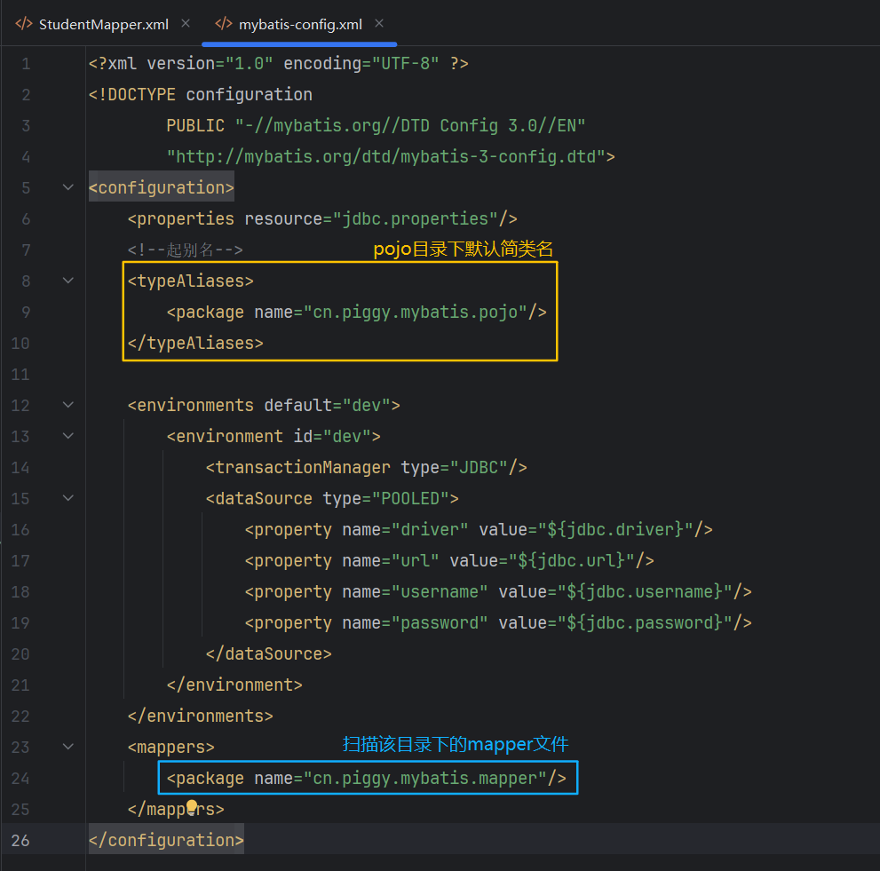

5. 创建pojo类`Student`要与数据库表`t_student`的字段对应上：

   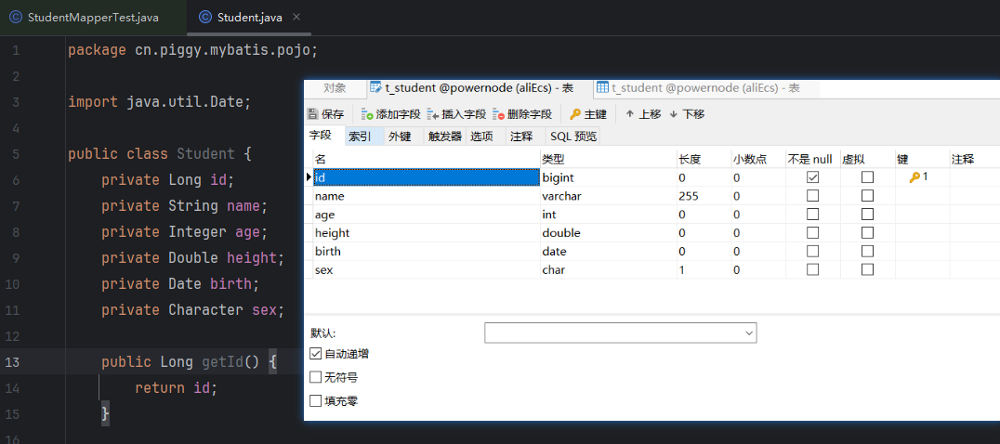


## 10.1 单参数传值

单参数传值主要有三种类型：简单类型参数、Map集合和POJO实体类。

### 10.1.1 简单类型参数

简单类型包括：

+ byte short int long float double char
+ Byte Short Integer Long Float Double Character
+ String
+ java.util.Date
+ java.sql.Date


需求：根据name查、根据id查、根据birth查、根据sex查


学生数据SQL映射：

```java
public interface StudentMapper {
    /**
     * 当接口中的方法的参数只有一个（单个参数），并且参数的数据类型都是简单类型
     * 根据id查询、name查询、birth查询，sex查询
     */
    List<Student> selectById(Long id);
    List<Student> selectByName(String name);
    List<Student> selectByBirth(Date birth);
    List<Student> selectBySex(Character sex);
}
```

查询演示：

1. 根据`id`查询：

   ```xml
   <select id="selectById" resultType="student" parameterType="java.lang.Long">
       select * from t_student where id = #{id}
   </select>
   ```

   其中，`parameterType`属性的作用：告诉mybatis框架，我这个方法的参数类型是什么类型。

   > 如上面的SQL语句会转换成：
   >     **select * from t_student where id = ?**
   >
   > JDBC代码是一定要给?传值的 -> ps.setXxx(第几个问号?, 传的值)
   >     ps.setLong(1, 1L);
   >     ps.setString(1, "zhangsan");
   >     ps.setDate(1, new Date());
   >     ps.setInt(1, 100);
   >     ...
   >
   > **mybatis底层到底调用setXxx()的哪个方法，取决于`parameterType`属性的值。**
   >
   > 因为这个语句的`parameterType`属性是`Long`型，因此底层会调用`ps.setLong()`给`?`赋值。

   

   但**mybatis框架自身带有类型自动推断机制**，所以大部分情况下`parameterType`属性都是可以省略不写的。如下所示：

   ```xml
   <select id="selectById" resultType="student">
       select * from t_student where id = #{id}
   </select>
   ```

   测试运行：

   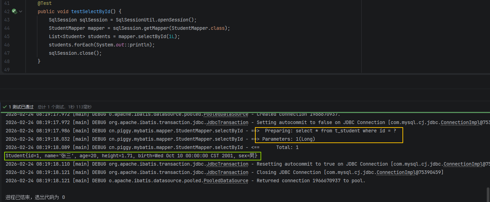

   

2. 根据`name`查询：

   ```xml
   <select id="selectByName" resultType="student" parameterType="java.lang.String">
       select * from t_student where name = #{name}
   </select>
   ```

   `parameterType`属性可以使用类型别名来替换，mybatis提供了一些内建的类型别名，且不区分大小写。更多可查看官方文档[类型别名]([mybatis – MyBatis 3 | 配置](https://mybatis.p2hp.com/configuration.html#typeAliases))。

   我们使用String的类型别名来替换：

   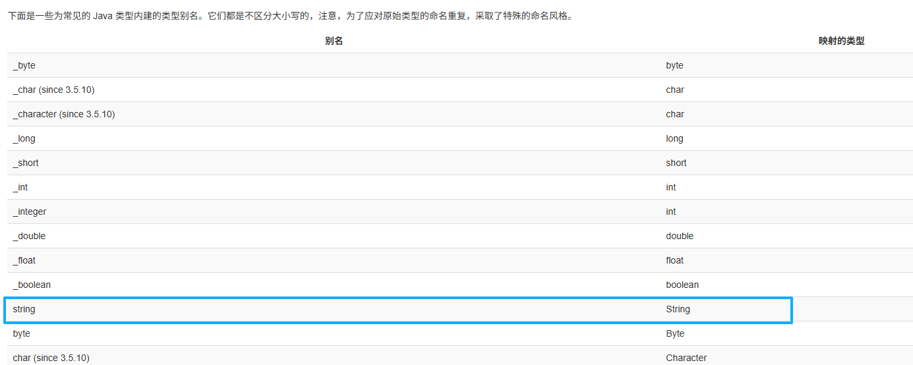

   ```xml
   <select id="selectByName" resultType="student" parameterType="string">
       select * from t_student where name = #{name}
   </select>
   ```

   

   如果我们不想使用mybatis提供的自动类型转换，也可以手动指定java和jdbc中的字段类型：

   ```xml
   <select id="selectByName" resultType="student">
       select * from t_student where name = #{name, javaType=String, jdbcType=VARCHAR}
   </select>
   ```

   

   测试运行：

   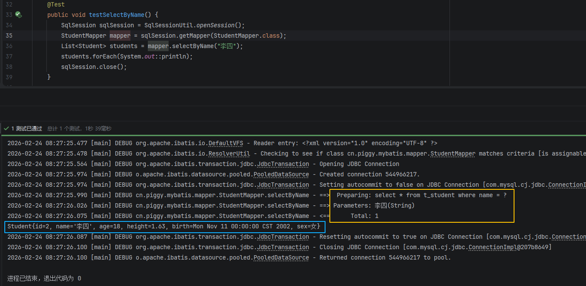

   

3. 根据`birth`查询：

   省略`parameterType`和不指定类型，直接使用内置的自动类型推断。

   ```xml
   <select id="selectByBirth" resultType="student">
       select * from t_student where birth = #{birth}
   </select>
   ```

   测试运行：

   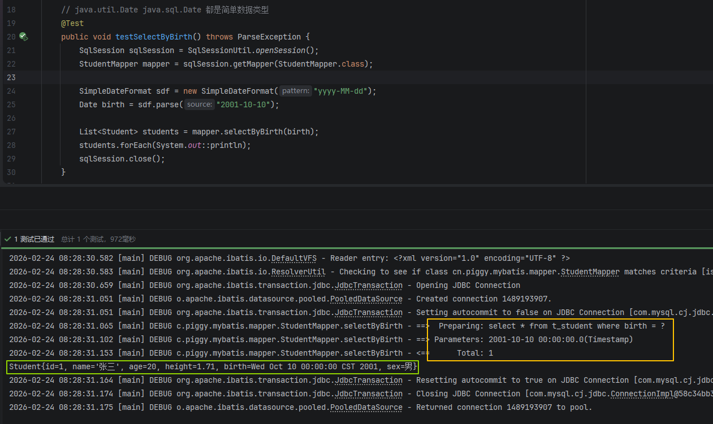

   

4. 根据`sex`查询：

   使用完整的SQL映射的写法：

   ```xml
   <select id="selectBySex" resultType="student" parameterType="java.lang.Character">
       select * from t_student where sex = #{sex, javaType=Character, jdbcType=CHAR}
   </select>
   ```

   运行测试：

   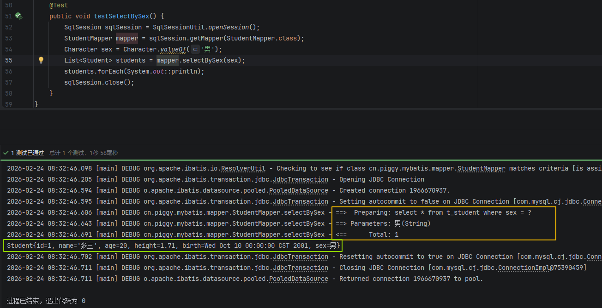


**总结：**

+ 简单类型对于mybatis来说都是可以自动类型推断的，也即mybatis可以根据简单类型来自行推断出ps.setXxx()方法。

+ SQL映射文件中的配置比较完整的写法：

  ```xml
  <select id="selectByName" resultType="student" parameterType="java.lang.String">
      select * from t_student where name = #{name, javaType=String, jdbcType=VARCHAR}
  </select>
  ```

  其中语句中的`javaType`，`jdbcType`，和`parameterType`属性都是来帮助mybatis进行类型确定的。但因为mybatis强大的自动类型推断机制，这些配置大多是可以省略的。

+ 如果参数只有一个的话，那么`#{}`里面的内容可以随便写的。对于`${}`来说，需要注意加单引号。


### 10.1.2 Map参数

需求：插入新的学生信息

在`StudentMapper.class`编写映射配置：

```java
/**
    * 保存学生信息，通过Map参数。
    * 以下是单个参数，但是参数的类型不是简单类型，是Map集合
    * @param map
    * @return
*/
int insertStudentByMap(Map<String, Object > map);
```

在`StudentMapper.xml`编写SQL语句：

```xml
<insert id="insertStudentByMap" parameterType="map">
    insert into t_student(id, name, age, sex, birth, height)
    values (null, #{姓名}, #{年龄}, #{性别}, #{生日}, #{身高})
</insert>
```

> 因mybatis的自动推断机制，`parameterType`属性是可以省略的。

测试代码；

```java
@Test
public void testInsertStudentByMap() {
    SqlSession sqlSession = SqlSessionUtil.openSession();
    StudentMapper mapper = sqlSession.getMapper(StudentMapper.class);

    Map<String, Object> map = new HashMap<>();
    map.put("姓名", "张三");
    map.put("年龄", 20);
    map.put("身高", 1.81);
    map.put("性别", '男');
    map.put("生日", new Date());
    int count = mapper.insertStudentByMap(map);

    sqlSession.commit();
    sqlSession.close();
}
```

运行测试：

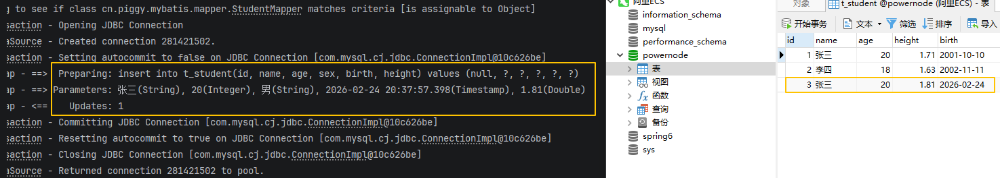


**这种方式是手动封装Map集合，将每个条件以key和value的形式存放到集合中。然后在使用的时候通过`#{map集合的key}`来取值。**


### 10.1.3 实体类参数

需求：插入新的学生信息

在`StudentMapper.class`编写映射配置：

```java
/**
    * 保存学生信息，通过POJO参数。
    * 以下是单个参数，但是参数的类型不是简单类型，是POJO实体类
    * @param student
    * @return
*/
int insertStudentByPOJO(Student student);
```

在`StudentMapper.xml`编写SQL语句：

```xml
<insert id="insertStudentByPOJO">
    insert into t_student(id, name, age, sex, birth, height)
    values (null, #{name}, #{age}, #{sex}, #{birth}, #{height})
</insert>
```

> 得益于自动推断机制，insert标签中属性`parameterType=Student`可以被省略。

测试代码：

```java
@Test
public void testInsertStudentByPOJO() {
    SqlSession sqlSession = SqlSessionUtil.openSession();
    StudentMapper mapper = sqlSession.getMapper(StudentMapper.class);
    // POJO对象
    Student student = new Student(null, "王五", 16, 1.56, new Date(), '女');
    mapper.insertStudentByPOJO(student);
    sqlSession.commit();
    sqlSession.close();
}
```

运行测试：

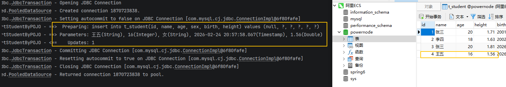


**这里需要注意的是：`#{} `里面写的是属性名字。这个属性名其本质上是：set/get方法名去掉set/get之后的名字。**


## 10.2 多参数

需求：根据name和sex来查询学生信息

Mpper接口：

```java
/**
	* 根据name和sex来查询Student信息
	* @param name
	* @param sex
	* @return
*/
List<Student> selectByNameAndSex(String name, Character sex);
```

Mapper映射文件：

```xml
<select id="selectByNameAndSex" resultType="Student">
    <!-- 方式1：使用arg方式来传值-->
    select * from t_student where name = #{arg0} and sex = #{arg1}
    <!-- 方式2：使用param方式来传值-->
    select * from t_student where name = #{param1} and sex = #{param2}
    <!-- 方式3：使用arg和param混合方式来传值-->
    select * from t_student where name = #{arg0} and sex = #{param2}
</select>
```

测试代码：

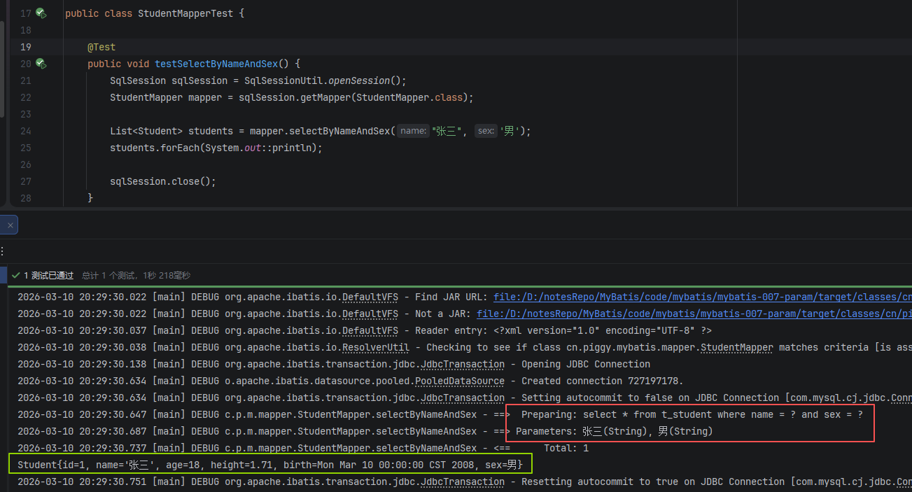


**多参数传值的底层实现：**

当我们通过多参数来传值的时候，mybatis框架会自动创建一个Map集合，并通过**arg**和**parma**来跟函数参数下标进行组合作为map的键，同时将函数参数作为对应的值。

在这个函数中的两个参数`name`和`sex`都被添加进同一个生成的map集合：

```java
map.put("arg0", name);
map.put("arg1", sex);
map.put("param1", name);
map.put("param2", sex);
```

因此我们在映射文件中使用这些map集合中的键进行传参。


>注意：在低版本的mybatis中，多参数传值使用`#{0}`、`#{1}`进行传值。
>
>只有在高版本中才会使用`#{arg0}`、`#{param1}`等进行传值。


## 10.3 @Param注解

在10.2多参数的多参数查询学生信息的实现中，使用arg0或者param1可读性不强，因此我们在这一节中使用`@Param`注释实现。

Mapper接口函数：

```java
/**
    * 多参数传值，Param注解实现
    * @param name
    * @param sex
	* @return
*/
List<Student> selectByNameAndSex2(@Param("name") String name, @Param("sex") Character sex);
```

Mapper映射文件：

```xml
<select id="selectByNameAndSex2" resultType="Student">
    select * from t_student where name = #{name} and sex = #{sex}
</select>
```

测试函数：

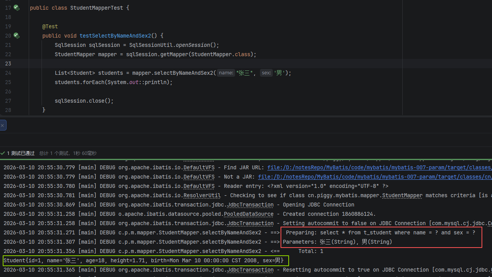


**使用`@Param`注释的底层实现：**

使用`@Param`会根据用户指定的键名来向map集合存放的键值对，比如：

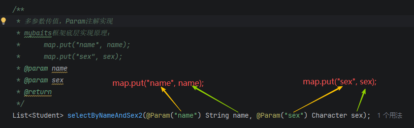

这样，我们就可以在mapper映射文件中直接使用这些键名了。


注意：我们使用了`@Param`注解，之前的`arg+参数下标`的方式会失效，此时的map集合只存在用户指定的键值和`param`组合的键值。

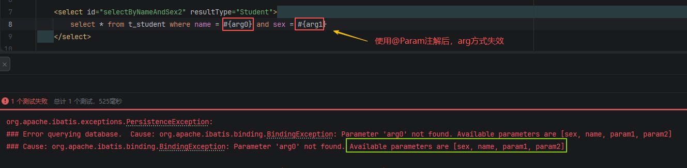


## 10.4 @Param源码分析

1. 我们在测试函数获取mapper代理对象的地方设置一个断点，并开始进行跟踪。

   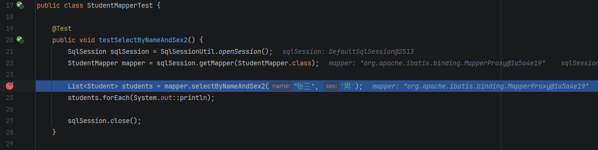

2. 进入Mapper代理类的invoke()方法：

   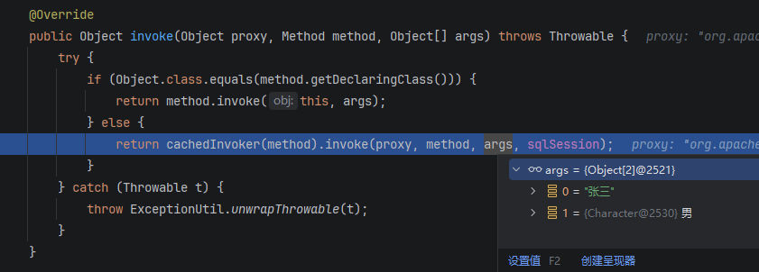

3. 继续步入，知道走到MapperMethod类的execute()方法：

   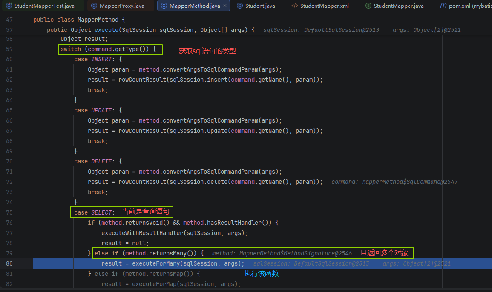

4. 继续步入，可以看到生成map集合的函数：

   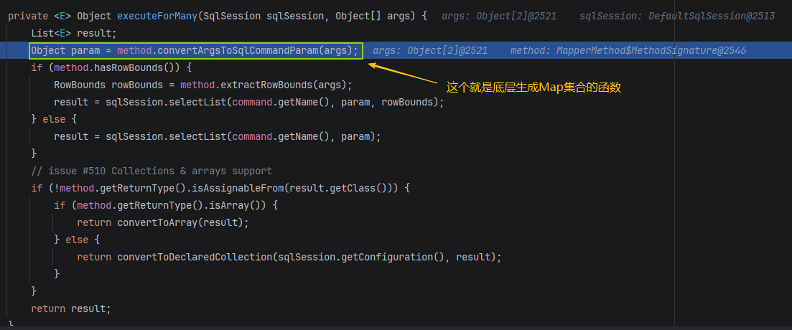

   继续步入可以看到会调用paramNameResolver类来获取Map集合：

   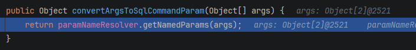

5. 继续步入，查看getNamedParams()方法：

   **大体逻辑：**

   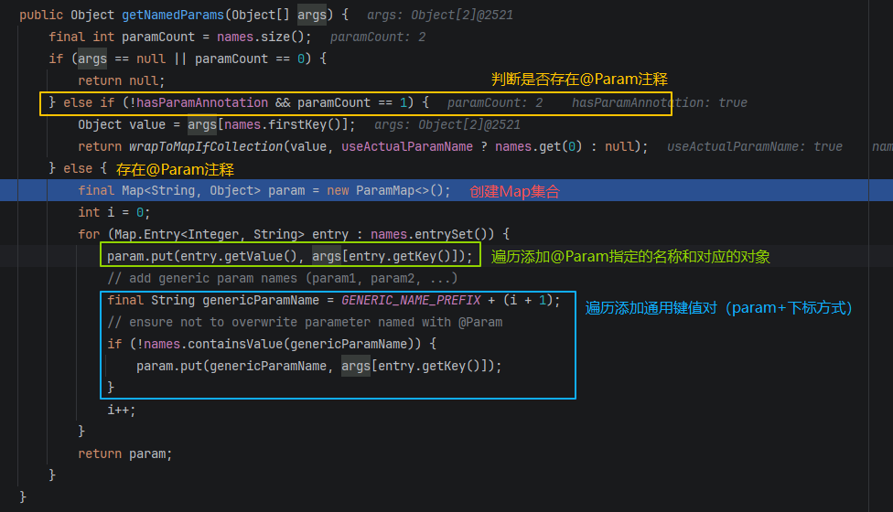

   **具体实现：**

   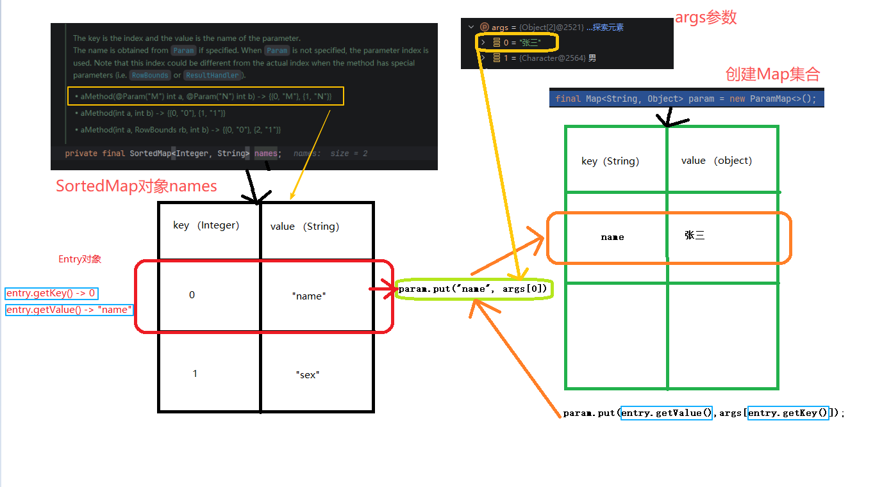


# 十一、Mybatis查询语句专题

新建一个项目`mybatis-008-select`用于测试查询功能。

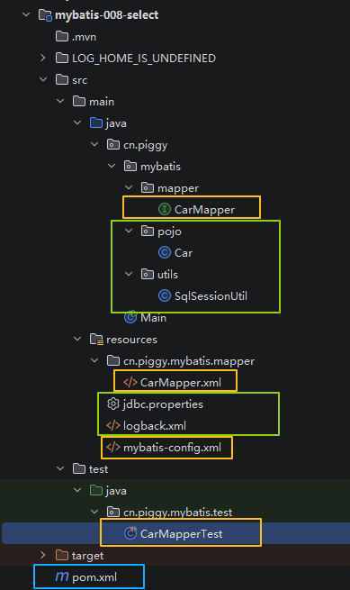

> 我们对篮框的pom配置文件可以参考上个项目的依赖引用，绿框中的文件也可以从上个项目中拉取过去，我们主要是对黄框里的文件进行修改。


mybatis核心配置文件`mybatis-config.xml`：

```xml
<?xml version="1.0" encoding="UTF-8" ?>
<!DOCTYPE configuration
        PUBLIC "-//mybatis.org//DTD Config 3.0//EN"
        "http://mybatis.org/dtd/mybatis-3-config.dtd">
<configuration>
    <properties resource="jdbc.properties"/>
    <typeAliases>
        <package name="cn.piggy.mybatis.pojo"/>
    </typeAliases>

    <environments default="dev">
        <environment id="dev">
            <transactionManager type="JDBC"/>
            <dataSource type="POOLED">
                <property name="driver" value="${jdbc.driver}"/>
                <property name="url" value="${jdbc.url}"/>
                <property name="username" value="${jdbc.username}"/>
                <property name="password" value="${jdbc.password}"/>
            </dataSource>
        </environment>
    </environments>
    <mappers>
        <package name="cn.piggy.mybatis.mapper"/>
    </mappers>
</configuration>
```


## 11.1 返回Car

当查询结果有对应的实体类，并且查询结果只有一条：通过id查询Car信息。

```java
// CarMapper.java
public interface CarMapper {
    /**
     * 根据id查询Car信息
     * @param id
     * @return
     */
    Car selectById(Long id);
}
```

```xml
<!--CarMapper.xml-->
<?xml version="1.0" encoding="UTF-8" ?>
<!DOCTYPE mapper
        PUBLIC "-//mybatis.org//DTD Mapper 3.0//EN"
        "http://mybatis.org/dtd/mybatis-3-mapper.dtd">

<mapper namespace="cn.piggy.mybatis.mapper.CarMapper">
    <select id="selectById" resultType="car">
        select
            id,
            car_num as carNum,
            brand,
            guide_price as guidePrice,
            produce_time as produceTime,
            car_type as carType
        from t_car
        where id = #{id}
    </select>
</mapper>
```

```java
// 测试函数
public class CarMapperTest {
    @Test
    public void testSelectById() {
        SqlSession sqlSession = SqlSessionUtil.openSession();
        CarMapper mapper = sqlSession.getMapper(CarMapper.class);
        Car car = mapper.selectById(1L);
        System.out.println(car);
        sqlSession.close();
    }
}
```

测试运行：

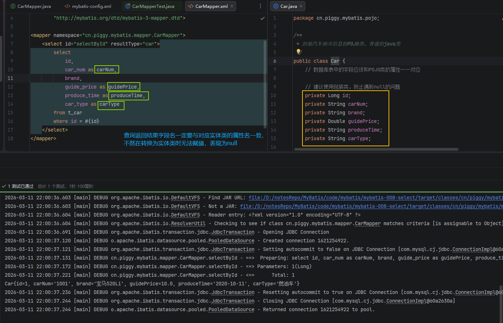


## 11.2 返回List

当查询返回的记录条数是多条时，必须使用集合接收。如果使用的那个实体类接受会出现异常。


**1. 查询所有Car信息**

```java
/**
    * 获取所有的Car
	* @return
*/
List<Car> selectAll();
```

```xml
<select id="selectAll" resultType="car">
    select
    	id,
    	car_num as carNum,
    	brand,
    	guide_price as guidePrice,
    	produce_time as produceTime,
    	car_type as carType
    from t_car
</select>
```

运行测试：

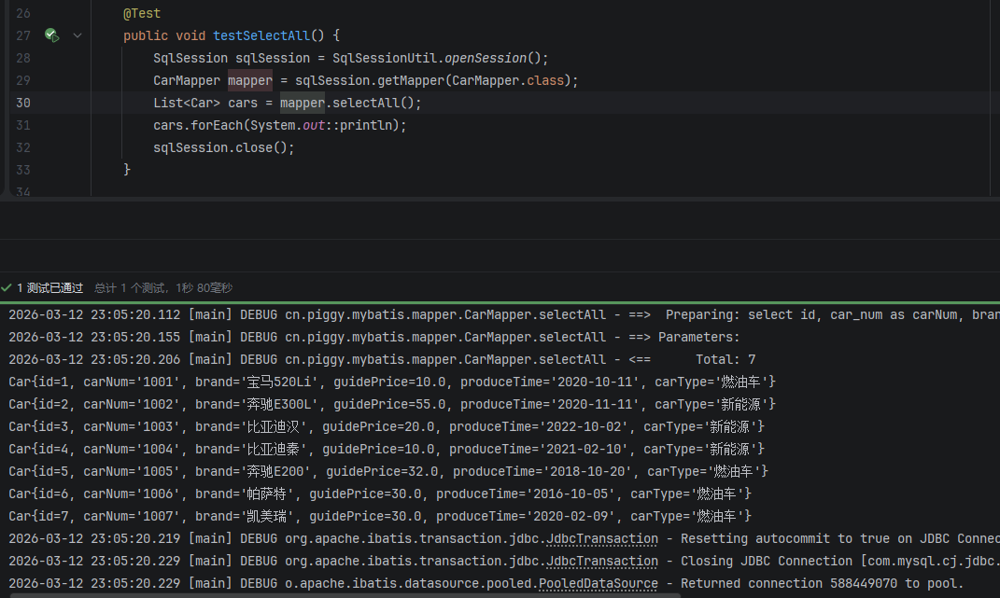


**2. 通过品牌名进行模糊查询：**

但是只使用单个POJO类来接收。

```java
/**
    * 根据品牌进行模糊查询
    * @param brand
    * @return
*/
Car selectByBrandLike(String brand);
```

```xml
<select id="selectByBrandLike" resultType="car">
    select
    	id,
    	car_num as carNum,
    	brand,
    	guide_price as guidePrice,
    	produce_time as produceTime,
    	car_type as carType
    from t_car
    where brand like "%"#{brand}"%"
</select>
```

查询结果只返回一个，则是可以被接收的：

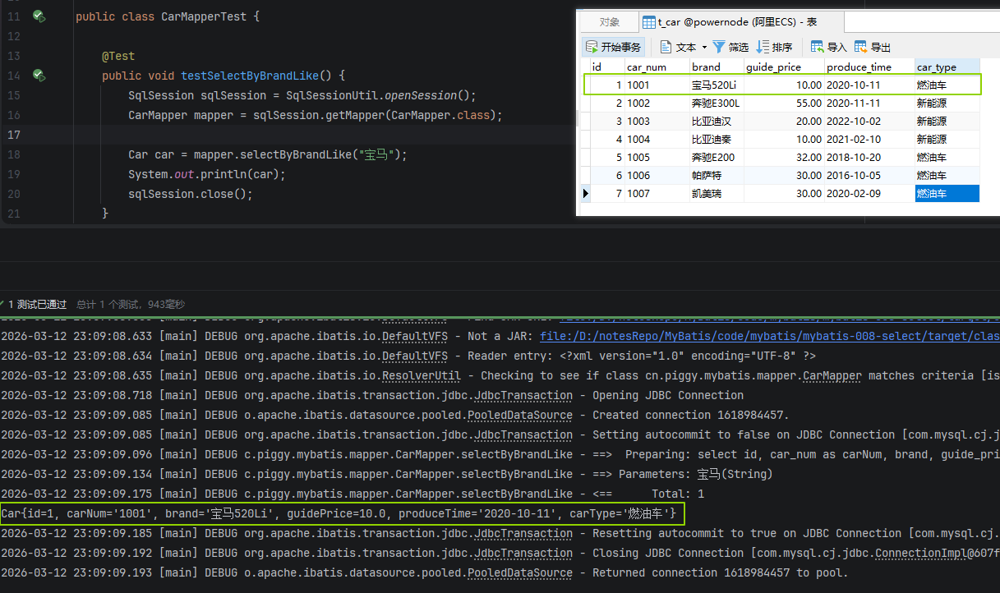

查询结果返回多个，则会报错`TooManyResultsException`：

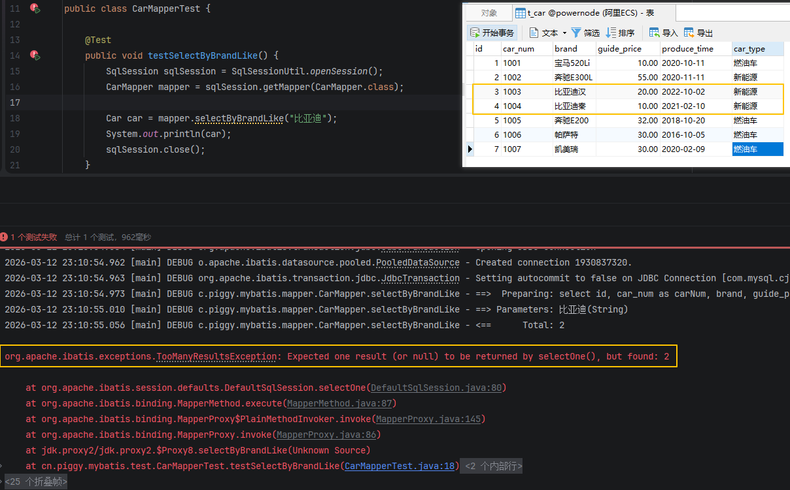


**总结：因此在查询返回多个对象的时候，应采用集合来接收这些对象。**


## 11.3 返回Map

如果查询的返回结果没有合适的POJO类接收，且保证只有一个返回结果，可以直接使用Map集合来接收查询信息，字段名做为key，字段值作为value。

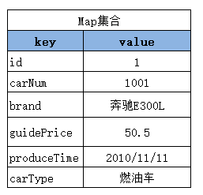


需求：根据id查询汽车信息，并使用Map来接收。

```java
/**
    * 根据id获取汽车信息，将汽车信息放到Map集合中
    * @param id
    * @return
*/
Map<String, Object> selectByIdRetMap(Long id);
```

```xml
<!--resultType="java.util.Map"，有别名map-->
<select id="selectByIdRetMap" resultType="map">
    select * from t_car where id = #{id}
</select>
```

运行结果：

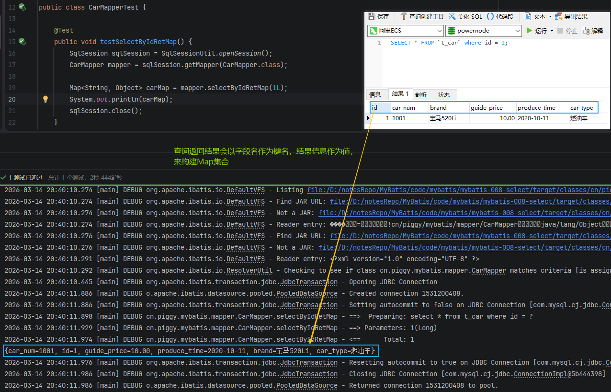


注意：

+ mybatis内置了很多别名，在`resultType`中`java.util.Map`可以简写成`map`，其他可以参考手册。
+ 使用Map集合只能接收一条返回结果，如果是多条返回结果则会同样报错`TooManyResultsException`。


## 11.4 返回List\<Map>

查询结果条数大于等于1条数据，则可以返回一个存储Map集合的List集合。

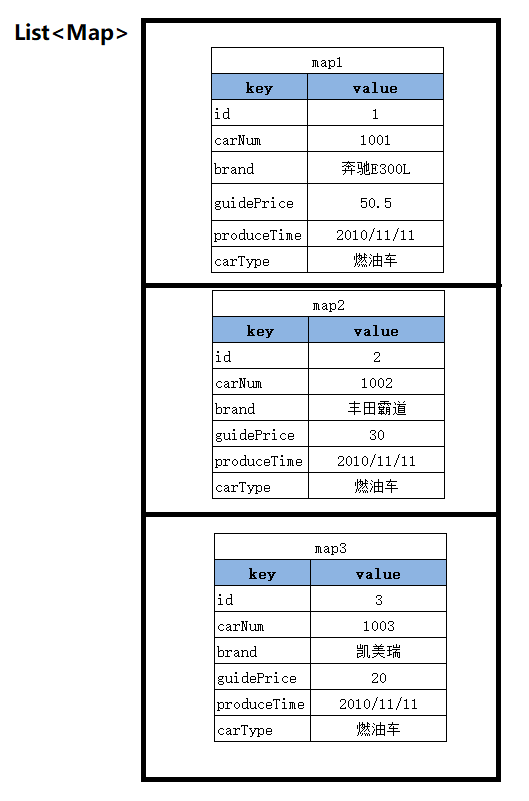


需求：查询所有Car信息，并使用List\<Map>接收。

```java
/**
    * 查询所有Car信息，返回一个存放Map集合的List集合
    * @return
*/
List<Map<String, Object>> selectAllRetListMap();
```

```xml
<select id="selectAllRetListMap" resultType="map">
    select * from t_car;
</select>
```

运行结果：

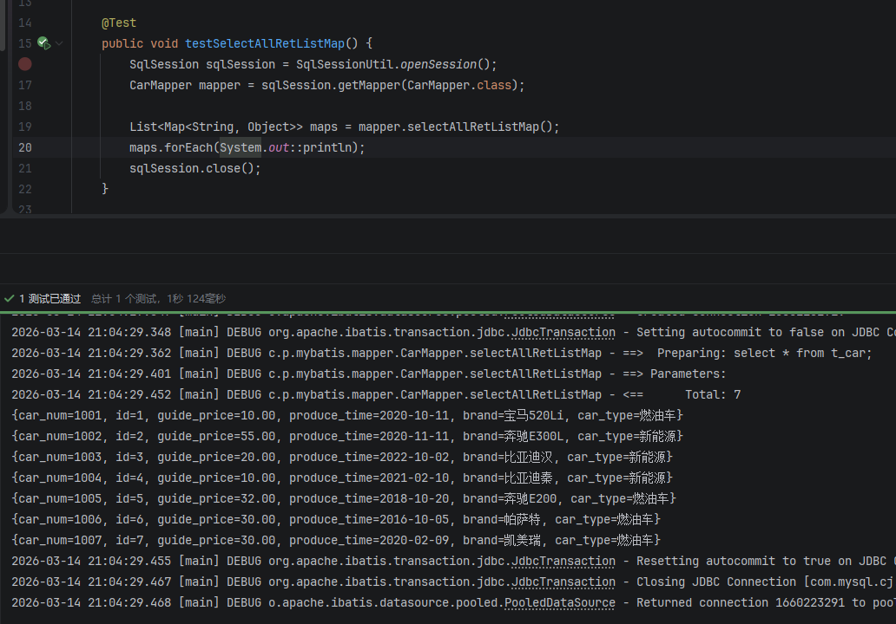


注意：为什么`resultType`还是等于`map`？

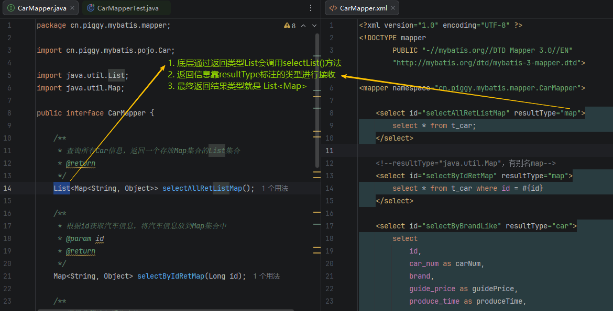


## 11.5 返回Map\<String, Map>

上述使用List\<Map>来接收封装所有信息，但是如果我们需要找到指定id的信息，则需要遍历List，判断id字段才能获取到相关信息。

如果我们拿Car的`id`的key，相关信息用Map封装作为value存入更大的Map集合中，之后取出相应的信息Map集合会更方便。

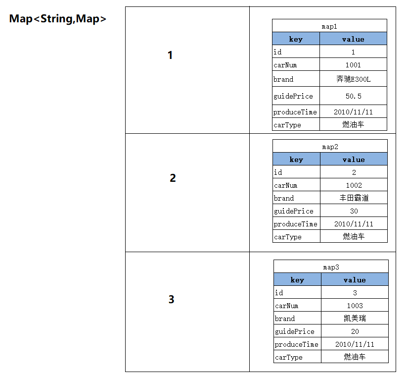


需求：查询所有Car信息，并通过Map集合封装每条记录。并使用id字段来作为key，封装记录的Map集合作为value，来组合成一个更大的Map集合返回回来。

```java
/**
    * 查询所有Car，返回一个大Map集合
    * 大Map集合：
    *      key：每条记录的主键值
    *      value: 返回的记录
    * @return
*/
@MapKey("id")   // 将查询结果的id值作为大Map集合的key
Map<Long, Map<String, Object>> selectAllRetMap();
```

```xml
<select id="selectAllRetMap" resultType="map">
    select * from t_car;
</select>
```

运行结果;

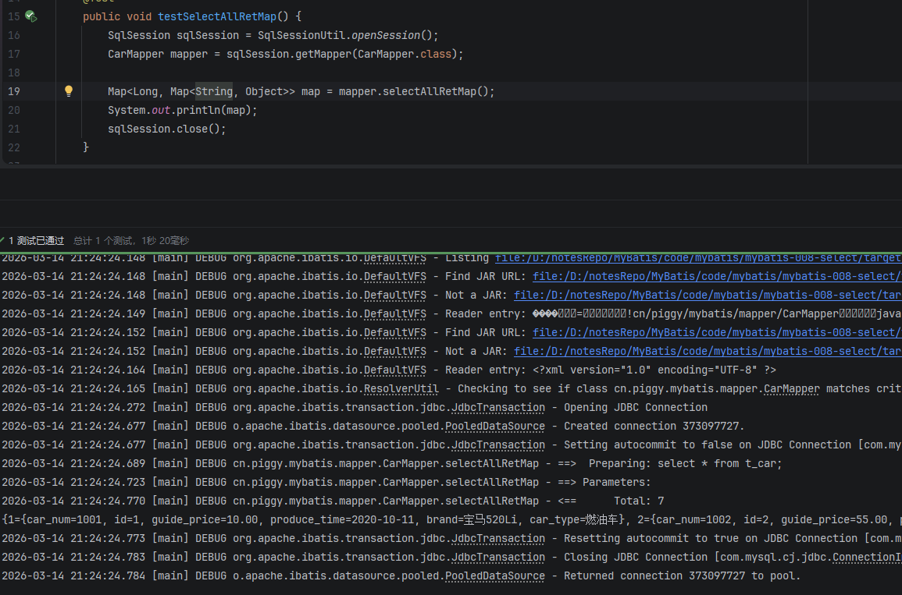

返回记录的封装结果：

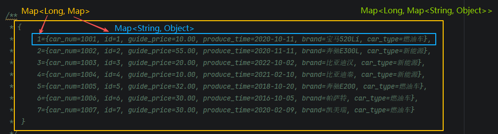


## 11.6 ResultMap

我们使用POJO类对结果进行封装的时候，有时会出现查询结果的类型和java类的属性名对应不上的情况。我们一般有三种解决方式：

1. 使用`as`起别名。（之前的项目用过的方法）
2. 使用`resultMap`进行结果映射。
3. 开启驼峰命名自动映射（配置settings）。


### 11.6.1 使用resultMap进行结果映射

需求：查询所有信息，使用Car类对结果进行封装。

```java
/**
	* 查询所有的Car信息，使用resultMap标签进行结果映射
    * @return
*/
List<Car> selectAllByResultMap();
```

```xml
<!--专门定义一个结果映射，在这个结果映射当中指定数据库表的字段名和Java类的属性名的对应关系-->
<resultMap id="carResultMap" type="cn.piggy.mybatis.pojo.Car">
    <id property="id" column="id"/>
    
    <result property="carNum" column="car_num"/>
    <result property="brand" column="brand"/>
    <result property="guidePrice" column="guide_price"/>
    <result property="produceTime" column="produce_time"/>
    <result property="carType" column="cat_type"/>
</resultMap>

<!--使用select标签中的resultMap属性，用来指定结果映射-->
<select id="selectAllByResultMap" resultMap="carResultMap">
    select * from t_car
</select>
```

测试结果：

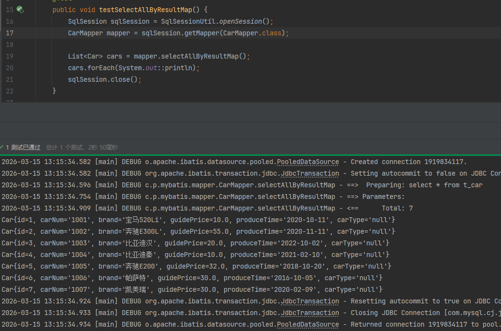


注意事项：

先使用resultMap标签来定义结果映射，后续在使用的时候指定该结果映射的id即可。

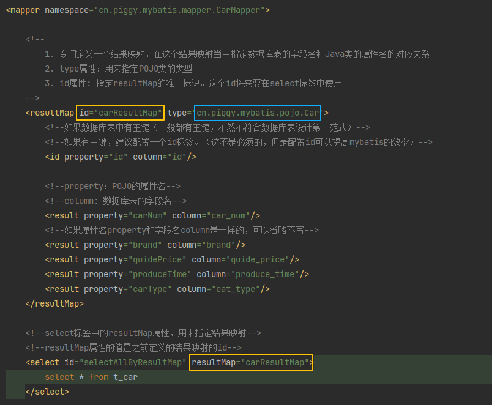


### 11.6.2  是否开启驼峰命名自动映射

使用这种方式的前提是：属性名遵循Java的命名规范，数据库表的列名遵循SQL的命名规范。

Java命名规范：首字母小写，后面每个单词首字母大写，遵循驼峰命名方式。

SQL命名规范：全部小写，单词之间采用下划线分割。


比如以下的对应关系：

| **实体类中的属性名** | **数据库表的列名** |
| -------------------- | ------------------ |
| carNum               | car_num            |
| carType              | car_type           |
| produceTime          | produce_time       |

如何启用该功能，在`mybatis-config.xml`文件中进行配置：

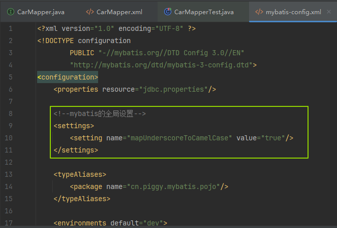


需求：开启驼峰命名自动映射，查询所有信息，并使用Car类进行封装。

```java
/**
    * 查询所有的Car信息，但是启用了驼峰命名自动映射
    * @return
*/
List<Car> selectAllByMapUnderscoreToCamelCase();
```

```xml
<select id="selectAllByMapUnderscoreToCamelCase" resultType="Car">
    select * from t_car
</select>
```

测试结果：

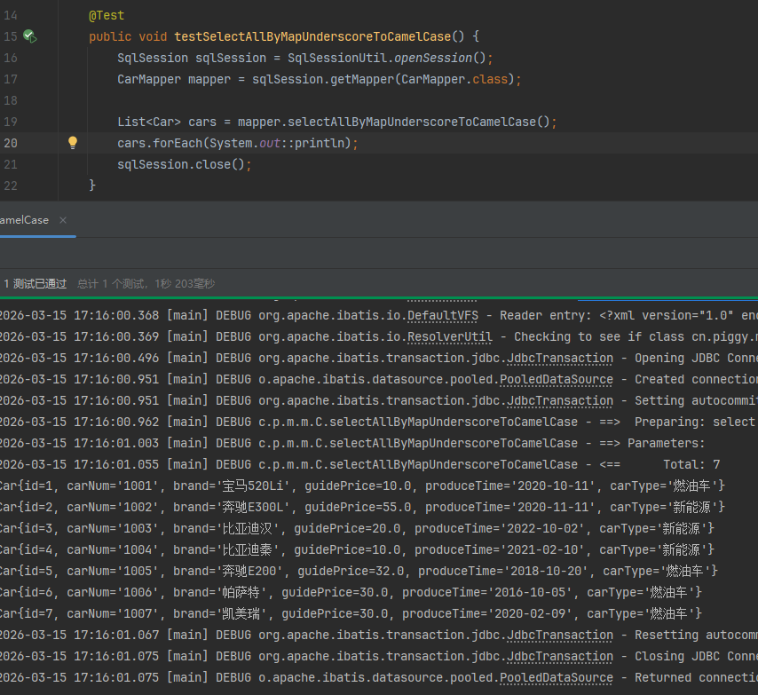


## 11.7 返回总记录条数

需求：查询总记录条数。

```java
/**
    * 获取Car的总记录条数
    * @return
*/
Long selectTotal();
```

```xml
<!--resultType也可以写别名 _long-->
<select id="selectTotal" resultType="Long">
    select count(*) from t_car
</select>
```

测试结果：

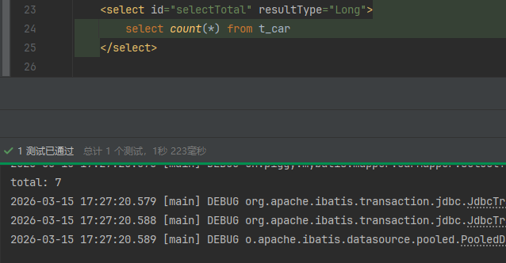


# 十二、动态SQL

我们先创建一个测试项目`mybatis-009-dynamic-sql`，像之前创建项目一样，目录如下：

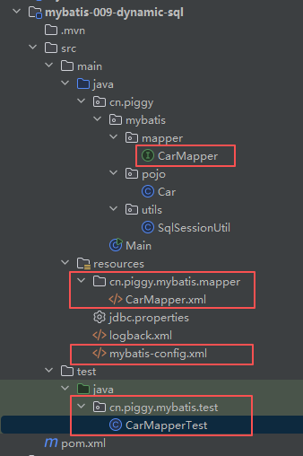

> 红框需要自己创建并编写。


## 12.1 \<if>标签

需求：多条件查询。

可能的条件包括：品牌（brand）、指导价格（guide_price）、汽车类型（car_type）


```java
**
	* 多条件查询
    * @param brand 品牌
    * @param guidePrice    指导价
    * @param carType   汽车类ing
    * @return
*/
    List<Car> selectByMultiCondition(@Param("brand") String brand, @Param("guidePrice") Double guidePrice, @Param("carType") String carType);
```

```xml
<select id="selectByMultiCondition" resultType="Car">
    select * from t_car where 1 = 1
    <!--
		1. if标签中的test属性是必须的
        2. if标签中的test属性的值是true或false
        3. 如果test是true，则if标签中的sql语句就会拼接，反之不会拼接。
        4. test属性中可以是用的是：
        	当使用了@Param注解，则test中要出现注解指定的参数名。比如@Param("brand")，属性只能使用brand。
        	当没有使用@Param注解，则test中使用默认参数名：param1, param2, arg0, arg1...
            当使用了POJO类，则test中要使用POJO类的属性名。
        5. 在mybatis的动态SQL中，需要连接时不能使用&&，只能使用and。
    -->
    <if test="brand != null and brand != ''">
        and brand like "%"#{brand}"%"
    </if>
    <if test="guidePrice != null and guidePrice != ''">
        and guide_price > #{guidePrice}
    </if>
    <if test="carType != null and carType != ''">
        and car_type = #{carType}
    </if>
</select>
```

```java
@Test
public void testSelectByMultiCondition() {
    SqlSession sqlSession = SqlSessionUtil.openSession();
    CarMapper mapper = sqlSession.getMapper(CarMapper.class);

    // 三个条件都不是空
    // List<Car> cars = mapper.selectByMultiCondition("比亚迪", 2.0, "新能源");

    // 三个条件都是空
    // List<Car> cars = mapper.selectByMultiCondition("", null, "");

    // 三个条件不全满足
    List<Car> cars = mapper.selectByMultiCondition("", 4.0, "");

    cars.forEach(System.out::println);
    sqlSession.close();
}
```


注意：

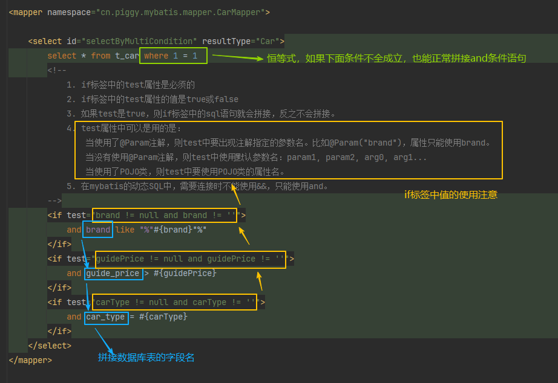

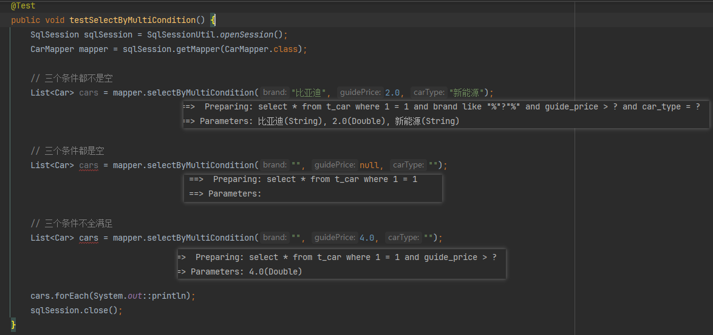


## 12.2 \<where>标签

`<where>`标签的作用：让where子句更加动态智能。

+ 所有条件都为空时，`<where>`标签保证不会生成where子句。
+ 自动去除某些条件**<font style="color:#E8323C;">前面</font>**多余的`and`或`or`。


继续处理12.1的需求：

```java
/**
    * 使用where标签，让where子句更加智能
    * @param brand
    * @param guidePrice
    * @param carType
    * @return
*/
List<Car> selectByMultiConditionWithWhere(@Param("brand") String brand, @Param("guidePrice") Double guidePrice, @Param("carType") String carType);
```

```xml
<select id="selectByMultiConditionWithWhere" resultType="Car">
    select * from t_car
    <!--where标签是专门负责where子句动态生成的-->
    <where>
        <if test="brand != null and brand != ''">
            and brand like "%"#{brand}"%"
        </if>
        <if test="guidePrice != null and guidePrice != ''">
            and guide_price > #{guidePrice}
        </if>
        <if test="carType != null and carType != ''">
            and car_type = #{carType}
        </if>
    </where>
</select>
```

```java
@Test
public void testSelectByMultiConditionWithWhere() {
    SqlSession sqlSession = SqlSessionUtil.openSession();
    CarMapper mapper = sqlSession.getMapper(CarMapper.class);

    // 三个条件都不是空
    // List<Car> cars = mapper.selectByMultiConditionWithWhere("比亚迪", 2.0, "新能源");

    // 三个条件都是空
    List<Car> cars = mapper.selectByMultiConditionWithWhere("", null, "");

    // 三个条件不全满足
    // List<Car> cars = mapper.selectByMultiConditionWithWhere("", 4.0, "燃油车");

    cars.forEach(System.out::println);
    sqlSession.close();
}
```


注意：

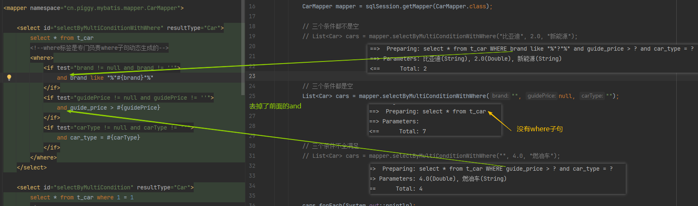


## 12.3 \<trim>标签

trim标签的属性：

+ `prefix`：在trim标签中的语句前**<font style="color:#E8323C;">添加</font>**内容
+ `suffix`：在trim标签中的语句后**<font style="color:#E8323C;">添加</font>**内容
+ `prefixOverrides`：前缀**<font style="color:#E8323C;">覆盖掉（去掉）</font>**
+ `suffixOverrides`：后缀**<font style="color:#E8323C;">覆盖掉（去掉）</font>**


重写12.1的需求：

```java
/**
    * 使用trim标签
    * @param brand
    * @param guidePrice
    * @param carType
    * @return
*/
    List<Car> selectByMultiConditionWithTrim(@Param("brand") String brand, @Param("guidePrice") Double guidePrice, @Param("carType") String carType);
```

```xml
<select id="selectByMultiConditionWithTrim" resultType="Car">
    select * from t_car
    <!--
        prefix: 加前缀
        suffix: 加后缀
        prefixOverrides: 删除前缀
        suffixOverrides: 删除后缀
    -->
    <trim prefix="where" suffixOverrides="and|or">
        <!--prefix="where" 是在trim标签所有内容的前面添加where-->
        <!--suffixOverrides="and|or" 把trim标签中内容的后缀and或or去掉-->
        <if test="brand != null and brand != ''">
            brand like "%"#{brand}"%" and
        </if>
        <if test="guidePrice != null and guidePrice != ''">
            guide_price > #{guidePrice} and
        </if>
        <if test="carType != null and carType != ''">
            car_type = #{carType}
        </if>
    </trim>
</select>
```

```java
@Test
public void testSelectByMultiConditionWithTrim() {
    SqlSession sqlSession = SqlSessionUtil.openSession();
    CarMapper mapper = sqlSession.getMapper(CarMapper.class);

    // 三个条件都不是空
    // List<Car> cars = mapper.selectByMultiConditionWithTrim("比亚迪", 2.0, "新能源");

    // 三个条件都是空
    // List<Car> cars = mapper.selectByMultiConditionWithTrim("", null, "");

    // 三个条件不全满足
    // List<Car> cars = mapper.selectByMultiConditionWithTrim("", 4.0, "燃油车");

    // 三个条件不全满足
    List<Car> cars = mapper.selectByMultiConditionWithTrim("比亚迪", null, "");

    cars.forEach(System.out::println);
    sqlSession.close();
}
```


注意：

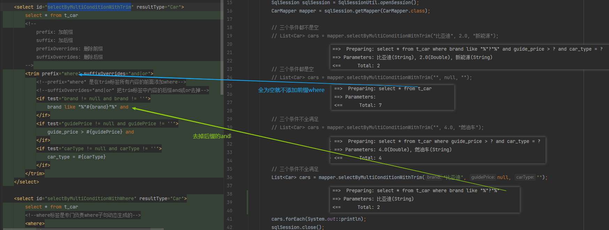


## 12.4 \<set>标签

`<set>`标签主要使用在update语句当中，用来生成set关键字，同时去掉最后多余的“`,`”。

比如我们只更新提交的不为空的字段，如果提交的数据是空或者""，那么这个字段我们将不更新。


```java
/**
    * 更新Car
    * @param car
    * @return
*/
int updateById(Car car);
```

```xml
<update id="updateById">
    update t_car
    <set>
        <if test="carNum != null and carNum != ''">car_num = #{carNum},</if>
        <if test="brand != null and brand != ''">brand = #{brand},</if>
        <if test="guidePrice != null and guidePrice != ''">guide_price = #{guidePrice},</if>
        <if test="produceTime != null and produceTime != ''">produce_time = #{produceTime},</if>
        <if test="carType != null and carType != ''">car_type = #{carType},</if>
    </set>
    where
    id = #{id}
</update>
```

```java
@Test
public void testUpdateById() {
    SqlSession sqlSession = SqlSessionUtil.openSession();
    CarMapper mapper = sqlSession.getMapper(CarMapper.class);
    Car car = new Car(3L, null, null, 26.0, null, "油电混动");
    mapper.updateById(car);
    sqlSession.commit();
    sqlSession.close();
}
```

测试运行：

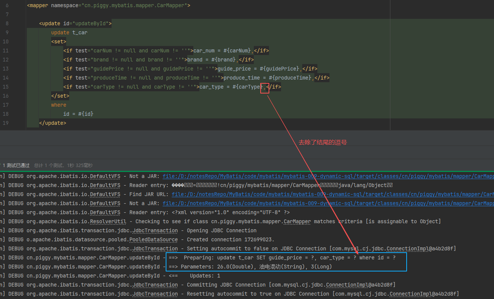


## 12.5 \<choose> \<when> \<otherwise>标签

这三个标签`choose`、`when`、`otherwise`是在一起使用的：

```xml
<choose>
    <when test=""></when>
    <when test=""></when>
    <when test=""></when>
    <otherwise></otherwise>
</choose>
```

等同于：

```java
if(){
    
}else if(){
    
}else if(){
    
}else if(){
    
}else{

}
```

只有一个分支会被选择！！！！


需求：先根据品牌查询，如果没有提供品牌，再根据指导价格查询，如果没有提供指导价格，就根据汽车类型查询。

```java
/**
* 使用choose when otherwise标签查询
* @param brand
* @param guidePrice
* @param produceTime
* @return
*/
List<Car> selectWithChoose(@Param("brand") String brand, @Param("guidePrice") Double guidePrice, @Param("produceTime") String produceTime);
```

```xml
<select id="selectByChoose" resultType="Car">
    select * from t_car
    <where>
        <choose>
            <when test="brand != null and brand != ''">
                brand like "%"#{brand}"%"
            </when>
            <when test="guidePrice != null and guidePrice != ''">
                guide_price > #{guidePrice}
            </when>
            <otherwise>
                car_type = #{carType}
            </otherwise>
        </choose>
    </where>
</select>
```

```java
@Test
public void testSelectByChoose() {
    SqlSession sqlSession = SqlSessionUtil.openSession();
    CarMapper mapper = sqlSession.getMapper(CarMapper.class);

    // 第一个参数不为空
    // List<Car> cars = mapper.selectByChoose("比亚迪", null, null);
    // cars.forEach(System.out::println);


    // 第二个参数不为空
    // List<Car> cars = mapper.selectByChoose("", 10.0, null);
    // cars.forEach(System.out::println);


    // 第三个参数不为空
    // List<Car> cars = mapper.selectByChoose("", null, "新能源");
    // cars.forEach(System.out::println);

    // 三个参数全为空
    List<Car> cars = mapper.selectByChoose("", null, null);
    cars.forEach(System.out::println);

    sqlSession.close();
}
```

测试结果：

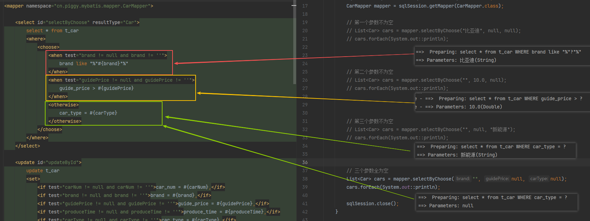


## 12.6 \<foreach>标签

循环数组或集合，用来动态生成sql语句。


### 12.6.1 批量删除 - in关键字

需求：提供Long数组，使用`in`关键字来进行批量删除。

```java
/**
    * 批量删除：foreach标签
    * @param ids
    * @return
*/
int deleteByIds(@Param("ids") Long[] ids);
```

```xml
<!--
    <foreach> 标签的属性:
        collection：指定数组或者集合
        item：代表数组或集合中的元素
        separator：循环之间的分隔符
        open: 拼接字符串的首字符
        close: 拼接字符串的尾字符
-->
<delete id="deleteByIds">
    delete from t_car where id in
    <foreach collection="ids" item="id" separator="," open="(" close=")">
        #{id}
    </foreach>
</delete>
```

```java
@Test
public void testDeleteByIds() {
    SqlSession sqlSession = SqlSessionUtil.openSession();
    CarMapper mapper = sqlSession.getMapper(CarMapper.class);
    int count = mapper.deleteByIds(new Long[]{1L, 2L, 3L});
    System.out.println("影响行数：" + count);
    // sqlSession.commit();
    sqlSession.close();
}
```

测试结果：


注意：

1. 如果不使用`@Param`注解给参数起别名的话，其底层Map默认会生成array和arg0两个键值对。

   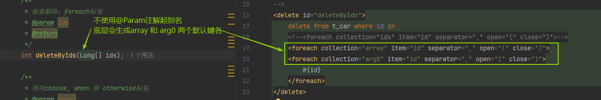

2. 如果不使用`open`和`close`两个属性，也可以写成：

   ```xml
   <delete id="deleteByIds">
       delete from t_car where id in(
       <foreach collection="ids" item="id" separator=",">
           #{id}
       </foreach>
       )
   </delete>
   ```


### 12.6.2 批量删除 - or关键字

需求：提供Long数组，使用`or`关键字来进行批量删除。

java代码部分与12.6.1一样，修改映射文件部分：

```xml
<delete id="deleteByIds">
    delete from t_car where
    <foreach collection="ids" item="id" separator="or">
        id = #{id}
    </foreach>
</delete>
```

测试结果：

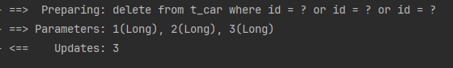


### 12.6.3 批量添加

需求：提供一个汽车集合`List<Car>`，使用`<foreach>`标签循环生成sql批量插入语句。

```java
/**
    * 批量插入汽车信息
    * @param cars
    * @return
*/
int insertBatch(@Param("cars") List<Car> cars);
```

```xml
<insert id="insertBatch">
    insert into t_car values
    <foreach collection="cars" item="car" separator=",">
        (null, #{car.carNum}, #{car.brand}, #{car.guidePrice}, #{car.produceTime}, #{car.carType})
    </foreach>
</insert>
```

```java
@Test
public void testInsertBatch() {
    SqlSession sqlSession = SqlSessionUtil.openSession();
    CarMapper mapper = sqlSession.getMapper(CarMapper.class);

    List<Car> cars = new ArrayList<>();
    cars.add(new Car(null, "1008", "宝马x3", 20.0, "2022-12-10", "燃油车"));
    cars.add(new Car(null, "1009", "宝马x5", 44.0, "2022-11-12", "燃油车"));
    cars.add(new Car(null, "1010", "宝马x7", 87.0, "2024-05-13", "燃油车"));

    int count = mapper.insertBatch(cars);
    System.out.println("影响行数：" + count);
    sqlSession.commit();
    sqlSession.close();
}
```

测试结果：

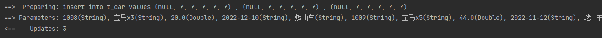


## 12.7 \<sql> 与 \<include>标签

`<sql>`标签用来声明sql片段。

`<include>`标签用来将声明的sql片段 包含到另一个sql语句当中

作用：**代码复用。易维护**。


我们在之前的映射文件中可以看到，重复的部分比较多：

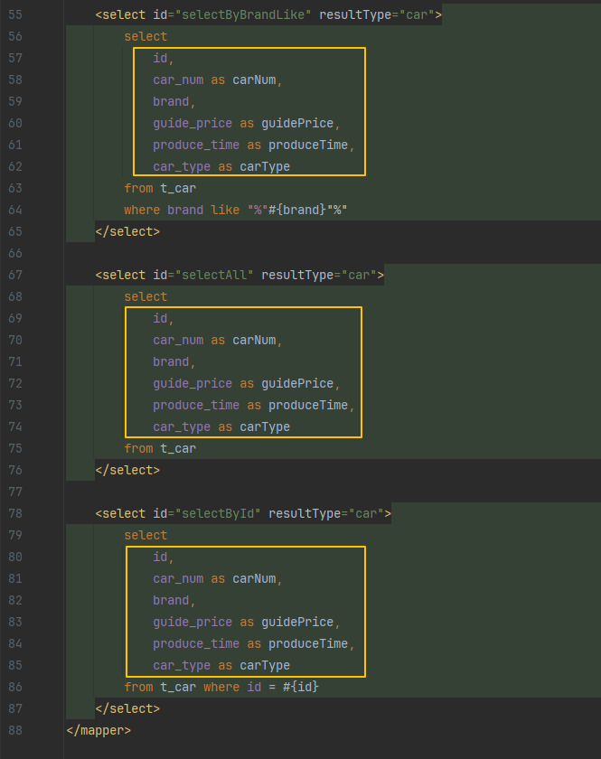

我们可以将这部分sql语句提取出来，用`<sql>`标签封装起来，在原本的地方使用`<include>`标签把封装好的sql片段引用进来：

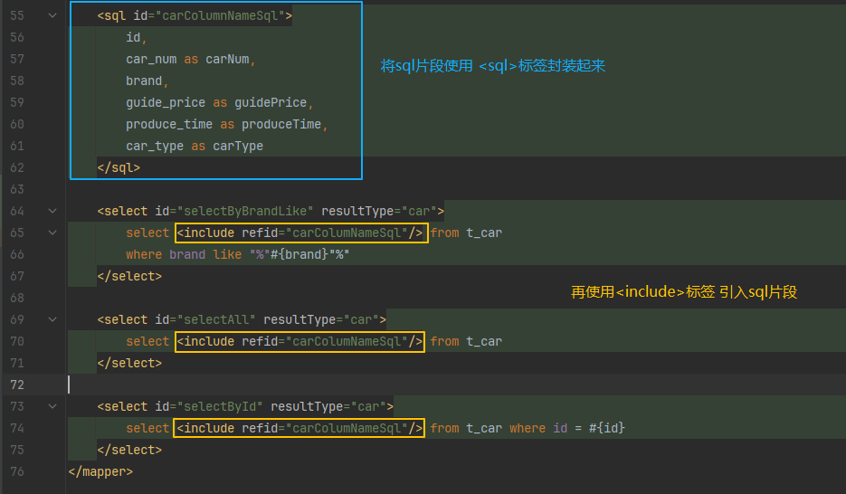

测试结果与之前一样。


# 十三、MyBatis的高级映射及延迟加载

我们先准备一个数据库表：班级表`t_clazz`和学生表`t_stu`。

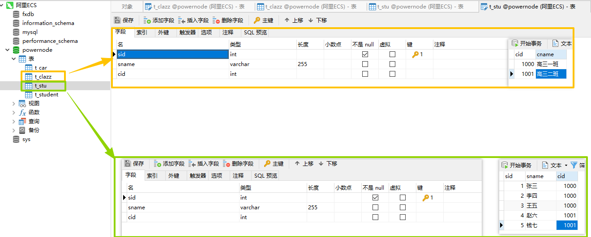


再来新建一个项目`mybatis-010-advanced-mapping`。

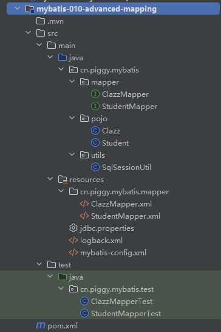


其他文件与之前项目基本一致，但是`StudentMapper.class`中的`clazz`属性先别写。

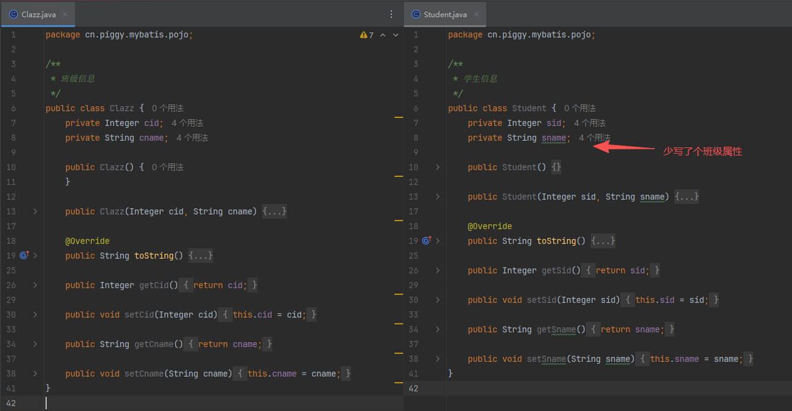


高级映射主要分为**多对一映射**和**一对多映射**。


## 13.1 多对一

多对一映射有多种方式，其中最主要的包含三种：

1. 一条SQL语句，级联属性映射。
2. 一条SQL语句，association。
3. 两条SQL语句，分步查询。（这种方式最常用，优点是**可复用**和**支持懒加载**）


案例：在班级和学生表中，我们先设定学生表`t_student`为多的一方，班级表`t_clazz`为少的一方。


怎么区分主表和副表：多的一方为主表，少的一方为副表。

因此在这个案例中，学生表为主表，班级表为副表（JVM中学生类为主类，班级类为副类）。


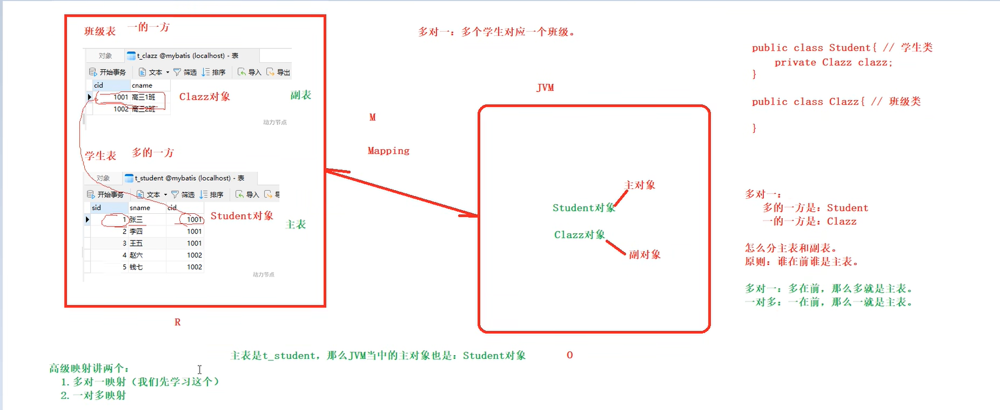


在学生类`t_student`中增加班级类属性`Clazz`，并生成其setter和getter方法。

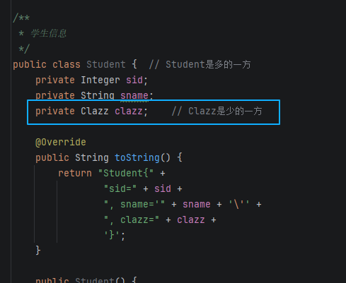


### 13.1.1 级联属性映射

映射代码部分：

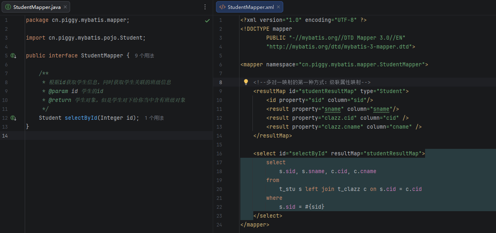

测试部分：

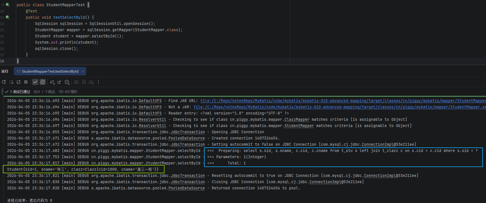


### 13.1.2 association

