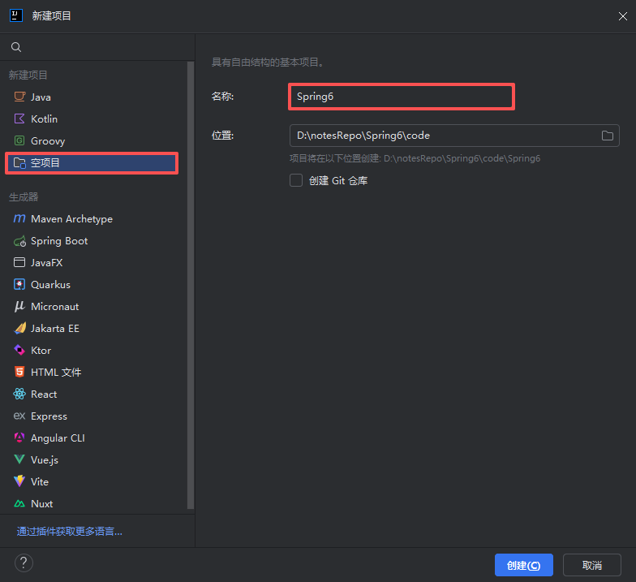
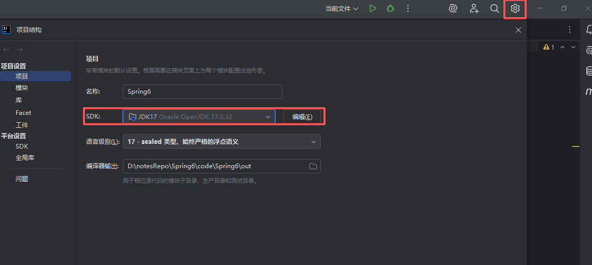
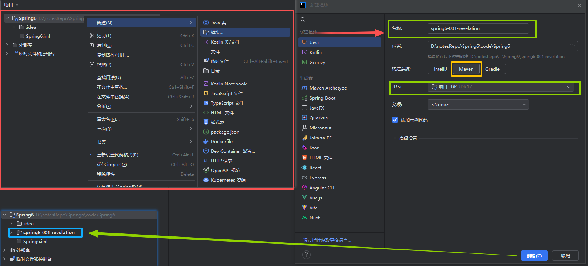
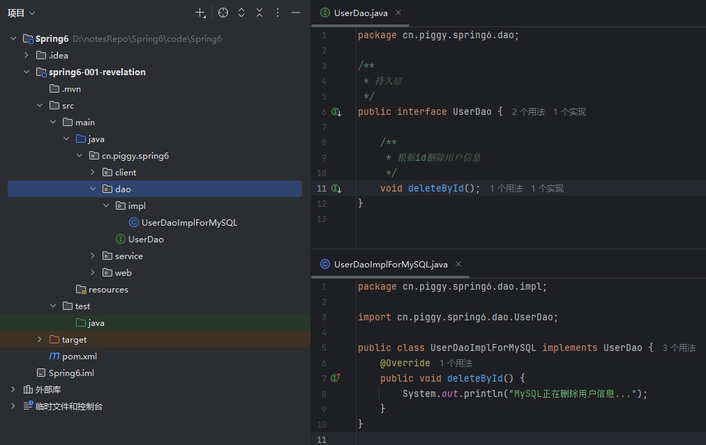
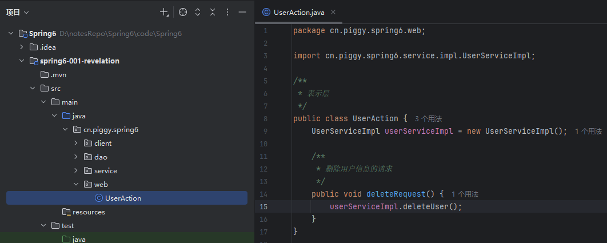
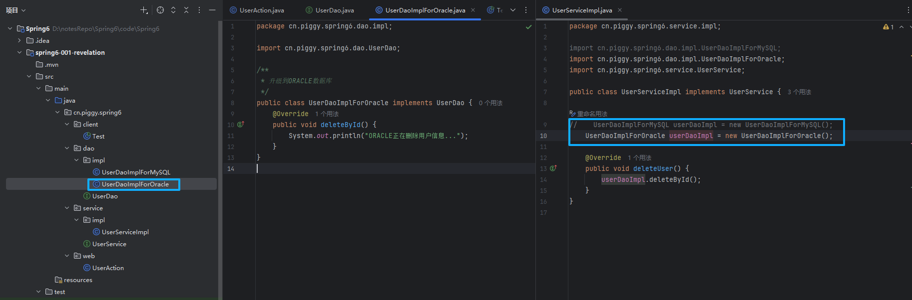

# 第一章节 - Spring启示录

## 引入

### 1. 环境配置

该配置环境为 Spring6，Java17，首先先创建一个项目。

1. 打开idea，创建一个空项目。

   

2. 配置Maven环境信息（我们使用默认捆绑的maven）。

   

3. 在空项目下创建maven模块。

   

### 2. 创建web项目

1. 持久层

   

2. 业务层

   

3. 表现层

   

### 3. 问题

如果需要升级成ORACLE数据库，对功能进行扩展的时候，不仅需要新增一个ORACLE的持久层，还要修改UserService业务层的代码。

这样一来就违背了OCP开闭原则。

## 1.  OCP开闭原则

### 1.1 什么是OCP?

OCP是软件七大开发原则当中最基本的一个原则：`开闭原则`

+ 对什么开？对**扩展**开放。
+ 对什么闭？对**修改**关闭。

OCP原则是最核心的，最基本的，其他的六个原则都是为这个原则服务的。

### 1.2 OCP开闭原则的核心
只要你在扩展系统功能的时候，没有修改以前写好的代码，那么你就是符合OCP原则的。

反之，如果在扩展系统功能的时候，你修改了之前的代码，那么这个设计是失败的，违背0CP原则。

当进行系统功能扩展的时候，如果动了之前稳定的程序，修改了之前的程序，之前所有程序都需要进行重新测试。这是不想看到的，因为非常麻烦。

